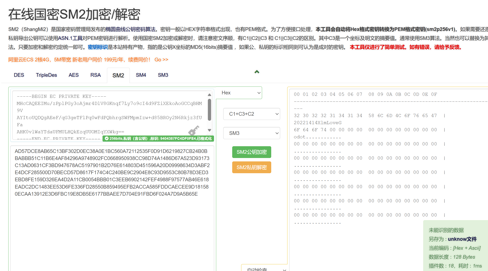

[toc]

# 《密码系统设计》实验

## 实验二	密码算法实现

### 1-3 学时实践要求（30 分）

1. 在 Ubuntu或openEuler中（推荐 openEuler）中调试运行[商用密码检测中心https://www.scctc.org.cn/xzzx/sfydm/ydmxz/](https://www.scctc.org.cn/xzzx/sfydm/ydmxz/)提供的源代码，至少运行SM2，SM3，SM4代码。使用GmSSL命令验证你代码的正确性。使用Markdown记录详细记录实践过程，每完成一项功能或者一个函数git commit 一次。（14分）

- SM3测试
  - 代码修改（测试使用的main函数）
    ```c
    #include <stdio.h>
    #include <string.h>

    const char* testCases[] = {
        "xlm",
        "20221414xlm20221414xlm",
    };

    int main() {

        // 调用自检函数并输出结果
        int selfTestResult = SM3_SelfTest();
        if (selfTestResult == 0) {
            printf("SM3 SelfTest passed.\n");
        }
        else {
            printf("SM3 SelfTest failed.\n");
        }

        // 计算并输出每个测试用例的哈希值
        for (int i = 0; i < sizeof(testCases) / sizeof(testCases[0]); i++) {
            unsigned char MsgHash[32] = { 0 };
            const char* testCase = testCases[i];
            int len = strlen(testCase);

            // 计算哈希值
            SM3_256((unsigned char*)testCase, len, MsgHash);

            // 打印计算出的哈希值
            printf("Computed Hash for '%s': ", testCase);
            for (int j = 0; j < 32; j++) {
                printf("%02x", MsgHash[j]);
            }
            printf("\n");
        }

        return 0;
    }
    ```
  - 验证过程
    ```
    root@Youer:~/shiyan/shiyan02/shiyan2-1/sm3# nano SM3.c
    root@Youer:~/shiyan/shiyan02/shiyan2-1/sm3# gcc -o SM3 SM3.c -lm
    root@Youer:~/shiyan/shiyan02/shiyan2-1/sm3# ./SM3
    SM3 SelfTest passed.
    Computed Hash for 'xlm': 99f620e94508ee9445bf0722bac8d9d9942cd1a9821f99b2e9e416960e926596
    Computed Hash for '20221414xlm20221414xlm': 39d0ccbf88ba55a3de4ad2b370288eee8d37f900ae14afff3ba95095cbf1b352
    root@Youer:~/shiyan/shiyan02/shiyan2-1/sm3# echo -n "xlm" | gmssl sm3
    99f620e94508ee9445bf0722bac8d9d9942cd1a9821f99b2e9e416960e926596
    root@Youer:~/shiyan/shiyan02/shiyan2-1/sm3# echo -n "20221414xlm20221414xlm" | gmssl sm3
    39d0ccbf88ba55a3de4ad2b370288eee8d37f900ae14afff3ba95095cbf1b352
    ```
- SM4测试
  - 代码
    - 原代码修改(特点：从命令行接受加密数据，按PKCS#7填充数据)
      ```c
      #include <stdio.h>
      #include <stdlib.h>
      #include <string.h>
      #include <time.h>

      #define KEY_SIZE 16  // 定义密钥长度为16字节
      #define BLOCK_SIZE 16  // SM4 block size is 16 bytes

      void pkcs7_padding(unsigned char* input, int input_length, unsigned char* output, int* output_length) {
          int padding_length = BLOCK_SIZE - (input_length % BLOCK_SIZE);
          *output_length = input_length + padding_length;

          // Copy input to output and apply PKCS#7 padding
          memcpy(output, input, input_length);
          memset(output + input_length, padding_length, padding_length);
      }

      void pkcs7_unpadding(unsigned char* input, int input_length, unsigned char* output, int* output_length) {
          // Get padding value
          int padding_value = input[input_length - 1];
          *output_length = input_length - padding_value;
          memcpy(output, input, *output_length);
      }

      int main(int argc, char* argv[]) {
          if (argc != 2) {
              fprintf(stderr, "Usage: %s <plaintext>\n", argv[0]);
              return 1;
          }

          // Self-check
          if (SM4_SelfCheck() == 0) {
              printf("自检成功！\n");
          }
          else {
              printf("自检失败！\n");
              return 1; // Self-check failed, exit program
          }

          // Generate random key
          unsigned char key[KEY_SIZE];
          srand((unsigned int)time(NULL)); // 使用当前时间作为随机数种子

          for (int i = 0; i < KEY_SIZE; i++) {
              key[i] = rand() % 256; // 生成0-255之间的随机数
          }

          // Output generated key
          printf("生成的随机密钥: ");
          for (int i = 0; i < KEY_SIZE; i++) {
              printf("%02x", key[i]);  // Hexadecimal output without space
          }
          printf("\n");

          // Prepare plaintext
          const char* plaintext_input = argv[1];
          unsigned char plaintext[BLOCK_SIZE] = { 0 }; // Buffer for plaintext
          unsigned char padded_plaintext[BLOCK_SIZE] = { 0 }; // Buffer for padded plaintext
          unsigned char ciphertext[BLOCK_SIZE] = { 0 }; // Buffer for ciphertext
          unsigned char decrypted[BLOCK_SIZE] = { 0 }; // Buffer for decrypted text
          int padded_length = 0;

          // Apply PKCS#7 padding to the plaintext
          pkcs7_padding((unsigned char*)plaintext_input, strlen(plaintext_input), padded_plaintext, &padded_length);

          // Encrypt plaintext
          SM4_Encrypt(key, padded_plaintext, ciphertext);
          printf("明文 (%s) 的密文: ", plaintext_input);
          for (int i = 0; i < BLOCK_SIZE; i++) {
              printf("%02x", ciphertext[i]);  // Hexadecimal output without space
          }
          printf("\n");

          // Decrypt ciphertext
          SM4_Decrypt(key, ciphertext, decrypted);

          // Remove PKCS#7 padding from decrypted text
          int decrypted_length = 0;
          pkcs7_unpadding(decrypted, BLOCK_SIZE, plaintext, &decrypted_length);
          plaintext[decrypted_length] = '\0'; // Null-terminate the decrypted plaintext for printing

          printf("解密后的文本: %s\n", plaintext);

          return 0;
      }
      ```
    - PKCS#7填充的Python脚本代码
      ```py
      import sys

      def pad_data(data, block_size=16):
          padding_length = block_size - (len(data) % block_size)
          if padding_length == 0:
              padding_length = block_size
          padding = bytes([padding_length] * padding_length)
          return data + padding

      if __name__ == "__main__":
          if len(sys.argv) != 3:
              print("Usage: python3 pad.py <input_file> <output_file>")
              sys.exit(1)

          input_file = sys.argv[1]
          output_file = sys.argv[2]

          try:
              with open(input_file, 'rb') as f:
                  data = f.read()

              padded_data = pad_data(data)

              with open(output_file, 'wb') as f:
                  f.write(padded_data)

              print(f"Padded data written to {output_file}")
          except Exception as e:
              print(f"Error: {e}")
              sys.exit(1)
      ```
    - 移除PKCS#7填充的Python脚本代码
      ```py
      import sys

      def pkcs7_unpadding(data):
          # 获取最后一个字节的值，这个值表示填充的字节数
          padding_value = data[-1]
          # 解除填充
          return data[:-padding_value]

      def main(input_file, output_file):
          try:
              # 读取输入文件
              with open(input_file, 'rb') as infile:
                  padded_data = infile.read()

              # 解除PKCS#7填充
              unpadded_data = pkcs7_unpadding(padded_data)

              # 将解除填充后的数据写入输出文件
              with open(output_file, 'wb') as outfile:
                  outfile.write(unpadded_data)

              print(f"解除填充成功！已将结果写入 '{output_file}'")

          except Exception as e:
              print(f"处理过程中出现错误: {e}")

      if __name__ == "__main__":
          if len(sys.argv) != 3:
              print("用法: python remove_pkcs7_padding.py <输入文件名> <输出文件名>")
              sys.exit(1)

          input_filename = sys.argv[1]
          output_filename = sys.argv[2]

          main(input_filename, output_filename)

      ```
  - 验证过程中生成的密文一致
    ```
    root@Youer:~/shiyan/shiyan02/shiyan2-1/sm4# ls
    SM4  SM4.c  SM4.h  ciphertext.bin  gmssl  key.bin  pad.py  padded_plaintext.bin  plaintext.txt
    root@Youer:~/shiyan/shiyan02/shiyan2-1/sm4# rm SM4.c
    root@Youer:~/shiyan/shiyan02/shiyan2-1/sm4# nano SM4.c
    root@Youer:~/shiyan/shiyan02/shiyan2-1/sm4# gcc SM4.c -o SM4 -lm
    root@Youer:~/shiyan/shiyan02/shiyan2-1/sm4# ./SM4
    Usage: ./SM4 <plaintext>
    root@Youer:~/shiyan/shiyan02/shiyan2-1/sm4# ./SM4 xlm
    自检成功！
    生成的随机密钥: 31fbbe5b98a83c039b489f269340f2e5
    明文 (xlm) 的密文: 772fc9106617fae43f654e30f577fc0d
    解密后的文本: xlm
    root@Youer:~/shiyan/shiyan02/shiyan2-1/sm4# echo -n "xlm" > plaintext.txt
    root@Youer:~/shiyan/shiyan02/shiyan2-1/sm4# python3 pad.py plaintext.txt padded_plaintext.bin
    Padded data written to padded_plaintext.bin
    root@Youer:~/shiyan/shiyan02/shiyan2-1/sm4# gmssl sm4_ecb -encrypt -key 31fbbe5b98a83c039b489f269340f2e5 -in padded_plaintext.bin -out ciphertext.bin
    root@Youer:~/shiyan/shiyan02/shiyan2-1/sm4# xxd ciphertext.bin
    00000000: 772f c910 6617 fae4 3f65 4e30 f577 fc0d  w/..f...?eN0.w..
    ```
  - 验证解密结果一致
    ```
    root@Youer:~/shiyan/shiyan02/shiyan2-1/sm4# nano unpad.py
    root@Youer:~/shiyan/shiyan02/shiyan2-1/sm4# gmssl sm4_ecb -decrypt -key 31fbbe5b98a83c039b489f269340f2e5 -in ciphertext.
    bin -out decrypted_padded.bin
    root@Youer:~/shiyan/shiyan02/shiyan2-1/sm4# python3 unpad.py decrypted_padded.bin plaintext_unpadded.txt
    Error: 'bool' object is not iterable
    root@Youer:~/shiyan/shiyan02/shiyan2-1/sm4# rm unpad.py
    root@Youer:~/shiyan/shiyan02/shiyan2-1/sm4# nano unpad.py
    root@Youer:~/shiyan/shiyan02/shiyan2-1/sm4# python3 unpad.py decrypted_padded.bin plaintext_unpadded.txt
    解除填充成功！已将结果写入 'plaintext_unpadded.txt'
    root@Youer:~/shiyan/shiyan02/shiyan2-1/sm4# cat plaintext_unpadded.txt
    xlmroot@Youer:~/shiyan/shiyan02/shiyan2-1/sm4#
    ```
- SM2测试
    - MIRACL的安装与编译
      - 先在GitHub上查看其[安装教程](https://github.com/miracl/MIRACL/blob/master/docs/miracl-user-manual/installation.md)
      - 根据教程查看其Linux安装说明，将教程发给AI辅助理解
        ```
        root@Youer:~/shiyan/MIRACL# cat linux.txt
        RedHat Linux 6.0+ MIRACL i386 x86-32 installation

        Also works OK for Solaris if its x386/Pentium based.

        1. Unzip the MIRACL.ZIP file using the utility unzip, into an empty directory

        unzip -j -aa -L miracl.zip

        The -j ignores the directory structure inside MIRACL.ZIP. The -aa converts all
        text files to Unix format, and -L ensures that all filenames are lower-case.


        2. Perform a tailored build of the MIRACL library by opening a terminal
        window, and typing

        bash linux

        3. All the MIRACL applications (except RATCALC) can then be built, as
        desired. Remember to link all C applications to the miracl.a library.
        C++ applications must be linked as well to one or more of big.o zzn.o
        ecn.o crt.o flash.o object files etc.
        See the xxx.bat files for examples. Some applications that require
        floating-point support may also require -lm in the compile command line.


        Make sure that your Linux PATH points to the current directory, so that
        executables can be run.

        Some programs may require some small changes. For example in schoof.cpp search
        for the comment about "platforms".

        Note that Linux already has (a rather pathetic) factor program. To avoid name
        clashes you might rename MIRACL's "factor" program to "facter", or somesuch.


        For a 64-bit build, on for example an AMD64 or a Core 2 processor (x86-64), use

        bash linux64


        IMPORTANT

        Some files might have to be changed from Windows File format, to Unix file format
        in order for programs to work correctly.
        ```
      - [提前准备32位的环境](https://kimi.moonshot.cn/share/cser2rgjdo7r0h8fqahg)  
      - 下载编译MIRACL的步骤（注意，由于代码在x86环境下运行，所以要编译32位的库：bash linux64改为bash linux）
        ```
        root@Youer:~/shiyan# mkdir MIRACL
        root@Youer:~/shiyan# cd MIRACL
        root@Youer:~/shiyan/MIRACL# cp /mnt/d/xlm20/*.zip ./
        root@Youer:~/shiyan/MIRACL# ls
        MIRACL-master.zip
        root@Youer:~/shiyan/MIRACL# mv MIRACL-master.zip miracl.zip
        root@Youer:~/shiyan/MIRACL# unzip -j -aa -L miracl.zip
        root@Youer:~/shiyan/MIRACL# bash linux
        rm: cannot remove '*.exe': No such file or directory
        rm: cannot remove 'miracl.a': No such file or directory
        ```
      - 使用./pk-demo测试安装是否成功
        ```
        root@Youer:~/shiyan/MIRACL# ./pk-demo
        First Diffie-Hellman Key exchange ....

        Alice's offline calculation
        Bob's offline calculation
        Alice calculates Key=
        62819331193396450791672701245666869004841238867503162982837631854978807867521211997800121296201281549161172455084358319875141689579278583145742033191147483587131845685279076909006463334865219498287122904216410526086475074325865076644608957912293552578596770581051619612858134311811410076942400971826457284478
        Bob calculates Key=
        62819331193396450791672701245666869004841238867503162982837631854978807867521211997800121296201281549161172455084358319875141689579278583145742033191147483587131845685279076909006463334865219498287122904216410526086475074325865076644608957912293552578596770581051619612858134311811410076942400971826457284478
        Alice and Bob's keys should be the same!

        Lets try that again using elliptic curves....
        Alice's offline calculation
        Bob's offline calculation
        Alice calculates Key=
        1483146370800745234952624144805074084563659557404291854909
        Bob calculates Key=
        1483146370800745234952624144805074084563659557404291854909
        Alice and Bob's keys should be the same! (but much smaller)

        Testing El Gamal's public key method
        Ciphertext=
        140255713304004004668624720945909560572393838948991569929447772941466994138516912896882002839080247711875606570491130030070634963102430979675692734455673380681288145766312886268439457719765465813548907360604954844942549174569085591090851846168483323192099687288583653325214341544290477898912617460728384274563
        60138963429756374248178820878790210981680384334548390102031871809065909525564147944347309538261282755436257549998062093988881832507031406673725564716642741698275725526314076722621371924164548825838360133412409685518411828911799150224026563881371900172430032265459500587047769913413209245591255393313531089380
        Plaintext=
        MIRACL - Best multi-precision library in the World!


        Now generating 512-bit random primes p and q
        11340398374807414145712504764040772073972814821629354872037387876217946735103473423887599944380774053967102703294338983637455054337857774025489190903442169
        11491087059530707623303459955621707008575758397513743963364388746044365470811001304806475779634236531468775789551659229446722680983433892042786360014067031
        n = p.q =
        130313505014672544175858966460143959752281046895918844621419284167087756883685330891294585357728519313277894883126541858959795701010001955662043493578178655558490078040180881467402818877404115378781198940124305318141811635403340568315580177450282273501929747896464766444067533526607935502701120618478998030239
        Encrypting test string
        Ciphertext=
        3000407806329698814102073179609945348049046319237075646855607270347816143886493601208769341470851330558503318797537886848932079655519199691600690717807930755846101963566906748675321833082162811823201601284763915623825145567104025737927803081304726032532696344508095382855398819643207401723394515679910220156
        Decrypting test string
        Plaintext=
        MIRACL - Best multi-precision library in the World!

        root@Youer:~/shiyan/MIRACL#
        ```
      - 在miracl.h的第96行取消注释，避免找不到compare函数
        ```c
        /* To avoid name clashes - undefine this */

        /* #define compare mr_compare */
        ```
      - 使这个库可以在任意地方进行链接
        ```
        root@Youer:~/shiyan/MIRACL# cp ./miracl.a /usr/lib/libmiracl_32.a
        root@Youer:~/shiyan/MIRACL# mkdir /usr/include/miracl
        root@Youer:~/shiyan/MIRACL# cp *.h /usr/include/miracl
        ```
      - 其他的参考对话、文章链接：
        - [与KIMI的对话](https://kimi.moonshot.cn/share/csce04fogfdri3b63nvg)
        - [Linux下编译并使用miracl密码库](https://www.cnblogs.com/little-kwy/p/12285747.html)
        - [miracl里的compare不能调用的问题](https://blog.csdn.net/weixin_43995624/article/details/108919712)
    - SM2加解密验证过程
      - 说明：由于GmSSL的SM2命令依赖内部的随机数生成器，不支持手动输入随机数，同时，不同随机数加密下密文不一致，所以我们只验证密文能否解密出正确的明文而不验证明文能否生成一样的密文。
      - 过程
        - 运行SM2_ENC，随机生成公私钥对，生成密文，验证程序是否正确运行
          ```
          root@Youer:~/shiyan/shiyan02/shiyan2-1/sm2/sm2_enc# nano SM2_ENC.c
          root@Youer:~/shiyan/shiyan02/shiyan2-1/sm2/sm2_enc# gcc -m32 -o SM2_ENC SM2_ENC.c -lmiracl_32
          In file included from SM2_ENC.c:4:
          kdf.h: In function ‘CF’:
          kdf.h:52:32: warning: result of ‘2055708042 << 16’ requires 48 bits to represent, but ‘int’ only has 32 bits [-Wshift-overflow=]
          52 | #define SM3_rotl32(x,n)  (((x) << n) | ((x) >> (32 - n)))
              |                                ^~
          kdf.h:161:29: note: in expansion of macro ‘SM3_rotl32’
          161 |                         T = SM3_rotl32(SM3_T2, 16);
              |                             ^~~~~~~~~~
          root@Youer:~/shiyan/shiyan02/shiyan2-1/sm2/sm2_enc# ./SM2_ENC
          SM2_ENC_SelfTest passed.
          Private Key (hex): CBBFCCFA653C6CB7A008E6AF80E557C18A9EA7FB2F2EE8F5C23877D159897124
          Print the publicKey:785FEA1B781E4C594FAB4C0574F41B86B812585329988CF0F9DF390513B2D8DE91923CF77D415A0072B4BE559A61375A5053142C7424133A9450E308A985D692
          Encryption and decryption successful!
          Original Message: 20221414XlmLoveGodot
          Ciphertext: AD57DCE8AB65C13BF302D0EC38A0E1BC560A72112535F0D91D6219827CB24B0BBABBB51C11B6E4AF84296A9748902FC0668950938CC98D74A1486D67A523D93173C13AD0631CF3BD947678AC5197901B2D76E614803D451596A20D09998634D3ABF2E4DCF285500D70BECD57D8617F174C4C240BE9C2904E8C93D9553C80B78D3ED3EBD8FE159D326EA4D2A11CB0054BBB01C3EEB6902142FEF4988F97577AB46E618EADC2DC1483EE53D6FE336FD28550B859495EFB2ACCA585FDDCAECEE9D181580ECAA13912E3D6FBC19E8DB5E6177BBAEE7D704E91FBD6F024A7D9A5B65E
          Decrypted Message: 20221414XlmLoveGodot
          ```
        - 通过[在线网站](https://the-x.cn/cryptography/Sm2.aspx)进行验证(可以看到解密结果是20221414XlmLoveGodot)
          - 
        - 其他问题：理论上讲，我应该将hex格式的私钥转换成PEM格式的私钥，然后用gmssl命令进行解密，但这一过程遇到了解决不了的困难
                - 一：解密的命令刚需密码。需要将无密码的密钥改为有密码的密钥
                - 二：无法用代码生成正确的密钥
                - 三：哪怕使用从在线网站生成的密钥也会报错：无法读取
            - 可能的解决方法：
                - [Openssl命令行:如何获取十六进制公钥的PEM，224位曲线？](https://cloud.tencent.com/developer/ask/sof/1023585)
        - 代码
            - SM2_ENC.c（增加了main函数并修正了头文件）
            ```c
            #define _CRT_SECURE_NO_WARNINGS
            #include "miracl.h"  
            #include "mirdef.h"  
            #include "SM2_ENC.h" 
            #include "kdf.h"

            int Test_Point(epoint* point)
            {
                big x, y, x_3, tmp;
                x = mirvar(0);
                y = mirvar(0);
                x_3 = mirvar(0);
                tmp = mirvar(0);
                //test if y^2=x^3+ax+b
                epoint_get(point, x, y);
                power(x, 3, para_p, x_3);
                multiply(x, para_a, x);
                divide(x, para_p, tmp);
                add(x_3, x, x);
                add(x, para_b, x);
                divide(x, para_p, tmp);
                power(y, 2, para_p, y);
                if (compare(x, y) != 0)
                    return ERR_NOT_VALID_POINT;
                else
                    return 0;
            }

            int Test_PubKey(epoint* pubKey)
            {

                big x, y, x_3, tmp;
                epoint* nP;
                x = mirvar(0);
                y = mirvar(0);
                x_3 = mirvar(0);
                tmp = mirvar(0);

                nP = epoint_init();

                //test if the pubKey is the point at infinity
                if (point_at_infinity(pubKey))// if pubKey is point at infinity, return error; 
                    return ERR_INFINITY_POINT;
                //test if x<p   and  y<p  both hold
                epoint_get(pubKey, x, y);
                if ((compare(x, para_p) != -1) || (compare(y, para_p) != -1))
                    return ERR_NOT_VALID_ELEMENT;

                if (Test_Point(pubKey) != 0)
                    return ERR_NOT_VALID_POINT;

                //test if the order of pubKey is equal to n
                ecurve_mult(para_n, pubKey, nP);        // nP=[n]P
                if (!point_at_infinity(nP))           // if np is point NOT at infinity, return error;
                    return ERR_ORDER;
                return 0;
            }

            int Test_Null(unsigned char array[], int len)
            {
                int i = 0;
                for (i = 0; i < len; i++) {
                    if (array[i] != 0x00)
                        return 0;
                }
                return 1;
            }

            int SM2_Init()
            {
                epoint* nG;
                para_p = mirvar(0);
                para_a = mirvar(0);
                para_b = mirvar(0);
                para_n = mirvar(0);
                para_Gx = mirvar(0);
                para_Gy = mirvar(0);
                para_h = mirvar(0);
                G = epoint_init();
                nG = epoint_init();
                bytes_to_big(SM2_NUMWORD, SM2_p, para_p);
                bytes_to_big(SM2_NUMWORD, SM2_a, para_a);
                bytes_to_big(SM2_NUMWORD, SM2_b, para_b);
                bytes_to_big(SM2_NUMWORD, SM2_n, para_n);
                bytes_to_big(SM2_NUMWORD, SM2_Gx, para_Gx);
                bytes_to_big(SM2_NUMWORD, SM2_Gy, para_Gy);
                bytes_to_big(SM2_NUMWORD, SM2_h, para_h);

                ecurve_init(para_a, para_b, para_p, MR_PROJECTIVE);//Initialises GF(p) elliptic curve.
                //MR_PROJECTIVE specifying  projective coordinates

                if (!epoint_set(para_Gx, para_Gy, 0, G))//initialise point G 
                {
                    return ERR_ECURVE_INIT;
                }

                ecurve_mult(para_n, G, nG);

                if (!point_at_infinity(nG))    //test if the order of the point is n
                {
                    return ERR_ORDER;
                }
                return 0;
            }


            int SM2_KeyGeneration(big priKey, epoint* pubKey)
            {
                int i = 0;
                big x, y;
                x = mirvar(0);
                y = mirvar(0);

                ecurve_mult(priKey, G, pubKey);//通过大数和基点产生公钥 
                epoint_get(pubKey, x, y);

                if (Test_PubKey(pubKey) != 0)
                    return 1;
                else
                    return 0;
            }


            int SM2_Encrypt(unsigned char* randK, epoint* pubKey, unsigned char M[], int klen, unsigned char C[])
            {

                big C1x, C1y, x2, y2, rand;
                epoint* C1, * kP, * S;
                int i = 0;
                unsigned char x2y2[SM2_NUMWORD * 2] = { 0 };
                SM3_STATE md;
                C1x = mirvar(0);
                C1y = mirvar(0);
                x2 = mirvar(0);
                y2 = mirvar(0);
                rand = mirvar(0);
                C1 = epoint_init();
                kP = epoint_init();
                S = epoint_init();

                //Step2.  calculate C1=[k]G=(rGx,rGy) 
                bytes_to_big(SM2_NUMWORD, randK, rand);
                ecurve_mult(rand, G, C1);            //C1=[k]G
                epoint_get(C1, C1x, C1y);
                big_to_bytes(SM2_NUMWORD, C1x, C, 1);
                big_to_bytes(SM2_NUMWORD, C1y, C + SM2_NUMWORD, 1);

                //Step3.  test if S=[h]pubKey if the point at infinity 
                ecurve_mult(para_h, pubKey, S);

                if (point_at_infinity(S))// if S is point at infinity, return error; 
                    return ERR_INFINITY_POINT;

                //Step4.  calculate [k]PB=(x2,y2)
                ecurve_mult(rand, pubKey, kP);     //kP=[k]P
                epoint_get(kP, x2, y2);

                //Step5.  KDF(x2||y2,klen)
                big_to_bytes(SM2_NUMWORD, x2, x2y2, 1);
                big_to_bytes(SM2_NUMWORD, y2, x2y2 + SM2_NUMWORD, 1);
                SM3_KDF(x2y2, SM2_NUMWORD * 2, klen, C + SM2_NUMWORD * 3);
                if (Test_Null(C + SM2_NUMWORD * 3, klen) != 0)
                    return ERR_ARRAY_NULL;

                //Step6.  C2=M^t
                for (i = 0; i < klen; i++) {
                    C[SM2_NUMWORD * 3 + i] = M[i] ^ C[SM2_NUMWORD * 3 + i];
                }

                //Step7.  C3=hash(x2,M,y2) 
                SM3_init(&md);
                SM3_process(&md, x2y2, SM2_NUMWORD);
                SM3_process(&md, M, klen);
                SM3_process(&md, x2y2 + SM2_NUMWORD, SM2_NUMWORD);
                SM3_done(&md, C + SM2_NUMWORD * 2);

                return 0;
            }


            int SM2_Decrypt(big dB, unsigned char C[], int Clen, unsigned char M[]) {

                SM3_STATE md;
                int i = 0;
                unsigned char x2y2[SM2_NUMWORD * 2] = { 0 };
                unsigned char hash[SM2_NUMWORD] = { 0 };
                big C1x, C1y, x2, y2;
                epoint* C1, * S, * dBC1;
                C1x = mirvar(0);
                C1y = mirvar(0);
                x2 = mirvar(0);
                y2 = mirvar(0);
                C1 = epoint_init();
                S = epoint_init();
                dBC1 = epoint_init();

                //Step1.  test if C1 fits the curve 
                bytes_to_big(SM2_NUMWORD, C, C1x);
                bytes_to_big(SM2_NUMWORD, C + SM2_NUMWORD, C1y);
                epoint_set(C1x, C1y, 0, C1);
                i = Test_Point(C1);
                if (i != 0)
                    return i;

                //Step2.  S=[h]C1 and test if S is the point at infinity 
                ecurve_mult(para_h, C1, S);
                if (point_at_infinity(S))// if S is point at infinity, return error; 
                    return ERR_INFINITY_POINT;

                //Step3.  [dB]C1=(x2,y2) 
                ecurve_mult(dB, C1, dBC1);
                epoint_get(dBC1, x2, y2);
                big_to_bytes(SM2_NUMWORD, x2, x2y2, 1);
                big_to_bytes(SM2_NUMWORD, y2, x2y2 + SM2_NUMWORD, 1);

                //Step4.  t=KDF(x2||y2,klen)
                SM3_KDF(x2y2, SM2_NUMWORD * 2, Clen - SM2_NUMWORD * 3, M);
                if (Test_Null(M, Clen - SM2_NUMWORD * 3) != 0)
                    return ERR_ARRAY_NULL;

                //Step5.  M=C2^t
                for (i = 0; i < Clen - SM2_NUMWORD * 3; i++)
                    M[i] = M[i] ^ C[SM2_NUMWORD * 3 + i];

                //Step6. hash(x2,m,y2) 
                SM3_init(&md);
                SM3_process(&md, x2y2, SM2_NUMWORD);
                SM3_process(&md, M, Clen - SM2_NUMWORD * 3);
                SM3_process(&md, x2y2 + SM2_NUMWORD, SM2_NUMWORD);
                SM3_done(&md, hash);
                if (memcmp(hash, C + SM2_NUMWORD * 2, SM2_NUMWORD) != 0)
                    return ERR_C3_MATCH;
                else
                    return 0;
            }


            int SM2_ENC_SelfTest()
            {
                int tmp = 0, i = 0;
                unsigned char Cipher[115] = { 0 };
                unsigned char M[19] = { 0 };
                unsigned char kGxy[SM2_NUMWORD * 2] = { 0 };
                big ks, x, y;
                epoint* kG;

                //standard data 
                unsigned char  std_priKey[32] =
                { 0x39,0x45,0x20,0x8F,0x7B,0x21,0x44,0xB1,0x3F,0x36,0xE3,0x8A,0xC6,0xD3,0x9F,0x95,

                0x88,0x93,0x93,0x69,0x28,0x60,0xB5,0x1A,0x42,0xFB,0x81,0xEF,0x4D,0xF7,0xC5,0xB8 };
                unsigned char std_pubKey[64] =
                { 0x09,0xF9,0xDF,0x31,0x1E,0x54,0x21,0xA1,0x50,0xDD,0x7D,0x16,0x1E,0x4B,0xC5,0xC6,

                    0x72,0x17,0x9F,0xAD,0x18,0x33,0xFC,0x07,0x6B,0xB0,0x8F,0xF3,0x56,0xF3,0x50,0x20,

                    0xCC,0xEA,0x49,0x0C,0xE2,0x67,0x75,0xA5,0x2D,0xC6,0xEA,0x71,0x8C,0xC1,0xAA,0x60,

                    0x0A,0xED,0x05,0xFB,0xF3,0x5E,0x08,0x4A,0x66,0x32,0xF6,0x07,0x2D,0xA9,0xAD,0x13 };
                unsigned char std_rand[32] =
                { 0x59,0x27,0x6E,0x27,0xD5,0x06,0x86,0x1A,0x16,0x68,0x0F,0x3A,0xD9,0xC0,0x2D,0xCC,

                    0xEF,0x3C,0xC1,0xFA,0x3C,0xDB,0xE4,0xCE,0x6D,0x54,0xB8,0x0D,0xEA,0xC1,0xBC,0x21 };
                unsigned char std_Message[19] =
                { 0x65,0x6E,0x63,0x72,0x79,0x70,0x74,0x69,0x6F,0x6E,0x20,0x73,0x74,0x61,0x6E, 0x64,0x61,0x72,0x64 };
                unsigned char std_Cipher[115] =
                { 0x04,0xEB,0xFC,0x71,0x8E,0x8D,0x17,0x98,0x62,0x04,0x32,0x26,0x8E,0x77,0xFE, 0xB6,

                    0x41,0x5E,0x2E,0xDE,0x0E,0x07,0x3C,0x0F,0x4F,0x64,0x0E,0xCD,0x2E,0x14,0x9A,0x73,

                    0xE8,0x58,0xF9,0xD8,0x1E,0x54,0x30,0xA5,0x7B,0x36,0xDA,0xAB,0x8F,0x95,0x0A,0x3C,

                    0x64,0xE6,0xEE,0x6A,0x63,0x09,0x4D,0x99,0x28,0x3A,0xFF,0x76,0x7E,0x12,0x4D,0xF0,

                    0x59,0x98,0x3C,0x18,0xF8,0x09,0xE2,0x62,0x92,0x3C,0x53,0xAE,0xC2,0x95,0xD3,0x03,

                    0x83,0xB5,0x4E,0x39,0xD6,0x09,0xD1,0x60,0xAF,0xCB,0x19,0x08,0xD0,0xBD,0x87,0x66,

                    0x21,0x88,0x6C,0xA9,0x89,0xCA,0x9C,0x7D,0x58,0x08,0x73,0x07,0xCA,0x93,0x09,0x2D,0x65,0x1E,0xFA };

                mip = mirsys(1000, 16);
                mip->IOBASE = 16;
                x = mirvar(0);
                y = mirvar(0);
                ks = mirvar(0);
                kG = epoint_init();
                bytes_to_big(32, std_priKey, ks);  //ks is the standard private key

                //initiate SM2 curve 
                SM2_Init();

                //generate key pair
                tmp = SM2_KeyGeneration(ks, kG);
                if (tmp != 0)
                    return tmp;
                epoint_get(kG, x, y);
                big_to_bytes(SM2_NUMWORD, x, kGxy, 1);
                big_to_bytes(SM2_NUMWORD, y, kGxy + SM2_NUMWORD, 1);
                if (memcmp(kGxy, std_pubKey, SM2_NUMWORD * 2) != 0)
                    return ERR_SELFTEST_KG;

                //encrypt data and compare the result with the standard data 
                tmp = SM2_Encrypt(std_rand, kG, std_Message, 19, Cipher);
                if (tmp != 0)
                    return tmp;
                if (memcmp(Cipher, std_Cipher, 19 + SM2_NUMWORD * 3) != 0)
                    return ERR_SELFTEST_ENC;

                //decrypt cipher and compare the result with the standard data 
                tmp = SM2_Decrypt(ks, Cipher, 115, M);
                if (tmp != 0)
                    return tmp;
                if (memcmp(M, std_Message, 19) != 0)
                    return ERR_SELFTEST_DEC;

                return 0;
            }


            #include <stdio.h>
            #include <string.h>
            #include <stdlib.h>
            #include <time.h>

            #define MESSAGE_LEN 128 // Length of "xlm20221414"
            #define CIPHER_LEN (SM2_NUMWORD * 3 + MESSAGE_LEN) // Length of ciphertext

            void printCiphertext(unsigned char* ciphertext, int len) {
                printf("Ciphertext: ");
                for (int i = 0; i < len; i++) {
                    printf("%02X", ciphertext[i]); // Print each byte in hexadecimal format
                }
                printf("\n");
            }

            // Function to print a 32-byte big private key
            void printPrivateKey(big privateKey) {
                char keyBytes[32];
                int bytesWritten = big_to_bytes(32, privateKey, keyBytes, TRUE);

                if (bytesWritten > 0) {
                    printf("Private Key (hex): ");
                    for (int i = 0; i < bytesWritten; i++) {
                        printf("%02X", (unsigned char)keyBytes[i]);
                    }
                    printf("\n");
                }
                else {
                    printf("Error converting big to bytes.\n");
                }
            }


            int main() {

                // Define variables
                big privateKey;              // Private key
                epoint* publicKey;           // Public key
                unsigned char message[MESSAGE_LEN + 1] = "20221414XlmLoveGodot"; // Message to encrypt
                unsigned char ciphertext[CIPHER_LEN]; // Buffer for ciphertext
                unsigned char decryptedMessage[MESSAGE_LEN + 1]; // Buffer for decrypted message
                unsigned char randK[32];     // Random K value
                unsigned char priKeyBytes[SM2_NUMWORD]; // Random private key bytes
                unsigned char kGxy[SM2_NUMWORD * 2] = { 0 };
                int result;
                result = SM2_ENC_SelfTest();
                if (result == 0) {
                    printf("SM2_ENC_SelfTest passed.\n");
                }
                else {
                    printf("SM2_ENC_SelfTest failed with error code: %d\n", result);
                }
                // Initialize random seed
                srand(time(NULL));

                // Initialize MIRACL
                mip = mirsys(1000, 16); // Set up the MIRACL library with enough space
                mip->IOBASE = 16;       // Set the base to hexadecimal
                big x = mirvar(0);
                big y = mirvar(0);

                // Allocate and initialize big numbers and epoints
                privateKey = mirvar(0);
                publicKey = epoint_init();

                // Generate a random private key
                for (int i = 0; i < 32; i++) {
                    priKeyBytes[i] = rand() % 256; // Generate random bytes for private key
                }
                bytes_to_big(32, priKeyBytes, privateKey);

                // Initialize SM2 parameters
                if (SM2_Init() != 0) {
                    printf("SM2 initialization failed.\n");
                    return -1;
                }

                // Generate public key from private key
                if (SM2_KeyGeneration(privateKey, publicKey) != 0) {
                    printf("Key generation failed.\n");
                    return -1;
                }

                // Generate a random K value
                for (int i = 0; i < 32; i++) {
                    randK[i] = rand() % 256; // Generate random bytes for K
                }

                // Encrypt the message
                if (SM2_Encrypt(randK, publicKey, message, MESSAGE_LEN, ciphertext) != 0) {
                    printf("Encryption failed.\n");
                    return -1;
                }

                // Print the privateKey
                printPrivateKey(privateKey);

                // Print the publicKey
                printf("Print the publicKey:");
                epoint_get(publicKey, x, y);
                big_to_bytes(SM2_NUMWORD, x, kGxy, 1);
                big_to_bytes(SM2_NUMWORD, y, kGxy + SM2_NUMWORD, 1);
                for (int i = 0; i < SM2_NUMWORD * 2; i++) {
                    printf("%02X", (unsigned char)kGxy[i]);
                }
                printf("\n");

                // Decrypt the ciphertext
                result = SM2_Decrypt(privateKey, ciphertext, CIPHER_LEN, decryptedMessage);
                if (result != 0) {
                    printf("Decryption failed with error code: %d\n", result);
                    return -1;
                }

                // Null-terminate the decrypted message
                decryptedMessage[MESSAGE_LEN] = '\0';

                // Compare original and decrypted messages
                if (strcmp((char*)message, (char*)decryptedMessage) == 0) {
                    printf("Encryption and decryption successful!\n");
                    printf("Original Message: %s\n", message);
                    printCiphertext(ciphertext, CIPHER_LEN);
                    printf("Decrypted Message: %s\n", decryptedMessage);
                }
                else {
                    printf("Decryption failed. Original and decrypted messages do not match.\n");
                }

                // Clean up
                epoint_free(publicKey);
                mirkill(privateKey);
                mip = mirsys(0, 16); // Reset MIRACL memory

                return 0;
            }

            ```
            - SM2_ENC.h
                ```c
                #include <miracl.h>

                #ifndef SM2_ENC_H
                #define SM2_ENC_H
                #define ECC_WORDSIZE         8
                #define SM2_NUMBITS         256
                #define SM2_NUMWORD        (SM2_NUMBITS/ECC_WORDSIZE)  //32

                #define ERR_INFINITY_POINT                0x00000001
                #define ERR_NOT_VALID_ELEMENT             0x00000002
                #define ERR_NOT_VALID_POINT               0x00000003
                #define ERR_ORDER                         0x00000004
                #define ERR_ARRAY_NULL                    0x00000005
                #define ERR_C3_MATCH                      0x00000006
                #define ERR_ECURVE_INIT                   0x00000007
                #define ERR_SELFTEST_KG                   0x00000008
                #define ERR_SELFTEST_ENC                  0x00000009
                #define ERR_SELFTEST_DEC                  0x0000000A


                unsigned char SM2_p[32] =
                { 0xFF,0xFF,0xFF,0xFE,0xFF,0xFF,0xFF,0xFF,0xFF,0xFF,0xFF,0xFF,0xFF,0xFF,0xFF,0xFF,

                0xFF,0xFF,0xFF,0xFF,0x00,0x00,0x00,0x00,0xFF,0xFF,0xFF,0xFF,0xFF,0xFF,0xFF,0xFF };
                unsigned char SM2_a[32] =
                { 0xFF,0xFF,0xFF,0xFE,0xFF,0xFF,0xFF,0xFF,0xFF,0xFF,0xFF,0xFF,0xFF,0xFF,0xFF,0xFF,

                0xFF,0xFF,0xFF,0xFF,0x00,0x00,0x00,0x00,0xFF,0xFF,0xFF,0xFF,0xFF,0xFF,0xFF,0xFC };
                unsigned char SM2_b[32] =
                { 0x28,0xE9,0xFA,0x9E,0x9D,0x9F,0x5E,0x34,0x4D,0x5A,0x9E,0x4B,0xCF,0x65,0x09,0xA7,

                0xF3,0x97,0x89,0xF5,0x15,0xAB,0x8F,0x92,0xDD,0xBC,0xBD,0x41,0x4D,0x94,0x0E,0x93 };
                unsigned char SM2_n[32] =
                { 0xFF,0xFF,0xFF,0xFE,0xFF,0xFF,0xFF,0xFF,0xFF,0xFF,0xFF,0xFF,0xFF,0xFF,0xFF,0xFF,

                0x72,0x03,0xDF,0x6B,0x21,0xC6,0x05,0x2B,0x53,0xBB,0xF4,0x09,0x39,0xD5,0x41,0x23 };
                unsigned char SM2_Gx[32] =
                { 0x32,0xC4,0xAE,0x2C,0x1F,0x19,0x81,0x19,0x5F,0x99,0x04,0x46,0x6A,0x39,0xC9,0x94,

                0x8F,0xE3,0x0B,0xBF,0xF2,0x66,0x0B,0xE1,0x71,0x5A,0x45,0x89,0x33,0x4C,0x74,0xC7 };
                unsigned char SM2_Gy[32] =
                { 0xBC,0x37,0x36,0xA2,0xF4,0xF6,0x77,0x9C,0x59,0xBD,0xCE,0xE3,0x6B,0x69,0x21,0x53,

                0xD0,0xA9,0x87,0x7C,0xC6,0x2A,0x47,0x40,0x02,0xDF,0x32,0xE5,0x21,0x39,0xF0,0xA0 };
                unsigned char SM2_h[32] =
                { 0x00,0x00,0x00,0x00,0x00,0x00,0x00,0x00,0x00,0x00,0x00,0x00,0x00,0x00,0x00,0x00,

                0x00,0x00,0x00,0x00,0x00,0x00,0x00,0x00,0x00,0x00,0x00,0x00,0x00,0x00,0x00,0x01 };

                big para_p, para_a, para_b, para_n, para_Gx, para_Gy, para_h;
                epoint* G;
                miracl* mip;


                int Test_Point(epoint* point);
                int Test_PubKey(epoint* pubKey);
                int Test_Null(unsigned char array[], int len);
                int SM2_Init();
                int SM2_KeyGeneration(big priKey, epoint* pubKey);
                int SM2_Encrypt(unsigned char* randK, epoint* pubKey, unsigned char M[], int klen, unsigned char C[]);
                int SM2_Decrypt(big dB, unsigned char C[], int Clen, unsigned char M[]);
                int SM2_ENC_SelfTest();

                #endif
                ```
            - KDF.h
                ```c
                /************************************************************************ FileName:
                KDF.h Version:
                KDF_V1.1 Date:
                Sep 24,2016 Description:
                This headfile provides KDF function needed in SM2 algorithm Function List:
                1.SM3_256        //calls SM3_init、SM3_process and SM3_done to calculate hash value
                2.SM3_init       //init the SM3 state
                3.SM3_process    //compress the the first len/64 blocks of the message
                4.SM3_done       //compress the rest message and output the hash value
                5.SM3_compress   //called by SM3_process and SM3_done, compress a single block of message
                6.BiToW          //called by SM3_compress,to calculate W from Bi
                7.WToW1          //called by SM3_compress, calculate W' from W
                8.CF             //called by SM3_compress, to calculate CF function.
                9.BigEndian      //called by SM3_compress and SM3_done.GM/T 0004-2012 requires to use
                big-endian.
                //if CPU uses little-endian, BigEndian function is a necessary call to
                change the
                //little-endian format into big-endian format.
                10.SM3_KDF       //calls SM3_init、SM3_process and SM3_done to generate key stream
                History:
                1. Date:   Sep 18,2016
                Author: Mao Yingying, Huo Lili
                Modification: Adding notes to all the functions
                ************************************************************************/


                #include <string.h>
                #include "SM2_ENC.h"


                #define SM3_len 256
                #define SM3_T1 0x79CC4519
                #define SM3_T2 0x7A879D8A
                #define SM3_IVA 0x7380166f
                #define SM3_IVB 0x4914b2b9
                #define SM3_IVC 0x172442d7
                #define SM3_IVD 0xda8a0600
                #define SM3_IVE 0xa96f30bc
                #define SM3_IVF 0x163138aa
                #define SM3_IVG 0xe38dee4d    
                #define SM3_IVH 0xb0fb0e4e


                /* Various logical functions */
                #define SM3_p1(x)        (x^SM3_rotl32(x,15)^SM3_rotl32(x,23))
                #define SM3_p0(x)        (x^SM3_rotl32(x,9)^SM3_rotl32(x,17))
                #define SM3_ff0(a,b,c)   (a^b^c)
                #define SM3_ff1(a,b,c)   ((a&b) | (a&c) | (b&c))
                #define SM3_gg0(e,f,g)   (e^f^g)
                #define SM3_gg1(e,f,g)   ((e&f) | ((~e)&g))
                #define SM3_rotl32(x,n)  (((x) << n) | ((x) >> (32 - n)))
                #define SM3_rotr32(x,n)  (((x) >> n) | ((x) << (32 - n)))


                typedef struct {
                    unsigned long state[8];
                    unsigned long length;
                    unsigned long curlen;
                    unsigned char buf[64];
                } SM3_STATE;


                void BiToWj(unsigned long Bi[], unsigned long Wj[]);
                void WjToWj1(unsigned long Wj[], unsigned long Wj1[]);
                void CF(unsigned long Wj[], unsigned long Wj1[], unsigned long V[]);
                void BigEndian(unsigned char src[], unsigned int bytelen, unsigned char des[]); 
                void SM3_init(SM3_STATE* md);
                void SM3_compress(SM3_STATE* md);
                void SM3_process(SM3_STATE* md, unsigned char buf[], int len); 
                void SM3_done(SM3_STATE* md, unsigned char* hash);
                void SM3_256(unsigned char buf[], int len, unsigned char hash[]);
                void SM3_KDF(unsigned char* Z, unsigned short zlen, unsigned short klen, unsigned char* K);


                /**************************************************************** Function:       BiToW
                Description:    calculate W from Bi
                Calls:
                Called By:      SM3_compress

                Input:	Bi[16]	//a block of a message
                Output:	W[68]
                Return:	null
                Others:
                ****************************************************************/

                void BiToW(unsigned long Bi[], unsigned long W[]) {
                    int i;
                    unsigned long tmp;

                    for (i = 0; i <= 15; i++) {
                        W[i] = Bi[i];
                    }
                    for (i = 16; i <= 67; i++) {
                        tmp = W[i - 16]
                            ^ W[i - 9]
                            ^ SM3_rotl32(W[i - 3], 15); W[i] = SM3_p1(tmp)
                            ^ (SM3_rotl32(W[i - 13], 7)) ^ W[i - 6];
                    }
                }


                /***************************************************************** Function:       WToW1
                Description:    calculate W1 from W
                Calls:
                Called By:      SM3_compress
                Input:          W[68]
                Output:         W1[64]
                Return:         null
                Others:
                *****************************************************************/ 
                void WToW1(unsigned long W[], unsigned long W1[])
                {
                    int i;
                    for (i = 0; i <= 63; i++) {
                        W1[i] = W[i] ^ W[i + 4];
                    }
                }


                /****************************************************************** Function:       CF
                Description:    calculate the CF compress function and update V

                Calls:
                Called By:      SM3_compress
                Input:          W[68]
                W1[64] V[8]
                Output:         V[8]
                Return:         null
                Others:
                ********************************************************************/ 
                void CF(unsigned long W[], unsigned long W1[], unsigned long V[])

                {
                    unsigned	long	SS1;
                    unsigned	long	SS2;
                    unsigned	long	TT1;
                    unsigned	long	TT2;
                    unsigned	long	A, B, C, D, E, F, G, H;
                    unsigned	long	T = SM3_T1;
                    unsigned	long	FF;
                    unsigned	long	GG;
                    int j;

                    //reg init,set ABCDEFGH=V0 
                    A = V[0];
                    B = V[1];
                    C = V[2]; 
                    D = V[3]; 
                    E = V[4]; 
                    F = V[5]; 
                    G = V[6]; 
                    H = V[7];

                    for (j = 0; j <= 63; j++) {
                        //SS1
                        if (j == 0) {
                            T = SM3_T1;
                        }
                        else if (j == 16) {
                            T = SM3_rotl32(SM3_T2, 16);
                        }
                        else {

                            T = SM3_rotl32(T, 1);
                        }
                        SS1 = SM3_rotl32((SM3_rotl32(A, 12) + E + T), 7);

                        //SS2
                        SS2 = SS1 ^ SM3_rotl32(A, 12);

                        //TT1
                        if (j <= 15) {
                            FF = SM3_ff0(A, B, C);
                        }

                        else {
                            FF = SM3_ff1(A, B, C);
                        }
                        TT1 = FF + D + SS2 + *W1; W1++;
                        //TT2
                        if (j <= 15) {
                            GG = SM3_gg0(E, F, G);
                        }
                        else {
                            GG = SM3_gg1(E, F, G);
                        }
                        TT2 = GG + H + SS1 + *W; 
                        W++;
                        //D  
                        D = C;
                        //C
                        C = SM3_rotl32(B, 9);
                        //B  
                        B = A;
                        //A
                        A = TT1;
                        //H  
                        H = G;
                        //G
                        G = SM3_rotl32(F, 19);
                        //F  
                        F=E;
                        //E
                        E = SM3_p0(TT2);
                    }

                    //update V
                    V[0] = A ^ V[0]; 
                    V[1] = B ^ V[1]; 
                    V[2] = C ^ V[2]; 
                    V[3] = D ^ V[3]; 
                    V[4] = E ^ V[4]; 
                    V[5] = F ^ V[5]; 
                    V[6] = G ^ V[6];
                    V[7] = H ^ V[7];
                }


                /****************************************************************************** Function:       BigEndian
                Description:    unsigned int endian converse.GM/T 0004-2012 requires to use big-endian.
                if CPU uses little-endian, BigEndian function is a necessary
                call to change the little-endian format into big-endian format.
                Calls:
                Called By:      SM3_compress, SM3_done
                Input:          src[bytelen]
                bytelen
                Output:         des[bytelen]
                Return:         null
                Others:         src and des could implies the same address
                *******************************************************************************/ 
                void BigEndian(unsigned char src[], unsigned int bytelen, unsigned char des[])
                {
                    unsigned char tmp = 0; unsigned long i = 0;

                    for (i = 0; i < bytelen / 4; i++)

                    {
                        tmp = des[4 * i];
                        des[4 * i] = src[4 * i + 3]; src[4 * i + 3] = tmp;

                        tmp = des[4 * i + 1];
                        des[4 * i + 1] = src[4 * i + 2]; des[4 * i + 2] = tmp;
                    }
                }


                /****************************************************************************** Function:       SM3_init
                Description:    initiate SM3 state
                Calls:
                Called By:      SM3_256
                Input:          SM3_STATE *md
                Output:         SM3_STATE *md
                Return:         null
                Others:
                *******************************************************************************/ 
                void SM3_init(SM3_STATE* md)
                {
                    md->curlen = md->length = 0;
                    md->state[0] = SM3_IVA;
                    md->state[1] = SM3_IVB;
                    md->state[2] = SM3_IVC; 
                    md->state[3] = SM3_IVD; 
                    md->state[4] = SM3_IVE; 
                    md->state[5] = SM3_IVF; 
                    md->state[6] = SM3_IVG; 
                    md->state[7] = SM3_IVH;
                }


                void SM3_compress(SM3_STATE* md)
                {
                    unsigned long W[68];  unsigned long W1[64];

                    //if CPU uses little-endian, BigEndian function is a necessary call 
                    BigEndian(md->buf, 64, md->buf);

                    BiToW((unsigned long*)md->buf, W); WToW1(W, W1);
                    CF(W, W1, md->state);
                }

                void SM3_process(SM3_STATE* md, unsigned char* buf, int len)
                {
                    while (len--) {
                        /* copy byte */
                        md->buf[md->curlen] = *buf++;
                        md->curlen++;

                        /* is 64 bytes full? */ 
                        if (md->curlen == 64)
                        {
                            SM3_compress(md);  md->length += 512;

                            md->curlen = 0;
                        }
                    }
                }

                void SM3_done(SM3_STATE* md, unsigned char hash[])
                {
                    int i;
                    unsigned char tmp = 0;

                    /* increase the bit length of the message */ 
                    md->length += md->curlen << 3;

                    /* append the '1' bit */
                    md->buf[md->curlen] = 0x80; 
                    md->curlen++;

                    /* if the length is currently above 56 bytes, appends zeros till it reaches 64 bytes, compress the current block, creat a new  block by appending zeros and length,and then compress it
                    */
                    if (md->curlen > 56) {
                        for (; md->curlen < 64;) {
                            md->buf[md->curlen] = 0;
                            md->curlen++;
                        }
                        SM3_compress(md);
                        md->curlen = 0;
                    }

                    /* if the length is less than 56 bytes, pad upto 56 bytes of zeroes */
                    for (; md->curlen < 56;) {
                        md->buf[md->curlen] = 0;
                        md->curlen++;
                    }

                    /* since all messages are under 2^32 bits we mark the top bits zero */ 
                    for (i = 56; i < 60; i++)
                    {
                        md->buf[i] = 0;
                    }

                    /* append length */
                    md->buf[63] = md->length & 0xff;
                    md->buf[62] = (md->length >> 8) & 0xff;  
                    md->buf[61] = (md->length >> 16) & 0xff; 
                    md->buf[60] = (md->length >> 24) & 0xff;

                    SM3_compress(md);

                    /* copy output */
                    memcpy(hash, md->state, SM3_len / 8);
                    BigEndian(hash, SM3_len / 8, hash);//if CPU uses little-endian, BigEndian function is a necessary call

                }

                void SM3_256(unsigned char buf[], int len, unsigned char hash[])
                {
                    SM3_STATE md;
                    SM3_init(&md);
                    SM3_process(&md, buf, len);
                    SM3_done(&md, hash);
                }


                void SM3_KDF(unsigned char Z[], unsigned short zlen, unsigned short klen, unsigned char K[]) {
                    unsigned short i, j, t;
                    unsigned int bitklen; 
                    SM3_STATE md;
                    unsigned char Ha[SM2_NUMWORD]; 
                    unsigned char ct[4] = { 0,0,0,1 };

                    bitklen = klen * 8;

                    if (bitklen % SM2_NUMBITS)
                        t = bitklen / SM2_NUMBITS + 1; 
                    else
                        t = bitklen / SM2_NUMBITS;

                    //s4:   K=Ha1||Ha2||... 
                    for(i=1;i<t;i++)
                    {
                        //s2:   Hai=Hv(Z||ct)
                        SM3_init(&md);
                        SM3_process(&md, Z, zlen); 
                        SM3_process(&md, ct, 4);
                        SM3_done(&md, Ha);

                        memcpy((K + SM2_NUMWORD * (i - 1)), Ha, SM2_NUMWORD);

                        if (ct[3] == 0xff) {
                            ct[3] = 0;
                            if (ct[2] == 0xff) {
                                ct[2] = 0;
                                if (ct[1] == 0xff) {
                                    ct[1] = 0; 
                                    ct[0]++;
                                }
                                else ct[1]++;
                            }
                            else ct[2]++;
                        }
                        else ct[3]++;
                    }

                    //s3:  klen/v非整数的处理
                    SM3_init(&md);
                    SM3_process(&md, Z, zlen);
                    SM3_process(&md, ct, 4);
                    SM3_done(&md, Ha);

                    if (bitklen % SM2_NUMBITS) {
                        i = (SM2_NUMBITS - bitklen + SM2_NUMBITS * (bitklen / SM2_NUMBITS)) / 8;
                        j = (bitklen - SM2_NUMBITS * (bitklen / SM2_NUMBITS)) / 8;
                        memcpy((K + SM2_NUMWORD * (t - 1)), Ha, j);
                    }
                    else {
                        memcpy((K + SM2_NUMWORD * (t - 1)), Ha, SM2_NUMWORD);
                    }
                }

                ```
    - SM2签名和验签验证过程
        - 程序运行过程（运行自检函数）
            ```
            root@Youer:~/shiyan/shiyan02/shiyan2-1/sm2/sm2_sv# gcc -m32 -o SM2_sv SM2_sv.c -lmiracl_32
            In file included from SM2_sv.c:26:
            KDF.h: In function ‘CF’:
            KDF.h:50:32: warning: result of ‘2055708042 << 16’ requires 48 bits to represent, but ‘int’ only has 32 bits [-Wshift-overflow=]
            50 | #define SM3_rotl32(x,n)  (((x) << n) | ((x) >> (32 - n)))
                |                                ^~
            KDF.h:159:29: note: in expansion of macro ‘SM3_rotl32’
            159 |                         T = SM3_rotl32(SM3_T2, 16);
                |                             ^~~~~~~~~~
            root@Youer:~/shiyan/shiyan02/shiyan2-1/sm2/sm2_sv# ./SM2_sv
            pass!
            ```
        - main函数
            ```c
            int main() {
                int result = SM2_SelfCheck();
                if (result == 0) {
                    printf("pass!\n");
                }
                else {
                    printf("fail!\n");
                }
            }
            ```
    - SM2密钥交换程序运行过程
        - 过程(自检函数运行返回值为0，验证成功)
            ```
            root@Youer:~/shiyan/shiyan02/shiyan2-1/sm2/SM2_KEY_EX# nano SM2_KEY_EX.c
            root@Youer:~/shiyan/shiyan02/shiyan2-1/sm2/SM2_KEY_EX# gcc -m32 -o SM2_KEY_EX SM2_KEY_EX.c -lmiracl_32
            In file included from SM2_KEY_EX.c:3:
            KDF.h: In function ‘CF’:
            KDF.h:51:32: warning: result of ‘2055708042 << 16’ requires 48 bits to represent, but ‘int’ only has 32 bits [-Wshift-overflow=]
            51 | #define SM3_rotl32(x,n)  (((x) << n) | ((x) >> (32 - n)))
                |                                ^~
            KDF.h:160:29: note: in expansion of macro ‘SM3_rotl32’
            160 |                         T = SM3_rotl32(SM3_T2, 16);
                |                             ^~~~~~~~~~
            SM2_KEY_EX.c: In function ‘SM3_Z’:
            SM2_KEY_EX.c:95:23: error: lvalue required as unary ‘&’ operand
            95 |         memcpy(IDlen, &(unsigned char)ELAN + 1, 1);
                |                       ^
            SM2_KEY_EX.c:96:27: error: lvalue required as unary ‘&’ operand
            96 |         memcpy(IDlen + 1, &(unsigned char)ELAN, 1);
                |                           ^
            root@Youer:~/shiyan/shiyan02/shiyan2-1/sm2/SM2_KEY_EX# nano SM2_KEY_EX.c
            root@Youer:~/shiyan/shiyan02/shiyan2-1/sm2/SM2_KEY_EX# gcc -m32 -o SM2_KEY_EX SM2_KEY_EX.c -lmiracl_32
            In file included from SM2_KEY_EX.c:3:
            KDF.h: In function ‘CF’:
            KDF.h:51:32: warning: result of ‘2055708042 << 16’ requires 48 bits to represent, but ‘int’ only has 32 bits [-Wshift-overflow=]
            51 | #define SM3_rotl32(x,n)  (((x) << n) | ((x) >> (32 - n)))
                |                                ^~
            KDF.h:160:29: note: in expansion of macro ‘SM3_rotl32’
            160 |                         T = SM3_rotl32(SM3_T2, 16);
                |                             ^~~~~~~~~~
            root@Youer:~/shiyan/shiyan02/shiyan2-1/sm2/SM2_KEY_EX# ./SM2_KEY_EX
            pass!
            ```
        - main代码
            ```c
            int main() {
                int result = SM2_KeyEX_SelfTest();
                if (result == 0) {
                    printf("pass!\n");
                }
                else {
                    printf("fail!\n");
                }
            }
            ```


3. 在[密标委网站http://www.gmbz.org.cn/main/bzlb.html](http://www.gmbz.org.cn/main/bzlb.html)查找SM2，SM3，SM4相关标准，分析代码实现与标准的对应关系。（6分）
4. 使用Rust完成SM2，SM3，SM4算法的实现（选做，10分）
5. 实验记录中提交 gitee 课程项目链接，提交本次实验相关 git log运行结果
6. 提交要求：

- 提交实践过程Markdown和转化的PDF文件
- 代码，文档托管到gitee或github等，推荐 gitclone
- 记录实验过程中遇到的问题，解决过程，反思等内容，用于后面实验报告
- sm3
  - 主要是pdf转word有很多错误，需要一一修改
  - 同时要理解自检函数的意义
    - 对于SM3算法，就是先预设好一个输入与其标准哈希值，再用自己实现的代码生成一个哈希值，通过判断两者是否相同判断实现是否正确
    - 在学习其他算法的实现时，这个函数也很值得先学习，它是自带的测试，自己构造数据、执行函数、验证结果
    - 这样便于我们来写测试代码
- sm4 密码模式判断与填充问题
  - 首要的问题是理解加密模式
    - 可以看出其没有使用IV文件，不是娄老师使用的cbc加密模式。
    - 用AI判断这是ECB模式
  - 同时其没有自动填充，所以要自己写填充函数。
    - 要确保代码中的填充模式和用命令实现的填充模式是一致的（这里都是PKCS#7填充）
- sm2运行环境问题

  - 表现
    - 之前都在vs2022中运行代码，在那里要求以32位编译代码，因为MIRACL库是用32位做的
    - 在Ubuntu中，原先的MIRACL库是按64位进行编译的（因为我的Ubuntu就是64位）
    - 尽管在vs2022中运行良好，但只要我把代码移植到Ubuntu中，就会解密失败（报错代码：6）
    - 哪怕是自检函数都无法运行成功（报错代码：9）
    - 之前一直以为源代码与系统位数无关，并且编译的库的位数需要和系统位数一样，不然会报错，直到这时才意识到这可能与系统环境有关
  - 解决问题的过程
    - 首先是如何在64位系统的编译32位代码
      - 按照AI的回复安装各种兼容的程序与C语言库
      - 修改编译命令为：gcc -m32 -o SM2_ENC SM2_ENC.c -lmiracl
      - 此时仍会报错，因为miracl是64位的，我们需要编译一个32位的miracl库
    - 编译32位的miracl库
      - 主要是生成一个miracl_32.a文件，因为头文件两者一般是一致的
      - 按照当初64位的编译方式编译，但改变“bash linux64”为“bash linux”
      - 将新生成的库复制到用户文件夹：cp ./miracl.a /usr/lib/libmiracl_32.a
      - 不需要复制新的头文件到用户文件夹中，同样，原先代码中的"miracl/miracl.h"等不需要改变，因为头文件不变
      - 修改编译命令为：gcc -m32 -o SM2_ENC SM2_ENC.c -lmiracl_32
  - 一些原理的解释
    - [编译库的位数与系统位数的关系](https://kimi.moonshot.cn/share/csdik5mgi3pnrcic66sg)
    - [为什么头文件不变](https://kimi.moonshot.cn/share/csdig9rd8p8ubqink2t0)
    - [解释编译命令中的&#34;-lmiracl_32&#34;](https://kimi.moonshot.cn/share/csdiglv1ed3106cf1uug)
  - 经验教训
    - 像这种处理字节的代码对系统位数比较敏感，要额外注意其适用于什么操作系统
    - 重视自检函数的作用，优先判断其自检函数能否运行，学习将自检函数一步步转换成自己的测试函数
- sm2密钥交换报错：
    - 报错代码：
        ```c
            memcpy(IDlen, &(unsigned char)ELAN + 1, 1); 
            memcpy(IDlen + 1, &(unsigned char)ELAN, 1);
        ```
    - 报错信息
        ```
        SM2_KEY_EX.c: In function ‘SM3_Z’:
        SM2_KEY_EX.c:95:23: error: lvalue required as unary ‘&’ operand
        95 |         memcpy(IDlen, &(unsigned char)ELAN + 1, 1);
            |                       ^
        SM2_KEY_EX.c:96:27: error: lvalue required as unary ‘&’ operand
        96 |         memcpy(IDlen + 1, &(unsigned char)ELAN, 1);
            |                           ^
        ```
    - 分析问题：要抓住问题的本质
        - 第一步：明确代码是干什么的
        - 第二步：问有没有合法的其他有效表达
        - [具体过程](https://share.aichatos58.com/#/share/5cca84d9c38549229319c95bbf1e0f33)
    - 最终方法：将问题代码改成正确代码：
        ```C
            memcpy(IDlen, (unsigned char*)&ELAN + 1, 1);
            memcpy(IDlen + 1, (unsigned char*)&ELAN, 1);
        ```
    - 为什么vs2022可以运行原本的代码，Linux中却不行

