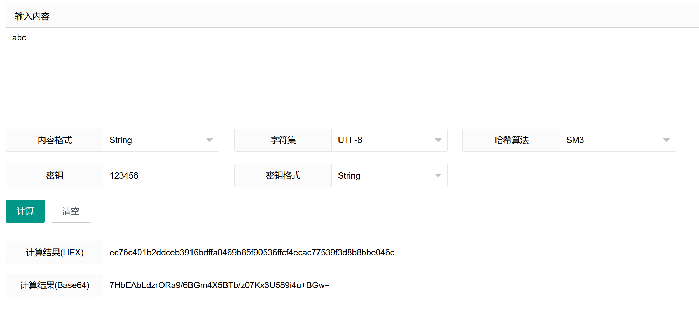

[toc]

# 《密码系统设计》实验

## 实验二	密码算法实现

### 4-6 学时实践要求（30 分）

1. 在 Ubuntu或openEuler中（推荐 openEuler）中调试运行教材提供的源代码，至少运行SM2，SM3，SM4代码，使用GmSSL命令验证你代码的正确性，使用Markdown记录详细记录实践过程，每完成一项功能或者一个函数git commit 一次。（15分）
- 下载并整理教材的源代码
    - 下载并解压云班课/资源/课程参考资料/Windows.C.C++.加密解密实战.rocsrc.zip
    - 结合教材确定代码所属内容（见GitHub仓库中“实验/代码/教材源代码”）
- 调试运行sm3代码
    - 4-1代码运行结果（一段式SM3算法）
        - 原先代码报错
            ```shell
            test.cpp: In function ‘long unsigned int SL(long unsigned int, int)’:
            test.cpp:17:26: error: expected initializer before ‘x’
            17 |         unsigned __int64 x = X;
                |                          ^
            test.cpp:18:9: error: ‘x’ was not declared in this scope
            18 |         x = x << (n % 32);
                |         ^
            test.cpp: In function ‘void SM3Hash(unsigned char*, int, unsigned char*)’:
            test.cpp:154:9: error: ‘memset’ was not declared in this scope
            154 |         memset(m1, 0, m1l);
                |         ^~~~~~
            test.cpp:9:1: note: ‘memset’ is defined in header ‘<cstring>’; did you forget to ‘#include <cstring>’?
                8 | #include <memory>
            +++ |+#include <cstring>
                9 |
            test.cpp:155:9: error: ‘memcpy’ was not declared in this scope
            155 |         memcpy(m1, m, l / 8);
                |         ^~~~~~
            test.cpp:155:9: note: ‘memcpy’ is defined in header ‘<cstring>’; did you forget to ‘#include <cstring>’?
            test.cpp: At global scope:
            test.cpp:223:1: error: ‘::main’ must return ‘int’
            223 | void main()
                | ^~~~
            ```
        - 代码运行过程
            ```shell
            root@Youer:~/shiyan/shiyan02/shiyan2-2/sm3/4-1# nano test.cpp
            root@Youer:~/shiyan/shiyan02/shiyan2-2/sm3/4-1# g++ -o test test.cpp -m32
            test.cpp:4:10: fatal error: pch.h: No such file or directory
                4 | #include "pch.h"
                |          ^~~~~~~
            compilation terminated.
            root@Youer:~/shiyan/shiyan02/shiyan2-2/sm3/4-1# nano test.cpp
            root@Youer:~/shiyan/shiyan02/shiyan2-2/sm3/4-1# g++ -o test test.cpp -m32
            root@Youer:~/shiyan/shiyan02/shiyan2-2/sm3/4-1# ./test
            SM3 Hash:
            66 c7 f0 f4 62 ee ed d9 d1 f2 d4 6b dc 10 e4 e2
            41 67 c4 87 5c f2 f7 a2 29 7d a0 2b 8f 4b a8 e0

            ```
        - 代码修改结果如下：
            ```c
            #include <stdio.h>
            #include <memory>
            #include <cstring>
            #include <cstdint>  // 包含标准整数类型

            unsigned char IV[256 / 8] = { 0x73,0x80,0x16,0x6f,0x49,0x14,0xb2,0xb9,0x17,0x24,0x42,0xd7,0xda,0x8a,0x06,0x00,0xa9,0x6f,0x30,0xbc,0x16,0x31,0x38,0xaa,0xe3,0x8d,0xee,0x4d,0xb0,0xfb,0x0e,0x4e };

            // 循环左移
            unsigned long SL(unsigned long X, int n)
            {
                    uint64_t x = X;  // 修改为标准类型
                    x = x << (n % 32);
                    unsigned long l = (unsigned long)(x >> 32);
                    return x | l;
            }

            unsigned long Tj(int j)
            {
                    if (j <= 15)
                    {
                            return 0x79cc4519;
                    }
                    else
                    {
                            return 0x7a879d8a;
                    }
            }

            unsigned long FFj(int j, unsigned long X, unsigned long Y, unsigned long Z)
            {
                    if (j <= 15)
                    {
                            return X ^ Y ^ Z;
                    }
                    else
                    {
                            return (X & Y) | (X & Z) | (Y & Z);
                    }
            }

            unsigned long GGj(int j, unsigned long X, unsigned long Y, unsigned long Z)
            {
                    if (j <= 15)
                    {
                            return X ^ Y ^ Z;
                    }
                    else
                    {
                            return (X & Y) | (~X & Z);
                    }
            }

            unsigned long P0(unsigned long X)
            {
                    return X ^ SL(X, 9) ^ SL(X, 17);
            }

            unsigned long P1(unsigned long X)
            {
                    return X ^ SL(X, 15) ^ SL(X, 23);
            }

            // 扩展
            void EB(unsigned char Bi[512 / 8], unsigned long W[68], unsigned long W1[64])
            {
                    // Bi 分为W0~W15
                    for (int i = 0; i < 16; ++i)
                    {
                            W[i] = Bi[i * 4] << 24 | Bi[i * 4 + 1] << 16 | Bi[i * 4 + 2] << 8 | Bi[i * 4 + 3];
                    }

                    for (int j = 16; j <= 67; ++j)
                    {
                            W[j] = P1(W[j - 16] ^ W[j - 9] ^ SL(W[j - 3], 15)) ^ SL(W[j - 13], 7) ^ W[j - 6];
                    }

                    for (int j = 0; j <= 63; ++j)
                    {
                            W1[j] = W[j] ^ W[j + 4];
                    }
            }

            // 压缩函数
            void CF(unsigned char Vi[256 / 8], unsigned char Bi[512 / 8], unsigned char Vi1[256 / 8])
            {
                    // Bi 扩展为132个字
                    unsigned long W[68] = { 0 };
                    unsigned long W1[64] = { 0 };

                    EB(Bi, W, W1);

                    // 串联 ABCDEFGH = Vi
                    unsigned long R[8] = { 0 };
                    for (int i = 0; i < 8; ++i)
                    {
                            R[i] = ((unsigned long)Vi[i * 4]) << 24 | ((unsigned long)Vi[i * 4 + 1]) << 16 | ((unsigned long)Vi[i * 4 + 2]) << 8 | ((unsigned long)Vi[i * 4 + 3]);
                    }

                    unsigned long A = R[0], B = R[1], C = R[2], D = R[3], E = R[4], F = R[5], G = R[6], H = R[7];

                    unsigned long SS1, SS2, TT1, TT2;
                    for (int j = 0; j <= 63; ++j)
                    {
                            SS1 = SL(SL(A, 12) + E + SL(Tj(j), j), 7);
                            SS2 = SS1 ^ SL(A, 12);
                            TT1 = FFj(j, A, B, C) + D + SS2 + W1[j];
                            TT2 = GGj(j, E, F, G) + H + SS1 + W[j];
                            D = C;
                            C = SL(B, 9);
                            B = A;
                            A = TT1;
                            H = G;
                            G = SL(F, 19);
                            F = E;
                            E = P0(TT2);
                    }

                    // Vi1 = ABCDEFGH 串联
                    R[0] = A, R[1] = B, R[2] = C, R[3] = D, R[4] = E, R[5] = F, R[6] = G, R[7] = H;
                    for (int i = 0; i < 8; ++i)
                    {
                            Vi1[i * 4] = (R[i] >> 24) & 0xFF;
                            Vi1[i * 4 + 1] = (R[i] >> 16) & 0xFF;
                            Vi1[i * 4 + 2] = (R[i] >> 8) & 0xFF;
                            Vi1[i * 4 + 3] = (R[i]) & 0xFF;
                    }
                    // Vi1 = ABCDEFGH ^ Vi
                    for (int i = 0; i < 256 / 8; ++i)
                    {
                            Vi1[i] ^= Vi[i];
                    }
            }

            //参数 m 是原始数据，ml 是数据长度，r 是输出参数,存放hash结果
            void SM3Hash(unsigned char* m, int ml, unsigned char r[32])
            {
                    int l = ml * 8;
                    int k = 448 - 1 - l % 512; // 添加k个0，k 是满足 l + 1 + k ≡ 448mod512 的最小的非负整数
                    if (k <= 0)
                    {
                            k += 512;
                    }

                    int n = (l + k + 65) / 512;

                    int m1l = n * 512 / 8; // 填充后的长度，512位的倍数
                    unsigned char* m1 = new unsigned char[m1l];
                    memset(m1, 0, m1l);
                    memcpy(m1, m, l / 8);

                    m1[l / 8] = 0x80; // 消息后补1

                    // 再添加一个64位比特串，该比特串是长度l的二进制表示
                    unsigned long l1 = l;
                    for (int i = 0; i < 64 / 8 && l1 > 0; ++i)
                    {
                            m1[m1l - 1 - i] = l1 & 0xFF;
                            l1 = l1 >> 8;
                    }

                    //将填充后的消息m′按512比特进行分组：m′ = B(0)B(1)· · · B(n−1),其中n=(l+k+65)/512。
                    unsigned char** B = new unsigned char*[n];
                    for (int i = 0; i < n; ++i)
                    {
                            B[i] = new unsigned char[512 / 8];
                            memcpy(B[i], m1 + (512 / 8)*i, 512 / 8);
                    }

                    delete[] m1;

                    unsigned char** V = new unsigned char*[n + 1];
                    for (int i = 0; i <= n; ++i)
                    {
                            V[i] = new unsigned char[256 / 8];
                            memset(V[i], 0, 256 / 8);
                    }

                    // 初始化 V0 = VI
                    memcpy(V[0], IV, 256 / 8);

                    // 压缩函数，V 与扩展的B
                    for (int i = 0; i < n; ++i)
                    {
                            CF(V[i], B[i], V[i + 1]);
                    }

                    for (int i = 0; i < n; ++i)
                    {
                            delete[] B[i];
                    }
                    delete[] B;

                    // V[n]是结果
                    memcpy(r, V[n], 32);

                    for (int i = 0; i <= n; ++i)
                    {
                            delete[] V[i];
                    }
                    delete[] V;
            }

            // 打印缓冲区内容
            void dumpbuf(unsigned char* buf, int len)
            {
                    for (int i = 0; i < len; ++i) {
                            printf("%02x", buf[i]);
                            if ((i + 1) % 16 == 0)
                            printf("\n");
                            else
                                    printf(" ");
                    }
                    printf("\n");
            }

            int main()
            {
                    // 输入数据
                    unsigned char message[] = "abc";
                    int message_len = strlen((char*)message);

                    // 输出缓冲区
                    unsigned char hash_result[32] = { 0 };

                    // 调用 SM3 哈希函数
                    SM3Hash(message, message_len, hash_result);

                    // 输出哈希结果
                    printf("SM3 Hash:\n");
                    dumpbuf(hash_result, 32);

                    return 0;
            }
            ```
    - 4-2代码运行结果（手工实现三段式SM3算法）
        ```shell
        root@Youer:~/shiyan/shiyan02/shiyan2-2/sm3/4-2# nano sm3.cpp
        root@Youer:~/shiyan/shiyan02/shiyan2-2/sm3/4-2# ls
        sm3.cpp  sm3.h  test  test.cpp
        root@Youer:~/shiyan/shiyan02/shiyan2-2/sm3/4-2# g++ -o test sm3.cpp  test.cpp
        root@Youer:~/shiyan/shiyan02/shiyan2-2/sm3/4-2# ./test
        Message: abc
        Hash:   37bc43d1 1cab393d 7899ef62 24f568ec 18a8fd85 1d165c50 0c375402 0f466a04
        Message: abcdabcdabcdabcdabcdabcdabcdabcdabcdabcdabcdabcdabcdabcdabcdabcd
        Hash:   a8f95215 08e03054 1325267f d822077a e5c2fd1f 32b54ebb bf8c1c79 064c9b6d
        root@Youer:~/shiyan/shiyan02/shiyan2-2/sm3/4-2# g++ -o test sm3.cpp  test.cpp -m32
        root@Youer:~/shiyan/shiyan02/shiyan2-2/sm3/4-2# ./test
        Message: abc
        Hash:   66c7f0f4 62eeedd9 d1f2d46b dc10e4e2 4167c487 5cf2f7a2 297da02b 8f4ba8e0
        Message: abcdabcdabcdabcdabcdabcdabcdabcdabcdabcdabcdabcdabcdabcdabcdabcd
        Hash:   debe9ff9 2275b8a1 38604889 c18e5a4d 6fdb70e5 387e5765 293dcba3 9c0c5732
        ```
    - 4-3代码运行结果（基于openssl实现sm3）
        ```shell
        root@Youer:~/shiyan/shiyan02/shiyan2-2/sm3/4-3# nano test.cpp
        root@Youer:~/shiyan/shiyan02/shiyan2-2/sm3/4-3# nano sm3hash.h
        root@Youer:~/shiyan/shiyan02/shiyan2-2/sm3/4-3# nano sm3hash.cpp
        root@Youer:~/shiyan/shiyan02/shiyan2-2/sm3/4-3# g++ -o test test.cpp sm3hash.cpp -lssl -lcrypto
        root@Youer:~/shiyan/shiyan02/shiyan2-2/sm3/4-3# ./test
        raw data: abc
        hash length: 32 bytes.
        hash value:
        0x66  0xc7  0xf0  0xf4  0x62  0xee  0xed  0xd9  0xd1  0xf2  0xd4  0x6b  0xdc  0x10  0xe4  0xe2  0x41  0x67  0xc4  0x87  0x5c  0xf2  0xf7  0xa2  0x29  0x7d  0xa0  0x2b  0x8f  0x4b  0xa8  0xe0

        raw data:
        0x61  0x62  0x63  0x64  0x61  0x62  0x63  0x64  0x61  0x62  0x63  0x64  0x61  0x62  0x63  0x64  0x61  0x62  0x63  0x64  0x61  0x62  0x63  0x64  0x61  0x62  0x63  0x64  0x61  0x62  0x63  0x64  0x61  0x62  0x63  0x64  0x61  0x62  0x63  0x64  0x61  0x62  0x63  0x64  0x61  0x62  0x63  0x64  0x61  0x62  0x63  0x64  0x61  0x62  0x63  0x64  0x61  0x62  0x63  0x64  0x61  0x62  0x63  0x64
        hash length: 32 bytes.
        hash value:
        0xde  0xbe  0x9f  0xf9  0x22  0x75  0xb8  0xa1  0x38  0x60  0x48  0x89  0xc1  0x8e  0x5a  0x4d  0x6f  0xdb  0x70  0xe5  0x38  0x7e  0x57  0x65  0x29  0x3d  0xcb  0xa3  0x9c  0xc  0x57  0x32
        ```
    - 4-4代码运行结果（实现HMAC-SM3算法）
        ```
        root@Youer:~/shiyan/shiyan02/shiyan2-2/sm3/4-4# ls
        sm3.cpp
        root@Youer:~/shiyan/shiyan02/shiyan2-2/sm3/4-4# nano sm3.h
        root@Youer:~/shiyan/shiyan02/shiyan2-2/sm3/4-4# nano test.cpp
        root@Youer:~/shiyan/shiyan02/shiyan2-2/sm3/4-4# g++ -o test test.cpp sm3.cpp -m32
        root@Youer:~/shiyan/shiyan02/shiyan2-2/sm3/4-4# ./test
        Message: abc
        HMAC:   ec76c401 b2ddceb3 916bdffa 0469b85f 90536ffc f4ecac77 539f3d8b 8bbe046c
        ```
    - 验证部分
        - 使用GmSSL命令得到'abc'和'abcdabcdabcdabcdabcdabcdabcdabcdabcdabcdabcdabcdabcdabcdabcdabcd'的哈希值
            ```shell
            root@Youer:~/shiyan/shiyan02/shiyan2-2/sm3/4-3# echo -n "abc" | gmssl sm3
            66c7f0f462eeedd9d1f2d46bdc10e4e24167c4875cf2f7a2297da02b8f4ba8e0
            root@Youer:~/shiyan/shiyan02/shiyan2-2/sm3/4-2# echo -n "abcdabcdabcdabcdabcdabcdabcdabcdabcdabcdabcdabcdabcdabcdabcdabcd" | gmssl sm3
            debe9ff92275b8a138604889c18e5a4d6fdb70e5387e5765293dcba39c0c5732
            ```
        - 由于4-4中源代码的密钥长度不符合gmssl命令的要求，所以在[在线网站](https://www.lddgo.net/encrypt/hmac)中验证结果
            - 
- 调试运行sm4代码
    - 3-6代码运行结果（16字节版）
        ```shell
        root@Youer:~/shiyan/shiyan02/shiyan2-2/sm4/3-6# nano sm4.h
        root@Youer:~/shiyan/shiyan02/shiyan2-2/sm4/3-6# nano sm4.cpp
        root@Youer:~/shiyan/shiyan02/shiyan2-2/sm4/3-6# nano test.cpp
        root@Youer:~/shiyan/shiyan02/shiyan2-2/sm4/3-6# g++ -o test test.cpp sm4.cpp -m32
        root@Youer:~/shiyan/shiyan02/shiyan2-2/sm4/3-6# ./test
        sm4(16�ֽ�)�Լ�ɹ���

        root@Youer:~/shiyan/shiyan02/shiyan2-2/sm4/3-6# nano sm4.cpp
        root@Youer:~/shiyan/shiyan02/shiyan2-2/sm4/3-6# g++ -o test test.cpp sm4.cpp -m32
        root@Youer:~/shiyan/shiyan02/shiyan2-2/sm4/3-6# ./test
        sm4(16字节)自检成功

        ```
    - 3-7代码运行结果（实现SM4-ECBCBCCFBOFB 算法(大数据版)）
        ```shell
        root@Youer:~/shiyan/shiyan02/shiyan2-2/sm4/3-7# nano sm4.h
        root@Youer:~/shiyan/shiyan02/shiyan2-2/sm4/3-7# nano sm4.cpp
        root@Youer:~/shiyan/shiyan02/shiyan2-2/sm4/3-7# nano sm4check.cpp
        root@Youer:~/shiyan/shiyan02/shiyan2-2/sm4/3-7# nano test.cpp
        root@Youer:~/shiyan/shiyan02/shiyan2-2/sm4/3-7# g++ -o test test.cpp sm4check.cpp sm4.cpp -m32
        root@Youer:~/shiyan/shiyan02/shiyan2-2/sm4/3-7# ./test
        ecb enc(len=16) memcmp ok
        ecb dec(len=16) memcmp ok
        ecb enc/dec(len=32) memcmp ok
        ecb enc/dec(len=64) memcmp ok
        ecb enc/dec(len=128) memcmp ok
        ecb enc/dec(len=256) memcmp ok
        ecb enc/dec(len=512) memcmp ok
        ecb enc/dec(len=1024) memcmp ok
        ecb enc/dec(len=2048) memcmp ok
        ecb enc/dec(len=4096) memcmp ok
        cbc enc(len=32) memcmp ok
        cbc dec(len=32) memcmp ok
        cbc enc/dec(len=32) memcmp ok
        cbc enc/dec(len=64) memcmp ok
        cbc enc/dec(len=128) memcmp ok
        cbc enc/dec(len=256) memcmp ok
        cbc enc/dec(len=512) memcmp ok
        cbc enc/dec(len=1024) memcmp ok
        cbc enc/dec(len=2048) memcmp ok
        cbc enc/dec(len=4096) memcmp ok
        cfb enc/dec(len=16) memcmp ok
        cfb enc/dec(len=32) memcmp ok
        cfb enc/dec(len=64) memcmp ok
        cfb enc/dec(len=128) memcmp ok
        cfb enc/dec(len=256) memcmp ok
        cfb enc/dec(len=512) memcmp ok
        cfb enc/dec(len=1024) memcmp ok
        cfb enc/dec(len=2048) memcmp ok
        cfb enc/dec(len=4096) memcmp ok
        ofb enc/dec(len=16) memcmp ok
        ofb enc/dec(len=32) memcmp ok
        ofb enc/dec(len=64) memcmp ok
        ofb enc/dec(len=128) memcmp ok
        ofb enc/dec(len=256) memcmp ok
        ofb enc/dec(len=512) memcmp ok
        ofb enc/dec(len=1024) memcmp ok
        ofb enc/dec(len=2048) memcmp ok
        ofb enc/dec(len=4096) memcmp ok
        ```
    - sm4的程序似乎与系统位数无关，32位与64位编译均自检成功


2. 在[密标委网站http://www.gmbz.org.cn/main/bzlb.html](http://www.gmbz.org.cn/main/bzlb.html)查找SM2，SM3，SM4相关标准，分析代码实现与标准的对应关系。（10分）
3. 使用GmSSL,UKey交叉验证实现的正确性（5 分）
4. 实验记录中提交 gitee 课程项目链接，提交本次实验相关 git log运行结果
5. 提交要求：

- 提交实践过程Markdown和转化的PDF文件
- 代码，文档托管到gitee或github等，推荐 gitclone
- 记录实验过程中遇到的问题，解决过程，反思等内容，用于后面实验报告

- 教材代码结果不正确
    - 原因主要是需要32位环境运行，应该与Ubuntu是小端系统无关
    - 现象：'abc'的sm3哈希值为37bc43d1 1cab393d 7899ef62 24f568ec 18a8fd85 1d165c50 0c375402 0f466a04
    - [](https://github.com/NEWPLAN/SMx/issues/6)