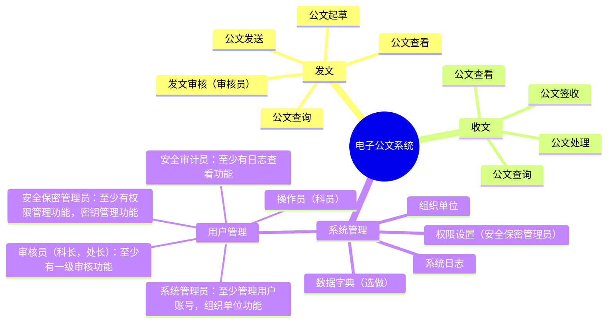

## 实验四	密码模块的应用

### 实践要求（40 分）

1. 完成电子公文交换系统，[系统功能](https://mermaid.live/edit#pako:eNqFks1qwkAUhV8lzErBJ8i62666zWZwxjbgJJJOFkWElvpTKaFKtbagWEsFFzUKxSoE9WUyM_EtOk42MRW7u3POd-fcC7cM8jbCQAfEtBCBJcPSNMe2aSYjOgs2bbHaF39piO9ABMNsdu9qGntqSy2u1Vsx0WIZec20yodj0X9MqKqX-SP-vkqz0tvd3h35IZp9xCrv_BxJFtONNP5NjjM-q6JVP5UR7yr80QEngqoIGszrhmsvoXYm_GGZZtWkz1647rP266EcL_5HTmYe6Wmy2iTcDtisfhKRn0f-6MDkg_vdWyvyN2LtJ8ZWcbw3Zttegu3OueezaY_VViAHCHYINJE8jfKeMQC9wgQbQJclwgXoFqkBDKsiUehS--LGygOdOi7OAbeEIMVnJrx0IAF6ARavpYqRSW3nPD43dXWVX60rGeU)，（15 分）




- 总体要求
  - 项目类型必须是B/S或C/S架构
  - 项目程序设计语言可以是C，Python，Rust等

2. 三员制度是指将系统管理员、安全保密管理员和安全审计员三个角色分离，分别负责系统运行、安全保密和安全管理，相互制约，共同保障信息系统安全。三员职责

- 系统管理员
  - 负责信息系统的日常维护、故障处理和升级更新。
  - 确保系统正常运行，对系统资源进行合理分配。
  - 负责用户账号的创建、修改和删除。
  - 定期备份重要数据，确保数据安全。
- 安全保密管理员
  - 负责制定和实施安全保密策略，确保信息系统安全。
  - 对用户进行安全意识培训，提高用户安全防范能力。
  - 监控网络安全状况，发现异常情况及时处理。
  - 负责信息系统安全事件的应急响应和处理。
- 安全审计员
  - 负责对信息系统进行安全审计，评估安全风险。
  - 监督系统管理员和安全保密管理员的工作，确保其履行职责。
  - 对信息系统安全事件进行调查，提出整改建议。

3. 黄金法则（5 分 ）
   - 身份鉴别：口令不能存，数据库要保存加盐的SM3Hash值
   - 访问控制：操作员，审核员，安全三员的权限设置
   - 安全审计：至少完成日志查询功能
4. 密码（15 分）
   - 算法：SM2，SM3，SM4，推荐使用 Key
   - 密钥管理：所有私钥，对称算法密钥等不能明存
5. 系统量化评估（5分）
   - 按照[商用密码应用安全性评估量化评估规则](https://ht.cacrnet.org.cn/upload/file/20230718/1689639379401088.pdf),计算自己系统的得分，只计算应用和数据安全。
6. 提交要求：

- 提交实践过程Markdown和转化的PDF文件
- 代码，文档托管到gitee或github等，推荐 gitclone
    - [GitHub文档链接](https://github.com/youer0219/Information-Security-System-Design-Assignment/blob/main/%E5%AE%9E%E9%AA%8C/%E5%AE%9E%E9%AA%8C%E5%9B%9B/20221414%E5%BE%90%E9%B9%BF%E9%B8%A3%E5%AE%9E%E9%AA%8C%E5%9B%9B%E5%AE%9E%E8%B7%B5%E8%BF%87%E7%A8%8B.md)
- 记录实验过程中遇到的问题，解决过程，反思等内容，用于后面实验报告

### 实验四实验报告（10 分）

参考附件中的实验报告模板，完成并提交实验报告，报告名称“学号_姓名_实验序号_实验名称.doc”

### 实践过程

#### 资料
- 电子公文系统参考示例
    - [国家能源局-西北监管局电子公文系统](https://xbj.nea.gov.cn/upload/2020/07/23/1595475792919000.pdf)
- 一般资料
    - [可以开发电子公文系统的开源平台](https://www.o2oa.net/app/gwgl.html)
    - [规范文件](https://www.gov.cn/gongbao/content/2019/content_5386632.htm)
    - [百度介绍](https://baike.baidu.com/item/%E7%94%B5%E5%AD%90%E5%85%AC%E6%96%87%E4%BC%A0%E8%BE%93%E7%B3%BB%E7%BB%9F/20925084)


#### 网课学习
- 在研究加盐SM3哈希验证那部分内容时明确技术路线就是：python + Flask + 国密 + 数据库

- 学习视频
    - [python flask连接mysql数据库实现登录注册](https://www.bilibili.com/video/BV1P5x7emE9H/?spm_id_from=333.337.search-card.all.click&vd_source=912de37828db7e4feff5c9492864d51c)
    - [90分钟用Python和Flask开发博客系统](https://www.bilibili.com/video/BV1gh411q7xo/?spm_id_from=333.337.search-card.all.click&vd_source=912de37828db7e4feff5c9492864d51c)
    - 权限管理
        - [Python Flask 权限管理系统实现 | 基于角色访问权限管理模型（RBAC） | 权鉴管理系统](https://www.bilibili.com/video/BV1tg411X7o5/?spm_id_from=333.337.search-card.all.click&vd_source=912de37828db7e4feff5c9492864d51c)
        - bydB站四个课程全都是一样的这你敢信！


- 教程一：[python flask连接mysql数据库实现登录注册](https://www.bilibili.com/video/BV1P5x7emE9H/?spm_id_from=333.337.search-card.all.click&vd_source=912de37828db7e4feff5c9492864d51c)
    - 简单的flask应用 与 数据库连接操作
    - 获得了一个简单的具有登录注册功能的应用
    - 修改用户表的组成，实现一个SM3+盐值的登录验证功能

- 教程二：[90分钟用Python和Flask开发博客系统](https://www.bilibili.com/video/BV1gh411q7xo/?spm_id_from=333.337.search-card.all.click&vd_source=912de37828db7e4feff5c9492864d51c)
    - 学习Base模板使用
    - 简单的渲染、编辑文章
        - 不够用


#### 登录验证功能实现

##### 邮箱发送功能实现
- 参考资料
  - [参考项目](https://github.com/wtmxxx/python-users?tab=readme-ov-file)
  - [QQ的smtp服务介绍](https://wx.mail.qq.com/list/readtemplate?name=app_intro.html#/agreement/authorizationCode)
- 报错与修改
  - 报错01：[Form格式问题](https://service.mail.qq.com/detail/124/995)
      ```
      验证码发送失败，原因: (550, b'The "From" header is missing or invalid. Please follow RFC5322, RFC2047, RFC822 standard protocol. https://service.mail.qq.com/detail/124/995.')，请稍后重试，或反馈客服wotemo@qq.com
      ```

  - 报错02：邮件内容可能被邮件服务器检测到包含不适当的词汇或内容
      ```
      验证码发送失败，原因: (550, b'The mail may contain inappropriate words or content.')，请稍后重试，或反馈客服wotemo@qq.com
      ```
      - 可能还是`Form格式问题`，因为之前多了一个'>'符号但系统没有检测到。或许是要开启邮箱独立验证密码。
- 最终测试代码
  ```py
  import random
  import smtplib
  from email.mime.text import MIMEText
  from email.header import Header
  import time


  def check_code():
      """
      生成6位随机验证码的函数
      """
      codes = ""
      for _ in range(6):
          code = str(random.randint(0, 9))
          codes += code
      return codes


  def send_code(from_addr, password, to_addr):
      """
      发送邮件验证码的函数
      :param from_addr: 发件邮箱地址
      :param password: 发件邮箱的SMTP授权码
      :param to_addr: 收件邮箱地址
      """
      check_codes = check_code()
      print(check_codes)
      smtp_server = 'smtp.qq.com'
      # 构建邮件正文内容，适当丰富正文说明
      msg = MIMEText(f'您好，您正在进行相关操作，以下是本次操作的验证码：{check_codes}，请妥善保管，勿向他人透露。', 'plain',
                  'utf-8')
      # 修改发件人From字段格式
      msg['From'] = Header('发件人邮箱')
      msg['To'] = Header('收件人邮箱')
      msg['Subject'] = Header('验证码测试邮件')

      try:
          server = smtplib.SMTP_SSL(smtp_server)
          server.connect(smtp_server, 465)
          server.login(from_addr, password)
          server.sendmail(from_addr, to_addr, msg.as_string())
          server.quit()
          print('验证码已发送到您的邮箱中，请注意查收...')
          return check_codes
      except smtplib.SMTPException as e:
          print(f'验证码发送失败，原因: {e}，请稍后重试，或反馈客服wotemo@qq.com')
          return None


  def checking():
      """
      整体的验证码发送与验证流程控制函数
      """
      # 发件邮箱地址，替换为你自己有效的邮箱
      from_addr = '发件人邮箱'
      # 发件邮箱的SMTP授权码，替换为你获取的真实授权码
      password = '*6%$#@!'
      # 收件邮箱地址，可根据需求修改为要发送的指定邮箱
      to_addr = "收件人邮箱"

      check_codes = send_code(from_addr, password, to_addr)
      if check_codes is None:
          return

      time_start = time.time()
      while True:
          check_code_input = input('请输入您的验证码：')
          time_end = time.time()
          time_continue = time_end - time_start
          if time_continue > 300:
              print('验证码超时，请稍后重试...')
              break
          if check_code_input == check_codes:
              print('验证通过，请继续您的操作...')
              break
          else:
              print('验证码错误，请重试...')
      return to_addr


  if __name__ == "__main__":
      checking()

  ```
- 结果截图(暂时隐藏)
  ```md
  - 
  - 
  ```

##### HTTPS访问限制
- 限制用户只能通过HTTPS访问网站，以此保护传输的数据安全
    - 其实是看看能不能为了让用户明文传递密码。
- 参考资料
    - [Flask: 如何给Python Flask Web服务器添加HTTPS功能](https://geek-docs.com/flask/flask-questions/4_flask_can_you_add_https_functionality_to_a_python_flask_web_server.html)
    - [Talisman：Flask应用的HTTP安全头保护神器](https://blog.csdn.net/gitblog_00027/article/details/138946103)
    - [AI解答：Python Flask 强制 HTTPS](https://www.doubao.com/thread/w34b3e520323c3a4f)
- 方法总结
    - 使用 Nginx 或其他反向代理服务器
    - 使用 Flask-Talisman 扩展
    - 使用 Python 代码实现简单重定向
    - 使用 Flask-SSLify 扩展
    - 同时，你需要获取一个 SSL证书
        - [获取SSL证书的方法](https://www.cnblogs.com/dyingstraw/p/12865815.html#%E6%96%B9%E6%B3%952%EF%BC%9A%E9%98%BF%E9%87%8C%E4%BA%91%E6%88%96%E8%80%85%E5%AE%9D%E5%A1%94%E5%85%8D%E8%B4%B9%E7%94%B3%E8%AF%B7%EF%BC%88%E6%8E%A8%E8%8D%90%EF%BC%89)
        - openssl自签名证书、阿里云免费申请等
- 综上资料所述，为快速完成实验四，我选择`Talisman`直接实现强制HTTPS访问。使用`openssl req -x509 -newkey rsa:4096 -nodes -out cert.pem -keyout key.pem -days 365`命令在Ubuntu上获取自签名证书再拷贝到Windows上来。
- 测试代码(同目录下放置之前生成的自签名证书和私钥)
    ```py
    from flask import Flask
    from flask_talisman import Talisman

    app = Flask(__name__)

    # 配置内容安全策略（可根据实际情况调整内容）
    csp = {
        'default-src': ['\'self\'', 'https://trusted.com'],
        'script-src': ['\'self\'', 'https://cdnjs.cloudflare.com/ajax/libs/jquery/3.5.1/jquery.min.js']
    }

    # 配置Talisman，启用强制HTTPS访问等相关安全配置
    talisman = Talisman(
        app,
        content_security_policy=csp,
        force_https=True,
        strict_transport_security={
            'max_age': 31536000  # 设置HSTS有效期为1年，单位为秒，这样的写法嵌套在字典中传递参数
        },
        frame_options='DENY'
    )

    @app.route('/')
    def index():
        return "Hello, World!"

    if __name__ == '__main__':
        app.run(ssl_context=('cert.pem', 'key.pem'))
    ```
- 结果截图（已隐藏）
    ```md
    - 
    - 
    - 
    ```

##### 加盐SM3哈希登录验证功能实现

- 系统设计
    - 参考文章：[基于SM3加盐的哈希密码验证算法](https://www.cnblogs.com/makai/p/11130703.html)
    - 如何正确使用哈希算法参与密码验证
        ```md
        对于每个用户的每个密码，盐值都应该是独一无二的。每当有新用户注册或者修改密码，都应该使用新的盐值进行加密。
        并且这个盐值也应该足够长，使得有足够多的盐值以供加密。
        一个好的标准的是：`盐值至少和哈希函数的输出一样长`、`盐值应该被储存和密码哈希一起储存在账户数据表中`。
        **存储密码的步骤**
        - 使用CSPRNG生成一个长度足够的盐值
        - 将盐值混入密码，并使用标准的加密哈希函数进行加密，如SHA256
        - 把哈希值和盐值一起存入数据库中对应此用户的那条记录
        **校验密码的步骤**
        - 从数据库取出用户的密码哈希值和对应盐值
        - 将盐值混入用户输入的密码，并且使用同样的哈希函数进行加密
        - 比较上一步的结果和数据库储存的哈希值是否相同，如果相同那么密码正确，反之密码错误
        ```
    - 应当在服务器中完成哈希计算等操作。
        - 采用B/S架构，Flask框架 —— 这个python的教程多。
        - PS：那么目前要学的就是 Flask框架 + 国密 + 数据库 + 用户界面的搭建。
            - 学些什么课程
            - [python flask连接mysql数据库实现登录注册](https://www.bilibili.com/video/BV1P5x7emE9H/?spm_id_from=333.337.search-card.all.click&vd_source=912de37828db7e4feff5c9492864d51c)
            - [90分钟用Python和Flask开发博客系统](https://www.bilibili.com/video/BV1gh411q7xo/?spm_id_from=333.337.search-card.all.click&vd_source=912de37828db7e4feff5c9492864d51c)
    - 更加安全的哈希
        - 慢哈希算法
        - **密钥哈希和密码哈希设备**
            ```md
            只要攻击者可以检测对一个密码的猜测是否正确，那么他们就可以进行字典攻击或暴力攻击。
            因此下一步就是向哈希计算中增加一个密钥，只有知道这个密钥的人才能校验密码。
            有两种办法可以实现：将哈希值加密，比如使用AES算法；将密钥包含到哈希字符串中，比如使用密钥哈希算法HMAC。
            听起来很简单，做起来就不一样了。这个密钥需要在任何情况下都不被攻击者获取，即使系统因为漏洞被攻破了。
            如果攻击者获取了进入系统的最高权限，那么不论密钥被储存在哪，他们都可以窃取到。
            因此密钥需要储存在`外部系统`中，比如另一个用于密码校验的物理服务器，或者一个关联到服务器的特制硬件，如YubiHSM。
            ```
        - **如果密钥无法存储的专门的服务器或外部设备的解决方案**
            ```md
            如果你难以负担多个服务器或专用的硬件，仍然有办法在一个普通Web服务器上利用密钥哈希技术。
            大部分针对数据库的入侵都是由于SQL注入攻击，因此`不要给攻击者进入本地文件系统的权限`（禁止数据库服务访问本地文件系统，如果它有这个功能的话）。
            这样一来，当你随机生成一个密钥存到通过Web程序无法访问的文件中，然后混入加盐哈希，得到的哈希值就不再那么脆弱了，
            即便这时数据库遭受了注入攻击。不要把将密钥硬编码到代码里，应该在安装时随机生成。这当然不如独立的硬件系统安全，
            因为如果Web程序存在SQL注入点，那么可能还存在其他一些问题，比如本地文件包含漏洞（Local File Inclusion），
            攻击者可以利用它读取本地密钥文件。无论如何，这个措施比没有好
            ```
- 用户数据设计与数据库表的创建
    - 用户数据：
        - 用户ID    （自动生成）
        - 用户名     (这里起到唯一ID的作用。实际应用中应该有其他的唯一ID。因此不可重复。)
        - 密码哈希值 (保存16进制数据)
        - 盐值       (保存16进制数据)
    - 之后肯定要更换唯一ID,用户名就用姓名且可重复。同时加入邮箱等数据。但这里仅作测试。
    - 创建表的SQL语句
        ```sql
        USE demo01;

        CREATE TABLE Users (
            UserID INT AUTO_INCREMENT PRIMARY KEY,
            Username VARCHAR(255) NOT NULL UNIQUE, -- 确保用户名不重复（实际应用中应该有其他的ID）
            PasswordHash VARCHAR(64) NOT NULL, -- 存储64个字符的十六进制字符串
            Salt VARCHAR(64) NOT NULL  -- 存储64个字符的十六进制字符串
        );
        ```
- 测试SM3的带盐值的哈希验证
    ```py
    from gmssl import sm3, func

    def generate_salt(length=32):
        """生成指定长度的随机盐"""
        return func.random_hex(length)

    def hash_with_salt(password, salt):
        """使用盐值对密码进行SM3哈希处理"""
        # 将密码和盐拼接起来
        data = password + salt
        # 使用SM3算法计算哈希
        hash_value = sm3.sm3_hash(func.bytes_to_list(data.encode()))
        return hash_value

    def verify_password(input_password, salt, stored_hash):
        """验证输入的密码是否与存储的哈希匹配"""
        # 使用相同的盐值对输入密码进行哈希处理
        input_hash = hash_with_salt(input_password, salt)
        # 比较新生成的哈希与存储的哈希
        return input_hash == stored_hash

    # 生成
    password = "my_secure_password"
    salt = generate_salt()  # 生成一个随机盐
    hashed_password = hash_with_salt(password, salt)
    print(f"Salt: {salt}")
    print(f"Hashed Password: {hashed_password}")

    # 验证
    input_password = "my_secure_password"
    stored_salt = salt  # 应该是从数据库中获取的盐值
    stored_hash = hashed_password  # 应该是从数据库中获取的哈希值

    is_valid = verify_password(input_password, stored_salt, stored_hash)
    print("Password is valid:", is_valid)
    ```
- 测试存储与提取生成的密码和盐值(在登陆系统的网课中的test.py中测试。其实现了一个基于参数的SQL语句执行函数con_my_sql)
    ```py
    # 测试存储SM3带盐值hash后的用户信息
    username = "张三"
    pwd = "123456"
    salt = SaltSM3.generate_salt()
    pwd_salt_hash = SaltSM3.hash_with_salt(pwd, salt)
    print(pwd_salt_hash)
    # 这里使用参数化的方式构建SQL语句，表名和列名按规范使用反引号包围，占位符 %s 表示参数位置
    code = "INSERT INTO `users` (`Username`, `PasswordHash`,`Salt`) VALUES (%s, %s, %s)"
    # 以元组形式传入对应占位符的参数值
    result = con_my_sql(code, (username, pwd_salt_hash,salt))
    print("result:",result)

    # 测试查询SM3带盐值hash后的用户信息并验证
    username = "张三"
    pwd = "123456"
    # 同样使用参数化方式构建查询语句，占位符 %s 用于传入参数
    code = "select * from users where Username = %s"
    # 传入参数值，以元组形式（即使只有一个参数也要用元组包裹）
    cursor_ans = con_my_sql(code, (username,))
    ans_dates = cursor_ans.fetchall()
    if len(ans_dates) > 0:
        user_date = ans_dates[0]
        PasswordHash = user_date['PasswordHash']
        Salt = user_date['Salt']
        password_salt_hash = SaltSM3.hash_with_salt(pwd,Salt)
        if password_salt_hash == PasswordHash:
            print("验证成功!")
    ```


##### flask-login插件使用

- 使用[通义千问代码模式](https://lxblog.com/qianwen/share?shareId=b5e17d38-6f0f-4089-bd1e-bb46fa0e7bb1)辅助学习，效果很不错！

- flask-login插件
    - 为什么用这个插件：
        - 需求：之前的实现太粗糙了。不好与后面的权限扩展相结合。同时尽可能使用插件避免自己造不安全费时间的轮子。
        - 优点：简单
    - [介绍](https://www.doubao.com/thread/w1b0d1ad7f2000db4)：专门为 Flask 应用程序设计的用户认证和会话管理扩展。它简化了处理用户登录、注销以及在多个请求之间跟踪用户状态的过程。
        - [中文文档](https://wizardforcel.gitbooks.io/flask-extension-docs/content/flask-login.html)

- 中文文档中包括了很多功能与实践建议，值得仔细看！


- 目前的实现中没有验证`next`，所以可能遭到[重定向攻击](https://www.doubao.com/thread/w1b0d1ad7f2000db4)。但由于是直接跳转index中的，所以我的项目并不需要验证。如果变更跳转另说。


#### 公文功能实现

- 参考博客系统实现最简单的公文操作建模

- 参考教程：[90分钟用Python和Flask开发博客系统](https://www.bilibili.com/video/BV1gh411q7xo/?spm_id_from=333.337.search-card.all.click&vd_source=912de37828db7e4feff5c9492864d51c)
    - 代码地址：
    - 直接复制demo代码，打算将其作为网页骨架
    - 教程特点：
        - 会传递很多数据到前端处理。这肯定不行。得改为后端处理数据。
        - 文章的表肯定要改。

- 公文建模
    - 核心就是数据库中的表如何设计
    - 要求：满足基本需求。但不要太复杂，简单实现就好。
    - 参考
        - [如何制作公文数据库表](https://docs.pingcode.com/baike/1815977)
        - [众多AI对话中我最满意的一个](https://lxblog.com/qianwen/share?shareId=601dd315-684a-4834-9d8d-fbc7a3365627)
    - 综上，公文建模如下：
        ```md
        id (主键) - 用于唯一识别每份公文。
        title - 公文标题。
        content - 公文正文内容。如果内容较大，考虑使用BLOB类型或单独存储在文件系统中，并在此字段保存文件路径。
        author_id - 作者ID，可以关联到用户表。
        status - 状态，表示当前公文的状态，如草稿、待审批、已发布等。
        create_date - 创建时间。
        last_modified_date - 最后修改日期。
        approver_id - 审批人ID。
        approval_date - 审批日期。
        approval_msg - 审批意见。
        security_level - 密级，如公开、秘密等。
        ```
        - 由于权限管理系统还没有实现。所以一开始可以默认全能用户。发文、审批等都可以干。
- 公文存储
    - 单表存储，多字段查询。
    - 加密存储（可能有些公文没必要加密，但目前先全都实现加密）
    - [加密方案](https://www.doubao.com/thread/w0e905731289f6807)
        - 用硬件将SM4密钥加密存储。每次调用时通过硬件解密，再用SM4密钥解密公文。
            - 这样的问题就是加密和解密都需要硬件。
        - 通过公钥进行加密，将私钥存储在硬件中
            - 私钥解密时间太长了，特别是对于硬件设备，更特别的是测试用的USB。
        - 目前还是第一个方案吧，简单点。服务器肯定不可能用我的小USB盘来做加解密，这里就当作模拟了。

- 如何开发：
    - 设计与建模
        - 需求是什么
        - 怎么说？做得到吗？
    - 参考博客教程，在其基础上进行扩展
    - 参考[B站发现的开源项目](https://www.bilibili.com/video/BV1vz421k7mH/?spm_id_from=333.337.search-card.all.click&vd_source=912de37828db7e4feff5c9492864d51c)——[基于Flask+MySQL的增删改查demo](https://github.com/mudfish/python-flask-user-crud)

- 博客中直接在前端暴露了文件的ID，这可能导致低密级的用户试图通过路由猜测文件位置。
    - 需要严格限制用户权限、文件ID加密或混淆处理以及进行日志监控


#### 权限管理功能实现

##### 资料与网课
- 资料
    - [探索 Flask-Permission：一款强大的权限管理库](https://blog.csdn.net/gitblog_00092/article/details/137452121)
    - [基于Python-Flask的权限管理 系列教程](https://www.cnblogs.com/huguodong/p/12653354.html)
    - 可以参考开源项目的代码：[基于 Flask 的后台管理系统 —— Pear Admin Flask](https://gitee.com/pear-admin/pear-admin-flask)
        - [Pear Admin Flask 使用教程](https://www.bilibili.com/video/BV1FF411b7bS/?spm_id_from=333.788.video.desc.click&vd_source=912de37828db7e4feff5c9492864d51c)
- 教程
    - [基于Python使用Flask开发一个权限管理系统](https://www.bilibili.com/video/BV1Dd4y197Eu/?spm_id_from=333.337.search-card.all.click&vd_source=912de37828db7e4feff5c9492864d51c)
    - [Python Flask 权限管理系统实现 | 基于角色访问权限管理模型（RBAC） | 权鉴管理系统](https://www.bilibili.com/video/BV1tg411X7o5/?spm_id_from=333.337.search-card.all.click&vd_source=912de37828db7e4feff5c9492864d51c)

- 这些网课都是一个网课。实际上并没有参考这个网课实现，而是直接去学习了flask相关插件的使用。
- 可能的插件
    - [Flask-Permissions](https://github.com/raddevon/flask-permissions)


#### 数据库安全

- [限制可以访问数据库的IP为本地](https://lxblog.com/qianwen/share?shareId=a89bb686-fcde-432f-954b-0bf615659399)
    - 修改数据库配置文件，重启MySQL服务以应用新的配置
        将`bind-address`设置为`127.0.0.1`.如果不存在bind-address字段，自行添加即可。
            ```plaintext
            [mysqld]
            bind-address = 127.0.0.1
            ```
        - 寻找配置文件：配置文件默认位置：C:\ProgramData\MySQL\MySQL Server 8.0\my.ini。[找寻配置文件的常用方法:推荐通过服务寻找](https://blog.csdn.net/hxwflay/article/details/103063964)
        - 验证结果：
            - 可用：可以在本机访问数据库，其功能正常
            - 使用`netstat -ano | findstr :3306`命令查看[监听情况](https://lxblog.com/qianwen/share?shareId=6a3576b3-183e-4ecb-a4c4-493fea27a64c)
        - `缺点：会导致程序启动速度变慢`
        - 目前已注释配置文件，避免未来使用出错。
    - 配置防火墙规则，禁止除本地流量以外的所有入站连接到MySQL端口（通常是3306）
        - 这里不再配置，避免未来用的时候出错。
    - 用户权限管理
        审查并管理用户权限
        ```sql
        GRANT ALL PRIVILEGES ON *.* TO 'user'@'localhost' IDENTIFIED BY 'password';
        ```
        这里的`localhost`意味着该用户只能从本地主机建立连接。如果你希望更加严格地控制，甚至可以在创建新用户时直接指定一个具体的内部网络IP地址而不是使用通配符`%`。

- [用户权限设置](https://www.doubao.com/thread/w850f4d8a80c43d44)
    - 疑似需要安装cryptography包
    - 明确需要哪些用户，用户的权限都是什么
        - 目前：五个用户
        - 确定权限的原则：最小原则。能没有就没有，能只读就只读。
    - 先删除用户再新建用户
    - 目前登录和用户管理的代码混在一起。有必要将其分开，特别是要限制登录的数据库连接权限为只可读登陆表。

- 使用配置文件管理数据库配置信息
    - 使用dotenv库管理配置信息
    - 新建.env文件、config.py文件。在前者中写入配置信息，在后者实现Config类与其实例
        - Config类负责读取配置信息，并返回一个数据库连接所需的字典

- 数据库备份与恢复


#### python访问龙脉SKF设备

##### 服务器端的使用
- 核心：python调用c库
- 选择：
    - [skf、csp、pkcs#11是什么](https://www.doubao.com/thread/we7583c0e82940086)
    - skf用过，所以优先选。csp完全不了解。pkcs#11在GitHub上找到过python的接口(没实现)，不过不同厂商可能不一样，所以不用。
    - 可以去参考GmSSL/SoftSKF库的代码

###### 测试过程

- 使用vs2022打开Windows测试项目中的interruptTest进行测试
    - 升级项目后测试成功。
- 在python中测试：
    - 资产准备：将skfapi.h拷贝过去作为参考。将windows/x64下的mtoken_gm3000.dll拷贝过去。
    - [AI实践](https://www.doubao.com/thread/w8388d09cf0676ee6)：告诉AI skfapi.h 头文件的内容与自己的需求。让AI生成测试代码
- python测试代码：
    ```py
    import ctypes

    # 加载动态库
    mydll = ctypes.CDLL('mtoken_gm3000.dll')

    # 定义数据类型

    # VERSION结构体定义，对应头文件中的版本结构体
    class VERSION(ctypes.Structure):
        _fields_ = [("major", ctypes.c_byte), ("minor", ctypes.c_byte)]

    # DEVINFO结构体定义，包含设备的各种信息，如版本、厂商、算法支持能力等
    class DEVINFO(ctypes.Structure):
        _fields_ = [("Version", VERSION),
                    ("Manufacturer", ctypes.c_char * 64),
                    ("Issuer", ctypes.c_char * 64),
                    ("Label", ctypes.c_char * 32),
                    ("SerialNumber", ctypes.c_char * 32),
                    ("HWVersion", VERSION),
                    ("FirmwareVersion", VERSION),
                    ("AlgSymCap", ctypes.c_ulong),
                    ("AlgAsymCap", ctypes.c_ulong),
                    ("AlgHashCap", ctypes.c_ulong),
                    ("DevAuthAlgId", ctypes.c_ulong),
                    ("TotalSpace", ctypes.c_ulong),
                    ("FreeSpace", ctypes.c_ulong),
                    ("MaxECCBufferSize", ctypes.c_ulong),
                    ("MaxBufferSize", ctypes.c_ulong),
                    ("Reserved", ctypes.c_byte * 64)]

    # 定义函数参数类型和返回类型

    # SKF_EnumDev函数参数及返回类型定义，用于枚举设备
    mydll.SKF_EnumDev.argtypes = (ctypes.c_bool, ctypes.c_char_p, ctypes.POINTER(ctypes.c_ulong))
    mydll.SKF_EnumDev.restype = ctypes.c_ulong

    # SKF_ConnectDev函数参数及返回类型定义，用于连接设备
    mydll.SKF_ConnectDev.argtypes = (ctypes.c_char_p, ctypes.POINTER(ctypes.c_void_p))
    mydll.SKF_ConnectDev.restype = ctypes.c_ulong

    # SKF_GenRandom函数参数及返回类型定义，用于生成随机数
    mydll.SKF_GenRandom.argtypes = (ctypes.c_void_p, ctypes.c_char_p, ctypes.c_ulong)
    mydll.SKF_GenRandom.restype = ctypes.c_ulong

    # SKF_DisConnectDev函数参数及返回类型定义，用于断开设备连接
    mydll.SKF_DisConnectDev.argtypes = (ctypes.c_void_p,)
    mydll.SKF_DisConnectDev.restype = ctypes.c_ulong

    # SKF_CloseHandle函数参数及返回类型定义，用于关闭句柄
    mydll.SKF_CloseHandle.argtypes = (ctypes.c_void_p,)
    mydll.SKF_CloseHandle.restype = ctypes.c_ulong


    def main():
        """
        主函数，实现了以下主要逻辑：
        1. 不断循环尝试枚举设备、连接设备以及生成随机数的操作。
        2. 如果某个操作执行结果不符合预期（返回值不为成功标识），则跳过当前循环，继续下一次循环尝试。
        3. 每次成功执行完一轮操作后，计数器i加1，表示成功操作的次数。
        """
        # 用于存储函数调用返回结果，初始化为0
        ulRslt = ctypes.c_ulong()
        # 设备句柄，初始化为指向一个空的 c_void_p 类型，这样后续才能正确传入 byref 函数
        hdev = ctypes.c_void_p()
        # 创建一个长度为32字节的缓冲区，用于存储生成的随机数
        pbRandom = ctypes.create_string_buffer(32)
        # 创建一个长度为256字节的缓冲区，用于存储设备名称
        szDevName = ctypes.create_string_buffer(256)
        # 用于记录设备名称缓冲区的长度，初始化为256字节
        ulNameLen = ctypes.c_ulong(256)
        hkey = None
        bp = None
        pszdev = szDevName

        i = 0
        while True:
            # 清空设备名称缓冲区，将所有字节设置为0
            szDevName.value = b'\x00' * 256
            ulNameLen.value = 256
            # 调用SKF_EnumDev函数枚举设备，传入参数：是否只枚举当前存在的设备（1表示是），设备名称缓冲区，缓冲区长度的指针
            ulRslt.value = mydll.SKF_EnumDev(1, szDevName, ctypes.byref(ulNameLen))
            print(f"{i} {szDevName.value.decode()}")
            if ulRslt.value!= 0:
                continue

            # 调用SKF_ConnectDev函数连接设备，传入参数：设备名称，设备句柄的指针
            ulRslt.value = mydll.SKF_ConnectDev(pszdev, ctypes.byref(hdev))
            if ulRslt.value!= 0:
                continue

            # 调用SKF_GenRandom函数生成随机数，传入参数：设备句柄，随机数缓冲区，要生成的随机数长度
            ulRslt.value = mydll.SKF_GenRandom(hdev, pbRandom, 8)
            if ulRslt.value!= 0:
                continue

            i += 1


    if __name__ == "__main__":
        main()
    ```
- 输出结果与项目结构（图片已隐藏）
    ```md
    - 
    ```

    - 12/03：目前来看，只需要测试一个SM4文件的读取就好了。

###### 需求与封装

- 我需要设备干什么？
    - 保存密钥对：私钥肯定保存在这里。公钥也保存，同时导出到数据库中。
        - 签名私钥 和 解密私钥
        - 私钥不导出，所以签名和解密就在设备中完成比较好。需要 `SM2签名和SM2解密` 功能
    - SM4密钥：
        - 工作密钥和密钥加密密钥的应用：设备保存密钥加密密钥。用来解密工作密钥。工作密钥加密存于外部。
        - 加密细节：字典先转JSON，再加密。解密后就是JSON，可以由JSON转字典。

- 目标：
    - Skfapi：代替skfapi.h，链接动态库，实现对硬件的调用
    - SkfApply：实现具体的功能，包括调用设备获取加解密数据等


##### 客户端的使用（未解决）
- SKF设备如何与服务器通信？？？这个办不到，其他的无意义。
    - 如果要达成这一点，可能客户端会更加合适……
- 核心问题：网页如何访问SKF设备
    - 解决了这个问题，那么，我们通过服务器发出指令，要求网页访问SKF设备，然后网页再把数据返回给服务器进行验证就好。
- 不确定能不能用：[WebUSB_API](https://developer.mozilla.org/zh-CN/docs/Web/API/WebUSB_API)
- 但可以明确，龙脉设备是支持浏览器访问的，就是不知道怎么访问。
- 同时，通义千问的代码模式支持预览网页并操作，非常方便！
    ```md
    
    ```


#### 实际开发


- 12/01
- 此时还没研究出怎么管理权限。先把已实现的部分进行整合，避免到时候什么都没有。

- 公文处理功能需要什么？
    - 需求：公文的起草、发送、审核、查看
    - 本质：对公文增删改查

- 注册界面功能保留，用于之后用户管理。

- 简化`公文建模`部分的公文设计，实际设计如下：
    - [AI回答](https://lxblog.com/qianwen/share?shareId=8a75e5a0-1c4d-4ca0-8b73-b5be5e29aa71)
        ```md
        id (主键) - 自动增长，用于唯一识别每份公文。
        title - 公文标题。不可为空。不可重复。
        content - 公文正文内容，不能为空。
        author_id - 作者ID，不能为空。  
        author_name - 作者名称，不能为空。冗余存储。
        status - 状态，表示当前公文的状态（草稿、待审批、已发布、已查看、已签收）。
        modified_date - 最后修改日期，同时作为创建时间。
        security_level - 密级，定义文档的安全级别（无、秘密、机密、绝密）。
        sm4_iv - 保存加密时用到的SM4 IV值。
        ```
    - SQL语句：
        ```sql
        CREATE TABLE documents (
            id INT AUTO_INCREMENT PRIMARY KEY,
            title VARCHAR(255) UNIQUE NOT NULL,
            content TEXT NOT NULL,
            author_id INT NOT NULL,
            author_name VARCHAR(255) NOT NULL,  
            status ENUM('draft', 'pending_approval', 'published', 'viewed', 'received') DEFAULT 'draft',
            modified_date TIMESTAMP DEFAULT CURRENT_TIMESTAMP ON UPDATE CURRENT_TIMESTAMP,
            security_level ENUM('none', 'secret', 'confidential', 'top_secret') DEFAULT 'none',
            sm4_iv BINARY(16)
        );
        ```
    - 这不是一个完美的公文建模，但是可以作为开始。后续可以参考[这个对话](https://kimi.moonshot.cn/share/ct5t5v95b5q2b8biklu0)进行修改。
        - [方法](https://kimi.moonshot.cn/share/ct61ii48u08j0h7furs0)

- 与数据库进行连接
    - 目前都使用root用户进行连接，开发方便。
    - 测试插入公文例子，使用函数对操作进行封装并测试，[参考AI代码](https://lxblog.com/qianwen/share?shareId=282d8638-9f13-4d4b-b6c0-190507e06c2c)
    - 同时修改了原先登录时对用户信息的查找例子，进行封装。
        - 用户数据结构也需要修改。但目前的ID和Name可以满足最基本的功能，暂时保留。修改插入语句即可。

- 从博客系统那边抄了一个导航功能来。之后想想导航页(网页端)怎么设计功能来满足快速开发需求。

- 显示公文列表。同时将之前对数据库操作的类都拆了出来，没必要每次都新建一个类，太麻烦了。

- 将之前用到的SQL语句都整理放在一起作为初始化文件db_init.sql。更改了部分设计。
    - 未来对数据库数据结构有更新时需要同时改变这个设计，依靠这个来完成测试数据的初始化与迅速生成。
    - 特别是用户权限管理时。

- 实现对公文的多因子查询。以及一个字典类。还能更强但现在应该满足需求了。

- 在电子公文系统中，每次编辑文章都需要传递文章的ID，但我不希望ID暴露给前端，该怎么办？
    - 先实现基于ID的版本，再去研究怎么替代

- 目前假定用户具有最高权限，优先实现功能。之后再进行权限设定（先写TODO吧）

- 实现公文编辑功能。后续的如审批意见等也可能可以通过这个方式实现。
    - 至少查看公文功能就用这个实现。查看公文时只可读。有权限的话可以跳转到编辑或删除等操作。

- 明天实现公文的增删改查功能。然后整理代码，尝试重构。之后就是权限管理的设计与实现了。

- 12/02
- 哪些功能是可以在目前基础上快速实现的？很多都可以基于编辑的那个模块。

- 目前的想法是，在公文列表实现查询。同时那里只有阅读的权限。需要点击到公文详情页才可以删除或进行其他操作。

- 需要的功能：
    - 公文列表： 查找公文 只可读
        - 展示个人的文章，包括草稿、待审核、审核失败文章。
        - 展示公开的文章，包括本单位已发布与已签收的文章。
    - 公文详情： 查看公文内容。只可读。但可以跳转到其他地方。
    - 公文编辑： 编辑公文内容
    - 公文审核： 公文列表（展示所有待审核的公文）
        - 具体公文审核界面：决定是否通过。对公文只可读。
        - 如果可以加一个可编辑的审核意见，这需要改变当前公文数据结构。

- 需要对公文数据结构进行修改
    - 标题的唯一性是否必要：存疑
    - 可以加一个审核意见
    - 可以加一个发文对象(需要同时搞一个外部的数据库，存储着单位列表)

- 感觉提交的处理太多了，好多都是重复的代码。同时公文数据库管理类中的函数太多了，需要整理。

- 需要对代码进行重构了。以及明确下一步该干什么了
    - 尝试使用表单插件
    - 感觉重构后还是一个样（
        - 还是先做完功能再说吧。
        - 两个list都没有使用表单插件
            - 其实是因为AI不给代码，不过确实方便，没必要用表单，用了还得处理表单数据结构变化时的问题

- 公文签收功能实现思考
    - 签收的文章在哪里？一个新的数据库或者表？
    - 同时，审核通过的文章也要自动发送到公开的数据库中以供其他人参阅
    - 这需要对公文格式进行必要的更改
        - 公文起草单位
        - 公文接受单位

- 重构数据结构
    - 公文数据结构
        - 添加起草单位、接受单位字段（起草单位设为用户的单位，接受单位需要从新的数据库/表中获取单位列表）
        - 取消标题的不可重复
        - 添加审批意见字段，可以为空（实际审核时在代码层面要求不为空）
    - 用户数据结构
        - 添加一个单位字段。
        - 取消名称的不可重复。
        - 增加邮箱的不可重复。之后使用邮箱代替用户名来搜索用户。
    - 数据库结构
        - 在当前或新的数据库中添加一个单位列表
            - 格式: 单位名称（不可重复）单位公钥
            - 使用：获取可发送单位列表  /  发送公文时获取对方公钥进行加密
        - 在当前或新的数据库中添加一个已发布的公文表
            - 格式：起草单位 接受单位 加密后的SM4密钥 SM4的IV值 加密数据
            - 使用：签收公文时查询这个表的数据进行操作

- 总结：
    - 实现了对公文的增改查功能。删除还没有做。这个简单，打算等权限管理时做。
    - 使用表单插件进行重构，尽管看着代码还是很丑甚至更长了，但内置的功能大大丰富了，特定的功能比如邮箱验证还很不错
    - 数据结构已重构。目前并无明显bug。之后再进行新的数据库的构建，然后发送和收取公文。
        - 这中间都不进行加解密。等密钥管理实现后再进行。
        - 审批意见字段加了。但忘记使用了。考虑到开发速度与工作量，不考虑这个的实现了。

-  12/03

- 将公文列表的查询条件改为返回所有作者的公文。
    - 同时需要改造公文列表页，只可读一些公文。
    - 如果需要更改，在可读界面中进行跳转
        - 草稿和审核失败的可以编辑并提交审核
        - 待审核、待签收、已签收的只能查看

- 公文签收如何实现？
    - 数据存储
    - 加解密与签名验签
    - 在公文签收界面，找到发送给本单位的公文列表，点击查看可以解密并展示出内容，点击签收即可签收成功，点击拒收即可拒绝公文接受
        - 所以在公共公文表上也要有一个状态：待签收、已查看、已签收、拒收
        - 一些本地公文列表中的字段是不必要的，但目前先不改
    - 公文签收界面，找到发送给本单位的“待签收”和“已查看”的公文。
        - 可以退回被拒收的公文（这个的逻辑有点复杂……因为一旦发出，默认本地直接存储归档的）
        - 目前为了测试方便，可以本地给本地发公文来签收验证


- 公共数据库的数据结构
    - 单位列表：单位名称 和 单位公钥
    - 公文列表：ID 起草单位 接受单位 公文状态 加密后的SM4密钥 SM4的IV值 加密数据

- 没有做SM4加解密等操作的验证，不确定这些操作能否实现……
    - 到时候先做本地数据库的加解密，那个相对简单一些

- 测试龙脉硬件的运行
    - 之前看加密demo时觉得有两个文件太复杂了。现在发现其中一个只是弹出个对话框罢了。所以可以去验证。
    - 但发现这可能是SM1的加解密。由此不再尝试。转而去研究由签名demo实现SM2加解密

- 对硬件的需求
    - 保存一对公私钥对，公钥可以导出
    - 使用私钥进行签名或解密

- 测试龙脉硬件的保存机制
    - 猜测通过容器保存。这个容器每次调用后只是被关闭，不是被销毁。
        - 确切的讲，是先应用，再容器，再各种密钥。
    - 之前已经运行过这个demo，所以如果猜测成功，里面肯定有实际数据。修改代码进行验证：
        ```py
        # 测试容器是否保存了公钥
        ulRslt.value = skfapi_dll.SKF_ExportPublicKey(hcont, skf_def.BOOL(True), byref(ecc_pub), byref(ulEccpubLen))
        if ulRslt.value!= skf_def.SAR_OK:
            return
        print("BitLen01:", ecc_pub.BitLen)
        print("XCoordinate01:", list(ecc_pub.XCoordinate))
        print("YCoordinate01:", list(ecc_pub.YCoordinate))
        # 调用SKF_GenECCKeyPair函数
        ulRslt.value = skfapi_dll.SKF_GenECCKeyPair(hcont, skf_def.ULONG(skf_def.SGD_SM2_1), byref(ecc_pub))
        if ulRslt.value!= skf_def.SAR_OK:
            return
        # 调用SKF_ExportPublicKey函数
        ulRslt.value = skfapi_dll.SKF_ExportPublicKey(hcont, skf_def.BOOL(True), byref(ecc_pub), byref(ulEccpubLen))
        if ulRslt.value!= skf_def.SAR_OK:
            return
        print("BitLen02:", ecc_pub.BitLen)
        print("XCoordinate02:", list(ecc_pub.XCoordinate))
        print("YCoordinate02:", list(ecc_pub.YCoordinate))
        ```
    - 两次运行的输入结果如下。不难发现第一次输出有实际结果而第二次输出的第一个公钥与第一次保存的公钥一致。
        ```md
        BitLen01: 256
        XCoordinate01: [0, 0, 0, 0, 0, 0, 0, 0, 0, 0, 0, 0, 0, 0, 0, 0, 0, 0, 0, 0, 0, 0, 0, 0, 0, 0, 0, 0, 0, 0, 0, 0, 71, 177, 175, 180, 190, 162, 18, 208, 6, 65, 165, 24, 224, 243, 58, 172, 45, 248, 186, 168, 136, 156, 198, 105, 63, 197, 160, 93, 90, 254, 139, 44]
        YCoordinate01: [0, 0, 0, 0, 0, 0, 0, 0, 0, 0, 0, 0, 0, 0, 0, 0, 0, 0, 0, 0, 0, 0, 0, 0, 0, 0, 0, 0, 0, 0, 0, 0, 123, 156, 132, 229, 21, 25, 224, 74, 87, 241, 188, 109, 80, 173, 42, 141, 133, 116, 193, 18, 156, 179, 46, 154, 88, 242, 223, 14, 209, 188, 5, 59]
        BitLen02: 256
        XCoordinate02: [0, 0, 0, 0, 0, 0, 0, 0, 0, 0, 0, 0, 0, 0, 0, 0, 0, 0, 0, 0, 0, 0, 0, 0, 0, 0, 0, 0, 0, 0, 0, 0, 41, 49, 138, 104, 73, 161, 81, 193, 250, 229, 123, 169, 81, 219, 245, 225, 103, 212, 20, 228, 227, 6, 143, 36, 80, 56, 63, 234, 47, 145, 232, 80]
        YCoordinate02: [0, 0, 0, 0, 0, 0, 0, 0, 0, 0, 0, 0, 0, 0, 0, 0, 0, 0, 0, 0, 0, 0, 0, 0, 0, 0, 0, 0, 0, 0, 0, 0, 16, 64, 166, 4, 201, 77, 101, 67, 99, 215, 149, 142, 248, 192, 50, 235, 183, 255, 87, 28, 146, 173, 220, 14, 231, 185, 99, 109, 2, 122, 123, 189]

        BitLen01: 256
        XCoordinate01: [0, 0, 0, 0, 0, 0, 0, 0, 0, 0, 0, 0, 0, 0, 0, 0, 0, 0, 0, 0, 0, 0, 0, 0, 0, 0, 0, 0, 0, 0, 0, 0, 41, 49, 138, 104, 73, 161, 81, 193, 250, 229, 123, 169, 81, 219, 245, 225, 103, 212, 20, 228, 227, 6, 143, 36, 80, 56, 63, 234, 47, 145, 232, 80]
        YCoordinate01: [0, 0, 0, 0, 0, 0, 0, 0, 0, 0, 0, 0, 0, 0, 0, 0, 0, 0, 0, 0, 0, 0, 0, 0, 0, 0, 0, 0, 0, 0, 0, 0, 16, 64, 166, 4, 201, 77, 101, 67, 99, 215, 149, 142, 248, 192, 50, 235, 183, 255, 87, 28, 146, 173, 220, 14, 231, 185, 99, 109, 2, 122, 123, 189]
        BitLen02: 256
        XCoordinate02: [0, 0, 0, 0, 0, 0, 0, 0, 0, 0, 0, 0, 0, 0, 0, 0, 0, 0, 0, 0, 0, 0, 0, 0, 0, 0, 0, 0, 0, 0, 0, 0, 233, 83, 66, 206, 163, 93, 216, 146, 70, 151, 210, 52, 218, 84, 50, 225, 43, 33, 188, 193, 149, 20, 99, 147, 249, 75, 87, 148, 1, 111, 91, 114]
        YCoordinate02: [0, 0, 0, 0, 0, 0, 0, 0, 0, 0, 0, 0, 0, 0, 0, 0, 0, 0, 0, 0, 0, 0, 0, 0, 0, 0, 0, 0, 0, 0, 0, 0, 102, 120, 154, 82, 169, 252, 197, 130, 10, 92, 23, 167, 90, 148, 242, 249, 105, 123, 2, 134, 146, 172, 175, 220, 107, 100, 4, 146, 131, 3, 253, 130]
        ```
    - 所以要满足对硬件的需求，就有一个初始化脚本。指定一个加密容器和一个签名容器。生成相关公私钥对并导出公钥。

- 测试龙脉硬件的密钥应用
    - 根据demo，私钥验证签名没有问题。问题是如何构造合法数据传递过来。
    - 私钥解密似乎没有这个方法。
        - 疑似特别复杂。不是剩下时间内可以搞定了。转而使用SM4密钥来充当密钥加密密钥。
        - 似乎都在加解密的demo中，那就很复杂了。
    - 私钥解密暂时无法完成。
        - 替代方法：SM4解密。但还是需要导出来进行解密。在里面操作太复杂了。
        - `使用文件来保存SM4密钥。使用这个密钥来加密保存在外的私钥。`
            - 既然都选择了这个方法了，那么也就暂时不用KEY里面的私钥签名了。
            - 已实现 12/06

- 测试SM2和SM4的使用
    - SM4测试：
        - [先进行一般功能测试](https://www.doubao.com/thread/w9b10f61e769da8f9)
            - 一般测试
            - 字典数据
            - 文本数据
            - SM2私钥
            - 使用SM4的CBC模式加强安全性。AI对SM4的代码有些混乱（怀疑是混入了gmssl-python的方法），所以要给AI源码
                ```md
                
                ```
    - SM2测试：
        - 从博客园上找到了伟大的老师留下的[公私钥对生成的代码](https://www.cnblogs.com/rocedu/p/15518988.html)
        - 测试内容
            - 一般数据
            - 对字典数据进行哈希与签名/验证
                - 哈希值签名值是hex的格式
            - 加解密SM4密钥
                - 都是hex格式
    - 根据需求测试，边测试边封装。
    - `目前问题：有些数据是hex，有些是byte，有些混乱。`
        - 部分数据库需要修改数据类型或进行转换
            - 是否需要统一呢？或是一个更明确的约定？
        - [hex类型与byte类型的不同](https://kimi.moonshot.cn/share/ct7gtt8967u9vfmggq10)
        - 总结：
            - 使用SM4密钥时，其为16字节byte，iv也为16字节byte
                - 同时有字典类型的输入、文本的输入、文本加密数据的输入（byte）
                - 16进制的私钥数据输入和比特类型的私钥加密数据的输入
            - 使用SM2密钥时，密钥都是16进制字符串，输入的SM4密钥和解密出来的SM4密钥也是hex格式
                - 返回的哈希值和签名值是hex格式，因为函数本身就是返回这个格式的
                - 加密的数据为byte类型
        - 约定：加密数据都是byte类型，正常密钥都是hex格式，哈希值和签名值与函数返回值一致，为hex格式
            - 之后再调整数据库存储的设置
            - 12/04：之前看岔了，当时SM4密钥都是byte类型的，现在都改为hex格式了
                - 要么都byte，要么都hex，这种混用还是让人不舒服……目前暂时如此吧

- 同时使用豆包的桌面版，感觉提供了不少好用的功能，比如AI搜索和选中后直接问AI等功能。


- 重构之前的本地公文的存储，添加SM4加解密的部分
    - 加密标题和内容
        - 缺点：不好按照标题进行检索
    - SM4密钥暂时硬编码，之后尝试用硬件中获取
    - 在上面位置上添加呢？
        - 目前想法：做一个`中间件`。新建一个文件作为con-my-sql的中转站，在这里对数据进行加解密处理。
            - 这就是装饰器

- 12/04

- 可以使用装饰器函数来实现对本地公文的SM4加解密。
    - 综合线上资料，不再加密标题，只加密公文内容
    - 但问题是如何精确的找到要加密的公文内容
        - 目前的实现都是以语句+元组对应的方式实现
        - 首先考虑对元组性质的研究
            - 元组可以按索引查找，但本身不能修改。无法精确查找'content'对应的部分，不符合要求。
            - 将其全部改为字典形式传递参数
                - [pymysql: 给 sql 语句传递字典参数](https://www.isyin.cn/note/2018-10-25-2121/)
                - [使用AI完成重构](https://www.doubao.com/thread/wbc1c416161b848be)
                - 可以发现，只要构造的sql语句合适，con-my-sql函数兼容字典、元组和列表的参数
                - 综合来看，重构难度不大，一个个函数改再测试就好。
        - 测试装饰器怎么使用
            - 可以对位置参数进行查找
    - 重构方案
        - 将原本以元组形式传递sql参数的方式改为字典，同时修改数据库公文处理类中sql语句和参数的构造
        - 使用装饰器对其con-my-sql函数进行装饰
            - 找到输入参数是字典且key是content的部分进行加密
            - 找到输出参数是列表的，遍历列表中的字典，对其key为content的部分进行解密
        - 发现：数据库直接返回的值需要处理才能使用，之前的处理都在db中，现在需要改为con-my-sql中处理
            - 解决方法一：在装饰器中进行提取。先实现这个来测试。
                - 测试没有问题。但如果在装饰器中进行操作，一方面要导入数据库的包，另一方面数据提取后就没有了，所以还是要改
            - 解决方法二：改为con-my-sql中提取并返回
                - 这个重构还影响登录的使用，需要慎重一些，等我上完课再搞
                    - 对于所有获取数据的语句，将fetchall()和fetchone()都删掉，按需决定是否只取列表第一个元素
                    - 在con-my-sql函数中返回时调用一个fetchall()方法
        - 装饰器的作用
            - 加密并保存IV
            - 使用IV解密
        - 继续重构公文数据库类
            - 之前公文数据库类中的报错处理都得重写
            - content绑定sm4-iv，尽管一般字典可以直接加入sm4-iv的字段，但sql语句需要写好

- 如何插入公文数据呢？
    - 不方便，先从公文起草开始写，进行测试吧
    - 同时需要关注，数据库怎么存储我们加解密后的数据，一些公文存储的格式可能需要修改
        - 这时候就有一个坏处了，那就是表中的和代码中的content名字是否需要修改为更加贴切的名字
        - 现在肯定不改

- 测试成功
- 同时需要思考一下之后怎么完成这个？
    - 替代方案的可行性验证没有做
    - 如果可能，还是想要去研究一下专业方案


- 开始实际的公文签收实现
    - 需求：
        - 列表：展示需要操作的公文列表或其他必要的公文（本地发送的签收失败的）
        - 签收：阅读公文，对可签收的公文签收或拒收
            - 如果验证失败也是签收失败

- 重构公共公文表数据结构
    - 将sm4-key改为hex格式
    - 添加一个上传时间变量，自动创建
    - 添加一个接受时间变量
    - 添加一个标题字段
    - 添加一个SM3哈希的签名值(hex格式)
    - 添加一个是否验证成功的bool值
- 设置公文基础表单

- 总结：完成本地的基于SM4密钥的公文存储读取的加解密
    - 下一步完成公文签收与基于数字信封的公共公文库的读取和存储过程
        - 完成这一步后，之后只需要管理好密钥、用户和权限就行了

- 需要已审核通过的公文经过SM2公私钥对处理后提交给数据库，同时读取数据库时自动解密

- 外地公文的装饰器
    - 对于输入
        - 下面的公文指的是'content'字段里面的公文
        - 临时生成SM4密钥和IV值，加密整个公文内容，将IV值填入
        - 使用对方的公钥加密SM4密钥，将密钥填入
        - 对原始公文内容进行SM3哈希再签名，将签名值填入
        - 将是否验证成功字段置为否
    - 对于输出
        - 输出类型为公关公文的数据结构。需要：
        - 使用私钥解密SM4密钥
        - 使用SM4密钥和IV值解密公文内容，将公文内容填入'content'字段（字典格式）
        - 使用签名私钥验证签名合法性，填写是否验证成功字段(在之前可以先置为否)
        - 返回修改后的字典列表

- 12/05

- 如何实现公文签收
    - 将审批通过的公文发送到公共数据库
    - 从公共数据库获取公文
    - 中途暂时不实现SM2等算法的应用，先用明文跑通流程。

- 中途发现SM4密钥的数据格式有点混乱，一下hex一下byte的，有必要优化一下
    - 考虑到每次生成都是byte，为了开箱即用，就以使用byte类型为佳
    - 不一定要二选一，对于简单的数据，完全可以兼容的！
        - [参考代码](https://www.doubao.com/thread/w2b5b4b07ae35beb1)


- 此外，那种返回两个参数乃至多个的函数一定要慎写慎用，太容易出错了

- 自己的公私钥对一起存储，所以不用担心是否要用发送单位字段去公共数据库中获取自己公钥的问题，也就不需要在相关函数中多加一个传入参数了。


- 编码问题报错：(1366, "Incorrect string value: '\\xAE\\xFE\\x8A\\xEF@\\x8B...' for column 'encrypted_sm4_key' at row 1")
    - 研究了半天，原来是我当初设计时让加密数据以hex存储，后续给忘了。
        ```sql
        encrypted_sm4_key VARCHAR(255) NOT NULL,
        ```
    - 已改为`VARBINARY`类型，希望255够用。
        - [SM2签名值长度大概在70字节左右](https://wenku.csdn.net/answer/7xmmu7ze11)，以二进制存放不会增加额外字节，因此够用。

- 公文签收基本完成。但目前一些细节还没有做
    - 需要更新公共公文数据库的公文状态字段
        - 查看公文与签收公文后更新

- 密钥管理

- 之前已经把获取密钥的代码都集中到一起了，在这个类中修改即可

- 如何实现密钥管理
    - 需求与方案
    - 第一步：先把之前测试的明文密钥保存的数据库中，从中读取密钥
    - 第二步：实现与KEY的交互，可以从KEY中获取SM4密钥
    - 第三步：使用装饰器从中加解密私钥数据

- 设计存储本地私钥和公钥的数据表

- 解决循环引用问题
    - 核心：同时应用两个板块时，不能由一个板块直接导入另一个板块的内容，而是创建一个新的实体，导入两个板块的内容

- 12/06

- 密钥管理
    - 将密钥数据库的ID改为由自己输入并且唯一
        - 公钥和私钥解密数据都是二进制存储。如果要使用hex格式的话，可以在装饰器部分转换一下。
    - ID指定为curr-id
    - 实现与KEY的交互，可以从KEY中获取SM4密钥
    - 设置好测试数据
- 同时完成公文签收的小尾巴

- 循环引用问题再次出现，有必要对整个项目结构做一个梳理以从根本解决问题
    - 核心问题：数据库的数据处理依赖国密部分，国密的公私钥对获取依赖数据库连接
    - 整理为图，箭头表示依赖，实线为直接依赖，虚线为间接依赖
    
        - 同时也发现main中引用的sm3部分功能可以直接交给db-user-manager，这交给之后重构
    - 解决方法：
        - 将装饰器单独放置一个类，将加解密SM2私钥的功能抽离出来，破坏掉db_key_manager对db_decorator_apply的直接依赖
        - 最终效果图：
        

- 今晚实现与KEY的交互
- 应用可以不自己创建，基于已有DEMO即可。容器用于RSA和ECC，与我们的目标无关。重点是实现指定文件的创建、写入和读取。
    - 解决！

- 明天的任务
    - 实现完全的公文签收环节。至少有公文的查看、签收、拒收后的状态更新。
    - 实现用户管理、日志管理和权限管理。
    - 为验收做些准备


- 12/07

- 初始化工作
    - 给main加了一个db-key-manager的导入，用来每次启动项目自动插入/更新测试用的公私钥对
    - 将数据库连接都改为配置文件中读取
    - 加入skf_sm4_file导入以在硬件中写入sm4文件

- 用户管理实现
    - 登录验证优化
    - 用户更改自己的信息（可能没空做）
    - 管理员：
        - 用户列表：之后还应该显示用户身份
        - 注册用户：以用户邮箱为唯一标识，初始化密码指定为123456，单位默认为操作者单位
        - 删除用户：只能删除普通用户。安全三员（包括自己）/审批人不可删除。但目前都可以删除以做测试。

- 日志管理
    - 参考
        - [Flask 如何在Flask视图中记录用户操作的最佳方式](https://deepinout.com/flask/flask-questions/239_flask_which_is_the_best_way_to_log_user_actions_in_flask_views.html)
        - [Loguru库](https://www.doubao.com/thread/ab6910e4a5543)
    - 使用Loguru来完成相关操作
    - 怎么记录？
        - 用户的操作：登录，登出，起草、查看、编辑、签收公文、用户操作、权限操作、日志操作
        - 级别：一般为INFO，涉及敏感操作时为WARNING，出错时为ERROR
        - 记录位置等配置参考
            ```py
            # 配置日志文件存储路径及相关设置
            log_path = os.path.join(os.getcwd(), "logs")
            if not os.path.exists(log_path):
                os.makedirs(log_path)
            log_file = os.path.join(log_path, "app.log")
            # 添加日志记录到文件，设置文件大小达到100MB时进行轮转，同时定义日志格式
            logger.add(log_file, rotation="100 MB", format="{time:YYYY-MM-DD HH:mm:ss} | {level} | {message}")
            ```
    - 读取日志文件内容，在前端显示

- 权限管理
    - 看的人脑壳痛……去找个[demo学习](https://github.com/likit/flask-principal-demo)
        - [demo代码解释](https://www.doubao.com/thread/wb0fd1f33f34946af)

    - 角色-权限-关联表

- 明天再干权限管理。有点头疼……

- 12/07

- 权限管理如何实现？
    - 以demo为例子，实现一个最小的管理员权限的应用与增删
    - 实现角色-权限-关联表并测试

- 测试数据更新
    - 五个初始用户对应五个角色

- TODO:日志报错：其他进程正在使用：可能是因为多开了几个用户/服务器（需要进一步排查与优化）

- 数据库报错/CSS文件失效：
    - 发现：似乎只要使用了@identity_loaded.connect_via(app)装饰器，我的数据库连接和CSS文件都会爆炸……
    - 莫名的解决方法：把@identity_loaded.connect_via(app)装饰器的函数移到登录函数后面。
        - 原理未知。有效性未知。
    - 目前依然有丢包等报错。非常奇怪。但程序暂时能跑。
        - 或许我应该登录时把他存到curr-user中，从这里获取角色和权限
            - 添加后CSS界面失效！


- 12/08 忙着交作业。暂时这样吧。之后整理整理，把核心内容放在项目说明和实验报告中去。


