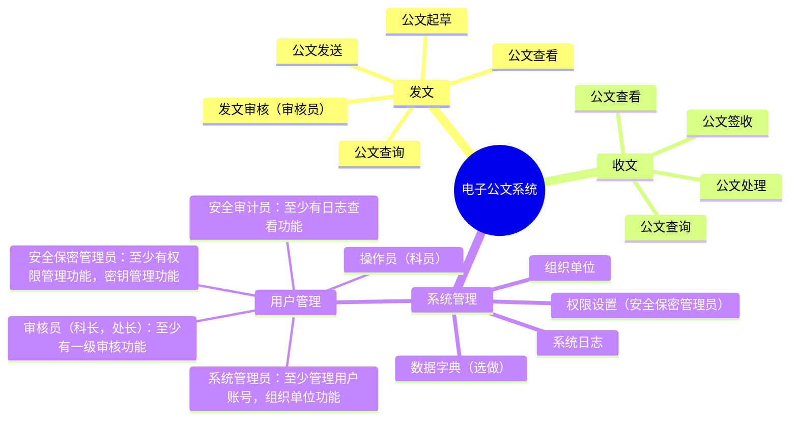

## 实验四	密码模块的应用

### 实践要求（40 分）

1. 完成电子公文交换系统，[系统功能](https://mermaid.live/edit#pako:eNqFks1qwkAUhV8lzErBJ8i62666zWZwxjbgJJJOFkWElvpTKaFKtbagWEsFFzUKxSoE9WUyM_EtOk42MRW7u3POd-fcC7cM8jbCQAfEtBCBJcPSNMe2aSYjOgs2bbHaF39piO9ABMNsdu9qGntqSy2u1Vsx0WIZec20yodj0X9MqKqX-SP-vkqz0tvd3h35IZp9xCrv_BxJFtONNP5NjjM-q6JVP5UR7yr80QEngqoIGszrhmsvoXYm_GGZZtWkz1647rP266EcL_5HTmYe6Wmy2iTcDtisfhKRn0f-6MDkg_vdWyvyN2LtJ8ZWcbw3Zttegu3OueezaY_VViAHCHYINJE8jfKeMQC9wgQbQJclwgXoFqkBDKsiUehS--LGygOdOi7OAbeEIMVnJrx0IAF6ARavpYqRSW3nPD43dXWVX60rGeU)，（15 分）




- 总体要求
  - 项目类型必须是B/S或C/S架构
  - 项目程序设计语言可以是C，Python，Rust等

2. 三员制度是指将系统管理员、安全保密管理员和安全审计员三个角色分离，分别负责系统运行、安全保密和安全管理，相互制约，共同保障信息系统安全。三员职责

- 系统管理员
  - 负责信息系统的日常维护、故障处理和升级更新。
  - 确保系统正常运行，对系统资源进行合理分配。
  - 负责用户账号的创建、修改和删除。
  - 定期备份重要数据，确保数据安全。
- 安全保密管理员
  - 负责制定和实施安全保密策略，确保信息系统安全。
  - 对用户进行安全意识培训，提高用户安全防范能力。
  - 监控网络安全状况，发现异常情况及时处理。
  - 负责信息系统安全事件的应急响应和处理。
- 安全审计员
  - 负责对信息系统进行安全审计，评估安全风险。
  - 监督系统管理员和安全保密管理员的工作，确保其履行职责。
  - 对信息系统安全事件进行调查，提出整改建议。

3. 黄金法则（5 分 ）
   - 身份鉴别：口令不能存，数据库要保存加盐的SM3Hash值
   - 访问控制：操作员，审核员，安全三员的权限设置
   - 安全审计：至少完成日志查询功能
4. 密码（15 分）
   - 算法：SM2，SM3，SM4，推荐使用 Key
   - 密钥管理：所有私钥，对称算法密钥等不能明存
5. 系统量化评估（5分）
   - 按照[商用密码应用安全性评估量化评估规则](https://ht.cacrnet.org.cn/upload/file/20230718/1689639379401088.pdf),计算自己系统的得分，只计算应用和数据安全。
6. 提交要求：

- 提交实践过程Markdown和转化的PDF文件
- 代码，文档托管到gitee或github等，推荐 gitclone
- 记录实验过程中遇到的问题，解决过程，反思等内容，用于后面实验报告

### 实验四实验报告（10 分）

参考附件中的实验报告模板，完成并提交实验报告，报告名称“学号_姓名_实验序号_实验名称.doc”

### 实践过程

#### 登录验证功能实现


##### 邮箱发送功能实现
- 参考资料
  - [参考项目](https://github.com/wtmxxx/python-users?tab=readme-ov-file)
  - [QQ的smtp服务介绍](https://wx.mail.qq.com/list/readtemplate?name=app_intro.html#/agreement/authorizationCode)
- 报错与修改
  - 报错01：[Form格式问题](https://service.mail.qq.com/detail/124/995)
      ```
      验证码发送失败，原因: (550, b'The "From" header is missing or invalid. Please follow RFC5322, RFC2047, RFC822 standard protocol. https://service.mail.qq.com/detail/124/995.')，请稍后重试，或反馈客服wotemo@qq.com
      ```

  - 报错02：邮件内容可能被邮件服务器检测到包含不适当的词汇或内容
      ```
      验证码发送失败，原因: (550, b'The mail may contain inappropriate words or content.')，请稍后重试，或反馈客服wotemo@qq.com
      ```
      - 可能还是`Form格式问题`，因为之前多了一个'>'符号但系统没有检测到。或许是要开启邮箱独立验证密码。
- 最终测试代码
  ```py
  import random
  import smtplib
  from email.mime.text import MIMEText
  from email.header import Header
  import time


  def check_code():
      """
      生成6位随机验证码的函数
      """
      codes = ""
      for _ in range(6):
          code = str(random.randint(0, 9))
          codes += code
      return codes


  def send_code(from_addr, password, to_addr):
      """
      发送邮件验证码的函数
      :param from_addr: 发件邮箱地址
      :param password: 发件邮箱的SMTP授权码
      :param to_addr: 收件邮箱地址
      """
      check_codes = check_code()
      print(check_codes)
      smtp_server = 'smtp.qq.com'
      # 构建邮件正文内容，适当丰富正文说明
      msg = MIMEText(f'您好，您正在进行相关操作，以下是本次操作的验证码：{check_codes}，请妥善保管，勿向他人透露。', 'plain',
                  'utf-8')
      # 修改发件人From字段格式
      msg['From'] = Header('发件人邮箱')
      msg['To'] = Header('收件人邮箱')
      msg['Subject'] = Header('验证码测试邮件')

      try:
          server = smtplib.SMTP_SSL(smtp_server)
          server.connect(smtp_server, 465)
          server.login(from_addr, password)
          server.sendmail(from_addr, to_addr, msg.as_string())
          server.quit()
          print('验证码已发送到您的邮箱中，请注意查收...')
          return check_codes
      except smtplib.SMTPException as e:
          print(f'验证码发送失败，原因: {e}，请稍后重试，或反馈客服wotemo@qq.com')
          return None


  def checking():
      """
      整体的验证码发送与验证流程控制函数
      """
      # 发件邮箱地址，替换为你自己有效的邮箱
      from_addr = '发件人邮箱'
      # 发件邮箱的SMTP授权码，替换为你获取的真实授权码
      password = '*6%$#@!'
      # 收件邮箱地址，可根据需求修改为要发送的指定邮箱
      to_addr = "收件人邮箱"

      check_codes = send_code(from_addr, password, to_addr)
      if check_codes is None:
          return

      time_start = time.time()
      while True:
          check_code_input = input('请输入您的验证码：')
          time_end = time.time()
          time_continue = time_end - time_start
          if time_continue > 300:
              print('验证码超时，请稍后重试...')
              break
          if check_code_input == check_codes:
              print('验证通过，请继续您的操作...')
              break
          else:
              print('验证码错误，请重试...')
      return to_addr


  if __name__ == "__main__":
      checking()

  ```
- 结果截图(暂时隐藏)
  ```
  - 
  - 
  ```


##### 加盐SM3哈希登录验证功能实现

- 系统设计
    - 参考文章：[基于SM3加盐的哈希密码验证算法](https://www.cnblogs.com/makai/p/11130703.html)
    - 如何正确使用哈希算法参与密码验证
        ```md
        对于每个用户的每个密码，盐值都应该是独一无二的。每当有新用户注册或者修改密码，都应该使用新的盐值进行加密。
        并且这个盐值也应该足够长，使得有足够多的盐值以供加密。
        一个好的标准的是：`盐值至少和哈希函数的输出一样长`、`盐值应该被储存和密码哈希一起储存在账户数据表中`。
        **存储密码的步骤**
        - 使用CSPRNG生成一个长度足够的盐值
        - 将盐值混入密码，并使用标准的加密哈希函数进行加密，如SHA256
        - 把哈希值和盐值一起存入数据库中对应此用户的那条记录
        **校验密码的步骤**
        - 从数据库取出用户的密码哈希值和对应盐值
        - 将盐值混入用户输入的密码，并且使用同样的哈希函数进行加密
        - 比较上一步的结果和数据库储存的哈希值是否相同，如果相同那么密码正确，反之密码错误
        ```
    - 应当在服务器中完成哈希计算等操作。
        - 采用B/S架构，Flask框架 —— 这个python的教程多。
        - PS：那么目前要学的就是 Flask框架 + 国密 + 数据库 + 用户界面的搭建。
            - 学些什么课程
            - [python flask连接mysql数据库实现登录注册](https://www.bilibili.com/video/BV1P5x7emE9H/?spm_id_from=333.337.search-card.all.click&vd_source=912de37828db7e4feff5c9492864d51c)
            - [90分钟用Python和Flask开发博客系统](https://www.bilibili.com/video/BV1gh411q7xo/?spm_id_from=333.337.search-card.all.click&vd_source=912de37828db7e4feff5c9492864d51c)
    - 更加安全的哈希
        - 慢哈希算法
        - **密钥哈希和密码哈希设备**
            ```md
            只要攻击者可以检测对一个密码的猜测是否正确，那么他们就可以进行字典攻击或暴力攻击。因此下一步就是向哈希计算中增加一个密钥，只有知道这个密钥的人才能校验密码。有两种办法可以实现：将哈希值加密，比如使用AES算法；将密钥包含到哈希字符串中，比如使用密钥哈希算法HMAC。
            听起来很简单，做起来就不一样了。这个密钥需要在任何情况下都不被攻击者获取，即使系统因为漏洞被攻破了。如果攻击者获取了进入系统的最高权限，那么不论密钥被储存在哪，他们都可以窃取到。因此密钥需要储存在**外部系统**中，比如另一个用于密码校验的物理服务器，或者一个关联到服务器的特制硬件，如YubiHSM。
            ```
        - **如果密钥无法存储的专门的服务器或外部设备的解决方案**
            ```md
            如果你难以负担多个服务器或专用的硬件，仍然有办法在一个普通Web服务器上利用密钥哈希技术。大部分针对数据库的入侵都是由于SQL注入攻击，因此**不要给攻击者进入本地文件系统的权限**（禁止数据库服务访问本地文件系统，如果它有这个功能的话）。这样一来，当你随机生成一个密钥存到通过Web程序无法访问的文件中，然后混入加盐哈希，得到的哈希值就不再那么脆弱了，即便这时数据库遭受了注入攻击。不要把将密钥硬编码到代码里，应该在安装时随机生成。这当然不如独立的硬件系统安全，因为如果Web程序存在SQL注入点，那么可能还存在其他一些问题，比如本地文件包含漏洞（Local File Inclusion），攻击者可以利用它读取本地密钥文件。无论如何，这个措施比没有好
            ```
        


