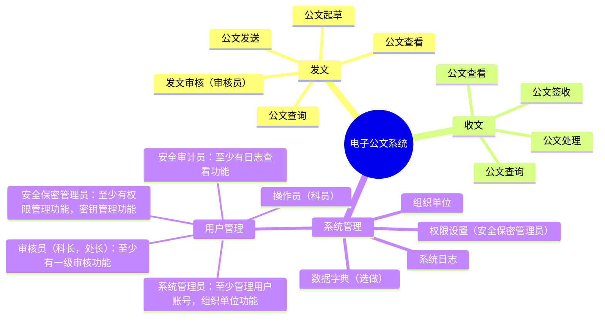

## 实验四	密码模块的应用

### 实践要求（40 分）

1. 完成电子公文交换系统，[系统功能](https://mermaid.live/edit#pako:eNqFks1qwkAUhV8lzErBJ8i62666zWZwxjbgJJJOFkWElvpTKaFKtbagWEsFFzUKxSoE9WUyM_EtOk42MRW7u3POd-fcC7cM8jbCQAfEtBCBJcPSNMe2aSYjOgs2bbHaF39piO9ABMNsdu9qGntqSy2u1Vsx0WIZec20yodj0X9MqKqX-SP-vkqz0tvd3h35IZp9xCrv_BxJFtONNP5NjjM-q6JVP5UR7yr80QEngqoIGszrhmsvoXYm_GGZZtWkz1647rP266EcL_5HTmYe6Wmy2iTcDtisfhKRn0f-6MDkg_vdWyvyN2LtJ8ZWcbw3Zttegu3OueezaY_VViAHCHYINJE8jfKeMQC9wgQbQJclwgXoFqkBDKsiUehS--LGygOdOi7OAbeEIMVnJrx0IAF6ARavpYqRSW3nPD43dXWVX60rGeU)，（15 分）




- 总体要求
  - 项目类型必须是B/S或C/S架构
  - 项目程序设计语言可以是C，Python，Rust等

2. 三员制度是指将系统管理员、安全保密管理员和安全审计员三个角色分离，分别负责系统运行、安全保密和安全管理，相互制约，共同保障信息系统安全。三员职责

- 系统管理员
  - 负责信息系统的日常维护、故障处理和升级更新。
  - 确保系统正常运行，对系统资源进行合理分配。
  - 负责用户账号的创建、修改和删除。
  - 定期备份重要数据，确保数据安全。
- 安全保密管理员
  - 负责制定和实施安全保密策略，确保信息系统安全。
  - 对用户进行安全意识培训，提高用户安全防范能力。
  - 监控网络安全状况，发现异常情况及时处理。
  - 负责信息系统安全事件的应急响应和处理。
- 安全审计员
  - 负责对信息系统进行安全审计，评估安全风险。
  - 监督系统管理员和安全保密管理员的工作，确保其履行职责。
  - 对信息系统安全事件进行调查，提出整改建议。

3. 黄金法则（5 分 ）
   - 身份鉴别：口令不能存，数据库要保存加盐的SM3Hash值
   - 访问控制：操作员，审核员，安全三员的权限设置
   - 安全审计：至少完成日志查询功能
4. 密码（15 分）
   - 算法：SM2，SM3，SM4，推荐使用 Key
   - 密钥管理：所有私钥，对称算法密钥等不能明存
5. 系统量化评估（5分）
   - 按照[商用密码应用安全性评估量化评估规则](https://ht.cacrnet.org.cn/upload/file/20230718/1689639379401088.pdf),计算自己系统的得分，只计算应用和数据安全。
6. 提交要求：

- 提交实践过程Markdown和转化的PDF文件
- 代码，文档托管到gitee或github等，推荐 gitclone
    - [GitHub文档链接](https://github.com/youer0219/Information-Security-System-Design-Assignment/blob/main/%E5%AE%9E%E9%AA%8C/%E5%AE%9E%E9%AA%8C%E5%9B%9B/20221414%E5%BE%90%E9%B9%BF%E9%B8%A3%E5%AE%9E%E9%AA%8C%E5%9B%9B%E5%AE%9E%E8%B7%B5%E8%BF%87%E7%A8%8B.md)
- 记录实验过程中遇到的问题，解决过程，反思等内容，用于后面实验报告

### 实验四实验报告（10 分）

参考附件中的实验报告模板，完成并提交实验报告，报告名称“学号_姓名_实验序号_实验名称.doc”

### 实践过程

#### 资料
- 电子公文系统参考示例
    - [国家能源局-西北监管局电子公文系统](https://xbj.nea.gov.cn/upload/2020/07/23/1595475792919000.pdf)
- 一般资料
    - [可以开发电子公文系统的开源平台](https://www.o2oa.net/app/gwgl.html)
    - [规范文件](https://www.gov.cn/gongbao/content/2019/content_5386632.htm)
    - [百度介绍](https://baike.baidu.com/item/%E7%94%B5%E5%AD%90%E5%85%AC%E6%96%87%E4%BC%A0%E8%BE%93%E7%B3%BB%E7%BB%9F/20925084)


#### 网课学习
- 在研究加盐SM3哈希验证那部分内容时明确技术路线就是：python + Flask + 国密 + 数据库

- 学习视频
    - [python flask连接mysql数据库实现登录注册](https://www.bilibili.com/video/BV1P5x7emE9H/?spm_id_from=333.337.search-card.all.click&vd_source=912de37828db7e4feff5c9492864d51c)
    - [90分钟用Python和Flask开发博客系统](https://www.bilibili.com/video/BV1gh411q7xo/?spm_id_from=333.337.search-card.all.click&vd_source=912de37828db7e4feff5c9492864d51c)
    - 权限管理
        - [Python Flask 权限管理系统实现 | 基于角色访问权限管理模型（RBAC） | 权鉴管理系统](https://www.bilibili.com/video/BV1tg411X7o5/?spm_id_from=333.337.search-card.all.click&vd_source=912de37828db7e4feff5c9492864d51c)
        - bydB站四个课程全都是一样的这你敢信！


- 教程一：[python flask连接mysql数据库实现登录注册](https://www.bilibili.com/video/BV1P5x7emE9H/?spm_id_from=333.337.search-card.all.click&vd_source=912de37828db7e4feff5c9492864d51c)
    - 简单的flask应用 与 数据库连接操作
    - 获得了一个简单的具有登录注册功能的应用
    - 修改用户表的组成，实现一个SM3+盐值的登录验证功能

- 教程二：[90分钟用Python和Flask开发博客系统](https://www.bilibili.com/video/BV1gh411q7xo/?spm_id_from=333.337.search-card.all.click&vd_source=912de37828db7e4feff5c9492864d51c)


#### 登录验证功能实现

##### 邮箱发送功能实现
- 参考资料
  - [参考项目](https://github.com/wtmxxx/python-users?tab=readme-ov-file)
  - [QQ的smtp服务介绍](https://wx.mail.qq.com/list/readtemplate?name=app_intro.html#/agreement/authorizationCode)
- 报错与修改
  - 报错01：[Form格式问题](https://service.mail.qq.com/detail/124/995)
      ```
      验证码发送失败，原因: (550, b'The "From" header is missing or invalid. Please follow RFC5322, RFC2047, RFC822 standard protocol. https://service.mail.qq.com/detail/124/995.')，请稍后重试，或反馈客服wotemo@qq.com
      ```

  - 报错02：邮件内容可能被邮件服务器检测到包含不适当的词汇或内容
      ```
      验证码发送失败，原因: (550, b'The mail may contain inappropriate words or content.')，请稍后重试，或反馈客服wotemo@qq.com
      ```
      - 可能还是`Form格式问题`，因为之前多了一个'>'符号但系统没有检测到。或许是要开启邮箱独立验证密码。
- 最终测试代码
  ```py
  import random
  import smtplib
  from email.mime.text import MIMEText
  from email.header import Header
  import time


  def check_code():
      """
      生成6位随机验证码的函数
      """
      codes = ""
      for _ in range(6):
          code = str(random.randint(0, 9))
          codes += code
      return codes


  def send_code(from_addr, password, to_addr):
      """
      发送邮件验证码的函数
      :param from_addr: 发件邮箱地址
      :param password: 发件邮箱的SMTP授权码
      :param to_addr: 收件邮箱地址
      """
      check_codes = check_code()
      print(check_codes)
      smtp_server = 'smtp.qq.com'
      # 构建邮件正文内容，适当丰富正文说明
      msg = MIMEText(f'您好，您正在进行相关操作，以下是本次操作的验证码：{check_codes}，请妥善保管，勿向他人透露。', 'plain',
                  'utf-8')
      # 修改发件人From字段格式
      msg['From'] = Header('发件人邮箱')
      msg['To'] = Header('收件人邮箱')
      msg['Subject'] = Header('验证码测试邮件')

      try:
          server = smtplib.SMTP_SSL(smtp_server)
          server.connect(smtp_server, 465)
          server.login(from_addr, password)
          server.sendmail(from_addr, to_addr, msg.as_string())
          server.quit()
          print('验证码已发送到您的邮箱中，请注意查收...')
          return check_codes
      except smtplib.SMTPException as e:
          print(f'验证码发送失败，原因: {e}，请稍后重试，或反馈客服wotemo@qq.com')
          return None


  def checking():
      """
      整体的验证码发送与验证流程控制函数
      """
      # 发件邮箱地址，替换为你自己有效的邮箱
      from_addr = '发件人邮箱'
      # 发件邮箱的SMTP授权码，替换为你获取的真实授权码
      password = '*6%$#@!'
      # 收件邮箱地址，可根据需求修改为要发送的指定邮箱
      to_addr = "收件人邮箱"

      check_codes = send_code(from_addr, password, to_addr)
      if check_codes is None:
          return

      time_start = time.time()
      while True:
          check_code_input = input('请输入您的验证码：')
          time_end = time.time()
          time_continue = time_end - time_start
          if time_continue > 300:
              print('验证码超时，请稍后重试...')
              break
          if check_code_input == check_codes:
              print('验证通过，请继续您的操作...')
              break
          else:
              print('验证码错误，请重试...')
      return to_addr


  if __name__ == "__main__":
      checking()

  ```
- 结果截图(暂时隐藏)
  ```md
  - 
  - 
  ```

##### HTTPS访问限制
- 限制用户只能通过HTTPS访问网站，以此保护传输的数据安全
    - 其实是看看能不能为了让用户明文传递密码。
- 参考资料
    - [Flask: 如何给Python Flask Web服务器添加HTTPS功能](https://geek-docs.com/flask/flask-questions/4_flask_can_you_add_https_functionality_to_a_python_flask_web_server.html)
    - [Talisman：Flask应用的HTTP安全头保护神器](https://blog.csdn.net/gitblog_00027/article/details/138946103)
    - [AI解答：Python Flask 强制 HTTPS](https://www.doubao.com/thread/w34b3e520323c3a4f)
- 方法总结
    - 使用 Nginx 或其他反向代理服务器
    - 使用 Flask-Talisman 扩展
    - 使用 Python 代码实现简单重定向
    - 使用 Flask-SSLify 扩展
    - 同时，你需要获取一个 SSL证书
        - [获取SSL证书的方法](https://www.cnblogs.com/dyingstraw/p/12865815.html#%E6%96%B9%E6%B3%952%EF%BC%9A%E9%98%BF%E9%87%8C%E4%BA%91%E6%88%96%E8%80%85%E5%AE%9D%E5%A1%94%E5%85%8D%E8%B4%B9%E7%94%B3%E8%AF%B7%EF%BC%88%E6%8E%A8%E8%8D%90%EF%BC%89)
        - openssl自签名证书、阿里云免费申请等
- 综上资料所述，为快速完成实验四，我选择`Talisman`直接实现强制HTTPS访问。使用`openssl req -x509 -newkey rsa:4096 -nodes -out cert.pem -keyout key.pem -days 365`命令在Ubuntu上获取自签名证书再拷贝到Windows上来。
- 测试代码(同目录下放置之前生成的自签名证书和私钥)
    ```py
    from flask import Flask
    from flask_talisman import Talisman

    app = Flask(__name__)

    # 配置内容安全策略（可根据实际情况调整内容）
    csp = {
        'default-src': ['\'self\'', 'https://trusted.com'],
        'script-src': ['\'self\'', 'https://cdnjs.cloudflare.com/ajax/libs/jquery/3.5.1/jquery.min.js']
    }

    # 配置Talisman，启用强制HTTPS访问等相关安全配置
    talisman = Talisman(
        app,
        content_security_policy=csp,
        force_https=True,
        strict_transport_security={
            'max_age': 31536000  # 设置HSTS有效期为1年，单位为秒，这样的写法嵌套在字典中传递参数
        },
        frame_options='DENY'
    )

    @app.route('/')
    def index():
        return "Hello, World!"

    if __name__ == '__main__':
        app.run(ssl_context=('cert.pem', 'key.pem'))
    ```
- 结果截图（已隐藏）
    ```md
    - 
    - 
    - 
    ```

##### 加盐SM3哈希登录验证功能实现

- 系统设计
    - 参考文章：[基于SM3加盐的哈希密码验证算法](https://www.cnblogs.com/makai/p/11130703.html)
    - 如何正确使用哈希算法参与密码验证
        ```md
        对于每个用户的每个密码，盐值都应该是独一无二的。每当有新用户注册或者修改密码，都应该使用新的盐值进行加密。
        并且这个盐值也应该足够长，使得有足够多的盐值以供加密。
        一个好的标准的是：`盐值至少和哈希函数的输出一样长`、`盐值应该被储存和密码哈希一起储存在账户数据表中`。
        **存储密码的步骤**
        - 使用CSPRNG生成一个长度足够的盐值
        - 将盐值混入密码，并使用标准的加密哈希函数进行加密，如SHA256
        - 把哈希值和盐值一起存入数据库中对应此用户的那条记录
        **校验密码的步骤**
        - 从数据库取出用户的密码哈希值和对应盐值
        - 将盐值混入用户输入的密码，并且使用同样的哈希函数进行加密
        - 比较上一步的结果和数据库储存的哈希值是否相同，如果相同那么密码正确，反之密码错误
        ```
    - 应当在服务器中完成哈希计算等操作。
        - 采用B/S架构，Flask框架 —— 这个python的教程多。
        - PS：那么目前要学的就是 Flask框架 + 国密 + 数据库 + 用户界面的搭建。
            - 学些什么课程
            - [python flask连接mysql数据库实现登录注册](https://www.bilibili.com/video/BV1P5x7emE9H/?spm_id_from=333.337.search-card.all.click&vd_source=912de37828db7e4feff5c9492864d51c)
            - [90分钟用Python和Flask开发博客系统](https://www.bilibili.com/video/BV1gh411q7xo/?spm_id_from=333.337.search-card.all.click&vd_source=912de37828db7e4feff5c9492864d51c)
    - 更加安全的哈希
        - 慢哈希算法
        - **密钥哈希和密码哈希设备**
            ```md
            只要攻击者可以检测对一个密码的猜测是否正确，那么他们就可以进行字典攻击或暴力攻击。
            因此下一步就是向哈希计算中增加一个密钥，只有知道这个密钥的人才能校验密码。
            有两种办法可以实现：将哈希值加密，比如使用AES算法；将密钥包含到哈希字符串中，比如使用密钥哈希算法HMAC。
            听起来很简单，做起来就不一样了。这个密钥需要在任何情况下都不被攻击者获取，即使系统因为漏洞被攻破了。
            如果攻击者获取了进入系统的最高权限，那么不论密钥被储存在哪，他们都可以窃取到。
            因此密钥需要储存在`外部系统`中，比如另一个用于密码校验的物理服务器，或者一个关联到服务器的特制硬件，如YubiHSM。
            ```
        - **如果密钥无法存储的专门的服务器或外部设备的解决方案**
            ```md
            如果你难以负担多个服务器或专用的硬件，仍然有办法在一个普通Web服务器上利用密钥哈希技术。
            大部分针对数据库的入侵都是由于SQL注入攻击，因此`不要给攻击者进入本地文件系统的权限`（禁止数据库服务访问本地文件系统，如果它有这个功能的话）。
            这样一来，当你随机生成一个密钥存到通过Web程序无法访问的文件中，然后混入加盐哈希，得到的哈希值就不再那么脆弱了，
            即便这时数据库遭受了注入攻击。不要把将密钥硬编码到代码里，应该在安装时随机生成。这当然不如独立的硬件系统安全，
            因为如果Web程序存在SQL注入点，那么可能还存在其他一些问题，比如本地文件包含漏洞（Local File Inclusion），
            攻击者可以利用它读取本地密钥文件。无论如何，这个措施比没有好
            ```
- 用户数据设计与数据库表的创建
    - 用户数据：
        - 用户ID    （自动生成）
        - 用户名     (这里起到唯一ID的作用。实际应用中应该有其他的唯一ID。因此不可重复。)
        - 密码哈希值 (保存16进制数据)
        - 盐值       (保存16进制数据)
    - 之后肯定要更换唯一ID,用户名就用姓名且可重复。同时加入邮箱等数据。但这里仅作测试。
    - 创建表的SQL语句
        ```sql
        USE demo01;

        CREATE TABLE Users (
            UserID INT AUTO_INCREMENT PRIMARY KEY,
            Username VARCHAR(255) NOT NULL UNIQUE, -- 确保用户名不重复（实际应用中应该有其他的ID）
            PasswordHash VARCHAR(64) NOT NULL, -- 存储64个字符的十六进制字符串
            Salt VARCHAR(64) NOT NULL  -- 存储64个字符的十六进制字符串
        );
        ```
- 测试SM3的带盐值的哈希验证
    ```py
    from gmssl import sm3, func

    def generate_salt(length=32):
        """生成指定长度的随机盐"""
        return func.random_hex(length)

    def hash_with_salt(password, salt):
        """使用盐值对密码进行SM3哈希处理"""
        # 将密码和盐拼接起来
        data = password + salt
        # 使用SM3算法计算哈希
        hash_value = sm3.sm3_hash(func.bytes_to_list(data.encode()))
        return hash_value

    def verify_password(input_password, salt, stored_hash):
        """验证输入的密码是否与存储的哈希匹配"""
        # 使用相同的盐值对输入密码进行哈希处理
        input_hash = hash_with_salt(input_password, salt)
        # 比较新生成的哈希与存储的哈希
        return input_hash == stored_hash

    # 生成
    password = "my_secure_password"
    salt = generate_salt()  # 生成一个随机盐
    hashed_password = hash_with_salt(password, salt)
    print(f"Salt: {salt}")
    print(f"Hashed Password: {hashed_password}")

    # 验证
    input_password = "my_secure_password"
    stored_salt = salt  # 应该是从数据库中获取的盐值
    stored_hash = hashed_password  # 应该是从数据库中获取的哈希值

    is_valid = verify_password(input_password, stored_salt, stored_hash)
    print("Password is valid:", is_valid)
    ```
- 测试存储与提取生成的密码和盐值(在登陆系统的网课中的test.py中测试。其实现了一个基于参数的SQL语句执行函数con_my_sql)
    ```py
    # 测试存储SM3带盐值hash后的用户信息
    username = "张三"
    pwd = "123456"
    salt = SaltSM3.generate_salt()
    pwd_salt_hash = SaltSM3.hash_with_salt(pwd, salt)
    print(pwd_salt_hash)
    # 这里使用参数化的方式构建SQL语句，表名和列名按规范使用反引号包围，占位符 %s 表示参数位置
    code = "INSERT INTO `users` (`Username`, `PasswordHash`,`Salt`) VALUES (%s, %s, %s)"
    # 以元组形式传入对应占位符的参数值
    result = con_my_sql(code, (username, pwd_salt_hash,salt))
    print("result:",result)

    # 测试查询SM3带盐值hash后的用户信息并验证
    username = "张三"
    pwd = "123456"
    # 同样使用参数化方式构建查询语句，占位符 %s 用于传入参数
    code = "select * from users where Username = %s"
    # 传入参数值，以元组形式（即使只有一个参数也要用元组包裹）
    cursor_ans = con_my_sql(code, (username,))
    ans_dates = cursor_ans.fetchall()
    if len(ans_dates) > 0:
        user_date = ans_dates[0]
        PasswordHash = user_date['PasswordHash']
        Salt = user_date['Salt']
        password_salt_hash = SaltSM3.hash_with_salt(pwd,Salt)
        if password_salt_hash == PasswordHash:
            print("验证成功!")
    ```

- `TODO: 将功能模块化，并复制为新的项目。在此基础上继续搞。`
- `TODO: 注册功能应该移除，改为由后台管理。用户登录后可以修改一些个人信息。`
- `TODO: 限制登录时的链接权限为只可读取用户表。`

#### 公文功能实现

- 参考博客系统实现最简单的公文操作建模

- 参考教程：[90分钟用Python和Flask开发博客系统](https://www.bilibili.com/video/BV1gh411q7xo/?spm_id_from=333.337.search-card.all.click&vd_source=912de37828db7e4feff5c9492864d51c)
    - 代码地址：
    - 直接复制demo代码，TODO:`打算将其作为网页骨架`
    - 教程特点：
        - 会传递很多数据到前端处理。这肯定不行。得改为后端处理数据。
        - 文章的表肯定要改。

- 公文建模
    - 核心就是数据库中的表如何设计
    - 要求：满足基本需求。但不要太复杂，简单实现就好。
    - 参考
        - [如何制作公文数据库表](https://docs.pingcode.com/baike/1815977)
        - [众多AI对话中我最满意的一个](https://lxblog.com/qianwen/share?shareId=601dd315-684a-4834-9d8d-fbc7a3365627)
    - 综上，公文建模如下：
        ```md
        id (主键) - 用于唯一识别每份公文。
        title - 公文标题。
        content - 公文正文内容。如果内容较大，考虑使用BLOB类型或单独存储在文件系统中，并在此字段保存文件路径。
        author_id - 作者ID，可以关联到用户表。
        status - 状态，表示当前公文的状态，如草稿、待审批、已发布等。
        create_date - 创建时间。
        last_modified_date - 最后修改日期。
        approver_id - 审批人ID。
        approval_date - 审批日期。
        approval_msg - 审批意见。
        security_level - 密级，如公开、秘密等。
        ```
        - 由于权限管理系统还没有实现。所以一开始可以默认全能用户。发文、审批等都可以干。
- 公文存储
    - 目前的想法是多表存储。区分密级。但先实现最简单的公开表，保留密级字段即可。


#### 权限管理功能实现

##### 资料与网课
- 资料
    - [探索 Flask-Permission：一款强大的权限管理库](https://blog.csdn.net/gitblog_00092/article/details/137452121)
    - [基于Python-Flask的权限管理 系列教程](https://www.cnblogs.com/huguodong/p/12653354.html)
    - 可以参考开源项目的代码：[基于 Flask 的后台管理系统 —— Pear Admin Flask](https://gitee.com/pear-admin/pear-admin-flask)
        - [Pear Admin Flask 使用教程](https://www.bilibili.com/video/BV1FF411b7bS/?spm_id_from=333.788.video.desc.click&vd_source=912de37828db7e4feff5c9492864d51c)
- 教程
    - [基于Python使用Flask开发一个权限管理系统](https://www.bilibili.com/video/BV1Dd4y197Eu/?spm_id_from=333.337.search-card.all.click&vd_source=912de37828db7e4feff5c9492864d51c)
    - [Python Flask 权限管理系统实现 | 基于角色访问权限管理模型（RBAC） | 权鉴管理系统](https://www.bilibili.com/video/BV1tg411X7o5/?spm_id_from=333.337.search-card.all.click&vd_source=912de37828db7e4feff5c9492864d51c)
- 可能的插件
    - [Flask-Permissions](https://github.com/raddevon/flask-permissions)

##### 数据库用户权限管理
- 为了安全起见，特定操作应该登录特定用户的数据库账号，并且限制其权限。
    - 对数据库的操作与对应的最小权限
        - 登录： 只允许读取用户表
        - 个人资料修改：只允许修改特定字段
        - 账号注册
    - `TODO: 完善数据库操作总结`

- MySQL数据库特点：基于表来管理权限。所以针对特定字段的操作会比较复杂。但不算核心功能，可以先忽略。
    - [限制用户只读某表的操作方法](https://blog.51cto.com/weiyuqingcheng/8430557)


#### python访问龙脉SDF设备

- 核心：python调用c库
- 选择：
    - [sdf、csp、pkcs#11是什么](https://www.doubao.com/thread/we7583c0e82940086)
    - sdf用过，所以优先选。csp完全不了解。pkcs#11在GitHub上找到过python的接口(没实现)，不过不同厂商可能不一样，所以不用。
    - 可以去参考GmSSL/SoftSDF库的代码

##### 测试过程

- 使用vs2022打开Windows测试项目中的interruptTest进行测试
    - 升级项目后测试成功。
- 在python中测试：
    - 资产准备：将sdfapi.h拷贝过去作为参考。将windows/x64下的mtoken_gm3000.dll拷贝过去。
    - [AI实践](https://www.doubao.com/thread/w8388d09cf0676ee6)：告诉AI sdfapi.h 头文件的内容与自己的需求。让AI生成测试代码
- python测试代码：
    ```py
    import ctypes

    # 加载动态库
    mydll = ctypes.CDLL('mtoken_gm3000.dll')

    # 定义数据类型

    # VERSION结构体定义，对应头文件中的版本结构体
    class VERSION(ctypes.Structure):
        _fields_ = [("major", ctypes.c_byte), ("minor", ctypes.c_byte)]

    # DEVINFO结构体定义，包含设备的各种信息，如版本、厂商、算法支持能力等
    class DEVINFO(ctypes.Structure):
        _fields_ = [("Version", VERSION),
                    ("Manufacturer", ctypes.c_char * 64),
                    ("Issuer", ctypes.c_char * 64),
                    ("Label", ctypes.c_char * 32),
                    ("SerialNumber", ctypes.c_char * 32),
                    ("HWVersion", VERSION),
                    ("FirmwareVersion", VERSION),
                    ("AlgSymCap", ctypes.c_ulong),
                    ("AlgAsymCap", ctypes.c_ulong),
                    ("AlgHashCap", ctypes.c_ulong),
                    ("DevAuthAlgId", ctypes.c_ulong),
                    ("TotalSpace", ctypes.c_ulong),
                    ("FreeSpace", ctypes.c_ulong),
                    ("MaxECCBufferSize", ctypes.c_ulong),
                    ("MaxBufferSize", ctypes.c_ulong),
                    ("Reserved", ctypes.c_byte * 64)]

    # 定义函数参数类型和返回类型

    # SKF_EnumDev函数参数及返回类型定义，用于枚举设备
    mydll.SKF_EnumDev.argtypes = (ctypes.c_bool, ctypes.c_char_p, ctypes.POINTER(ctypes.c_ulong))
    mydll.SKF_EnumDev.restype = ctypes.c_ulong

    # SKF_ConnectDev函数参数及返回类型定义，用于连接设备
    mydll.SKF_ConnectDev.argtypes = (ctypes.c_char_p, ctypes.POINTER(ctypes.c_void_p))
    mydll.SKF_ConnectDev.restype = ctypes.c_ulong

    # SKF_GenRandom函数参数及返回类型定义，用于生成随机数
    mydll.SKF_GenRandom.argtypes = (ctypes.c_void_p, ctypes.c_char_p, ctypes.c_ulong)
    mydll.SKF_GenRandom.restype = ctypes.c_ulong

    # SKF_DisConnectDev函数参数及返回类型定义，用于断开设备连接
    mydll.SKF_DisConnectDev.argtypes = (ctypes.c_void_p,)
    mydll.SKF_DisConnectDev.restype = ctypes.c_ulong

    # SKF_CloseHandle函数参数及返回类型定义，用于关闭句柄
    mydll.SKF_CloseHandle.argtypes = (ctypes.c_void_p,)
    mydll.SKF_CloseHandle.restype = ctypes.c_ulong


    def main():
        """
        主函数，实现了以下主要逻辑：
        1. 不断循环尝试枚举设备、连接设备以及生成随机数的操作。
        2. 如果某个操作执行结果不符合预期（返回值不为成功标识），则跳过当前循环，继续下一次循环尝试。
        3. 每次成功执行完一轮操作后，计数器i加1，表示成功操作的次数。
        """
        # 用于存储函数调用返回结果，初始化为0
        ulRslt = ctypes.c_ulong()
        # 设备句柄，初始化为指向一个空的 c_void_p 类型，这样后续才能正确传入 byref 函数
        hdev = ctypes.c_void_p()
        # 创建一个长度为32字节的缓冲区，用于存储生成的随机数
        pbRandom = ctypes.create_string_buffer(32)
        # 创建一个长度为256字节的缓冲区，用于存储设备名称
        szDevName = ctypes.create_string_buffer(256)
        # 用于记录设备名称缓冲区的长度，初始化为256字节
        ulNameLen = ctypes.c_ulong(256)
        hkey = None
        bp = None
        pszdev = szDevName

        i = 0
        while True:
            # 清空设备名称缓冲区，将所有字节设置为0
            szDevName.value = b'\x00' * 256
            ulNameLen.value = 256
            # 调用SKF_EnumDev函数枚举设备，传入参数：是否只枚举当前存在的设备（1表示是），设备名称缓冲区，缓冲区长度的指针
            ulRslt.value = mydll.SKF_EnumDev(1, szDevName, ctypes.byref(ulNameLen))
            print(f"{i} {szDevName.value.decode()}")
            if ulRslt.value!= 0:
                continue

            # 调用SKF_ConnectDev函数连接设备，传入参数：设备名称，设备句柄的指针
            ulRslt.value = mydll.SKF_ConnectDev(pszdev, ctypes.byref(hdev))
            if ulRslt.value!= 0:
                continue

            # 调用SKF_GenRandom函数生成随机数，传入参数：设备句柄，随机数缓冲区，要生成的随机数长度
            ulRslt.value = mydll.SKF_GenRandom(hdev, pbRandom, 8)
            if ulRslt.value!= 0:
                continue

            i += 1


    if __name__ == "__main__":
        main()
    ```
- 输出结果与项目结构（图片已隐藏）
    ```md
    - 
    ```
- `TODO:下一步就是封装与使用了。明确哪些函数需要使用并封装即可。`
    - 要求是：除非那种必须的密钥保护比如私钥，否则，为了开发方便，能用软件就用软件。

###### 需求与封装


##### 实际开发