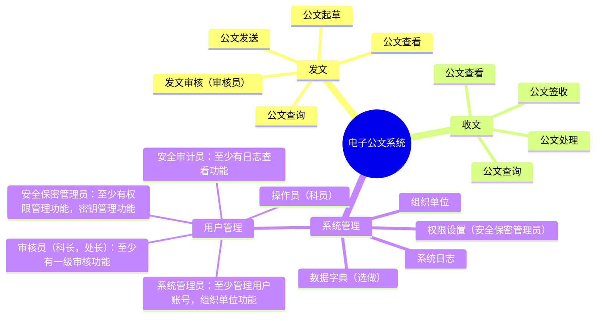

[toc]

# 《密码系统设计》实验

## 实验项目

| 实验序号 | 实验名称       | 实验学时数 | 实验目的                         | 实验内容                                                                         | 实验类型 | 学生学习预期成果                                                                                                                                                                                                                                                                   |
| -------- | -------------- | ---------- | -------------------------------- | -------------------------------------------------------------------------------- | -------- | ---------------------------------------------------------------------------------------------------------------------------------------------------------------------------------------------------------------------------------------------------------------------------------- |
| 实验一   | 嵌入式开发基础 | 6          | 掌握Linux系统使用与开发方法      | Linux命令，OpenSSL（GmSSL）命令与开发                                            | 验证性   | 1.掌握常见的Linux命令与C语言开发方法；` `2.掌握OpenSSL（GmSSL）的基本用法与开发；` `3.掌握常见商用密码算法的使用                                                                                                                                                         |
| 实验二   | 密码算法实现   | 6          | 掌握常见商用密码算法的原理与实现 | 基于国产化平台使用C语言编程实现SM2、SM3、SM4等算法；                             | 验证性   | 1.基于Arm等平台和国产化操作系统使用C语言编程实现SM2、SM3、SM4算法；` `2.对比分析算法实现的正确性和效率。                                                                                                                                                                      |
| 实验三   | 密码模块实现   | 6          | 基于商用密码标准的密码模块的实现 | 实现简单的密码引擎，能够提供对称密码算法、非对称密码算法、Hash算法等的密码服务。 | 综合性   | 1.理解密码系统固件、接口等的设计和开发流程；` `2．参考《GMT 0018-2023密码设备应用接口规范》等商用密码标准设计实现密码算法进行加密/解密、签名/验签、密钥生成/导出等的接口；` `3.与其他商用密码模块进行兼容性测试。                                                        |
| 实验四   | 密码模块的应用 | 6          | 基于商用密码标准的密码模块的应用 | 对电子公文系统等密码系统进行威胁建模，安全性分析和安全性设计。                   | 综合性   | 1.系统采用B/S，或者C/S架构，参考《GM∕T 0054-2018 信息系统密码应用基本要求》和《GB/T 39786-2021《信息安全技术 信息系统密码应用基本要求》》` `2.设计实现的系统管理功能要简单易用；` `3.用户管理采用“三员”管理；` `4.设计实现的密钥管理功能应覆盖密钥的全生命周期； |

## 实验一	嵌入式开发基础

### 1-3 学时实践要求（30 分）

1. 参考云班课相关教学视频，在 Ubuntu或openEuler中（推荐 openEuler）中实践[课程思维导图中](https://www.processon.com/v/66c459846a4cd376bbd51633?cid=66bcf83cce68f62ecf3f63ff)OpenSSL相关内容，使用Markdown记录详细记录实践过程，每完成一项git commit 一次。（5分）
2. 参考云班课相关教学视频，在 Ubuntu或openEuler中（推荐 openEuler）中实践课程[课程思维导图](https://www.processon.com/v/66c459846a4cd376bbd51633?cid=66bcf83cce68f62ecf3f63ff)中GmSSL相关内容，使用Markdown记录详细记录实践过程，每完成一项git commit 一次。（5‘）
   （5分）
3. 两人一组，在 Ubuntu或openEuler中（推荐 openEuler）中使用OpenSSL命令实现带签名的数字信封协议。使用OpenSSL时Alice发送，Bob接收。Ailice，Bob在实验中要替换为自己的8位学号+姓名。 使用Markdown记录详细记录实践过程，每完成一项git commit 一次。（10分）

- Alice,Bob生成自己的公私钥匙对，记作：（PKa，SKa），（PKb，SKb），Alice,Bob分别拥有：（PKa，SKa，PKb），（PKb，SKb，PKa），实验中把公钥文件拷贝给对方
- Alice发给Bob的明文plain.txt，内容为自己的姓名学号
- Alice：sm4 key使用gmssl rand 产生，16字节，记作k
- Alice：Sm4Enc(k,P) = C
- Alice：Sm2Enc(PKb,k) = KC
- Alice：Sm2Sign（SKa，C）= S1
- Alice： 数字信封 C||KC||S1  发给Bob
- Bob：Sm2Very（PKa，S1）
- Bob：Sm2Dec（SKb，KC）= k
- Bob：Sm4Dec（k，C）= P

4. 两人一组，在 Ubuntu或openEuler中（推荐 openEuler）中使用GmSSL命令实现带签名的数字信封协议。使用GmSSL，Bob发送，Alice接收。Ailice，Bob在实验中要替换为自己的8位学号+姓名。 使用Markdown记录详细记录实践过程，每完成一项git commit 一次。（10分）
5. 实验记录中提交 gitee 课程项目链接，提交本次实验相关 git log运行结果
6. 提交要求：

- 提交实践过程Markdown和转化的PDF文件
- 代码，文档托管到gitee或github等，推荐 gitclone
- 记录实验过程中遇到的问题，解决过程，反思等内容，完成实验报告相关内容
- [实验一项目gittee链接](https://gitee.com/xu-luming/information-security-system-design-experiment1-fundamentals-of-embedded-development)
- [实验过程文档GitHub链接](https://github.com/youer0219/Information-Security-System-Design-Assignment)

### 4-6 学时实践要求（30 分）

1. 参考相关内容，在 Ubuntu或openEuler中（推荐 openEuler）中使用OpenSSL库编程实现调用SM2（加密解密，签名验签），SM3（摘要计算，HMAC 计算），SM4（加密解密）算法，使用Markdown记录详细记录实践过程，每完成一项git commit 一次。（5'）
2. 参考相关内容，在 Ubuntu或openEuler中（推荐 openEuler）中使用GmSSL库编程实现调用SM2（加密解密，签名验签），SM3（摘要计算，HMAC 计算），SM4（加密解密）算法，使用Markdown记录详细记录实践过程，每完成一项git commit 一次。（5'）
   （5分）
3. 两人一组，在 Ubuntu或openEuler中（推荐 openEuler）中使用OpenSSL编程实现带签名的数字信封协议。使用OpenSSL库时，Alice发送，Bob接收。Ailice，Bob在实验中要替换为自己的8位学号+姓名。 使用Markdown记录详细记录实践过程，每完成一项git commit 一次。（5分）

- Alice,Bob生成自己的公私钥匙对，记作：（PKa，SKa），（PKb，SKb），Alice,Bob分别拥有：（PKa，SKa，PKb），（PKb，SKb，PKa），实验中把公钥文件拷贝给对方
- Alice发给Bob的明文plain.txt，内容为自己的姓名学号
- Alice：sm4 key使用gmssl rand 产生，16字节，记作k
- Alice：Sm4Enc(k,P) = C
- Alice：Sm2Enc(PKb,k) = KC
- Alice：Sm2Sign（SKa，C）= S1
- Alice： 数字信封 C||KC||S1  发给Bob
- Bob：Sm2Very（PKa，S1）
- Bob：Sm2Dec（SKb，KC）= k
- Bob：Sm4Dec（k，C）= P

4. 两人一组，在 Ubuntu或openEuler中（推荐 openEuler）中使用GmSSL编程实现带签名的数字信封协议。使用GmSSL库时，Bob发送，Alice接收。Ailice，Bob在实验中要替换为自己的8位学号+姓名。 使用Markdown记录详细记录实践过程，每完成一项git commit 一次。（5分）
5. 使用Rust完成带签名的数字信封协议（选做，10分）
6. 实验记录中提交 gitee 课程项目链接，提交本次实验相关 git log运行结果
7. 提交要求：

- 提交实践过程Markdown和转化的PDF文件
- 代码，文档托管到gitee或github等，推荐 gitclone
- 记录实验过程中遇到的问题，解决过程，反思等内容，用于后面实验报告

### 实验一实验报告（10 分）

- 参考附件中的实验报告模板，完成并提交实验报告，报告名称“学号_姓名_实验序号_实验名称.doc”

## 实验二	密码算法实现

### 1-3 学时实践要求（30 分）

1. 在 Ubuntu或openEuler中（推荐 openEuler）中调试运行[商用密码检测中心https://www.scctc.org.cn/xzzx/sfydm/ydmxz/](https://www.scctc.org.cn/xzzx/sfydm/ydmxz/)提供的源代码，至少运行SM2，SM3，SM4代码。使用GmSSL命令验证你代码的正确性。使用Markdown记录详细记录实践过程，每完成一项功能或者一个函数git commit 一次。（14分）
2. 在[密标委网站http://www.gmbz.org.cn/main/bzlb.html](http://www.gmbz.org.cn/main/bzlb.html)查找SM2，SM3，SM4相关标准，分析代码实现与标准的对应关系。（6分）
3. 使用Rust完成SM2，SM3，SM4算法的实现（选做，10分）
4. 实验记录中提交 gitee 课程项目链接，提交本次实验相关 git log运行结果
5. 提交要求：

- 提交实践过程Markdown和转化的PDF文件
- 代码，文档托管到gitee或github等，推荐 gitclone
- 记录实验过程中遇到的问题，解决过程，反思等内容，用于后面实验报告

### 4-6 学时实践要求（30 分）

1. 在 Ubuntu或openEuler中（推荐 openEuler）中调试运行教材提供的源代码，至少运行SM2，SM3，SM4代码，使用GmSSL命令验证你代码的正确性，使用Markdown记录详细记录实践过程，每完成一项功能或者一个函数git commit 一次。（15分）
2. 在[密标委网站http://www.gmbz.org.cn/main/bzlb.html](http://www.gmbz.org.cn/main/bzlb.html)查找SM2，SM3，SM4相关标准，分析代码实现与标准的对应关系。（10分）
3. 使用GmSSL,UKey 交叉验证实现的正确性（5 分）
4. 实验记录中提交 gitee 课程项目链接，提交本次实验相关 git log运行结果
5. 提交要求：

- 提交实践过程Markdown和转化的PDF文件
- 代码，文档托管到gitee或github等，推荐 gitclone
- 记录实验过程中遇到的问题，解决过程，反思等内容，用于后面实验报告

### 实验二实验报告（10 分）

参考附件中的实验报告模板，完成并提交实验报告，报告名称“学号_姓名_实验序号_实验名称.doc”

## 实验三	密码模块实现

### 1-3 学时实践要求（30 分）

1. 阅读学习 [《GM/T 0016智能密码钥匙密码应用接口规范》](http://www.gmbz.org.cn/main/viewfile/20240628173223234537.html)和[《GMT 0018 密码设备应用接口规范》](http://www.gmbz.org.cn/main/viewfile/20240628173907475462.html)
2. 在 Ubuntu或openEuler中（推荐 openEuler）中编译运行附件中[《GM/T 0016智能密码钥匙密码应用接口规范》](http://www.gmbz.org.cn/main/viewfile/20240628173223234537.html)相关代码，并新增完成标准中至少一项功能。使用Markdown记录详细记录实践过程，每完成一项功能或者一个函数git commit 一次。（15分）
3. 在 Ubuntu或openEuler中（推荐 openEuler）中编译运行附件中[《GMT 0018 密码设备应用接口规范》](http://www.gmbz.org.cn/main/viewfile/20240628173907475462.html)相关代码，并新增完成标准中至少一项功能。（15分）
4. 实验记录中提交 gitee 课程项目链接，提交本次实验相关 git log运行结果。
5. 提交要求：

- 提交实践过程Markdown和转化的PDF文件
- 代码，文档托管到gitee或github等
- 记录实验过程中遇到的问题，解决过程，反思等内容，用于后面实验报告

### 4-6 学时实践要求（30 分）

1. 在 Ubuntu或openEuler中（推荐 openEuler）中调用GmSSL代码，至少实现SM2，SM3，SM4相关密码算法接口，使用Markdown记录详细记录实践过程，每完成一项功能或者一个函数git commit 一次。。（10分）
2. 在 Ubuntu或openEuler中（推荐 openEuler）中调用GmSSL代码，实现SM2，SM4相关接口密钥管理功能及其他必要接口。使用Markdown记录详细记录实践过程，每完成一项功能或者一个函数git commit 一次。（10分）
3. 使用 Rust 实现相关接口（选做，10 分）
4. 实验记录中提交 gitee 课程项目链接，提交本次实验相关 git log运行结果。
5. 提交要求：

- 提交实践过程Markdown和转化的PDF文件
- 代码，文档托管到gitee或github等，推荐 gitclone
- 记录实验过程中遇到的问题，解决过程，反思等内容，用于后面实验报告

### 实验三实验报告（10 分）

参考附件中的实验报告模板，完成并提交实验报告，报告名称“学号_姓名_实验序号_实验名称.doc”

## 实验四	密码模块的应用

### 实践要求（40 分）

1. 完成电子公文交换系统，[系统功能](https://mermaid.live/edit#pako:eNqFks1qwkAUhV8lzErBJ8i62666zWZwxjbgJJJOFkWElvpTKaFKtbagWEsFFzUKxSoE9WUyM_EtOk42MRW7u3POd-fcC7cM8jbCQAfEtBCBJcPSNMe2aSYjOgs2bbHaF39piO9ABMNsdu9qGntqSy2u1Vsx0WIZec20yodj0X9MqKqX-SP-vkqz0tvd3h35IZp9xCrv_BxJFtONNP5NjjM-q6JVP5UR7yr80QEngqoIGszrhmsvoXYm_GGZZtWkz1647rP266EcL_5HTmYe6Wmy2iTcDtisfhKRn0f-6MDkg_vdWyvyN2LtJ8ZWcbw3Zttegu3OueezaY_VViAHCHYINJE8jfKeMQC9wgQbQJclwgXoFqkBDKsiUehS--LGygOdOi7OAbeEIMVnJrx0IAF6ARavpYqRSW3nPD43dXWVX60rGeU)，（15 分）

- 总体要求
  - 项目类型必须是B/S或C/S架构
  - 项目程序设计语言可以是C，Python，Rust等

2. 三员制度是指将系统管理员、安全保密管理员和安全审计员三个角色分离，分别负责系统运行、安全保密和安全管理，相互制约，共同保障信息系统安全。三员职责

- 系统管理员
  - 负责信息系统的日常维护、故障处理和升级更新。
  - 确保系统正常运行，对系统资源进行合理分配。
  - 负责用户账号的创建、修改和删除。
  - 定期备份重要数据，确保数据安全。
- 安全保密管理员
  - 负责制定和实施安全保密策略，确保信息系统安全。
  - 对用户进行安全意识培训，提高用户安全防范能力。
  - 监控网络安全状况，发现异常情况及时处理。
  - 负责信息系统安全事件的应急响应和处理。
- 安全审计员
  - 负责对信息系统进行安全审计，评估安全风险。
  - 监督系统管理员和安全保密管理员的工作，确保其履行职责。
  - 对信息系统安全事件进行调查，提出整改建议。

3. 黄金法则（5 分 ）
   - 身份鉴别：口令不能存，数据库要保存加盐的SM3Hash值
   - 访问控制：操作员，审核员，安全三员的权限设置
   - 安全审计：至少完成日志查询功能
4. 密码（15 分）
   - 算法：SM2，SM3，SM4，推荐使用 Key
   - 密钥管理：所有私钥，对称算法密钥等不能明存
5. 系统量化评估（5分）
   - 按照[商用密码应用安全性评估量化评估规则](https://ht.cacrnet.org.cn/upload/file/20230718/1689639379401088.pdf),计算自己系统的得分，只计算应用和数据安全。
6. 提交要求：

- 提交实践过程Markdown和转化的PDF文件
- 代码，文档托管到gitee或github等，推荐 gitclone
- 记录实验过程中遇到的问题，解决过程，反思等内容，用于后面实验报告

### 实验四实验报告（10 分）

参考附件中的实验报告模板，完成并提交实验报告，报告名称“学号_姓名_实验序号_实验名称.doc”
