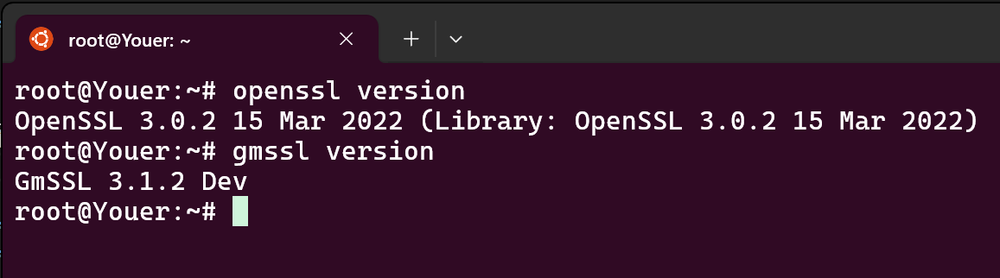
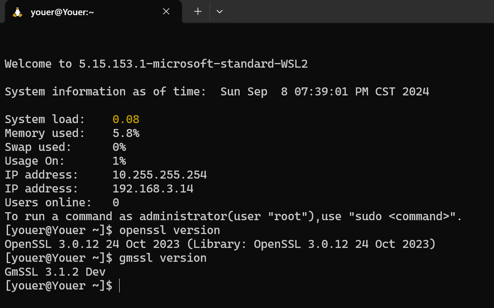
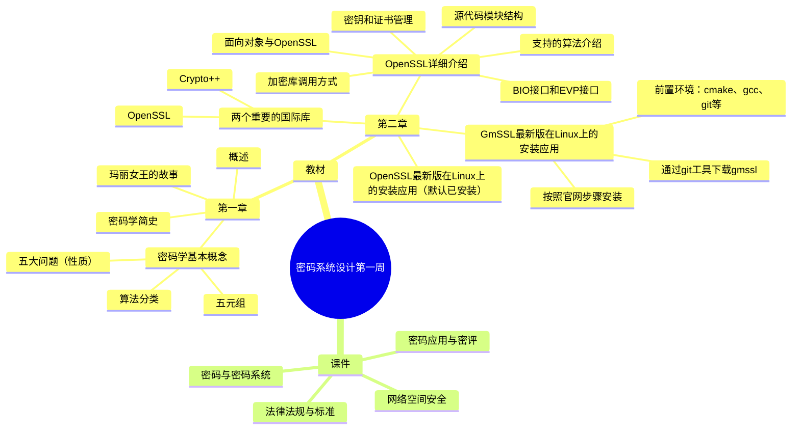
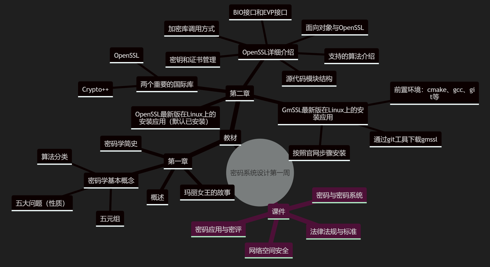

## 第一周预习报告 
### 学习内容

- [《Windows C/C++加密解密实战》](https://weread.qq.com/web/bookDetail/a0332190813ab78fag011422?wfrom=bookDetailH5)第 1，2 章
    - 第一章概念复习
    - 第二章主要在 Linux（Ubuntu,openEuler）上把软件更新到最新版(3.0版本以上)，如果默认不是，参考下面脚本

### 在Ubuntu,openEuler上安装openssl和gmssl
- openssl已经预安装了最新版本，无需重复操作
- gmssl在ubuntu上的安装我主要参考了[《Ubuntu22安装并使用GMSSL》](https://www.bilibili.com/video/BV1Do4y1M79P/?spm_id_from=333.337.search-card.all.click&vd_source=912de37828db7e4feff5c9492864d51c)这个视频。其在openEular上的安装本质上与前者一致，不过一些命令不同，在安装好cmake、gcc、git工具等环境后，通过git从GitHub上下载gmssl，再按照官网给出的Linux安装步骤一步步来即可
- 
- 

### AI 对学习内容的总结（1分）
#### 要求
- 让AI（kimi，元宝等）阅读学习内容并进行总结，教材内容可以使用微信读书或者云班课电子教材
#### 总结
感谢您提供文档内容。根据您提供的文本，我可以为您总结《Windows.C.C++.加密解密实战》的第一章和第二章的主要内容。

##### 第1章 密码学概述
- **密码学历史**：密码学的历史非常悠久，起源于公元前400年，但直到二战结束，密码学主要与军事和间谍活动相关，不为公众所熟知。
- **玛丽女王的密码**：通过苏格兰玛丽女王的故事，介绍了密码学在历史上的重要性。玛丽女王因使用密码通信而遭到审判，说明了密码学的生死攸关的作用。
- **密码学的发展**：随着信息技术的发展，密码学逐渐从军事领域走向公众生活，成为保护信息安全的重要工具。
- **基本概念**：介绍了密码学的基本概念，包括密码编码学和密码分析学，以及它们在保护信息安全中的作用。
- **密码学要解决的问题**：包括机密性、可用性、完整性、认证性和不可否认性。
- **密码学中的五元组**：明文、密文、密钥、加密算法和解密算法。
- **加解密算法的分类**：对称算法和非对称算法，以及它们的特点和应用场景。

##### 第2章 搭建C和C++密码开发环境
- **密码编程库**：介绍了两个重要的密码学编程库：OpenSSL和Crypto++，它们为密码学编程提供了丰富的函数和工具。
- **OpenSSL**：详细讨论了OpenSSL库，包括它的功能、历史、以及如何在C和C++程序中使用。
- **OpenSSL的目录结构**：介绍了OpenSSL的源代码模块结构，包括Crypto、SSL和Apps等主要目录的功能。
- **OpenSSL的加密库调用方式**：讨论了如何通过不同的接口调用OpenSSL的加密库。
- **OpenSSL支持的算法**：详细介绍了OpenSSL支持的对称加密算法、非对称加密算法和信息摘要算法。
- **密钥和证书管理**：讨论了OpenSSL如何实现密钥和证书的管理。
- **面向对象与OpenSSL**：分析了OpenSSL如何使用面向对象的设计方法和多态性来支持多种加密算法。
- **BIO接口**：介绍了OpenSSL中的BIO抽象接口，它用于统一网络和磁盘I/O操作。
- **EVP接口**：讨论了OpenSSL中EVP系列函数，这些函数封装了多种加密算法。
- **版本和操作系统**：讨论了不同版本的OpenSSL和它们在不同操作系统上的编译和安装方法。

这两章为读者提供了密码学的基础知识和如何在C/C++环境中搭建密码学开发环境的指导。如果您需要更详细的内容或有其他问题，请随时告诉我。

### 对 AI 总结的反思与补充（2分）
#### 要求
- AI总结的问题
- 自己的补充
#### 反思与补充
- AI总结的问题：
  - 无法识别云班课下载的教材PDF文件，需要手动转换为word文档
  - 一些内容过于简略。比如，介绍“密码学历史”时，只总结了前面的内容，没有涉及信息化与互联网发展对密码的影响；又比如，介绍“密码学的发展”即原书中密码学简史部分时，对其的总结过于简单。对第二章总结时，欠缺OpenSSL和Crypto++的对比。
  - 因果错误。介绍“玛丽女王的密码”时，AI声称“玛丽女王因使用密码通信而遭到审判”，这显然不符合原书内容。
- 自己的补充
  - 在“玛丽女王的密码”故事中，玛丽女王是因为“图谋、设想各种能致使英格兰女王死亡、毁灭的事件”而被判死刑，其与密码学的关联在于她用密文写信， 但密文最终被破解导致信件成为指控谋逆的关键证据。
  - 信息化和互联网发展对密码的影响：随着信息化与互联网的发展，越来越多的个人信息需要严格保密，在这种对信息的秘密性与真实性的需求下，密码学才走进公众的日常生活中。
  - OpenSSL和Crypto++的对比：最关键的在于，OpenSSL用的更多，功能更强，建议掌握。同时，OpenSSL使用C语言写的，但也可以在C++环境使用，Crypto++使用C++写的，更适合C++洁癖患者。

### 学习思维导图（2分）
#### 要求
- Mermaid 代码与截图(参考[Mermaid MindMap语法](https://mermaid.live/edit#pako:eNpdUk1vwjAM_StWTiAx7V5Nk2A7DoEGu_ViUreN1tqZkyB1iP--8FG2kZP93svTk-2DsVKRKUzvuOrRlwygInEyuQLT6QkCWKlrHIdLA_Am3EDrQhQdRqwonBWe1Ag1PuxEPqcjsxafOlQXMDrhEQVYqIsutOAvPPgw2FY6aQbAFFtR2AoPsEjfeP31ToFQbTt6rBiorslGt2cK4Wmnj8_IFdSEMSmFP7p5itLnABas0l2Qj_ArvbyXs2ZPEMm27L7SvWATFSM12c53yOy4-c_PtUk9cYQ8RH9jtyLdzWhNDKewHj3pCC5Je3SVmZn-WhXmcCJLE1vqqTRFLiuqMXWxNCUfszRPSzYDW1NETTQzKqlpTVFjF3KXfJWjvjpsFPtRQpXLy1tetn8-guMPMYioGg))**或者**提交思维导图链接（如果使用线上编辑器，推荐[processon](https://www.processon.com/),[xmind](https://xmind.cn/),...）
#### 思维导图

- 代码：

- 安装Markdown Preview Mermaid Support扩展后可以预览Mermaid思维导图。
- 截图：

### 基于 AI 的学习（2分）
#### 要求
- 至少找到自己理解不是太好 2 个概念，让 AI 对自己进行苏格拉底提问
- 参考下面提示语或者使用 AI Agent

提示词：“我在学习XXX知识点，请你以苏格拉底的方式对我进行提问，一次一个问题”
1. 核心是要求AI工具：“请你以苏格拉底的方式对我进行提问”
2. 然后AI工具就会给你提问，如果不知道问题的答案，可以反问AI：“你的理解（回答）是什么？”
3. 如果你觉得差不多了，可以先问问AI工具：“针对我XXX知识点，我理解了吗？”
4. AI工具会给出它的判断，如果你也觉得自己想清楚了，可以最后问AI工具：“我的回答结束了，请对我的回答进行评价总结”，让它帮你总结一下。

#### 学习内容
- 由于这些问答较长，这里给出对话的链接：
  - [关于BIO接口的对话](https://kimi.moonshot.cn/share/creo7j9hmfr9f82in95g)
  - [关于EVP接口的对话](https://kimi.moonshot.cn/share/creobr998onmut40dbpg)

### 学习实践过程遇到的问题与解决方式（AI 驱动，优先使用AI工具解决问题）（2分）
至少两个
- 问题 1：在ubuntu安装gmssl的过程中输入了python3，无法退出环境，解决过程：当时不知道是这个问题，直接把提示信息复制给AI，AI告诉了我这是什么问题，于是我输入exit()后成功退出python环境。[问题1对话链接](https://kimi.moonshot.cn/share/creoidecp7fc4tl7d090)
- 问题 2：不会在openEular中安装gmssl，解决过程：询问AI如何安装，按照AI提供的步骤来，在中途明白了这本质上和在Ubuntu安装gmssl没什么区别，只是命令格式有所不同。之后参考在Ubuntu的安装过程以及官网的安装教程进行安装，有什么不懂的命令或报错问AI就好。[问题2对话链接](https://kimi.moonshot.cn/share/creokrcjot6je50ecf6g)

### 作业提交要求（1分）

1. 提交Markdown 文件,文档命名“学号姓名《密码系统设计》.md”
2. 提交Markdown 文件转为 PDF,文档命名“学号姓名《密码系统设计》第 X 周.pdf”
3. 提交代码托管链接（可选）：[学号姓名 gitee(github) 链接](你的链接)
4. 内容质量高有加分

### 参考资料
- AI工具(你使用的AI工具及其链接)
  - [Kimi](https://kimi.moonshot.cn/)
  - [关于BIO接口的对话](https://kimi.moonshot.cn/share/creo7j9hmfr9f82in95g)
  - [关于EVP接口的对话](https://kimi.moonshot.cn/share/creobr998onmut40dbpg)
  - [问题1对话链接](https://kimi.moonshot.cn/share/creoidecp7fc4tl7d090)
  - [问题2对话链接](https://kimi.moonshot.cn/share/creokrcjot6je50ecf6g)
- 图书
  - [《Windows C/C++加密解密实战》](https://weread.qq.com/web/bookDetail/a0332190813ab78fag011422?wfrom=bookDetailH5)
- 网站
  - [gmssl官网](https://gmssl.org/)
  - [openssl](https://openssl-library.org/)
  - [《Ubuntu22安装并使用GMSSL》](https://www.bilibili.com/video/BV1Do4y1M79P/?spm_id_from=333.337.search-card.all.click&vd_source=912de37828db7e4feff5c9492864d51c)