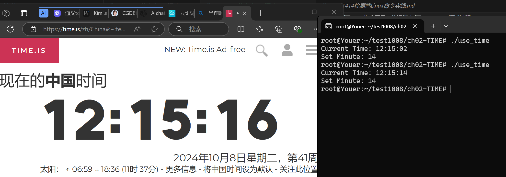

[toc]

# 课上测试

## ch02
### 作业题目：位运算
#### 学习“位运算” 
-  完成附件中ch02 “位运算” 任务内容
#### 作业要求（9‘）
- 参考课件，针对上面核心命令重复老师的演示内容（3’）
- 选择自己习惯的 AI 工具， 针对上面核心命令，让 AI 给自己生成至少例子，然后自己进行验证，总结（3’）
- 让 AI工具推荐一些重要命令，然后选择自己认为会高频应用的至少 3个命令（重点推荐 echo，od，sort，bc，ls）进行自主深入学习，每个命令不少于 5 个例子，提交验证，实践过程和总结（3’）
#### 作业提交要求 (1')
0. 记录实践过程和 AI 问答过程，尽量不要截图，给出文本内容
1. (选做)推荐所有作业托管到 [gitee](https://gitee.com/)或 [github](https://github.com/) 上
2. (必做)提交作业 markdown文档，命名为“学号-姓名-作业题目.md”
3. (必做)提交作业 markdown文档转成的 PDF 文件，命名为“学号-姓名-作业题目.pdf”

#### 位运算实现过程
- [作业github链接](https://github.com/youer0219/Information-Security-System-Design-Assignment) 
- git过程：
    ```
    root@Youer:~/test1008/ch02-TIME# git log --graph --oneline --all
    * d64ff94 (HEAD -> master) delete auto-save file
    * a785785 fix error:min show error
    * 6aafec3 fix test func
    * 4a0b715 add test func
    * 53cc8ec add get time func
    * 0776c4a add set time func
    root@Youer:~/test1008/ch02-TIME# git log --stat
    commit d64ff94dcc0bcaf685d8d91758c77a6de8cbabab (HEAD -> master)
    Author: root <root@Youer>
    Date:   Tue Oct 8 12:08:14 2024 +0800

        delete auto-save file

    use_time.c.save | 52 ----------------------------------------------------
    1 file changed, 52 deletions(-)

    commit a7857853738d52aae0fcec585bab4acfd2b96c4a
    Author: root <root@Youer>
    Date:   Tue Oct 8 11:41:56 2024 +0800

        fix error:min show error

    use_time        | Bin 0 -> 16312 bytes
    use_time.c      |  23 +++++++++++++++--------
    use_time.c.save |  52 ++++++++++++++++++++++++++++++++++++++++++++++++++++
    3 files changed, 67 insertions(+), 8 deletions(-)

    commit 6aafec3697be8084059a221b898d5073142b6a0b
    Author: root <root@Youer>
    Date:   Tue Oct 8 10:59:28 2024 +0800

        fix test func

    use_time.c | 2 +-
    1 file changed, 1 insertion(+), 1 deletion(-)

    :
    ```
- 最终代码：
    ```
    root@Youer:~/test1008/ch02-TIME# cat use_time.c
    #include <stdio.h>
    #include <time.h>

    unsigned short TIME;

    void setHour(int h) {
        TIME = (h << 11) | (TIME & 0x07FF); // 设置小时
    }

    void setMinute(int m) {
        TIME = (m << 5) | (TIME & 0xF8FF); // 设置分钟
    }

    void setSecond(int s) {
        TIME = s | (TIME & 0xFFE0); // 设置秒
    }

    int getHour(void) {
        return (TIME >> 11) & 0x1F; // 获取小时
    }

    int getMinute(void) {
        return (TIME >> 5) & 0x3F; // 获取分钟
    }

    int getSecond(void) {
        return (TIME & 0x1F) * 2; // 获取秒，并乘以2
    }

    int main() {
        // 获取当前系统时间
        time_t now = time(NULL);
        struct tm *tm = localtime(&now);

        // 设置TIME
        setHour(tm->tm_hour);
        setMinute(tm->tm_min);
        setSecond(tm->tm_sec / 2); // 存储秒的一半

        // 重新组合TIME
        TIME = (getHour() << 11) | (getMinute() << 5) | (getSecond() / 2);

        // 读取并打印TIME
        printf("Current Time: %02d:%02d:%02d\n", getHour(), getMinute(), getSecond());

        // 设置分钟为你学号最后两位
        setMinute(14);

        // 重新组合TIME
        TIME = (getHour() << 11) | (14 << 5) | (getSecond() / 2);

        // 读取并打印分钟
        printf("Set Minute: %02d\n", getMinute());

        return 0;
    }
    ```
- 测试截图（截图有一定延迟）：
    ```
    root@Youer:~/test1008/ch02-TIME# ./use_time
    Current Time: 12:15:14
    Set Minute: 14
    ```
    - 
- AI的辅助：
    - [解决使用nano编辑器的问题](https://lxblog.com/qianwen/share?shareId=ca59ddaf-1a85-4783-bd2b-7d51a27d3bbd)
    - [解决如何实现位运算函数的问题](https://kimi.moonshot.cn/share/cs2b6p03qff1u8hgr330)
        - 注意这里要明确代码运行环境为Ubuntu
    - [解决如何查看git记录的问题](https://lxblog.com/qianwen/share?shareId=9022e7f9-d47e-48d9-af1e-8c26e5cf0f5a)