# 课下测试

## ch03

### 作业题目：IPSec协议验证
完成下面任务（99分）
1. 参考云班课课程资源中“ch03 密码技术-协议验证”的“VPN协议验证.pdf”和“ch03 密码技术-10-密码协议验证IPSec.mp4”，对 IPSec 协议进行验证，提交验证过程。（79分）
2. 不使用 “VPN协议验证.pdf”中的商用密码工具，使用 OpenSSL或者 GmSSL命令进行验证，提交验证过程（选做,加分项目，加20分）
#### 作业提交要求 (1')

0. 记录实践过程和 AI 问答过程，尽量不要截图，给出文本内容
1. (选做)推荐所有作业托管到 [gitee](https://gitee.com/)或 [github](https://github.com/) 上
2. (必做)提交作业 markdown文档，命名为“学号-姓名-作业题目.md”
3. (必做)提交作业 markdown文档转成的 PDF 文件，命名为“学号-姓名-作业题目.pdf”

- [github链接](https://github.com/youer0219/Information-Security-System-Design-Assignment)

### 作业内容

#### 第一阶段
######  第一阶段发起方的验证
- 使用工具解析发起方加密私钥文件“left_enc.key”，得到发起方加密公私钥对内容
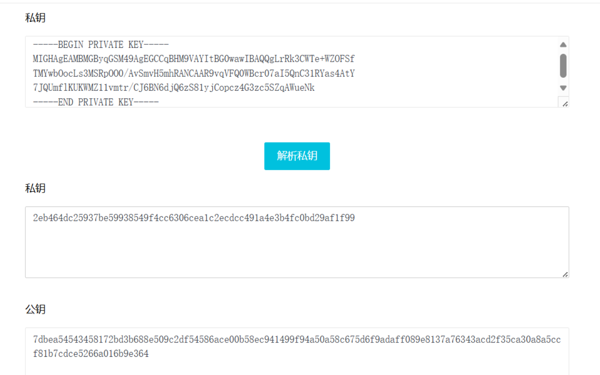
- 私钥
    ```bash
    2eb464dc25937be59938549f4cc6306cea1c2ecdcc491a4e3b4fc0bd29af1f99
    ```
- 公钥
    ```bash
    7dbea54543458172bd3b688e509c2df54586ace00b58ec941499f94a50a58c675d6f9adaff089e8137a76343acd2f35ca30a8a5ccf81b7cdce5266a016b9e364
    ```
- 在Wireshark中打开“left.pcapng”包，用isakmp协议过滤一下数据包
    - 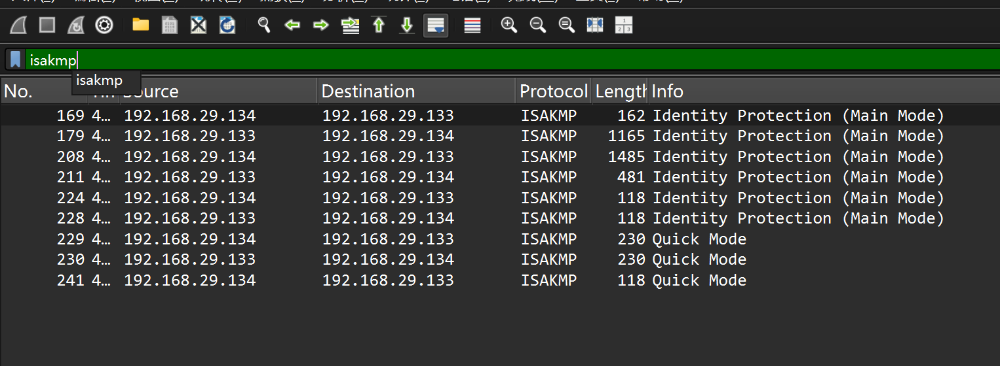
- 导出ski密文
    ```bash
    307902210083e6ecef3fb62d7d4683132d920a298dd88efc8342256fb751987a5c37300cd30220398674a09fc955c21d9218a5016994738d9eddb2939b133e8ed2273aa3a215d30420cf1f2e14abe2de8c81fc9f2fbf028648570af88dcdaa98659a4c3eb1f96975100410ac34d8306c55b50003a96045184deb81
    ```
- 所以SKi密文X||Y||Hash||C为
    ```bash
    83e6ecef3fb62d7d4683132d920a298dd88efc8342256fb751987a5c37300cd3398674a09fc955c21d9218a5016994738d9eddb2939b133e8ed2273aa3a215d3cf1f2e14abe2de8c81fc9f2fbf028648570af88dcdaa98659a4c3eb1f9697510ac34d8306c55b50003a96045184deb81
    ```
- 解密得到明文
    - 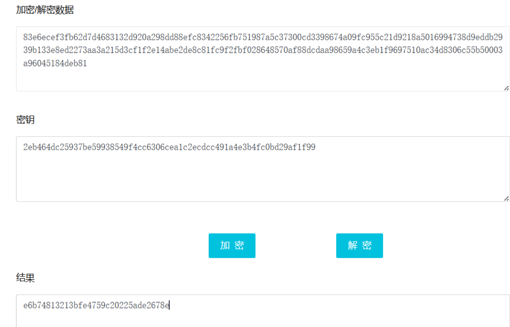
    - 明文：
        ```bash
        e6b74813213bfe4759c20225ade2678e
        ```
- 在Wireshark中通过导出获取Ni密文
    - 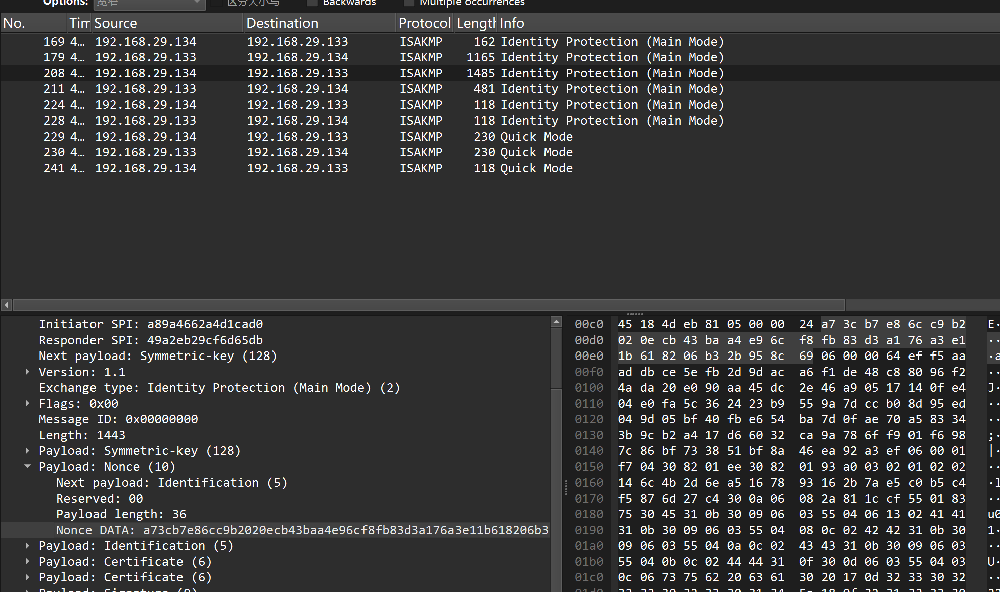
    - NI密文
        ```bash
        a73cb7e86cc9b2020ecb43baa4e96cf8fb83d3a176a3e11b618206b32b958c69
        ```
- 使用工具解密Ni密文:SM4算法，CBC模式密钥为Ski，iv为00000000000000000000000000000000
    - 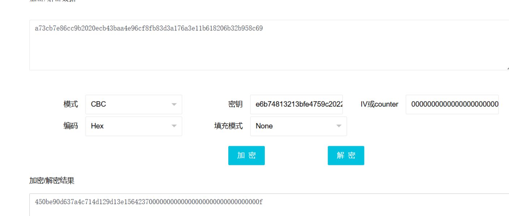
- NI明文（已填充）
    - 具体值
        ```bash
        450be90d637a4c714d129d13e15642370000000000000000000000000000000f
        ```
    - 后面的0000000000000000000000000000000f为填充数据，Ni明文为450be90d637a4c714d129d13e1564237
- 在Wireshark中通过导出获取IDi密文,注意Wireshark对IDi的解析有错误，IDi数据看截图，IDi为identificationpayload去掉前3项后的所有数据
    - IDi密文
        ```bash
        eff5aaaddbce5efb2d9daca6f1de48c88096f24ada20e090aa45dc2e46a90517140fe404e0fa5c362423b9559a7dccb08d95ed049d05bf40fbe654ba7d0fae70a583343b9cb2a417d66032ca9a786ff901f6987c86bf733851bf8a46ea92a3ef
        ```
    - 解密IDi密文
        - 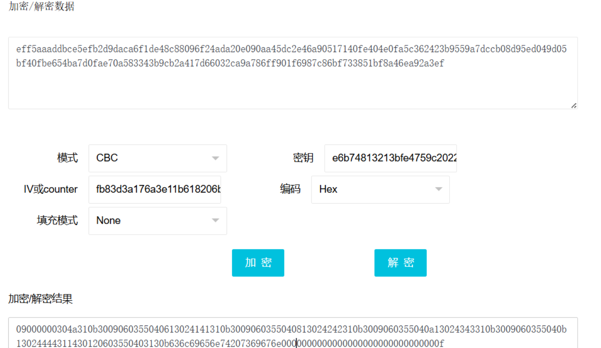
    - IDi明文
        ```bash
        09000000304a310b3009060355040613024141310b3009060355040813024242310b3009060355040a13024343310b3009060355040b13024444311430120603550403130b636c69656e74207369676e0000000000000000000000000000000f
        ```
- 在Wireshark中通过导出获取发起方加密证书CERT_enc_i
    - CERT_enc_i
        ```bash
        05308201ed30820192a00302010202145b2ebfa257b547c1b04ebce83ad65e6c595addaa300a06082a811ccf550183753045310b3009060355040613024141310b300906035504080c024242310b3009060355040a0c024343310b3009060355040b0c024444310f300d06035504030c067375622063613020170d3233303232323032333031345a180f32313233303132393032333031345a3049310b3009060355040613024141310b300906035504080c024242310b3009060355040a0c024343310b3009060355040b0c0244443113301106035504030c0a636c69656e7420656e633059301306072a8648ce3d020106082a811ccf5501822d034200042920dde9348041de867e49a5caa1936d3241f9b79cb5dcc5c6d59b31f8d88467b05b38505b101f7dbf242bcba73daf394cf0879d3f0e8ec08739f1db00fa770ca35a305830090603551d1304023000300b0603551d0f040403020338301d0603551d0e041604147cf13c4f768f4733a2ffe2e259346b90cfb474a8301f0603551d23041830168014ac61eb22806259083e96c8d17fce745c02af3c99300a06082a811ccf550183750349003046022100e2131845079c82d4a4b09b4990b21bc4e281899b83b226c9916d5c5fee12139f022100e7d3e711561a7a0be92392ed9f94f63ca2aa899d9039611f4472488bf14565ea
        ```
- 得到签名原文SKi||Ni||IDi||CERT_enc_i
    ```bash
    e6b74813213bfe4759c20225ade2678e450be90d637a4c714d129d13e156423709000000304a310b3009060355040613024141310b3009060355040813024242310b3009060355040a13024343310b3009060355040b13024444311430120603550403130b636c69656e74207369676e05308201ed30820192a00302010202145b2ebfa257b547c1b04ebce83ad65e6c595addaa300a06082a811ccf550183753045310b3009060355040613024141310b300906035504080c024242310b3009060355040a0c024343310b3009060355040b0c024444310f300d06035504030c067375622063613020170d3233303232323032333031345a180f32313233303132393032333031345a3049310b3009060355040613024141310b300906035504080c024242310b3009060355040a0c024343310b3009060355040b0c0244443113301106035504030c0a636c69656e7420656e633059301306072a8648ce3d020106082a811ccf5501822d034200042920dde9348041de867e49a5caa1936d3241f9b79cb5dcc5c6d59b31f8d88467b05b38505b101f7dbf242bcba73daf394cf0879d3f0e8ec08739f1db00fa770ca35a305830090603551d1304023000300b0603551d0f040403020338301d0603551d0e041604147cf13c4f768f4733a2ffe2e259346b90cfb474a8301f0603551d23041830168014ac61eb22806259083e96c8d17fce745c02af3c99300a06082a811ccf550183750349003046022100e2131845079c82d4a4b09b4990b21bc4e281899b83b226c9916d5c5fee12139f022100e7d3e711561a7a0be92392ed9f94f63ca2aa899d9039611f4472488bf14565ea
    ```
- 在Wireshark中通过导出获取签名值（处理后）
    ```bash
    8fd24caa07d506eb6b88ebd5852839e127e875738747a8d2c356150e4b95c6f214a9f5aea118004276fbd8437b0f6e5db84d138b058236f7d6656f3dedefd740
    ```
- 发起方签名公钥，去掉第一字节04
    ```bash
    04 2d617e74d5586dde23d2490fbd468e30f11d012d50a8f392cd1849b10b167e9a0661f7e3a2a00ee7ec4718ed937b4ab2c50aa0d341d15e4095743b3850af6d3c
    ```
- 发起方验签成功
    - 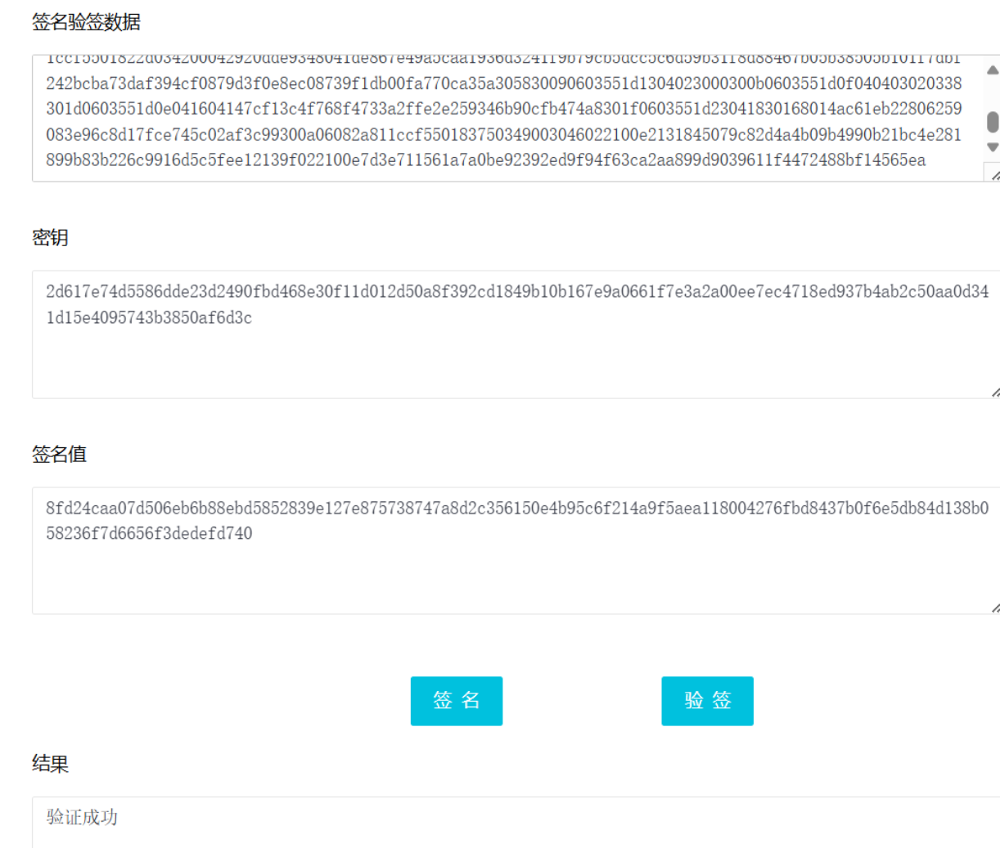
######  第一阶段响应方的验证
- 解析响应方加密私钥文件“right_enc.key”，得到响应方加密公私钥对内容
    - 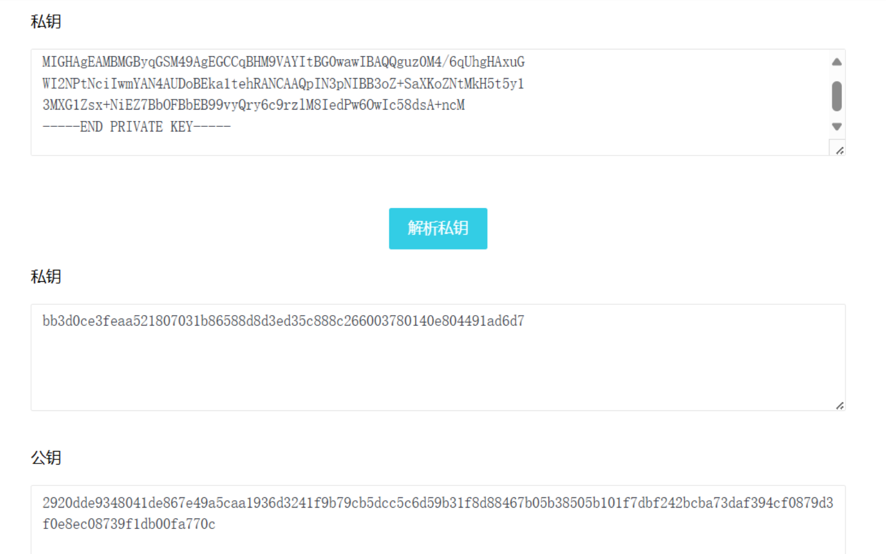
- 私钥
    ```bash
    bb3d0ce3feaa521807031b86588d8d3ed35c888c266003780140e804491ad6d7
    ```
- 公钥
    ```bash
    2920dde9348041de867e49a5caa1936d3241f9b79cb5dcc5c6d59b31f8d88467b05b38505b101f7dbf242bcba73daf394cf0879d3f0e8ec08739f1db00fa770c
    ```
- 导出SKr密文
    - 密文：
        ```bash
        3079022100e2fee5b1439937014b7ad1a585f4a62910787a7c885884c1370cd9fb8dadd12c02201c2f5ab9ba02bc9d9c21cf18afaa6b64f0b0a733bd730508d6567f9faac722aa042000376aa46646d90577b5ab0170f97043356acef83504b8a4b9ae159a0e834fc3041001734e922fa8c88ad6814c59264e9f21
        ```
    - 处理后：
        ```bash
        e2fee5b1439937014b7ad1a585f4a62910787a7c885884c1370cd9fb8dadd12c1c2f5ab9ba02bc9d9c21cf18afaa6b64f0b0a733bd730508d6567f9faac722aa00376aa46646d90577b5ab0170f97043356acef83504b8a4b9ae159a0e834fc301734e922fa8c88ad6814c59264e9f21
        ```
- 使用工具，用prv_r解密SKr密文得到SKr的明文为
    - 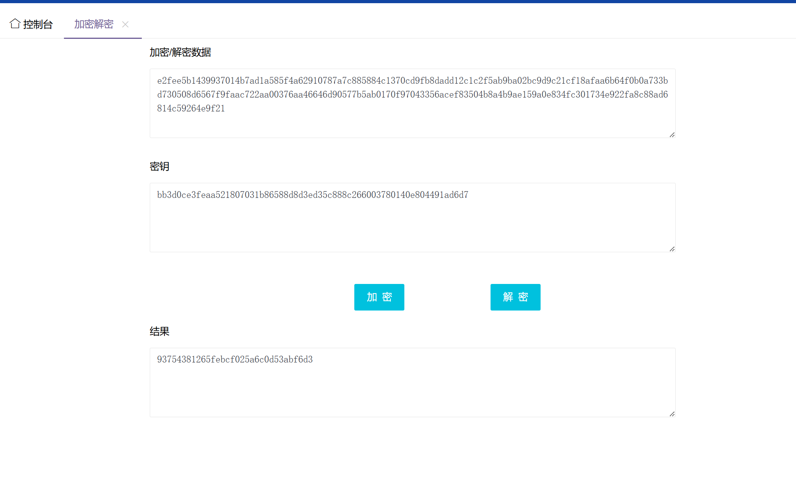
- SKr明文
    ```bash
    93754381265febcf025a6c0d53abf6d3
    ```
- 在Wireshark中获取Nr密文
    - 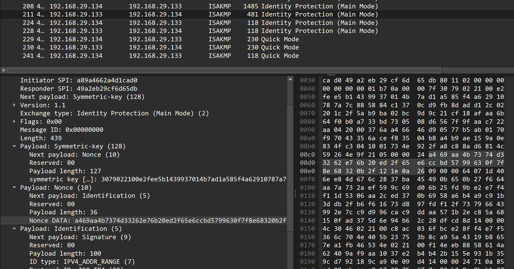
- Nr密文
    ```bash
    a469aa4b7374d33262e76b20ed2f65e6ccbd5799630f7f8e68320b2f121e0a26
    ```
- 使用工具解密Nr密文(SM4算法，CBC模式密钥为Skr,iv是：00000000000000000000000000000000)
    - 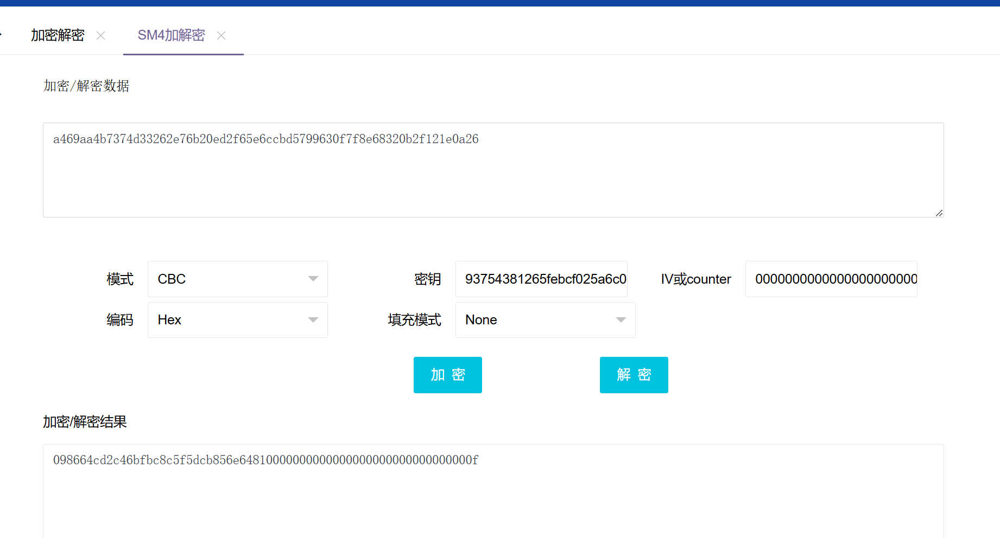
- 解密
    ```bash
    098664cd2c46bfbc8c5f5dcb856e64810000000000000000000000000000000f
    ```
- 在Wireshark中通过导出获取IDr密文
    - 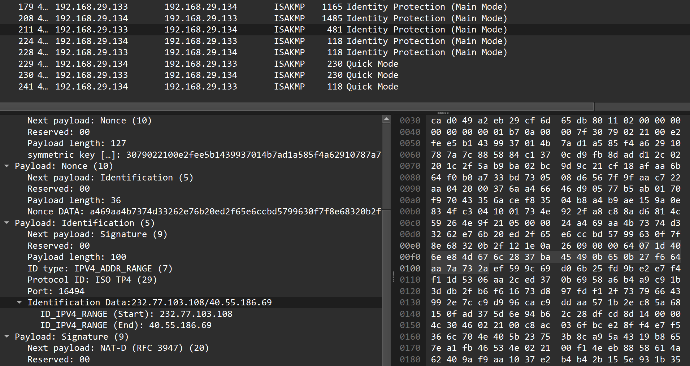
- IDr密文
    ```bash
    09000064
    071d406ee84d676c2837ba45490b650b27f664aa7a732aef599c69d06b25fd9be2e7f4f11d5306aa2ced370b6958a6b4a9c91b3ddb2fb6f61673d897fdf12f73796643992e7cc9d996cac9ddaa571b2ec85a68150fad375d6e94b62c28dfcd8d
    ```
- 解密IDr明文：SM4算法，CBC模式，密钥SKr，iv是Nr密文中的ccbd5799630f7f8e68320b2f121e0a26
    - 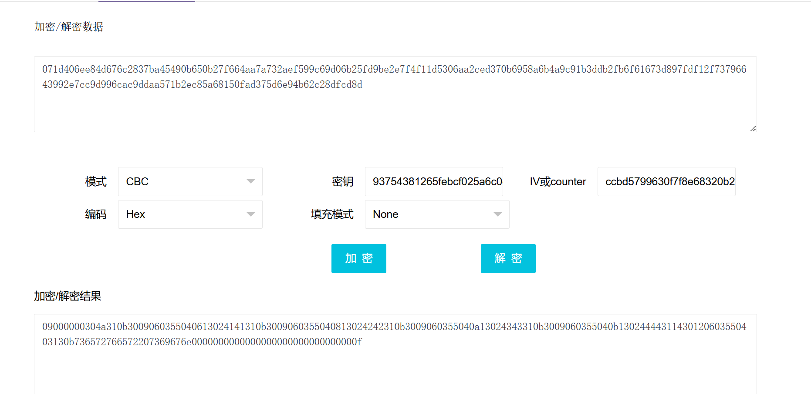
- IDr明文
    ```bash
    09000000304a310b3009060355040613024141310b3009060355040813024242310b3009060355040a13024343310b3009060355040b13024444311430120603550403130b736572766572207369676e0000000000000000000000000000000f
    ```
-  在Wireshark中通过导出获取发起方加密证书CERT_enc_r
    ```bash
    0d0001f4（去掉前三项）
    05308201eb30820192a003020102021468d892e963aca045620e799d6fc31d937433e57c300a06082a811ccf550183753045310b3009060355040613024141310b300906035504080c024242310b3009060355040a0c024343310b3009060355040b0c024444310f300d06035504030c067375622063613020170d3233303232323032333031345a180f32313233303132393032333031345a3049310b3009060355040613024141310b300906035504080c024242310b3009060355040a0c024343310b3009060355040b0c0244443113301106035504030c0a73657276657220656e633059301306072a8648ce3d020106082a811ccf5501822d034200047dbea54543458172bd3b688e509c2df54586ace00b58ec941499f94a50a58c675d6f9adaff089e8137a76343acd2f35ca30a8a5ccf81b7cdce5266a016b9e364a35a305830090603551d1304023000300b0603551d0f040403020338301d0603551d0e0416041467a5add59476e05a9c5e56b8860ff13b28eeec54301f0603551d23041830168014ac61eb22806259083e96c8d17fce745c02af3c99300a06082a811ccf550183750347003044022047593579c4adec8db7df98c4aae1661c1139a5ef1293f22a3aa412d09becd6e602206e57301d177946956fd39cb5ac603902cd17c7517ed8941ecc985ea7db6958c8
    ```
- 得到签名原文SKr||Nr||IDr||CERT_enc_r
    ```bash
    93754381265febcf025a6c0d53abf6d3098664cd2c46bfbc8c5f5dcb856e648109000000304a310b3009060355040613024141310b3009060355040813024242310b3009060355040a13024343310b3009060355040b13024444311430120603550403130b736572766572207369676e05308201eb30820192a003020102021468d892e963aca045620e799d6fc31d937433e57c300a06082a811ccf550183753045310b3009060355040613024141310b300906035504080c024242310b3009060355040a0c024343310b3009060355040b0c024444310f300d06035504030c067375622063613020170d3233303232323032333031345a180f32313233303132393032333031345a3049310b3009060355040613024141310b300906035504080c024242310b3009060355040a0c024343310b3009060355040b0c0244443113301106035504030c0a73657276657220656e633059301306072a8648ce3d020106082a811ccf5501822d034200047dbea54543458172bd3b688e509c2df54586ace00b58ec941499f94a50a58c675d6f9adaff089e8137a76343acd2f35ca30a8a5ccf81b7cdce5266a016b9e364a35a305830090603551d1304023000300b0603551d0f040403020338301d0603551d0e0416041467a5add59476e05a9c5e56b8860ff13b28eeec54301f0603551d23041830168014ac61eb22806259083e96c8d17fce745c02af3c99300a06082a811ccf550183750347003044022047593579c4adec8db7df98c4aae1661c1139a5ef1293f22a3aa412d09becd6e602206e57301d177946956fd39cb5ac603902cd17c7517ed8941ecc985ea7db6958c8
    ```
- 在Wireshark中通过导出获取签名值
    - 签名值（DER格式签名值）
        ```bash
        3046022100c8ac036fbce28ff4e7f5366c704e405b23753b8ca95a4319b8657ea1fb46534e022100f14eeb8858614a62409af9aa1037e2b4b42b155e931b359cd792189ca90e09d4
        ```
    -  处理
        ```bash
        c8ac036fbce28ff4e7f5366c704e405b23753b8ca95a4319b8657ea1fb46534ef14eeb8858614a62409af9aa1037e2b4b42b155e931b359cd792189ca90e09d4
        ```
- 在Wireshark中通过导出获取响应方签名公钥
    ```bash
    04
    05bffaeec406c8f3f580a6e39c528476c0df2b61065d4a74f476af0fb66890f896acc4b21d8b036d13f17bd4d38234908bedb77f8e3eae870654fc6fa8048d0c
    ```
- 第一阶段响应方验签成功
    - 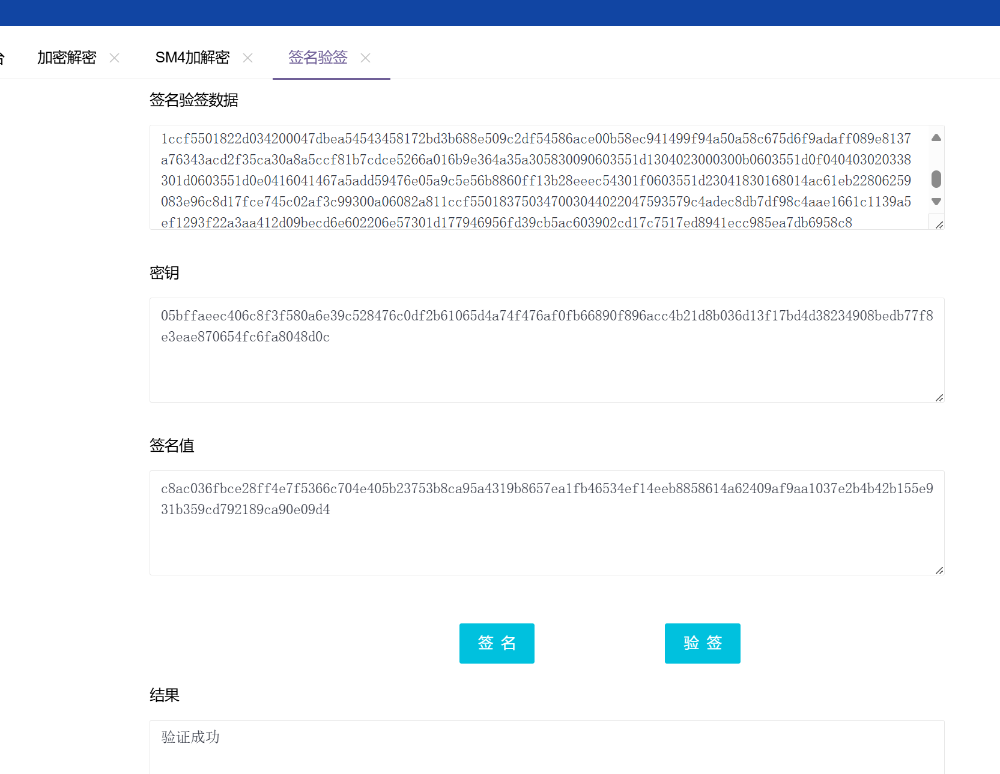
######  第一阶段密钥计算
- 基于sm3算法计算HASH(Ni||Nr）
    ```bash
    450be90d637a4c714d129d13e1564237098664cd2c46bfbc8c5f5dcb856e6481
    ```
- HASH（Ni||Nr）
    ```bash
    83fddf2b5dc8bd853c343ee68f780cfaf2e37fdde3998da2c76a4b368816e972
    ```
- CKY-I||CKY-R
    ```bash
    a89a4662a4d1cad049a2eb29cf6d65db
    ```
- 计算SKEYID=PRF(HASH(Ni||Nr),CKY-I|CKY-R）
    ```bash
    af75db413c0babf64d866f08b53432ce027c59a975a30b284b31236c0689113e
    ```
- 计算SKEYID_d=PRF(SKEYID,CKY-I|CKY-R|0)
    ```bash
    d07385874bd72fa3ec6d42714e643a94de6644d24f2f50239892f8ef478293e7
    ```
- 计算SKEYID_a=PRF(SKEYID,SKEYID_d|CKY-I|CKY-R|1)
    ```bash
    51b531818c073c1b72ca8e9a883e6b19755604445abedf57df176d575f4320fe
    ```
- 计算SKEYID_e=PRF(SKEYID,SKEYID_a|CKY-I|CKY-R|2)
    ```bash
    f60661271d29c5093894dacdacf5378c13aeea3d52b2be0ce06ad87edbc9f7d1
    ```
- 计算hash(SKi||SKr)
    ```bash
    e6b74813213bfe4759c20225ade2678e93754381265febcf025a6c0d53abf6d3
    ```
- IV=hash(SKi||SKr)
    ```bash
    de788aa1e41303baf97136e86f82f2fc  
    05fd904df03879c49c1e1a9a868b0e1a
    ```
- 在Wireshark中通过导出获取HAHSi密文
    ```bash
    c60c2e7689fa1519256ec690bbfb7d6380a52de3d51ce8fb1ac5923a84ceac86
    b958be5fa74277fc91b3bfd3d1cbf7e0  
    ```
- 解密HASHi包:SM4算法，密钥：SKEYID_e，CBC模式，IV=HASH(Ski_b|Skr_b)
    - 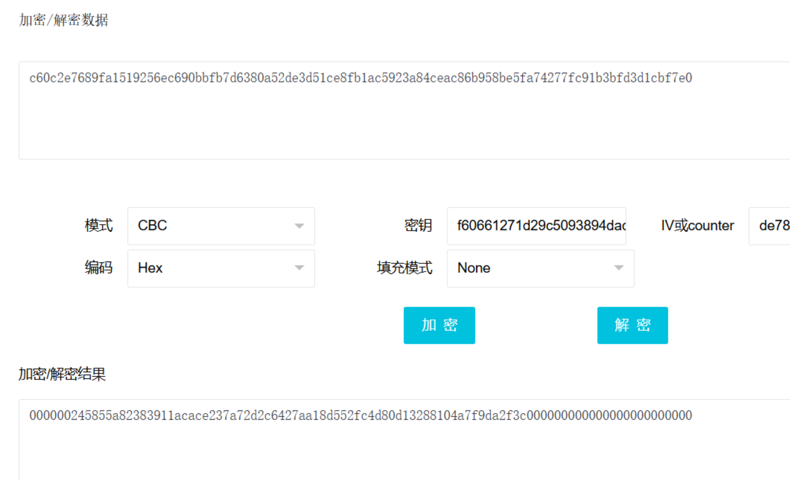
- HASHi明文
    ```bash
    00
    00
    0024
    5855a82383911acace237a72d2c6427aa18d552fc4d80d13288104a7f9da2f3c000000000000000000000000
    ```
- 验证HASHi=PRF(SKEYID,CKY-I|CKY-R|SAi_b|IDi_b)
    - SAi
        ```bash
        0d000034   
        0000000100000001000000280001000100000020010100008001007f800200148003000a80140002800b0001800c3de0
        ```
   - CKY-I||CKY-R||SAi||IDi
    ```bash
    a89a4662a4d1cad049a2eb29cf6d65db0000000100000001000000280001000100000020010100008001007f800200148003000a80140002800b0001800c3de009000000304a310b3009060355040613024141310b3009060355040813024242310b3009060355040a13024343310b3009060355040b13024444311430120603550403130b636c69656e74207369676e
    ```
    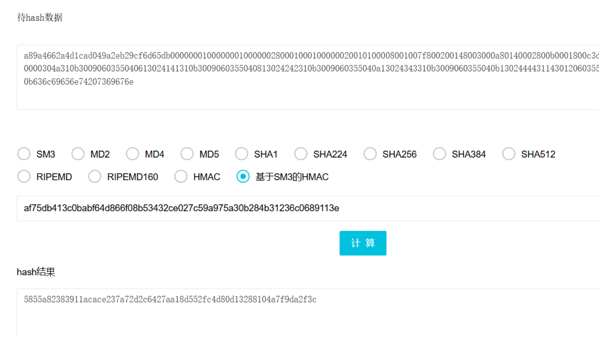
    - HASHi=PRF(SKEYID,CKY-I|CKY-R|SAi_b|IDi_b)
        ```bash
        5855a82383911acace237a72d2c6427aa18d552fc4d80d13288104a7f9da2f3c
        ```
    - 与步解密出来的一致
- HASHr密文
    ```bash
    dd55ad19832211a7909550c3472615c55feddb949b5ee01f9cfe6d9e228e3a1dd92048953a172891b194012f8db5f7b0
    ```
- 解密HASHr：SM4算法，密钥：SKEYID_e，CBC模式，IV=HASHi密文最后一包
    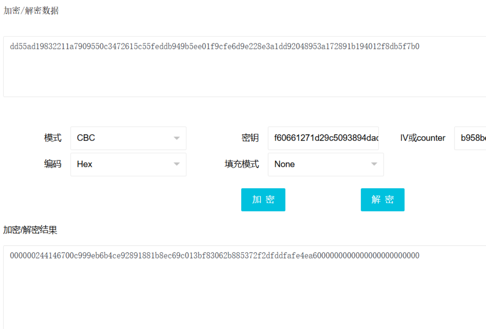
- HASHr明文
    ```bash
    00
    00
    0024
    4146700c999eb6b4ce92891881b8ec69c013bf83062b885372f2dfddfafe4ea6000000000000000000000000
    ```
- SAr
    ```bash
    06000034  
    0000000100000001000000280001000100000020010100008001007f800200148003000a80140002800b0001800c3de0
    ```
- CKY-R||CKY-I||SAr||IDr
    ```bash
    49a2eb29cf6d65dba89a4662a4d1cad00000000100000001000000280001000100000020010100008001007f800200148003000a80140002800b0001800c3de009000000304a310b3009060355040613024141310b3009060355040813024242310b3009060355040a13024343310b3009060355040b13024444311430120603550403130b736572766572207369676e
    ```
- HASHr=PRF(SKEYID,CKY-R|CKY-I|SAr_b|IDr_b)
    ```bash
    4146700c999eb6b4ce92891881b8ec69c013bf83062b885372f2dfddfafe4ea6
    ```
####  第二阶段
- 第一阶段的最后一组密文
    ```bash
    dd55ad19832211a7909550c3472615c55feddb949b5ee01f9cfe6d9e228e3a1d
    d92048953a172891b194012f8db5f7b0 最后一组
    ```
- Message ID
    ```bash
    cc2d2221
    ```
- 第一阶段的最后一组密文||MsgID
    ```bash
    d92048953a172891b194012f8db5f7b0cc2d2221
    ```
- 计算IV
    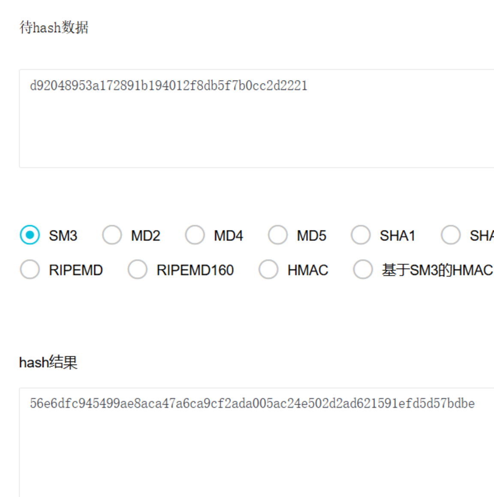
- hash
    ```bash
    56e6dfc945499ae8aca47a6ca9cf2ada  
    005ac24e502d2ad621591efd5d57bdbe
    ```
- 第一个包密文
    ```bash
    0480348d01d6635a2c2a912fbdb677f0e718ca239c1758319069d74efc0601c4bdb814f8d5575add1acc7075723263a65270547f464345b292753cd5c759fde4c94048f5ced4b161679c75a3cb0fec2d80c292df8b6a567b916cb0cdb57d30097f841630cfb8081cc8b65b0be54dcd45acef18456a1dbb1b764b4a4164b4ffab0b364556de52ec116c1014112986fd82
    359b204f92800504072e2994af771b88  
    ```
- 第一个包解密:SM4算法，CBC模式，密钥SKEYID_e,IV=HASH(第一阶段最后一组密文||MsgID),即56e6dfc945499ae8aca47a6ca9cf2ada
    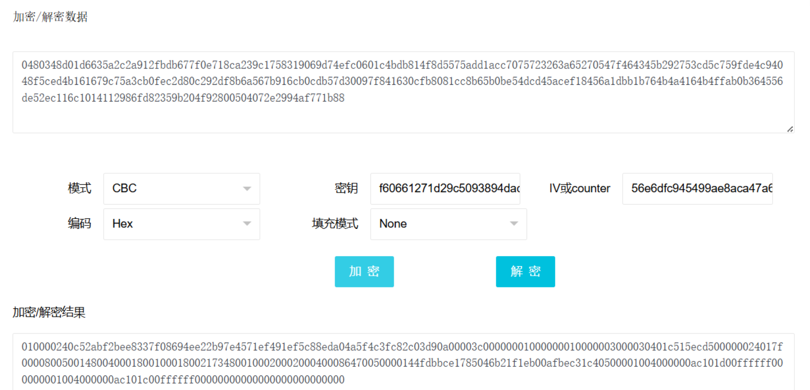
- 第一个包明文
    ```bash
    01
    00
    0024
    0c52abf2bee8337f08694ee22b97e4571ef491ef5c88eda04a5f4c3fc82c03d9

    0a
    00
    003c
    00000001
    00000001

    00
    00
    0030
    00
    03
    04
    01
    c515ecd5

    00
    00
    0024
    01
    7f
    0000

    8005001
    80040001
    80010001
    80021734
    800100020002000400086470

    05
    00
    0014
    4fdbbce1785046b21f1eb00afbec31c4

    05
    00
    0010
    04000000ac101d00ffffff00

    00
    00
    0010
    04000000ac101c00ffffff00
    000000000000000000000000填充
    ```
- 第二个包密文
    ```bash
    49813dfd83a4c3c3bf2950290904fc4237c90e5e45e4991a60336a91ee6848de0ca5964fbb5af6f0aa607ebcc8188e9774a8ac79f1f93b1a72140625c3588eea7e1e4b137783c948e9bd7a060f8d36821b5198c7e3eb41a5ad4e3f30acf978f80930e47a79e3ddae43fb9d1463c6dbcb45ad9d37ead1eb54fbcf39058a9e9c39f7a9c43c6c1aecc5a1a58522abd5960920f20261bf78e32847d2f84e7f4cbdb2
    ```
- 第二个包解密:SM4算法，CBC模式，密钥SKEYID_e,IV：359b204f92800504072e2994af771b88
    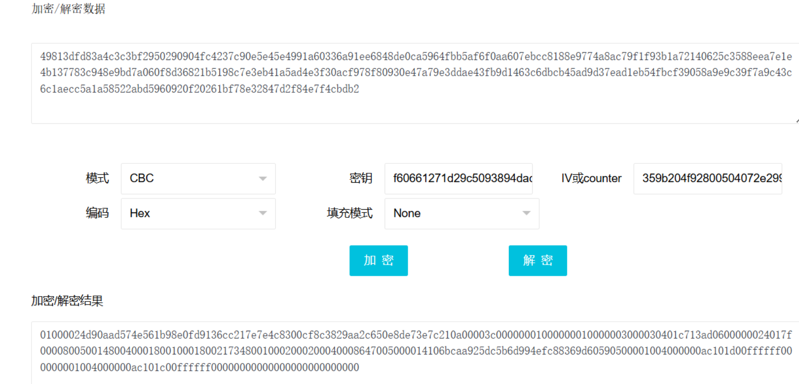
- 第二个包明文
    ```bash
    01000024d90aad574e561b98e0fd9136cc217e7e4c8300cf8c3829aa2c650e8de73e7c210a00003c00000001000000010000003000030401c713ad0600000024017f00008005001480040001800100018002173480010002000200040008647005000014106bcaa925dc5b6d994efc88369d60590500001004000000ac101d00ffffff000000001004000000ac101c00ffffff00000000000000000000000000
    ```
- 第三个包密文
    ```bash
    6017ca492079d1910a3cfbc30aaa2d66c6a003b902799af271b6d87d36555031b2d9d152de3a711963072efa0d2d8012
    ```
- 第三个包解密:SM4算法，CBC模式，密钥SKEYID_e,IV：20f20261bf78e32847d2f84e7f4cbdb2
    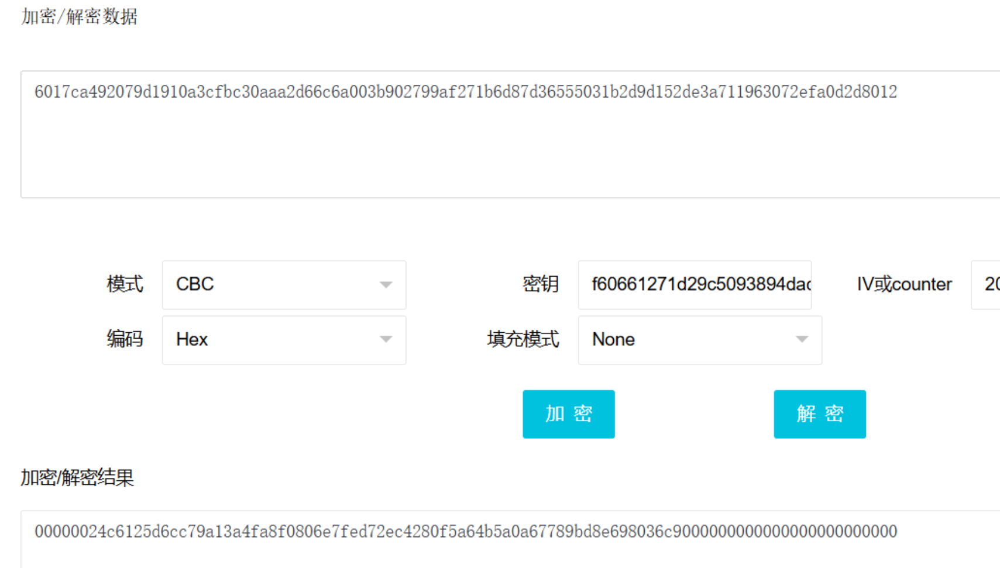
- 第三个包明文
    ```bash
    00
    00
    0024
    c6125d6cc79a13a4fa8f0806e7fed72ec4280f5a64b5a0a67789bd8e698036c9
    000000000000000000000000填充
    ```

####  使用 OpenSSL或者 GmSSL命令进行验证，提交验证过程（选做,加分项目，加20分）
##### 第一阶段
######  发起方验签
- 将其公钥转化为pem格式
    ```bash
    -----BEGIN PUBLIC KEY-----
    MFkwEwYHKoZIzj0CAQYIKoEcz1UBgi0DQgAELWF+dNVYbd4j0kkPvUaOMPEdAS1Q
    qPOSzRhJsQsWfpoGYffjoqAO5+xHGO2Te0qyxQqg00HRXkCVdDs4UK9tPA==
    -----END PUBLIC KEY-----
    ```
- 使用gmssl命令验证成功
    ```bash
    root@Youer:~/TestInClass/test1029/ipsec# nano pubkey.pem
    root@Youer:~/TestInClass/test1029/ipsec# echo "30450221008fd24caa07d506eb6b88ebd5852839e127e875738747a8d2c356150e4b95c6f2022014a9f5aea118004276fbd8437b0f6e5db84d138b058236f7d6656f3dedefd740" | xxd -r -p > signature.bin
    root@Youer:~/TestInClass/test1029/ipsec# echo -n "e6b74813213bfe4759c20225ade2678e450be90d637a4c714d129d13e156423709000000304a310b3009060355040613024141310b3009060355040813024242310b3009060355040a13024343310b3009060355040b13024444311430120603550403130b636c69656e74207369676e05308201ed30820192a00302010202145b2ebfa257b547c1b04ebce83ad65e6c595addaa300a06082a811ccf550183753045310b3009060355040613024141310b300906035504080c024242310b3009060355040a0c024343310b3009060355040b0c024444310f300d06035504030c067375622063613020170d3233303232323032333031345a180f32313233303132393032333031345a3049310b3009060355040613024141310b300906035504080c024242310b3009060355040a0c024343310b3009060355040b0c0244443113301106035504030c0a636c69656e7420656e633059301306072a8648ce3d020106082a811ccf5501822d034200042920dde9348041de867e49a5caa1936d3241f9b79cb5dcc5c6d59b31f8d88467b05b38505b101f7dbf242bcba73daf394cf0879d3f0e8ec08739f1db00fa770ca35a305830090603551d1304023000300b0603551d0f040403020338301d0603551d0e041604147cf13c4f768f4733a2ffe2e259346b90cfb474a8301f0603551d23041830168014ac61eb22806259083e96c8d17fce745c02af3c99300a06082a811ccf550183750349003046022100e2131845079c82d4a4b09b4990b21bc4e281899b83b226c9916d5c5fee12139f022100e7d3e711561a7a0be92392ed9f94f63ca2aa899d9039611f4472488bf14565ea" | xxd -r -p > message.txt
    root@Youer:~/TestInClass/test1029/ipsec# gmssl sm2verify -pubkey pubkey.pem -in message.txt -sig signature.bin
    verify : success
    ```
######  响应方验签
- 将其公钥转化为pem格
    ```bash
    -----BEGIN PUBLIC KEY-----
    MFkwEwYHKoZIzj0CAQYIKoEcz1UBgi0DQgAEBb/67sQGyPP1gKbjnFKEdsDfK2EG
    XUp09HavD7ZokPiWrMSyHYsDbRPxe9TTgjSQi+23f44+rocGVPxvqASNDA==
    -----END PUBLIC KEY-----
    ```
- 使用gmssl验证成功
    ```bash
    root@Youer:~/TestInClass/test1029/ipsec# nano pubkey.pem
    root@Youer:~/TestInClass/test1029/ipsec# echo -n "93754381265febcf025a6c0d53abf6d3098664cd2c46bfbc8c5f5dcb856e648109000000304a310b3009060355040613024141310b3009060355040813024242310b3009060355040a13024343310b3009060355040b13024444311430120603550403130b736572766572207369676e05308201eb30820192a003020102021468d892e963aca045620e799d6fc31d937433e57c300a06082a811ccf550183753045310b3009060355040613024141310b300906035504080c024242310b3009060355040a0c024343310b3009060355040b0c024444310f300d06035504030c067375622063613020170d3233303232323032333031345a180f32313233303132393032333031345a3049310b3009060355040613024141310b300906035504080c024242310b3009060355040a0c024343310b3009060355040b0c0244443113301106035504030c0a73657276657220656e633059301306072a8648ce3d020106082a811ccf5501822d034200047dbea54543458172bd3b688e509c2df54586ace00b58ec941499f94a50a58c675d6f9adaff089e8137a76343acd2f35ca30a8a5ccf81b7cdce5266a016b9e364a35a305830090603551d1304023000300b0603551d0f040403020338301d0603551d0e0416041467a5add59476e05a9c5e56b8860ff13b28eeec54301f0603551d23041830168014ac61eb22806259083e96c8d17fce745c02af3c99300a06082a811ccf550183750347003044022047593579c4adec8db7df98c4aae1661c1139a5ef1293f22a3aa412d09becd6e602206e57301d177946956fd39cb5ac603902cd17c7517ed8941ecc985ea7db6958c8" | xxd -r -p > message.txt
    root@Youer:~/TestInClass/test1029/ipsec# echo "3046022100c8ac036fbce28ff4e7f5366c704e405b23753b8ca95a4319b8657ea1fb46534e022100f14eeb8858614a62409af9aa1037e2b4b42b155e931b359cd792189ca90e09d4" | xxd -r -p > signature.bin
    root@Youer:~/TestInClass/test1029/ipsec# gmssl sm2verify -pubkey pubkey.pem -in message.txt -sig signature.bin
    verify : success
    ```
######  密钥计算HMAC验证和SM4解密验证

- HMAC验证

- 解密HASHr

##### 第二阶段

