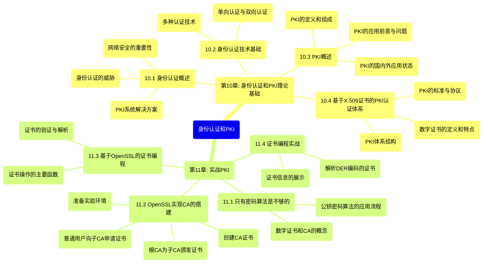

[toc]
# 密码系统设计

## 第七周预习报告 
### 学习内容
- [《Windows C/C++加密解密实战》](https://weread.qq.com/web/bookDetail/a0332190813ab78fag011422?wfrom=bookDetailH5)第 10，11章
    - 重点第 11 章 
- [课程 mindmap](https://www.processon.com/mindmap/66bcf83cce68f62ecf3f63fc?from=pwa)
- 报告内容参考第一周

### AI 对学习内容的总结（1分）
#### 要求
- 让AI（kimi，元宝等）阅读学习内容并进行总结，教材内容可以使用微信读书或者云班课电子教材
#### 总结

- [GPT4.0mini:对《Windows C/C++加密解密实战》第10、11章的总结](https://share.aichatos58.com/#/share/1351f0e928de4cdca4f2e022bd55e65b)
  ```
  第10章：身份认证和PKI理论基础
  本章主要介绍了身份认证的重要性及公钥基础设施（PKI）的基本概念。随着网络技术的发展，网络安全问题日益凸显，身份认证技术成为保障网络安全的关键。PKI作为一种解决方案，提供了通用的信息安全服务，促进了网络应用的安全性。尽管PKI技术取得了一定进展，但仍面临一些问题，如属性证书、漫游证书的管理、密码分析攻击等。章节还强调了身份认证过程中的隐私保护和认证服务器的安全性。
  第11章：实战PKI
  本章深入探讨了PKI的实际应用，特别是如何在代码中实现证书的签名算法判断。通过定义函数来获取证书中的签名算法，并将解析后的信息存储到全局字符串中，展示了PKI在实际编程中的应用。章节还提到了一些PKI技术的现状和发展趋势，包括对现有问题的解决方案和未来研究方向，如X.509属性证书和漫游证书的改进。
  总体而言，这两章强调了身份认证和PKI在网络安全中的重要性，探讨了技术实现和面临的挑战，以及未来的发展方向。

  当然可以！以下是对第10章和第11章内容的详细总结：
  第10章：身份认证和PKI理论基础

  1.身份认证的重要性：


  2.随着互联网的普及，身份认证成为确保网络安全的关键环节。有效的身份认证可以防止未授权访问和信息泄露。


  3.公钥基础设施（PKI）概述：


  4.PKI是一种用于管理数字证书和公钥加密的框架，提供身份验证、数据完整性和不可否认性等安全服务。
  5.PKI的核心组件包括证书颁发机构（CA）、注册机构（RA）、证书存储和证书撤销列表（CRL）。


  6.PKI面临的挑战：


  7.属性证书和漫游证书：如何有效管理和验证属性证书以及支持用户在不同环境中的身份认证。
  8.密码分析攻击：随着计算能力的提升，传统密码算法可能面临被破解的风险，需采用更强的加密算法。


  9.隐私保护：


  10.在身份认证过程中，需要平衡用户隐私与身份验证的需求，确保用户信息不被滥用。


  11.认证服务器的安全性：


  12.认证服务器必须具备高安全性，以防止被攻击者利用，确保其提供的身份认证服务的可靠性。

  第11章：实战PKI

  13.PKI的实际应用：


  14.本章通过具体实例展示了如何在编程中实现PKI，特别是如何使用代码来处理证书的签名算法。


  15.证书签名算法的实现：


  16.介绍了如何定义函数来获取证书中的签名算法，并解析相关信息，将其存储在全局字符串中，便于后续使用。


  17.当前PKI技术现状：


  18.讨论了PKI技术在实际应用中的现状，包括对现有问题的解决方案和未来研究方向。


  19.未来发展方向：


  20.强调了对X.509属性证书和漫游证书的改进，提出了PKI技术在未来可能的演变和应用场景。


  21.实验环境的搭建：


  22.描述了搭建PKI实验环境的步骤，包括准备虚拟机、配置CA环境、生成自签名证书等，展示了PKI的实际操作过程。

  总结
  第10章和第11章共同强调了身份认证和PKI在网络安全中的重要性，探讨了技术实现、面临的挑战以及未来的发展方向。通过理论与实践的结合，读者能够更深入地理解PKI的工作原理及其在实际应用中的重要性。
  ```


- [kimi：对《Windows C/C++加密解密实战》第10、11章的总结](https://kimi.moonshot.cn/share/csbp5fm0atp5turg0jq0)
  ```
  User: 请为我总结文档内容 

  Kimi: 这份文档包含了两个章节的内容，分别是第10章和第11章，主题聚焦于身份认证和公钥基础设施（PKI）的理论基础及实战应用。

  ### 第10章：身份认证和PKI理论基础

  **10.1 身份认证概述**
  - 讨论了计算机网络技术发展下网络安全的重要性，特别是身份认证在其中的作用。
  - 介绍了公钥基础设施（PKI）作为一套完整的身份认证系统解决方案。
  - 探讨了网络安全的多个方面，包括数据机密性、数据完整性、身份认证、授权控制和审计。
  - 强调了身份认证在网络安全中的核心地位，以及面临的威胁，如中间人攻击、重放攻击、密码分析攻击等。

  **10.2 身份认证技术基础**
  - 描述了身份认证的基本理论，包括单向认证、双向认证、秘密支持证明、物理介质证明等。
  - 讨论了多种身份认证技术，包括基于口令的认证、智能卡认证、生物特征认证、动态口令认证和USB Key认证。

  **10.3 PKI概述**
  - 详细介绍了PKI的概念、组成部分和功能，以及它在国内外的应用状态。
  - 探讨了PKI的应用前景、存在的问题和发展趋势。

  **10.4 基于X.509证书的PKI认证体系**
  - 深入讲解了X.509证书的定义、特点、格式和数字信封技术。
  - 描述了PKI体系结构，包括认证中心（CA）、注册机构（RA）、证书库等。
  - 讨论了PKI的标准与协议，以及认证机构（CA）的组成和功能。

  ### 第11章：实战PKI

  **11.1 只有密码算法是不够的**
  - 讨论了公钥密码算法的应用流程，以及在实际应用中存在的安全问题。
  - 介绍了数字证书的概念，以及如何通过证书认证中心（CA）来解决公钥归属问题。

  **11.2 OpenSSL实现CA的搭建**
  - 描述了如何使用OpenSSL在Linux环境下搭建CA系统，包括根CA和子CA的创建和证书的申请与分发。
  - 提供了详细的步骤和命令，用于生成私钥、自签名证书、证书请求文件，以及如何签发和颁发证书。

  **11.3 基于OpenSSL的证书编程**
  - 介绍了如何使用OpenSSL库进行证书操作，包括证书的验证、解析等。
  - 详细描述了OpenSSL中涉及证书操作的主要函数和它们的用途。

  **11.4 证书编程实战**
  - 提供了一个实际的例子，展示了如何解析一个DER编码的RSA证书。
  - 包含了用于证书解析的代码示例，以及如何使用OpenSSL函数获取证书的详细信息。

  整体而言，这份文档为读者提供了关于身份认证和PKI的全面介绍，从理论基础到实战应用，涵盖了技术细节和实际操作步骤。 
  ```

- [对《Windows C/C++加密解密实战》第10、11章的总结](https://lxblog.com/qianwen/share?shareId=a3f62b94-e79b-41bf-91e3-4d3776d83924)
  ```
  你上传的文档《第10章 身份认证和PKI理论基础》主要涵盖了身份认证技术和公钥基础设施（PKI）的基本概念、重要性以及相关的安全问题。以下是文档内容的总结：

  ### 10.1 身份认证概述
  - **网络安全与身份认证**：随着网络技术的发展，网络安全变得越来越重要。身份认证是网络安全的第一道门槛，用于验证网络通信双方的身份。身份认证为其他安全技术如访问控制、计费等提供基础。
  - **身份认证的重要性**：身份认证是网络安全系统中的关键环节，一旦被攻破，整个系统的安全措施将失效。因此，研究和应用身份认证技术非常重要。

  ### 10.1.2 网络环境下身份认证所面临的威胁
  - **中间人攻击**：非法用户截获并修改信息，或者冒充合法用户发送信息。
  - **重放攻击**：第三方获取认证信息后重新发送，以实现身份伪造或破坏同步性。
  - **密码分析攻击**：通过密码分析破译口令或身份信息。
  - **口令猜测攻击**：利用计算机猜测用户的口令字。
  - **身份信息的暴露**：认证过程中暴露身份信息可能导致隐私泄露。
  - **对认证服务器的攻击**：认证服务器是安全的关键所在，如果被攻破后果严重。

  ### 10.4 基于X.509证书的PKI认证体系
  - **数字证书**：
    - **基本定义**：数字证书是包含用户身份信息、公钥信息及认证机构签名的数据文件，用于在网络中验证身份。
    - **特点**：数字证书是PKI体系的核心元素，是权威的电子文档，用于证明网上身份，并作为公钥的载体。
    - **格式**：数字证书遵循ITU-T X.509国际标准，包含公开密钥、名称、有效期、序列号等信息。

  ### 10.4.1 数字证书
  - **基本定义**：数字证书是一种在互联网上验证身份的方式，由权威的证书授权机构发行，包含公开密钥拥有者的信息及公钥。
  - **特点**：数字证书是PKI体系的核心组成部分，具有权威性和法律效力，用于证明网上身份。
  - **格式**：数字证书遵循X.509标准，包含多个字段，如版本号、序列号、签名算法、颁发者、有效日期、主体、主体公钥信息等。

  ### 10.4.2 强身份认证协议
  - **双向鉴别**：允许通信双方验证对方的身份，通常包括时间戳和现时值。
  - **三向认证**：增加从A到B的消息，避免使用时间戳，通过现时值来检测重放攻击。

  ### 11.1 只有密码算法是不够的
  - **公钥密码算法的应用流程**：生成密钥对、公钥公开、加密消息、解密消息。
  - **公钥归属问题**：需要解决如何正确地获取对方的公钥，防止中间人攻击。
  - **数字证书的概念**：由证书认证中心签发，包含持有者的公钥数据与其身份信息，并进行数字签名，确保不可篡改。

  ### 总结
  文档详细介绍了身份认证和PKI的基本概念、重要性以及面临的安全威胁，并讨论了数字证书的作用和格式。此外，还介绍了强身份认证协议和公钥密码算法的实际应用，强调了数字证书在解决公钥归属问题中的重要作用。
  ```

### 对 AI 总结的反思与补充（2分）
#### 要求
- AI总结的问题
- 自己的补充
#### 反思与补充

- AI总结的问题
  - 通义千问直接忽视了第11章的内容，对长文本的结构把握的不是很好
  - GPT4.0 mini介绍的很简略，内容和结构都不太好
- 自己的补充
  - 在讨论PKI的应用前景时，可以进一步探讨PKI在实际部署中面临的挑战，如证书的管理和分发、跨域认证问题、以及如何防范和应对潜在的安全威胁。
  - 在介绍PKI体系结构时，除了认证中心（CA）、注册机构（RA）、证书库，还可以补充其他重要组件如证书撤销列表（CRL）和在线证书状态协议（OCSP），这些组件对于确保PKI体系的安全性和有效性至关重要。

### 学习思维导图（2分）
#### 要求
- Mermaid 代码与截图(参考[Mermaid MindMap语法](https://mermaid.live/edit#pako:eNpdUk1vwjAM_StWTiAx7V5Nk2A7DoEGu_ViUreN1tqZkyB1iP--8FG2kZP93svTk-2DsVKRKUzvuOrRlwygInEyuQLT6QkCWKlrHIdLA_Am3EDrQhQdRqwonBWe1Ag1PuxEPqcjsxafOlQXMDrhEQVYqIsutOAvPPgw2FY6aQbAFFtR2AoPsEjfeP31ToFQbTt6rBiorslGt2cK4Wmnj8_IFdSEMSmFP7p5itLnABas0l2Qj_ArvbyXs2ZPEMm27L7SvWATFSM12c53yOy4-c_PtUk9cYQ8RH9jtyLdzWhNDKewHj3pCC5Je3SVmZn-WhXmcCJLE1vqqTRFLiuqMXWxNCUfszRPSzYDW1NETTQzKqlpTVFjF3KXfJWjvjpsFPtRQpXLy1tetn8-guMPMYioGg))**或者**提交思维导图链接（如果使用线上编辑器，推荐[processon](https://www.processon.com/),[xmind](https://xmind.cn/),...）
#### 思维导图



### 基于 AI 的学习（2分）
#### 要求
- 至少找到自己理解不是太好 2 个概念，让 AI 对自己进行苏格拉底提问
- 参考下面提示语或者使用 AI Agent

提示词：“我在学习XXX知识点，请你以苏格拉底的方式对我进行提问，一次一个问题”
1. 核心是要求AI工具：“请你以苏格拉底的方式对我进行提问”
2. 然后AI工具就会给你提问，如果不知道问题的答案，可以反问AI：“你的理解是什么？”
3. 如果你觉得差不多了，可以先问问AI工具：“针对这个知识点，我理解了吗？”
4. AI工具会给出它的判断，如果你也觉得自己想清楚了，可以最后问AI工具：“我的回答结束了，请对我的回答进行评价总结”，让它帮你总结一下。

#### 学习内容

- [学习基于OpenSSL的证书编程知识点](https://kimi.moonshot.cn/share/csbpi11hmfr3frs4q050)
  ```
        User: 我在学习基于OpenSSL的证书编程知识点时遇到了一些困难，请你以苏格拉底的方式对我进行提问，一次一个问题 

        Kimi: 当然可以，让我们开始吧。首先，你能告诉我你了解OpenSSL是什么吗？ 

        User: 当然可以。OpenSSL 是一个开源的软件库，提供了强大的加密功能和安全协议实现。它广泛用于互联网上的各种安全应用中，包括但不限于：

        1. **加密算法**：OpenSSL 支持多种加密算法，如对称加密（AES、DES等）、非对称加密（RSA、DSA、ECDSA等）以及哈希函数（SHA-256、MD5等）。

        2. **证书管理**：OpenSSL 提供了生成、签发、解析和验证X.509数字证书的功能。这使得它在公钥基础设施（PKI）中扮演重要角色，支持创建自签名证书、证书请求（CSR）和证书颁发机构（CA）。

        3. **SSL/TLS协议**：OpenSSL 实现了SSL（Secure Sockets Layer）和TLS（Transport Layer Security）协议，这些协议用于保护网络通信的安全性。许多Web服务器（如Apache、Nginx）和客户端都使用OpenSSL来实现HTTPS。

        4. **命令行工具**：OpenSSL 提供了一个丰富的命令行工具集，可以用来进行密钥和证书的管理、数据加密和解密、散列计算、随机数生成等操作。

        5. **库接口**：除了命令行工具，OpenSSL 还提供了一套全面的API，开发者可以在自己的应用程序中调用这些API来实现加密和安全功能。

        ### 常见用途

        - **生成密钥和证书**：
          - 生成私钥：`openssl genpkey -algorithm RSA -out private.key`
          - 生成证书请求（CSR）：`openssl req -new -key private.key -out request.csr`
          - 生成自签名证书：`openssl req -x509 -new -key private.key -out certificate.crt`

        - **证书和密钥管理**：
          - 查看证书信息：`openssl x509 -in certificate.crt -text -noout`
          - 转换证书格式：`openssl x509 -in certificate.crt -outform der -out certificate.der`

        - **数据加密和解密**：
          - 对文件进行加密：`openssl enc -aes-256-cbc -in plaintext.txt -out encrypted.bin -pass pass:yourpassword`
          - 对文件进行解密：`openssl enc -d -aes-256-cbc -in encrypted.bin -out decrypted.txt -pass pass:yourpassword`

        - **SSL/TLS连接**：
          - 测试SSL/TLS连接：`openssl s_client -connect example.com:443`

        ### 安全性和更新

        由于OpenSSL被广泛使用，其安全性非常重要。历史上，OpenSSL曾出现过一些严重的安全漏洞，如Heartbleed漏洞。因此，保持OpenSSL的最新版本并定期检查安全更新是非常重要的。
        ### 总结

        OpenSSL是一个功能强大且广泛应用的加密库，支持多种加密算法、证书管理和SSL/TLS协议。无论是作为命令行工具还是通过API集成到应用程序中，OpenSSL都是实现网络安全的重要工具。 

        Kimi: 很好，你已经对OpenSSL有了相当全面的了解。现在，让我们更深入一些。在证书管理方面，OpenSSL如何处理证书的签发和验证过程？你能描述一下这个过程吗？ 

        User: OpenSSL 是一个强大的工具，可以用来处理证书的签发和验证过程。下面是 OpenSSL 在证书管理方面如何处理证书签发和验证的具体步骤：

        ### 证书签发过程

        1. **生成私钥**：
          - 使用 `openssl genpkey` 或 `openssl genrsa` 命令生成一个私钥。
          ```bash
          openssl genpkey -algorithm RSA -out private.key
          ```

        2. **生成证书签名请求 (CSR)**：
          - 使用私钥生成一个证书签名请求（CSR），其中包含公钥和其他身份信息。
          ```bash
          openssl req -new -key private.key -out request.csr
          ```
          - 在生成 CSR 的过程中，你需要填写一些信息，如国家、省份、组织名称等。
        
        3. **签署证书**：
          - 如果你有一个证书颁发机构（CA），你可以使用 CA 的私钥来签署这个 CSR，生成最终的证书。
          ```bash
          openssl x509 -req -in request.csr -CA ca_certificate.crt -CAkey ca_private.key -CAcreateserial -out certificate.crt -days 365
          ```
          - 这里，`ca_certificate.crt` 是 CA 的证书，`ca_private.key` 是 CA 的私钥，`-CAcreateserial` 选项会创建一个新的序列号文件，`-days 365` 表示证书的有效期为365天。

        4. **自签名证书**：
          - 如果没有 CA，你可以生成一个自签名证书。
          ```bash
          openssl req -x509 -new -key private.key -out self_signed_certificate.crt -days 365
          ```

        ### 证书验证过程

        1. **获取证书链**：
          - 确保你有完整的证书链，包括中间证书和根证书。这些证书通常由 CA 提供。

        2. **验证证书**：
          - 使用 `openssl verify` 命令来验证证书的有效性。
          ```bash
          openssl verify -CAfile ca_certificate.crt -untrusted intermediate_certificate.crt certificate.crt
          ```
          - `-CAfile` 指定根证书，`-untrusted` 指定中间证书，最后是你要验证的证书。

        3. **检查证书吊销列表 (CRL)**：
          - 你可以使用 `openssl crl` 命令来下载和检查 CRL 文件，以确保证书没有被撤销。
          ```bash
          openssl crl -in crl.pem -noout -text
          ```

        4. **在线证书状态协议 (OCSP)**：
          - 你可以使用 OCSP 来实时检查证书的状态。
          ```bash
          openssl ocsp -issuer ca_certificate.crt -cert certificate.crt -url http://ocsp.example.com  
          ```

        ### 示例流程

        假设你已经有一个 CA 证书 (`ca_certificate.crt`) 和 CA 私钥 (`ca_private.key`)，并且你想为某个实体签发一个证书。

        1. **生成实体的私钥**：
          ```bash
          openssl genpkey -algorithm RSA -out entity_private.key
          ```

        2. **生成证书签名请求 (CSR)**：
          ```bash
          openssl req -new -key entity_private.key -out entity_request.csr
          ```

        3. **签署证书**：
          ```bash
          openssl x509 -req -in entity_request.csr -CA ca_certificate.crt -CAkey ca_private.key -CAcreateserial -out entity_certificate.crt -days 365
          ```

        4. **验证证书**：
          ```bash
          openssl verify -CAfile ca_certificate.crt entity_certificate.crt
          ```
        ### 总结

        - **证书签发**：生成私钥，创建 CSR，然后使用 CA 的私钥签署 CSR 生成最终证书。
        - **证书验证**：使用 `openssl verify` 命令验证证书的有效性，并通过 CRL 或 OCSP 检查证书是否被撤销。

        通过这些步骤，OpenSSL 可以有效地管理和验证数字证书，确保通信的安全性和完整性。 

        Kimi: 现在，让我们回到你正在学习的内容。你已经了解了如何使用OpenSSL进行证书的签发和验证，这是非常重要的。我的下一个问题可能会帮助你更深入地理解这个主题：在使用OpenSSL进行证书验证时，你如何确保证书链的完整性和信任度？你能描述一下这个过程吗？ 

        User: 在使用 OpenSSL 进行证书验证时，确保证书链的完整性和信任度是非常重要的。证书链通常包括终端实体证书、一个或多个中间证书以及根证书。验证过程需要确保每个证书都是由可信的 CA 签发，并且整个链是完整的。以下是详细的过程描述：

        ### 1. 准备证书和密钥
        - **终端实体证书**：这是你要验证的证书。
        - **中间证书**：这些证书链接终端实体证书到根证书。
        - **根证书**：这是最顶层的证书，由一个广泛认可的 CA 签发。

        ### 2. 验证证书链

        #### 2.1 使用 `openssl verify` 命令
        OpenSSL 提供了 `openssl verify` 命令来验证证书链。这个命令会检查证书链中的每个证书是否有效，并且是否最终链接到一个受信任的根证书。

        ##### 基本用法
        ```bash
        openssl verify -CAfile root_certificate.crt -untrusted intermediate_certificate.crt terminal_certificate.crt
        ```

        - `-CAfile`：指定根证书文件。
        - `-untrusted`：指定中间证书文件。
        - `terminal_certificate.crt`：指定要验证的终端实体证书。

        ##### 示例
        假设你有以下文件：
        - `root_certificate.crt`：根证书
        - `intermediate_certificate.crt`：中间证书
        - `terminal_certificate.crt`：终端实体证书

        你可以运行以下命令来验证证书链：
        ```bash
        openssl verify -CAfile root_certificate.crt -untrusted intermediate_certificate.crt terminal_certificate.crt
        ```

        如果证书链是完整的并且所有证书都有效，你会看到类似以下的输出：
        ```
        terminal_certificate.crt: OK
        ```

        如果证书链不完整或有任何问题，你会看到错误信息。

        #### 2.2 检查 CRL 和 OCSP
        为了进一步确保证书没有被撤销，你可以检查证书吊销列表（CRL）或使用在线证书状态协议（OCSP）。

        ##### 检查 CRL
        ```bash
        openssl crl -in crl.pem -noout -text
        ```

        - `crl.pem`：CRL 文件。

        ##### 使用 OCSP
        ```bash
        openssl ocsp -issuer ca_certificate.crt -cert terminal_certificate.crt -url http://ocsp.example.com  
        ```

        - `-issuer`：指定签发者证书（通常是中间证书或根证书）。
        - `-cert`：指定要验证的终端实体证书。
        - `-url`：指定 OCSP 服务器的 URL。

        ### 3. 构建完整的证书链

        有时候，证书链可能不完整，缺少某些中间证书。你可以通过以下步骤构建完整的证书链：

        #### 3.1 获取中间证书
        如果你没有中间证书，可以从 CA 的网站下载，或者从终端实体证书中提取。

        ##### 从终端实体证书中提取
        ```bash
        openssl x509 -in terminal_certificate.crt -noout -text | grep "CA Issuers" -A 1
        ```

        这将显示签发该证书的 CA 的 URL。你可以访问该 URL 下载中间证书。

        #### 3.2 合并证书链
        将所有证书合并到一个文件中，顺序是从终端实体证书到根证书。

        ```bash
        cat terminal_certificate.crt intermediate_certificate.crt root_certificate.crt > full_chain.crt
        ```

        ### 4. 验证完整的证书链
        使用 `openssl verify` 命令验证完整的证书链：

        ```bash
        openssl verify -CAfile root_certificate.crt -untrusted intermediate_certificate.crt terminal_certificate.crt
        ```

        ### 总结

        1. **准备证书和密钥**：确保你有终端实体证书、中间证书和根证书。
        2. **使用 `openssl verify` 命令**：验证证书链的完整性和有效性。
        3. **检查 CRL 和 OCSP**：确保证书没有被撤销。
        4. **构建完整的证书链**：如果证书链不完整，获取缺失的中间证书并合并到一个文件中。
        5. **验证完整的证书链**：再次使用 `openssl verify` 命令进行验证。

        通过这些步骤，你可以确保证书链的完整性和信任度，从而提高系统的安全性。 

        ```
    ```
- [学习DER编码知识点](https://kimi.moonshot.cn/share/csbpnoq8t5h8lsqn6okg)
  ```
        User: 我在学习DER编码知识点时遇到了一些困难，请你以苏格拉底的方式对我进行提问，一次一个问题，不超过3个问题 

        Kimi: 当然可以，让我们开始吧。首先，你能告诉我什么是DER编码吗？ 

        User: 当然可以。DER（Distinguished Encoding Rules）是一种用于编码ASN.1（Abstract Syntax Notation One）数据的二进制格式。ASN.1是一种描述数据结构的标准，广泛用于定义网络协议、证书和其他安全相关的数据结构。DER是ASN.1的一种特定编码规则，它提供了一种将ASN.1数据结构转换为二进制格式的方法。

        ### 主要特点

        1. **二进制格式**：DER编码是二进制的，因此它比文本格式更紧凑，适合在网络传输和存储中使用。
        2. **唯一性**：对于给定的ASN.1数据结构，DER编码的结果是唯一的。这意味着相同的ASN.1数据结构总是会被编码成相同的二进制序列。
        3. **自描述**：DER编码的数据是自描述的，即数据本身包含了类型信息，使得解码器能够正确解析数据。

        ### 常见应用

        - **数字证书**：X.509数字证书通常以DER格式进行编码。例如，`.crt`文件通常是DER编码的。
        - **PKCS#7**：PKCS#7标准中的签名和加密消息也常用DER编码。
        - **公钥和私钥**：公钥和私钥也可以用DER格式进行编码，例如在PEM格式中，实际的内容是DER编码的数据，只是外面包裹了Base64编码和一些头部信息。

        ### 与PEM格式的对比

        - **PEM**：PEM（Privacy Enhanced Mail）格式是基于Base64编码的文本格式，通常用于证书和密钥的存储和传输。PEM格式的数据以 `-----BEGIN CERTIFICATE-----` 开头，以 `-----END CERTIFICATE-----` 结尾，中间是Base64编码的DER数据。
        - **DER**：DER格式是纯二进制的，没有Base64编码和额外的文本标记。

        ### 转换示例

        假设你有一个PEM格式的证书文件 `certificate.pem`，你可以使用OpenSSL将其转换为DER格式：

        ```bash
        openssl x509 -in certificate.pem -outform der -out certificate.der
        ```

        反过来，如果你有一个DER格式的证书文件 `certificate.der`，你可以将其转换为PEM格式：

        ```bash
        openssl x509 -in certificate.der -inform der -out certificate.pem
        ```

        ### 示例

        假设你有一个简单的X.509证书，其内容如下（PEM格式）：

        ```pem
        -----BEGIN CERTIFICATE-----
        MIIDXTCCAkWgAwIBAgIJAKGQvVwLz88jMA0GCSqGSIb3DQEBCwUAMEUxCzAJBgNV
        ...
        -----END CERTIFICATE-----
        ```

        使用OpenSSL将其转换为DER格式：

        ```bash
        openssl x509 -in certificate.pem -outform der -out certificate.der
        ```

        生成的 `certificate.der` 文件将是二进制格式，可以直接用于需要DER编码的场景。

        ### 总结

        DER编码是一种二进制格式，用于表示ASN.1数据结构。它在安全性相关领域广泛应用，特别是在数字证书和密钥管理中。相比于PEM格式，DER编码更加紧凑且唯一，但不便于人类直接阅读。通过OpenSSL等工具，可以方便地在PEM和DER格式之间进行转换。 

        Kimi: 很好，你已经对DER编码有了基本的了解。我的下一个问题可能会帮助你进一步深化你的知识：你能描述一下DER编码和PEM编码之间的区别吗？ 

        User: 当然可以。DER（Distinguished Encoding Rules）和PEM（Privacy Enhanced Mail）是两种常用的编码格式，用于表示证书、密钥和其他安全相关的数据结构。它们的主要区别在于编码方式、可读性和使用场景。

        ### DER编码

        **定义**：
        - **DER** 是一种二进制编码规则，它是ASN.1（Abstract Syntax Notation One）标准的一部分。
        - DER 编码是自描述的，即数据本身包含了类型信息，使得解码器能够正确解析数据。

        **特点**：
        - **二进制格式**：DER 编码的数据是纯二进制的，不包含任何文本标记。
        - **紧凑性**：由于是二进制格式，DER 编码的数据比文本格式更紧凑，适合在网络传输和存储中使用。
        - **唯一性**：对于给定的ASN.1数据结构，DER 编码的结果是唯一的。这意味着相同的ASN.1数据结构总是会被编码成相同的二进制序列。
        - **不可读性**：DER 编码的数据对人类来说是不可读的，通常需要专门的工具来查看和处理。

        **常见应用**：
        - X.509数字证书（`.crt`文件通常是DER编码的）。
        - PKCS#7签名和加密消息。
        - 公钥和私钥的二进制表示。

        ### PEM编码

        **定义**：
        - **PEM** 是一种基于Base64编码的文本格式，它将二进制数据转换为ASCII文本，便于在邮件和其他文本系统中传输。
        - PEM 格式的数据通常以 `-----BEGIN CERTIFICATE-----` 开头，以 `-----END CERTIFICATE-----` 结尾，中间是Base64编码的DER数据。

        **特点**：
        - **文本格式**：PEM 编码的数据是基于文本的，易于阅读和编辑。
        - **Base64编码**：PEM 使用Base64编码将二进制数据转换为ASCII字符，确保数据可以在文本环境中传输。
        - **可读性**：PEM 编码的数据对人类来说是可读的，可以通过文本编辑器查看。
        - **头部和尾部标记**：PEM 数据通常包含头部和尾部标记，这些标记标识了数据的类型，例如 `-----BEGIN CERTIFICATE-----` 和 `-----END CERTIFICATE-----`。

        **常见应用**：
        - X.509数字证书（`.pem`文件通常是PEM编码的）。
        - 私钥文件（`.key`文件通常是PEM编码的）。
        - 证书请求（CSR）文件。


        ### 总结

        - **DER** 是二进制格式，适用于网络传输和存储，但对人类来说不可读。
        - **PEM** 是基于Base64编码的文本格式，易于阅读和编辑，适用于文本环境中的传输。

        这两种格式各有优劣，选择哪种格式取决于具体的应用场景和需求。在实际使用中，可以根据需要在这两种格式之间进行转换。 

        Kimi: 非常好，你已经很清楚地区分了DER和PEM格式。最后一个问题：在实际应用中，我们如何将PEM格式的证书转换为DER格式，以及为什么要进行这样的转换？ 

        User: 在实际应用中，将PEM格式的证书转换为DER格式是一个常见的需求。这种转换通常用于确保证书在不同系统和应用程序之间的兼容性。下面是如何进行这种转换以及为什么要进行这种转换的详细说明。

        ### 如何将PEM格式的证书转换为DER格式

        使用OpenSSL工具可以很容易地将PEM格式的证书转换为DER格式。以下是具体步骤：

        1. **安装OpenSSL**（如果还没有安装）：
          - 在Debian/Ubuntu系统上：
            ```bash
            sudo apt-get install openssl
            ```
          - 在CentOS/RHEL系统上：
            ```bash
            sudo yum install openssl
            ```

        2. **转换证书**：
          假设你有一个PEM格式的证书文件 `certificate.pem`，你可以使用以下命令将其转换为DER格式：

          ```bash
          openssl x509 -in certificate.pem -outform der -out certificate.der
          ```

          其中：
          - `-in certificate.pem`：指定输入的PEM格式证书文件。
          - `-outform der`：指定输出格式为DER。
          - `-out certificate.der`：指定输出的DER格式证书文件名。

        ### 为什么要进行这样的转换

        #### 1. **兼容性和互操作性**
        - **不同的系统和库**：某些系统和库可能只支持特定的证书格式。例如，某些嵌入式设备或安全硬件模块可能要求证书以DER格式提供。
        - **标准和规范**：某些行业标准或规范可能明确要求使用某种格式。例如，某些网络协议或安全标准可能规定证书必须是DER编码的。

        #### 2. **性能和效率**
        - **二进制格式**：DER格式是二进制的，比PEM格式更紧凑，占用更少的存储空间。在网络传输时，DER格式的数据量较小，可以提高传输效率。
        - **处理速度**：对于某些应用程序来说，处理二进制数据可能比处理Base64编码的文本数据更快，尤其是在需要频繁解析和验证证书的场景中。

        #### 3. **安全性和完整性**
        - **不可读性**：DER格式的数据对人类来说是不可读的，这有助于防止敏感信息被直接查看。虽然这不是主要的安全措施，但可以增加一层额外的保护。
        - **唯一性**：对于给定的ASN.1数据结构，DER编码的结果是唯一的。这意味着相同的ASN.1数据结构总是会被编码成相同的二进制序列，这对于某些安全应用来说是非常重要的。

        ### 示例

        假设你有一个PEM格式的证书文件 `certificate.pem`，内容如下：

        ```pem
        -----BEGIN CERTIFICATE-----
        MIIDXTCCAkWgAwIBAgIJAKGQvVwLz88jMA0GCSqGSIb3DQEBCwUAMEUxCzAJBgNV
        ...
        -----END CERTIFICATE-----
        ```

        你可以使用以下命令将其转换为DER格式：

        ```bash
        openssl x509 -in certificate.pem -outform der -out certificate.der
        ```

        转换后的 `certificate.der` 文件将是二进制格式，可以直接用于需要DER编码的场景。

        ### 总结

        将PEM格式的证书转换为DER格式的主要原因是确保证书在不同系统和应用程序之间的兼容性、提高性能和效率，以及满足某些标准和规范的要求。通过使用OpenSSL工具，可以轻松完成这种转换。 

        Kimi: 非常好，你已经掌握了DER编码和PEM编码之间的转换及其重要性。如果你有任何其他问题或需要进一步的解释，请随时告诉我。 

  ```


### 学习实践过程遇到的问题与解决方式（AI 驱动，优先使用AI工具解决问题）（2分）

- 问题 1:在预习实验时，不知道怎么填充文件，解决过程：询问AI填充的方法，获得python代码：
  - [AI的回答](https://lxblog.com/qianwen/share?shareId=bb446609-869b-4e53-97f9-029409823349)
- 问题 2:在预习实验时，不是很理解代码的含义，解决过程：
  - 让AI解释函数的实现方式与具体作用
  - 同时让其为我编写测试用例，在测试中理解代码功能
  - [AI的回答](https://share.aichatos58.com/#/share/79dba2b29b3f4c9ba2f1ca467eaf9967)

### 作业提交要求（1分）

1. 提交Markdown 文件,文档命名“学号姓名《密码系统设计》.md”
2. 提交Markdown 文件转为 PDF,文档命名“学号姓名《密码系统设计》第 X 周.pdf”
3. 提交代码托管链接：[我的作业的github链接](https://github.com/youer0219/Information-Security-System-Design-Assignment) 
4. 内容质量高有加分

### 参考资料
- AI工具(你使用的AI工具及其链接)
  - [Kimi](https://kimi.moonshot.cn/)
  - [文心一言](https://yiyan.baidu.com/)
  - [通义千问](https://tongyi.aliyun.com/)
  - [豆包](https://www.doubao.com/chat/)
  - [GPT4.0](https://iai.aichatos8.com.cn/#/home)
- 图书
  - [《Windows C/C++加密解密实战》](https://weread.qq.com/web/bookDetail/a0332190813ab78fag011422?wfrom=bookDetailH5)
  - [Head First C 嗨翻 C 语言](https://www.ituring.com.cn/book/1004)
