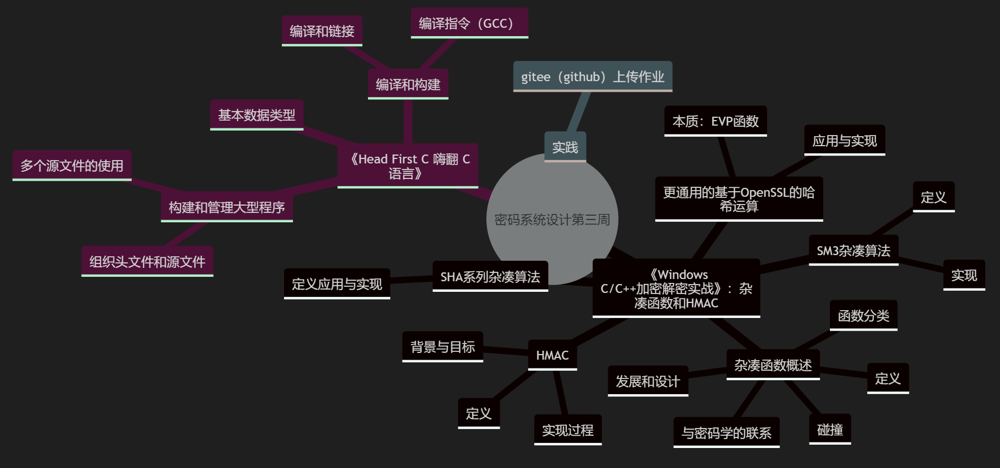

[toc]
# 密码系统设计

## 第三周预习报告 
### 学习内容
- [Head First C 嗨翻 C 语言](https://www.ituring.com.cn/book/1004) 第4章
- [《Windows C/C++加密解密实战》](https://weread.qq.com/web/bookDetail/a0332190813ab78fag011422?wfrom=bookDetailH5)第4章
    -  重点 4.2,4.3, 4.5
- [课程 mindmap](https://www.processon.com/mindmap/66bcf83cce68f62ecf3f63fc?from=pwa)
- 报告内容参考第一周

### AI 对学习内容的总结（1分）
#### 要求
- 让AI（kimi，元宝等）阅读学习内容并进行总结，教材内容可以使用微信读书或者云班课电子教材
#### 总结

- [对《Windows C/C++加密解密实战》第四章的总结](https://kimi.moonshot.cn/share/crnmp12eseponthde8kg)：
  ```
  User: 请阅读学习《Windows C/C++加密解密实战》第四章内容并进行总结 

  Kimi: 《Windows C/C++加密解密实战》第四章主要介绍了杂凑函数和HMAC的相关知识。以下是对本章内容的总结：

  1. **杂凑函数概述**：
    - 杂凑函数（Hash Function）将任意长度的输入数据转换为固定长度的输出（哈希值）。
    - 杂凑函数在信息安全中用于数据完整性验证、数字签名等。
    - 安全的杂凑函数应具备单向性、抗碰撞性等特性。

  2. **密码学和杂凑函数**：
    - 杂凑函数在密码学中的应用包括消息认证、数字签名等。
    - 杂凑函数的发展与密码学的进步紧密相关。

  3. **杂凑函数的发展**：
    - 杂凑函数从20世纪70年代末开始被引入密码学。
    - 随着技术的发展，杂凑函数的设计和应用不断演进。

  4. **杂凑函数的设计**：
    - 杂凑函数设计分为基于分组密码的杂凑函数和直接构造的杂凑函数。
    - 迭代型杂凑函数是常见的设计方式。

  5. **杂凑函数的分类**：
    - 杂凑函数分为不带密钥的（如MD5、SHA-1）和带密钥的（如HMAC）。

  6. **杂凑函数的碰撞**：
    - 碰撞是指不同的输入产生相同的杂凑值，这在安全上是不可接受的。

  7. **SM3杂凑算法**：
    - SM3是中国国家密码管理局公布的密码杂凑算法标准。
    - SM3算法采用Merkle-Damgård结构，输出256比特的杂凑值。

  8. **HMAC**：
    - HMAC（Hash-Based Message Authentication Code）是一种基于哈希函数和密钥的消息认证码。
    - HMAC结合了密钥和哈希函数，提供了数据完整性和认证功能。

  9. **Base64编码**：
    - Base64编码用于将二进制数据转换为ASCII字符串，常用于电子邮件等场景。

  10. **PEM文件**：
      - PEM（Privacy Enhanced Mail）文件是一种文本文件格式，用于存储加密材料，如证书和私钥。

  11. **ASN.1和DER**：
      - ASN.1（Abstract Syntax Notation One）是一种数据描述语言，用于描述数据结构。
      - DER（Distinguished Encoding Rules）是ASN.1的一种编码方式，用于确保数据结构的唯一编码。

  本章内容涵盖了杂凑函数的基本概念、设计原则、应用场景以及具体的算法实例（如SM3），同时介绍了HMAC、Base64编码和PEM文件格式，以及ASN.1和DER在数据传输中的应用。这些知识点对于理解和实现加密解密技术非常重要。 
  ```

- [对《Head First C 嗨翻 C 语言》第四章的总结](https://kimi.moonshot.cn/share/crrn27r4ukfetusco1d0)：
  ```
  User: 请阅读这本书的第4章节Break it down, build it up内容并总结 

  Kimi: 第4章节“Break it down, build it up”主要讲解了如何在C语言中使用多个源文件来构建程序。以下是该章节的主要内容总结：

  1. **数据类型的深入理解**：介绍了C语言中不同类型的数据，包括字符、整数（short、int、long）、浮点数（float、double）以及它们的存储大小和范围。

  2. **数据类型转换**：解释了如何通过强制类型转换（casting）在不同数据类型之间转换值，尤其是将浮点数转换为整数。

  3. **使用头文件**：介绍了如何创建和使用头文件（header files），以便在多个源文件之间共享函数声明和宏定义。

  4. **编译和链接**：解释了编译过程，包括预处理、编译、汇编和链接四个阶段，以及如何将多个源文件编译成单个可执行文件。

  5. **使用`gcc`编译器**：介绍了如何使用`gcc`命令行编译器来编译C程序，包括如何使用`-c`选项编译源文件为对象文件，以及如何链接对象文件生成最终的可执行文件。

  6. **使用`make`工具**：讲解了`make`工具的基本概念和用法，如何编写makefile来自动化编译过程，以及如何通过makefile管理复杂的项目构建。

  7. **代码组织**：讨论了将大型程序分解为小型、可管理的代码块的重要性，以及如何通过模块化来提高代码的可维护性和可读性。

  8. **避免数据类型溢出**：警告了将大值赋给小数据类型（如将整数赋给short变量）可能导致的数据溢出问题。

  9. **指针与数组**：深入讨论了指针和数组的关系，包括如何使用指针来操作数组，以及指针在数组操作中的作用。

  10. **函数声明与定义**：强调了在函数定义之前进行声明的重要性，以避免编译器对函数返回类型的错误假设。

  整体而言，第4章节着重于C语言编程中的代码组织和编译技巧，让读者了解如何有效地构建和管理大型C项目。 
  User: Your quick guide to data types                                                                   162
  Don’t put something big into something small                                        163
  Use casting to put floats into whole numbers                                           164
  Oh no	it’s the out-of-work actors …                                                     168
  Let’ssee what’s happened to the code                                                     169
  Compilers don’t like surprises                                                                    171
  Split the declaration from the definition                                                  173
  Creating your first header file                                                                   174
  If you have common features 	                                                             182
  You can split the code into separate files                                                   183
  Compilation behind the scenes                                                                184
  The shared code needs its own header file                                               186
  It’s not rocket science	or is it?                                                              189
  Don’t recompile every file                                                                          190
  First, compile the source into object files                                                  191
  It’shard to keep track of the files                                                             196
  Automate your builds with the make tool                                                198
  How make works                                                                                    199
  Tell make about your code with a makefile                                             200
  Liftoff!                                                                                                    205
  Your C Toolbox                                                                                         206 

  Kimi: 在第4章节“Break it down, build it up”中，涉及了C语言编程中关于数据类型、代码组织、编译过程、以及使用`make`工具的一系列重要概念。以下是该部分内容的详细总结：

  1. **数据类型指南**：
    - 介绍了C语言中的基本数据类型，如`char`、`int`、`float`、`double`等。
    - 强调了数据类型的重要性，以及如何根据需要选择正确的数据类型。

  2. **避免小数据类型存储大数据**：
    - 讨论了将大数据类型的值赋给小数据类型变量时可能遇到的问题，例如整数赋给`short`类型可能导致溢出。

  3. **使用类型转换**：
    - 展示了如何使用类型转换（casting）来将浮点数转换为整数。

  4. **编译器不喜欢意外**：
    - 强调了编译器在编译过程中对代码的顺序和声明的依赖性。

  5. **分离声明和定义**：
    - 讨论了如何将函数的声明（prototype）和定义（implementation）分开，以提高代码的可读性和可维护性。

  6. **创建第一个头文件**：
    - 介绍了如何创建自定义的头文件，以便在多个源文件之间共享函数声明和其他定义。

  7. **编译背后的场景**：
    - 详细解释了编译过程中的各个步骤，包括预处理、编译、汇编和链接。

  8. **共享代码需要自己的头文件**：
    - 讨论了如何为共享代码创建头文件，以及如何通过头文件来避免代码重复。

  9. **不要每次都重新编译每个文件**：
    - 介绍了如何通过编译器选项`-c`来编译源文件为对象文件，并且如何通过链接这些对象文件来构建最终的可执行文件。

  10. **自动化构建**：
      - 讨论了使用`make`工具来自动化编译过程的好处，以及如何创建`makefile`来管理构建过程。

  11. **C工具箱**：
      - 总结了本章的关键知识点，并提供了快速参考。

  通过本章节的学习，读者将能够更好地理解如何在C语言中有效地组织代码，如何使用头文件来共享代码，以及如何通过`make`工具来简化构建过程。这些技能对于开发大型C项目至关重要。 


  ```

### 对 AI 总结的反思与补充（2分）
#### 要求
- AI总结的问题
- 自己的补充
#### 反思与补充

- AI总结的问题
  - 结构不清晰。比如，在对《Windows C/C++加密解密实战》第四章的总结中，前6点应该归于“杂凑函数概述”
  - 内容缺失。比如，在对《Windows C/C++加密解密实战》第四章的总结中，缺少了“SHA 系列杂凑算法”和“更通用的基于 OpenSSL 的哈希运算”的内容
  - 内容超出合理范围。比如，在对《Windows C/C++加密解密实战》第四章的总结中，额外总结了第五章的内容。
- 自己的补充
  - SHA系列杂凑算法内容包括SHA算法概述、应用与实现，涵盖了SHA算法的分类、安全性等内容
  - “更通用的基于OpenSSL的哈希运算”一节主要介绍了EVP系列函数，这些函数是OpenSSL提供的一组高级别、统一接口的密码学函数，它们封装了多种对称加密、摘要（哈希）、编码以及数字签名/验签等算法。通过EVP接口，开发者可以轻松地在不同算法之间切换，而无需大幅更改代码。

### 学习思维导图（2分）
#### 要求
- Mermaid 代码与截图(参考[Mermaid MindMap语法](https://mermaid.live/edit#pako:eNpdUk1vwjAM_StWTiAx7V5Nk2A7DoEGu_ViUreN1tqZkyB1iP--8FG2kZP93svTk-2DsVKRKUzvuOrRlwygInEyuQLT6QkCWKlrHIdLA_Am3EDrQhQdRqwonBWe1Ag1PuxEPqcjsxafOlQXMDrhEQVYqIsutOAvPPgw2FY6aQbAFFtR2AoPsEjfeP31ToFQbTt6rBiorslGt2cK4Wmnj8_IFdSEMSmFP7p5itLnABas0l2Qj_ArvbyXs2ZPEMm27L7SvWATFSM12c53yOy4-c_PtUk9cYQ8RH9jtyLdzWhNDKewHj3pCC5Je3SVmZn-WhXmcCJLE1vqqTRFLiuqMXWxNCUfszRPSzYDW1NETTQzKqlpTVFjF3KXfJWjvjpsFPtRQpXLy1tetn8-guMPMYioGg))**或者**提交思维导图链接（如果使用线上编辑器，推荐[processon](https://www.processon.com/),[xmind](https://xmind.cn/),...）
#### 思维导图





### 基于 AI 的学习（2分）
#### 要求
- 至少找到自己理解不是太好 2 个概念，让 AI 对自己进行苏格拉底提问
- 参考下面提示语或者使用 AI Agent

提示词：“我在学习XXX知识点，请你以苏格拉底的方式对我进行提问，一次一个问题”
1. 核心是要求AI工具：“请你以苏格拉底的方式对我进行提问”
2. 然后AI工具就会给你提问，如果不知道问题的答案，可以反问AI：“你的理解（回答）是什么？”
3. 如果你觉得差不多了，可以先问问AI工具：“针对我XXX知识点，我理解了吗？”
4. AI工具会给出它的判断，如果你也觉得自己想清楚了，可以最后问AI工具：“我的回答结束了，请对我的回答进行评价总结”，让它帮你总结一下。

#### 学习内容

- [对EVP封装知识点的提问](https://kimi.moonshot.cn/share/crnn442lnl9aq5njrgj0)
  ```
  User: 对于这本书第四章的OpenSSL 的EVP封装知识点我不是很理解，请你以苏格拉底的方式对我进行提问，一次只提出一个问题，但不要超过4个问题 

  Kimi: 当然，让我们通过提问的方式来探索OpenSSL的EVP封装知识点。

  1. 你是否知道OpenSSL中的EVP代表什么？ 

  User: 是OpenSSL中更加通用的哈希函数接口。 

  Kimi: 很好，你已经掌握了EVP的基本概念。那么，

  2. 在使用EVP进行哈希运算时，通常需要包含哪个头文件？ 

  User: #include   <openssl/evp.h> 

  Kimi: 正确，包含这个头文件是使用EVP功能的基础。现在，请告诉我，

  3. EVP中用于创建和初始化摘要上下文结构体的函数是什么？ 

  User: 函数EVP_MD_CTX_create 

  Kimi: 完全正确，这个函数用于创建和初始化摘要上下文结构体。最后一个问题：

  4. 当你不再需要使用EVP摘要上下文结构体时，应该调用哪个函数来释放它？ 

  User: EVP_MD_CTX_destroy 

  Kimi: 非常好，你已经正确地回答了所有问题。`EVP_MD_CTX_destroy` 函数确实是用来销毁不再需要的摘要上下文结构体的。通过这种方式，可以确保资源得到妥善管理。如果你有更多关于OpenSSL或EVP的问题，或者需要进一步的解释，随时可以提问。 

  User: 针对这个知识点，我理解了吗？ 

  Kimi: 是的，根据你的回答，你对OpenSSL的EVP封装知识点有了一个基本的理解。你能够识别EVP是OpenSSL中用于哈希函数的通用接口，知道需要包含的头文件是 `<openssl/evp.h>`，了解创建和销毁摘要上下文结构体的函数分别是 `EVP_MD_CTX_create` 和 `EVP_MD_CTX_destroy`。

  如果你想要进一步加深理解，你可能需要探索以下方面：
  - EVP支持的各种哈希算法和如何使用它们。
  - 如何使用EVP进行多步哈希运算（例如，分块处理大数据）。
  - EVP在实际加密应用中的使用案例，比如数字签名或消息认证码（MAC）。

  继续学习和实践将有助于你更全面地掌握这个知识点。如果你有任何疑问或需要进一步的解释，请随时提问。 

  ```

- [对SHA系列杂凑算法知识点的提问](https://kimi.moonshot.cn/share/crnn3pilnl9aq5njp6gg)
  ```
  User: 对SHA系列杂凑算法知识点我还不太理解，你以苏格拉底的方式对我进行提问，一次只提出一个问题，但不要超过4个问题 

  Kimi: 很好，让我们通过提问来探索你对SHA系列杂凑算法的理解。

  1. SHA系列杂凑算法中的"SHA"代表什么？ 

  User: 安全哈希算法(Security  Hash  Algorithm) 

  Kimi: 正确，SHA代表安全哈希算法。那么，

  2. SHA-1算法产生的哈希值长度是多少位？ 

  User: 160位 

  Kimi: 完全正确，SHA-1产生的哈希值是160位。接下来，请告诉我，

  3. SHA-2包括哪些算法，你能列举出至少两个吗？ 

  User: SHA-256 、SHA-384 、SHA-512等 

  Kimi: 非常好，你已经正确地列举了SHA-2系列中的几个算法。现在，请思考，

  4. 在SHA-2系列中，SHA-256和SHA-512的主要区别是什么？ 

  User: 输出大小和安全性。此外的区别还有性能和内部结构。 

  Kimi: 对的，SHA-256和SHA-512的主要区别在于它们的输出大小和安全性。SHA-256产生一个256位的哈希值，而SHA-512产生一个512位的哈希值。更长的哈希值通常意味着更高的安全性，因为对于更长的输出，找到两个不同输入产生相同输出（即碰撞）的概率更低。

  性能方面，SHA-512通常比SHA-256慢，因为它处理的数据块更大。内部结构上，尽管两者都使用Merkle-Damgård结构，但它们在处理消息时使用的不同函数和常数有所不同。

  如果你对SHA系列算法的工作原理、安全性分析或者如何在实际应用中选择适合的哈希算法有更多的疑问，可以继续提问。 

  User: 针对这个知识点，我理解了吗？ 

  Kimi: 是的，根据你的回答，你对SHA系列杂凑算法的基本概念和区别有了一个基本的理解。你已经能够识别出SHA代表安全哈希算法，知道SHA-1的输出大小是160位，并且能够列举出SHA-2系列中的算法，如SHA-256和SHA-512，以及它们之间的一些主要区别。

  为了更全面地理解这个知识点，你可能还需要进一步学习以下内容：

  1. **SHA算法的工作原理**：了解它们是如何将输入数据转换成固定长度的哈希值的。
  2. **安全性**：为什么更长的哈希值通常意味着更高的安全性，以及为什么SHA-1现在被认为是不安全的。
  3. **应用场景**：不同的SHA算法在实际应用中是如何被使用的，例如在数字签名、密码学协议等场景中。
  4. **性能考量**：不同算法的性能特点，以及它们在不同平台上的效率。
  5. **最新发展**：随着计算能力的增强，SHA算法的安全性如何得到评估和更新。

  如果你对这些方面有任何疑问，或者想要更深入地探讨，随时可以提出问题。 

  ```

### 学习实践过程遇到的问题与解决方式（AI 驱动，优先使用AI工具解决问题）（2分）
至少两个
- 问题 1：用vscode写作业时总出现声音，不知道什么情况，解决过程：询问AI相关问题，AI告知可能是扩展安装问题，卸载一些扩展后问题解决。
- 问题 2：不会用vscode来链接GitHub从而快速提交更改，解决过程：[询问AI](https://kimi.moonshot.cn/share/crnnmu3f4kmosp7p8ihg)，安装了Git扩展，在“源代码管理”界面处自动识别并链接了原有仓库。

### 作业提交要求（1分）

1. 提交Markdown 文件,文档命名“学号姓名《密码系统设计》.md”
2. 提交Markdown 文件转为 PDF,文档命名“学号姓名《密码系统设计》第 X 周.pdf”
3. 提交代码托管链接：[github链接](https://github.com/youer0219/Information-Security-System-Design-Assignment) 
4. 内容质量高有加分

### 参考资料
- AI工具(你使用的AI工具及其链接)
  - [Kimi](https://kimi.moonshot.cn/)
  - [秘塔搜索](https://metaso.cn/)
  - [通义千问](https://tongyi.aliyun.com/)
- 图书
  - [《Windows C/C++加密解密实战》](https://weread.qq.com/web/bookDetail/a0332190813ab78fag011422?wfrom=bookDetailH5)
  - [Head First C 嗨翻 C 语言](https://www.ituring.com.cn/book/1004)
- 网站
  - [课程 mindmap](https://www.processon.com/mindmap/66bcf83cce68f62ecf3f63fc?from=pwa)

