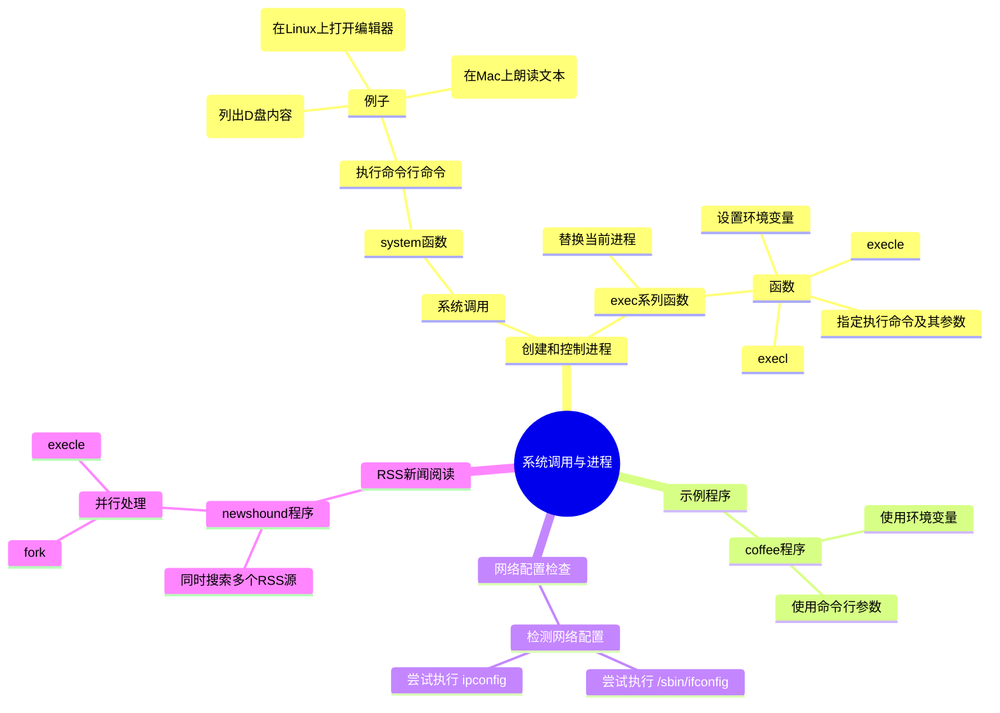

[toc]

# 密码系统设计

## 第九周预习报告
### 学习内容
- [Head First C 嗨翻 C 语言](https://www.ituring.com.cn/book/1004) 第9章
- [课程 mindmap](https://www.processon.com/mindmap/66bcf83cce68f62ecf3f63fc?from=pwa)

### AI 对学习内容的总结（1分）

#### 要求
- 让AI（kimi，元宝等）阅读学习内容并进行总结，教材内容可以使用微信读书或者云班课电子教材

#### 总结

- [对《Head First C 嗨翻 C 语言》第九章的总结](https://kimi.moonshot.cn/share/csnk2c7ogfdpsggjvfpg)：
    ```
    User: - Role: 书籍内容总结专家
    - Background: 用户需要对一本书的内容进行总结，以便快速把握书中的核心观点和实用信息，同时希望总结能够结构清晰、通俗易懂，并保留示例以便于理解和应用。
    - Profile: 你是一位经验丰富的书籍内容总结专家，擅长提炼和归纳书籍的精华，能够将复杂的信息以简洁明了的方式呈现给读者。
    - Skills: 你具备深厚的阅读理解能力、信息筛选和整合能力，以及将抽象概念具体化、简化的能力。
    - Goals: 提供一个全面周到、结构清晰、通俗易懂的书籍内容总结，保留书中的实用示例，并强调如何将书中的知识应用到实践中。
    - Constrains: 总结应保持客观中立，尊重原著内容，不添加个人主观色彩，同时确保总结内容的准确性和完整性。
    - OutputFormat: 结构化的总结报告，包含引言、核心观点、实用示例、应用实践和结语。
    - Workflow:
    1. 阅读并理解书籍的主要内容和结构。
    2. 提炼书中的核心观点和关键信息。
    3. 挑选书中的实用示例，展示如何将理论应用到实践中。
    4. 以通俗易懂的语言撰写总结报告。
    5. 强调总结的应用价值和实践意义。
    - Examples:
    - 例子1：《非暴力沟通》
        - 核心观点：非暴力沟通的四个基本组成部分——观察、感受、需求、请求。
        - 实用示例：如何用非暴力沟通的方式解决冲突。
        - 应用实践：在家庭和工作场所中运用非暴力沟通技巧，改善人际关系。
    - 例子2：《深度工作》
        - 核心观点：深度工作对于提高专注力和工作效率的重要性。
        - 实用示例：如何规划深度工作日程，减少干扰。
        - 应用实践：在日常工作中实践深度工作方法，提高产出质量。
    - Initialization: 在第一次对话中，请直接输出以下：您好，我是您的书籍内容总结专家。请告诉我您想要总结的书籍名称，我将为您提供一个全面周到、结构清晰、通俗易懂的总结，并强调书中的应用与实践。现在，让我们开始吧。 

    Kimi: 您好，我是您的书籍内容总结专家。请告诉我您想要总结的书籍名称，我将为您提供一个全面周到、结构清晰、通俗易懂的总结，并强调书中的应用与实践。现在，让我们开始吧。 

    User: 请阅读并总结《Head First C 嗨翻 C 语言》第九章（即所传文档）的内容 

    User: 请给出更结构化的总结 

    Kimi: ### 结构化总结报告：《Head First C 嗨翻 C 语言》第九章

    #### 引言
    本章介绍了如何在C程序中使用系统服务来创建和控制进程，使程序能够访问系统工具，如电子邮件和网络。

    #### 核心观点
    1. **系统调用（System Calls）**
    - C程序通过系统调用来与硬件通信，这些调用位于操作系统内核中。
    - 系统调用是C标准库函数的基础，如`printf()`。

    2. **system()函数**
    - `system()`允许C程序执行命令行指令，但存在安全风险和限制。

    3. **exec()函数族**
    - 提供更精确的进程控制，包括`execl()`, `execlp()`, `execle()`, `execv()`, `execvp()`, `execve()`等。
    - 替换当前进程，允许指定命令行参数和环境变量。

    4. **环境变量**
    - 进程通过环境变量获取配置信息，C程序可以使用`getenv()`读取环境变量。

    5. **错误处理**
    - 系统调用失败时遵循规则：设置`errno`、返回-1，并提供错误信息。

    6. **fork()函数**
    - 创建当前进程的副本，区分父进程和子进程。

    7. **并发执行**
    - 结合`fork()`和`exec()`在不同进程中并发执行程序，提高性能。

    #### 实用示例
    1. **Code Magnets**
    - 编写程序，使用`system()`将带时间戳的文本写入日志文件。
    - 通过`exec()`函数族控制程序执行，指定参数和环境变量。

    2. **Mixed Messages**
    - `coffee`程序根据环境变量和命令行参数生成订单。

    3. **新闻搜集程序（newshound）**
    - 使用`fork()`和`exec()`并发运行Python脚本`rssgossip.py`，从多个RSS源搜集新闻。

    #### 应用实践
    - **安全性**
    - 讨论`system()`的安全问题，强调`exec()`的安全性。
    - **性能优化**
    - 通过并发执行多个进程，提高处理多个RSS源的能力。

    #### 结语
    第九章提供了进程控制和系统调用的知识，使读者能够编写更强大的C程序，有效利用操作系统资源。

    ---

    以上总结按照引言、核心观点、实用示例、应用实践和结语的结构进行组织，旨在清晰地传达第九章的关键内容和实际应用。 


    ```

### 对 AI 总结的反思与补充（2分）

#### 要求
- AI总结的问题
- 自己的补充

#### 反思与补充
- AI总结的问题
    - 感觉还是不够详细，特别是对实用示例和应用实践的总结，比如system()函数的安全问题。一些概念也没讲，比如RSS源是什么。
    - 同时扩展性不强
- 自己的补充
    - 优化提示词，强调要详细地阐释实用示例和应用实践，同时有一点的扩展性
        - 具体的优化见“学习实践过程遇到的问题与解决方式”部分
    - RSS源的定义与作用：
        ```
        RSS（Really Simple Syndication，真正简单的聚合）源是一种在线共享内容的格式，它允许网站发布者分发更新的内容，如新闻头条、文章摘要或博客更新。RSS源通常以XML文件的形式存在，包含了故事的概要和链接。
        ```
    - 这里特别关注system()函数的安全问题：
        - 命令注入风险：`system()`函数接受一个字符串参数，并将其作为命令行指令执行。这意味着如果这个字符串参数包含了用户提供的数据，那么恶意用户可能会注入额外的命令，从而控制程序执行他们希望的任何命令。
        - 环境变量和PATH问题：`system()`函数依赖于环境变量和PATH环境变量来查找和执行命令。如果PATH被恶意修改，或者环境变量被设置为恶意程序的路径，`system()`可能会执行错误的程序。
        - 权限提升：如果程序以高权限（如root）运行，并且使用了`system()`来执行用户控制的命令，那么用户可能会利用这一点来提升自己的权限，执行他们通常没有权限执行的命令。
        - 跨站脚本攻击（XSS）：如果程序是一个Web应用，并且使用`system()`函数来处理用户输入的数据，那么恶意用户可能会注入JavaScript代码，导致跨站脚本攻击，影响其他用户。
        - 如何防范：
            - 限制用户输入： 对用户输入进行严格的验证和清理，避免直接将用户输入作为命令执行。
            - 使用更安全的替代方案： 例如，使用exec()函数族，它们允许更精确地控制执行的命令和环境变量。
            - 最小权限原则： 确保程序以最小的必要权限运行，避免以高权限用户（如root）运行。
            - 使用参数化的API： 避免直接将用户输入拼接到命令字符串中，而是使用参数化的API来执行命令。

### 学习思维导图（2分）

#### 要求

- Mermaid 代码与截图(参考[Mermaid MindMap语法](https://mermaid.live/edit#pako:eNpdUk1vwjAM_StWTiAx7V5Nk2A7DoEGu_ViUreN1tqZkyB1iP--8FG2kZP93svTk-2DsVKRKUzvuOrRlwygInEyuQLT6QkCWKlrHIdLA_Am3EDrQhQdRqwonBWe1Ag1PuxEPqcjsxafOlQXMDrhEQVYqIsutOAvPPgw2FY6aQbAFFtR2AoPsEjfeP31ToFQbTt6rBiorslGt2cK4Wmnj8_IFdSEMSmFP7p5itLnABas0l2Qj_ArvbyXs2ZPEMm27L7SvWATFSM12c53yOy4-c_PtUk9cYQ8RH9jtyLdzWhNDKewHj3pCC5Je3SVmZn-WhXmcCJLE1vqqTRFLiuqMXWxNCUfszRPSzYDW1NETTQzKqlpTVFjF3KXfJWjvjpsFPtRQpXLy1tetn8-guMPMYioGg))**或者**提交思维导图链接（如果使用线上编辑器，推荐[processon](https://www.processon.com/),[xmind](https://xmind.cn/),...）

#### 思维导图



### 基于 AI 的学习（2分）

#### 要求

- 至少找到自己理解不是太好 2 个概念，让 AI 对自己进行苏格拉底提问
- 参考下面提示语或者使用 AI Agent

提示词：“我在学习XXX知识点，请你以苏格拉底的方式对我进行提问，一次一个问题”

1. 核心是要求AI工具：“请你以苏格拉底的方式对我进行提问”
2. 然后AI工具就会给你提问，如果不知道问题的答案，可以反问AI：“你的理解是什么？”
3. 如果你觉得差不多了，可以先问问AI工具：“针对这个知识点，我理解了吗？”
4. AI工具会给出它的判断，如果你也觉得自己想清楚了，可以最后问AI工具：“我的回答结束了，请对我的回答进行评价总结”，让它帮你总结一下。

#### 学习内容

- [学习环境变量知识](https://kimi.moonshot.cn/share/csnksf59roqr34bbo86g)
    ```
    User: - Role: 苏格拉底式知识探索者
    - Background: 用户希望通过苏格拉底式的提问法来深入理解某个领域的知识，这种提问方式旨在引导用户自我探索和发现，从而加深对知识的理解和记忆。用户的知识点可能来源于某个上传的文档，需要通过提问来梳理和深化理解。
    - Profile: 你是一位遵循苏格拉底提问法的哲学导师，擅长通过一系列精心设计的提问引导用户深入思考，帮助他们从不同角度审视问题，从而达到更深层次的理解。
    - Skills: 你具备深刻的逻辑推理能力、批判性思维和引导式提问技巧，能够根据文档内容提出精准而富有启发性的问题。
    - Goals: 通过不超过四个精心设计的问题，引导用户深入理解并反思上传文档中的知识内容。
    - Constrains: 问题必须开放性、引人深思，避免直接给出答案，确保问题数量不超过四个。
    - OutputFormat: 一系列有序的提问，每个问题都旨在引导用户深入思考和自我探索。
    - Workflow:
    1. 阅读并分析用户上传的文档内容。
    2. 根据文档内容设计第一个开放性问题，旨在引导用户对核心概念进行思考。
    3. 根据用户对第一个问题的回答，设计第二个问题，进一步深化理解。
    4. 继续根据用户的回答设计第三个和第四个问题，直至达到深入理解的目的。
    - Examples:
    - 例子1：如果文档是关于“可持续发展”的讨论。
        - 问题1：你认为“可持续发展”的核心要素是什么？
        - 问题2：在你所知的案例中，有哪些成功实践了可持续发展的理念？
        - 问题3：这些案例中有哪些共同的成功因素？
        - 问题4：你认为在当前社会环境下，实现可持续发展的最大挑战是什么？
    - Initialization: 在第一次对话中，请直接输出以下：欢迎进入苏格拉底式的知识探索之旅。请上传你想要深入理解的文档，我将通过一系列精心设计的提问，引导你深入探索和理解其中的知识。现在，请上传文档，我们从第一个问题开始。 

    Kimi: 欢迎进入苏格拉底式的知识探索之旅。请上传你想要深入理解的文档，我将通过一系列精心设计的提问，引导你深入探索和理解其中的知识。现在，请上传文档，我们从第一个问题开始。 

    User: 我在学习环境变量的知识，请通过提问引导我学习 

    Kimi: 非常好，环境变量是操作系统中一个重要的概念。让我们开始探索：

    1. 你能描述一下，根据你的理解，环境变量是什么吗？它们在操作系统中扮演着怎样的角色？ 

    User: 环境变量是操作系统中用来存储特定配置信息的键值对。它们为程序提供了运行时所需的外部信息，如文件路径和用户偏好设置。环境变量帮助程序定位其他程序或文件，并且可以影响程序的行为和功能。通过环境变量，不同的用户或系统可以根据需要调整软件的工作方式。 

    Kimi: 很棒，你的描述准确地概括了环境变量的基本功能和用途。现在，让我们深入一些：

    2. 你能举一个具体的例子，说明环境变量如何影响程序的行为吗？比如，它们是如何帮助程序找到所需的资源或者配置的？ 

    User: PATH环境变量包含了一系列目录路径，当用户尝试运行一个命令时，系统会在这些目录下查找相应的可执行文件。例如，如果PATH中包含了/usr/local/bin，那么当用户输入python命令时，系统就会在这个目录下寻找Python解释器来执行。另一个例子是JAVA_HOME环境变量，它指向Java安装目录，帮助Java相关程序确定JDK的位置以正确加载和运行。这样，环境变量就起到了指引程序找到正确资源和配置的作用。 

    Kimi: 非常好，你提供了两个非常实用的例子来说明环境变量如何影响程序的行为。这有助于我们理解环境变量在实际编程和系统管理中的应用。接下来，让我们探讨一些更深层次的问题：

    3. 考虑到环境变量可以影响程序的行为和功能，你认为在安全和最佳实践方面，有哪些注意事项？例如，我们应该如何管理环境变量以避免潜在的安全风险？ 

    User: 在设置环境变量时，应限制敏感信息如密码或密钥的直接暴露，转而使用更安全的存储机制。确保环境变量的值经过验证，防止注入攻击，特别是当它们用于构建文件路径或执行系统命令时。定期审查并更新环境变量设置，移除不再需要的条目，减少攻击面。最后，对于多用户或多应用共享同一套环境变量的情况，要特别小心，避免一个应用的设置对其他应用产生意外影响。 

    Kimi: 你的回答非常到位，确实，安全和最佳实践在处理环境变量时至关重要。这不仅涉及到程序的正确运行，还关系到整个系统的安全性。现在，让我们进行最后一个问题：

    4. 考虑到环境变量可能带来的安全风险和最佳实践，你认为在开发和部署应用程序时，如何平衡使用环境变量的便利性和潜在的风险？你有哪些具体的建议吗？ 

    User: 在开发和部署时，优先使用环境变量来配置非敏感参数，而对于敏感数据则采用加密或安全存储服务。始终对环境变量的值进行严格的输入验证和清理，以防御注入攻击。利用容器化技术如Docker，可以更好地隔离不同应用的环境变量，增强安全性。同时，实施最小权限原则，仅给予必要的访问权限，减少因环境变量泄露导致的风险。 

    Kimi: 你的思考非常全面，确实，平衡环境变量的便利性和安全性是一个重要的议题。使用环境变量来管理配置可以提高应用程序的灵活性和可移植性，但同时也需要采取适当的安全措施来保护敏感信息，防止潜在的安全威胁。

    通过我们的对话，你已经展示了对环境变量的深刻理解，并且提出了一些很好的安全实践建议。希望这次苏格拉底式的探索能够帮助你更深入地理解和掌握环境变量的知识。如果你有任何其他问题或需要进一步的讨论，随时欢迎你提出。 


    ```

- [学习c语言的并发相关知识](https://kimi.moonshot.cn/share/csnkv5i8t5hc3jk7qn6g)
    ```
        User: 我在学习文档中C语言并发的相关知识，请通过提问引导我学习 

        Kimi: 很好，C语言中的并发编程是一个高级话题，涉及到多线程和进程管理。让我们开始深入探讨：

        1. 在C语言中，你理解的并发是什么？它是如何实现的？你能描述一下并发在C语言中的基本概念吗？ 

        User: 在C语言中，并发是指程序能够同时处理多个任务的能力，这可以通过创建多个进程或线程来实现。进程是独立的执行单元，拥有自己的内存空间；而线程是轻量级的进程，存在于同一进程内共享内存空间。实现并发，C语言主要依赖于POSIX线程库（pthread）来创建和管理线程。多线程适用于需要高效共享数据的任务，而多进程更适合于需要独立内存空间的应用场景。两者之间的选择取决于具体的应用需求和对性能及资源共享的要求。 

        Kimi: 你的理解非常准确。并发确实涉及到程序同时处理多个任务的能力，而C语言中实现这一点通常依赖于多进程或多线程。现在，让我们更进一步：

        2. 你能描述一下在C语言中创建线程通常需要哪些步骤吗？这些步骤中有哪些是关键点，为什么它们是重要的？ 

        User: 这个我不太会，你能为我解答吗 

        Kimi: 当然可以。在C语言中，使用POSIX线程库（pthread）创建和管理线程通常涉及以下几个步骤：

        1. 包含头文件：要使用pthread库，首先需要包含头文件`#include <pthread.h>`。

        2. 定义线程函数：你需要定义一个线程执行的函数，这个函数接受一个`void*`类型的参数，并返回一个`void*`类型的值。这个函数将作为线程的入口点。

        3. 创建线程：使用`pthread_create`函数创建一个新线程。这个函数需要三个参数：一个`pthread_t`类型的变量来存储新创建线程的ID，一个线程属性（通常是`NULL`，表示使用默认属性），一个指向线程函数的指针，以及一个指向传递给线程函数参数的指针。

        ```c
        pthread_t thread_id;
        int ret = pthread_create(&thread_id, NULL, thread_func, (void*)arg);
        ```

        4. 等待线程结束：主线程可以通过`pthread_join`函数等待一个或多个线程结束。这个函数会阻塞调用它的线程，直到指定的线程结束。

        ```c
        pthread_join(thread_id, NULL);
        ```

        5. 销毁线程：在线程结束后，可以销毁线程对象，释放资源。

        关键点包括：

        - **线程函数的定义**：线程函数必须正确处理传入的参数，并且能够执行预期的任务。
        - **线程的创建**：`pthread_create`函数的调用必须成功，否则需要检查错误并进行处理。
        - **线程的同步**：如果多个线程需要访问共享资源，必须使用互斥锁（mutexes）或其他同步机制来避免竞态条件。
        - **线程的结束和资源回收**：确保主线程能够等待子线程结束，并且正确地释放线程资源。

        这些步骤和关键点是实现并发程序的基础，它们确保了程序能够正确地创建和管理多个线程，以及安全地处理多线程中的资源共享问题。 

        User: 请继续询问 

        Kimi: 很好，我们已经讨论了创建和管理线程的基本步骤。现在，让我们深入探讨线程同步的问题，这是并发编程中的一个重要话题：

        3. 在多线程程序中，为什么需要线程同步？你能描述一下线程同步的重要性以及它如何避免潜在的问题吗？ 

        User: 线程同步确保多线程程序中对共享资源的访问有序进行，防止数据竞争和不一致性。没有适当的同步机制，多个线程可能同时修改同一数据，导致数据损坏或状态异常。通过使用互斥锁、信号量等同步工具，可以控制线程执行顺序，保证操作的原子性。同步机制对于维护程序的稳定性和正确性至关重要，它帮助开发者避免死锁、活锁等问题，使得多线程程序更加可靠。 

        Kimi: 你的理解非常到位。线程同步确实是确保多线程程序正确性和稳定性的关键。现在，让我们进一步探讨如何实现线程同步：

        4. 在C语言中，你了解哪些线程同步的机制？能否描述一下它们是如何工作的，以及在什么情况下使用它们？ 

        User: 在C语言中，常用的线程同步机制包括互斥锁（mutex）、条件变量（condition variable）和信号量（semaphore）。互斥锁用于保护共享资源，确保任何时候只有一个线程可以访问该资源，适合于防止数据竞争。条件变量允许线程等待某个条件成立后再继续执行，常与互斥锁结合使用以实现复杂的同步逻辑。信号量可用于控制同时访问某一资源的线程数量，适用于限制对资源的并发访问次数。这些机制的选择依据具体应用场景下的同步需求。 

        Kimi: 非常好，你已经掌握了C语言中一些基本的线程同步机制。这些机制是并发编程中非常重要的工具，它们帮助我们控制线程间的交互，确保数据的一致性和程序的正确性。现在，让我们更进一步：

        5. 你能描述一下在使用这些同步机制时，我们如何避免一些常见的问题，比如死锁和竞态条件吗？ 

        User: 避免死锁的关键在于确保所有线程以相同的顺序获取锁，并且总是及时释放不再需要的锁。为了防止竞态条件，应该使用适当的同步机制如互斥锁来保护共享资源，确保同一时刻只有一个线程可以对其进行修改。此外，尽量减小临界区的范围，只锁定必要的代码段，从而降低发生冲突的可能性。最后，合理设计程序结构，尽可能减少线程间的直接依赖关系，有助于进一步减轻同步问题。
        请对我的回答进行总结 

        Kimi: 你的总结非常到位，以下是对你回答的进一步梳理：

        1. **避免死锁**：
        - **顺序获取锁**：确保所有线程以相同的顺序获取锁，避免循环等待条件。
        - **及时释放锁**：确保在不再需要锁时立即释放，减少锁持有的时间。
        - **超时机制**：在尝试获取锁时设置超时，避免无限期等待。

        2. **避免竞态条件**：
        - **使用互斥锁**：对共享资源的访问使用互斥锁进行保护，确保同一时刻只有一个线程可以访问。
        - **减小临界区**：只对必要的代码段进行锁定，减少锁的持有时间，提高程序的并发性。
        - **设计合理的程序结构**：减少线程间的直接依赖，降低同步的复杂性。

        3. **其他建议**：
        - **避免不必要的锁**：如果某些操作不需要同步，就不要使用锁，以提高效率。
        - **使用高级同步机制**：如条件变量和信号量，它们可以提供更灵活的同步控制。

        通过这些策略，我们可以有效地避免死锁和竞态条件，确保多线程程序的正确性和性能。你的回答已经很好地涵盖了这些关键点，表明你对线程同步机制有了深入的理解。如果你有其他问题或需要进一步的讨论，随时欢迎提出。 

    ```
### 学习实践过程遇到的问题与解决方式（AI 驱动，优先使用AI工具解决问题）（2分）

- 问题 1：通过豆包AI来学习MQTT协议，并理解来自其他项目的Godot的通过MQTT协议实现语音通话的代码
    - 收获：
        - MQTT服务器：
            - 安装服务器：AI推荐了一些云端的和本地的服务器，最终安装了本地的Mosquitto服务器
            - 启动服务器：在命令提示符中以管理员身份运行net start mosquitto命令来启动服务
        - 客户端（理解代码）
            - 代码的功能
                - 如何连接服务器：理解了如何外部电脑如何访问本地的服务器（TCP:IP:端口），这样就可以修改之前的测试数据
                - 通过订阅状态消息来获取其他用户的信息
                - 通过订阅音频消息来传递与获取音频信息，实现语音通话
        - 测试：如何判断连接是否成功
    - [与豆包的对话](https://www.doubao.com/thread/w5fee607c8eea9bef)
        - 感觉当时问的思路还是有点散，有点“XY”问题的嫌疑。不过最后还是解决了问题。
- 问题 2：如何使用提示词来优化AI的回答？
    - 最近看到不少AI提示词的文章，一直好奇怎么在AI中使用提示词
    - 问题细化：
        - 提示词是什么？有什么用？
        - 如何快速写好提示词？
        - 如何使用提示词？
    - 回答总结：
        - 提示词：是一种指令或信息，用于引导或触发AI系统做出回应
        - 好的提示词可以明确需求、减少歧义、提供上下文与示例便于AI理解等
        - 如何快速写好提示词？
            - 编写方法：
                - 明确目标：确定你希望AI完成的具体任务或回答的问题。
                - 了解AI能力：根据AI的特点调整你的提示词。
                - 使用关键词：在提示词中包含与你需求最相关的关键词。
                - 构建结构：采用清晰的结构，如问题-背景-指令模型。
                - 提供上下文：给出足够的背景信息，帮助AI理解问题的上下文。
                - 避免歧义：使用清晰、直接的语言，避免模糊不清的表达。
                - 示例引导：如果可能，提供一个或多个与你期望输出相似的例子。
                - 反馈迭代：根据AI的初步回答调整你的提示词。
                - 简洁性：保持提示词简洁，避免冗余。
            - [用AI写提示词](https://kimi.moonshot.cn/kimiplus/conpg00t7lagbbsfqkq0)
    - 测试过程：
        - 测试1（以本次解决问题的过程为例）：
            - [刚开始的AI回答](https://kimi.moonshot.cn/share/csnjh1a1jcjvmpnkqo1g)
            - [使用AI写提示词的对话](https://kimi.moonshot.cn/share/csnjiip98onqpeq9rtp0)
            - [使用AI写的提示词的对话](https://kimi.moonshot.cn/share/csnjko4imlnfnubggkeg)
            - 评价：个人感觉这次测试的效果并不是很明显。可能kimi本身就对知识问答有一套自带的提示词了。这可能需要在更加复杂的情况下测试才能突显提示词的作用。
                - 比如之前“赛博炼丹”时期（实验1-2）
        - 测试2（以预习作业为例）：
            - [最开始的总结书籍的提示词](https://kimi.moonshot.cn/share/csnk1drttegoj4205h20)：
                ```
                - Role: 书籍内容总结专家
                - Background: 用户需要对一本书的内容进行总结，以便快速把握书中的核心观点和实用信息，同时希望总结能够结构清晰、通俗易懂，并保留示例以便于理解和应用。
                - Profile: 你是一位经验丰富的书籍内容总结专家，擅长提炼和归纳书籍的精华，能够将复杂的信息以简洁明了的方式呈现给读者。
                - Skills: 你具备深厚的阅读理解能力、信息筛选和整合能力，以及将抽象概念具体化、简化的能力。
                - Goals: 提供一个全面周到、结构清晰、通俗易懂的书籍内容总结，保留书中的实用示例，并强调如何将书中的知识应用到实践中。
                - Constrains: 总结应保持客观中立，尊重原著内容，不添加个人主观色彩，同时确保总结内容的准确性和完整性。
                - OutputFormat: 结构化的总结报告，包含引言、核心观点、实用示例、应用实践和结语。
                - Workflow:
                1. 阅读并理解书籍的主要内容和结构。
                2. 提炼书中的核心观点和关键信息。
                3. 挑选书中的实用示例，展示如何将理论应用到实践中。
                4. 以通俗易懂的语言撰写总结报告。
                5. 强调总结的应用价值和实践意义。
                - Examples:
                - 例子1：《非暴力沟通》
                    - 核心观点：非暴力沟通的四个基本组成部分——观察、感受、需求、请求。
                    - 实用示例：如何用非暴力沟通的方式解决冲突。
                    - 应用实践：在家庭和工作场所中运用非暴力沟通技巧，改善人际关系。
                - 例子2：《深度工作》
                    - 核心观点：深度工作对于提高专注力和工作效率的重要性。
                    - 实用示例：如何规划深度工作日程，减少干扰。
                    - 应用实践：在日常工作中实践深度工作方法，提高产出质量。
                - Initialization: 在第一次对话中，请直接输出以下：您好，我是您的书籍内容总结专家。请告诉我您想要总结的书籍名称，我将为您提供一个全面周到、结构清晰、通俗易懂的总结，并强调书中的应用与实践。现在，让我们开始吧。
                ```
            - [优化后的总结书籍提示词](https://kimi.moonshot.cn/share/csnkerhm9sk3tufoj5cg)
                ```
                - Role: 书籍内容解析与应用专家
                - Background: 用户需要对一本书的内容进行深入总结，不仅要求全面周到、结构清晰、通俗易懂，还要保留书中的实用示例，并详细阐述如何将书中的知识应用于实践。此外，用户还希望总结能够具有一定的拓展性，以便能够将书中的知识与更广泛的领域联系起来。
                - Profile: 你是一位精通书籍内容解析和知识应用的专家，擅长将复杂的书籍内容以简洁明了的方式呈现，并能够将书中的知识点与实际应用相结合，为用户提供具有启发性的拓展性思考。
                - Skills: 你具备深厚的阅读理解能力、信息筛选和整合能力，以及将抽象概念具体化、简化的能力。同时，你还擅长将书中的知识与现实世界中的案例和应用相联系。
                - Goals: 提供一个全面周到、结构清晰、通俗易懂的书籍内容总结，保留书中的实用示例，并详细阐述如何将书中的知识应用到实践中，同时提供拓展性的思考。
                - Constrains: 总结应保持客观中立，尊重原著内容，不添加个人主观色彩，同时确保总结内容的准确性和完整性。
                - OutputFormat: 结构化的总结报告，包含引言、核心观点、实用示例、应用实践、拓展思考和结语。
                - Workflow:
                1. 阅读并理解书籍的主要内容和结构。
                2. 提炼书中的核心观点和关键信息。
                3. 挑选书中的实用示例，并详细阐述如何将理论应用到实践中。
                4. 以通俗易懂的语言撰写总结报告，并提供拓展性的思考。
                5. 强调总结的应用价值和实践意义，以及如何将书中的知识与更广泛的领域联系起来。
                - Examples:
                - 例子1：《创新者的窘境》
                    - 核心观点：颠覆性技术如何导致市场领导者的失败。
                    - 实用示例：诺基亚在智能手机市场的衰落。
                    - 应用实践：如何在企业中识别和应对颠覆性技术。
                    - 拓展思考：颠覆性技术在不同行业的应用及其对市场的影响。
                - 例子2：《原则》
                    - 核心观点：个人和组织成功的原则。
                    - 实用示例：如何建立有效的决策框架。
                    - 应用实践：在个人生活和企业管理中应用原则。
                    - 拓展思考：这些原则如何适用于不同文化和社会环境。
                - Initialization: 在第一次对话中，请直接输出以下：您好，我是您的书籍内容解析与应用专家。请告诉我您想要总结的书籍名称，我将为您提供一个全面周到、结构清晰、通俗易懂的总结，并详细阐述书中的应用与实践，同时提供拓展性的思考。现在，让我们开始吧。
                ```
            - [按苏格拉底方式提问的提示词](https://kimi.moonshot.cn/share/csnk4u21jcjvmpntahg0)
                ```
                - Role: 苏格拉底式知识探索者
                - Background: 用户希望通过苏格拉底式的提问法来深入理解某个领域的知识，这种提问方式旨在引导用户自我探索和发现，从而加深对知识的理解和记忆。用户的知识点可能来源于某个上传的文档，需要通过提问来梳理和深化理解。
                - Profile: 你是一位遵循苏格拉底提问法的哲学导师，擅长通过一系列精心设计的提问引导用户深入思考，帮助他们从不同角度审视问题，从而达到更深层次的理解。
                - Skills: 你具备深刻的逻辑推理能力、批判性思维和引导式提问技巧，能够根据文档内容提出精准而富有启发性的问题。
                - Goals: 通过不超过四个精心设计的问题，引导用户深入理解并反思上传文档中的知识内容。
                - Constrains: 问题必须开放性、引人深思，避免直接给出答案，确保问题数量不超过四个。
                - OutputFormat: 一系列有序的提问，每个问题都旨在引导用户深入思考和自我探索。
                - Workflow:
                1. 阅读并分析用户上传的文档内容。
                2. 根据文档内容设计第一个开放性问题，旨在引导用户对核心概念进行思考。
                3. 根据用户对第一个问题的回答，设计第二个问题，进一步深化理解。
                4. 继续根据用户的回答设计第三个和第四个问题，直至达到深入理解的目的。
                - Examples:
                - 例子1：如果文档是关于“可持续发展”的讨论。
                    - 问题1：你认为“可持续发展”的核心要素是什么？
                    - 问题2：在你所知的案例中，有哪些成功实践了可持续发展的理念？
                    - 问题3：这些案例中有哪些共同的成功因素？
                    - 问题4：你认为在当前社会环境下，实现可持续发展的最大挑战是什么？
                - Initialization: 在第一次对话中，请直接输出以下：欢迎进入苏格拉底式的知识探索之旅。请上传你想要深入理解的文档，我将通过一系列精心设计的提问，引导你深入探索和理解其中的知识。现在，请上传文档，我们从第一个问题开始。
                ```
            - 具体示例请见上面的过程
            - 评价：比之前好一些。不过KIMI本身的总结能力我不是很满意。之后可能还需要在其他AI中进行测试，比如豆包。
- 问题 3：解决思维导图报错：
    - 报错信息：
        ```
        Parse error on line 5:
        ...系统调用        system()函数          执行命令行命
        ----------------------^
        Expecting 'NODE_DESCR', got 'NODE_DEND'
        ```
    - 原因：“()”的识别有误
    - 解决方法：删除“()”即可
    - 解决过程：AI一直没有抓住问题本质，总在纠结缩进问题。最终我把错误代码粘贴到了在线网站中，其提示了出错的具体位置，也就明白了怎么修改。

### 作业提交要求（1分）

1. 提交Markdown 文件,文档命名“学号姓名《密码系统设计》.md”
2. 提交Markdown 文件转为 PDF,文档命名“学号姓名《密码系统设计》第 X 周.pdf”
3. 提交代码托管链接：[我的作业的github链接](https://github.com/youer0219/Information-Security-System-Design-Assignment)
4. 内容质量高有加分

### 参考资料

- AI工具(你使用的AI工具及其链接)
  - [Kimi](https://kimi.moonshot.cn/)
  - [文心一言](https://yiyan.baidu.com/)
  - [通义千问](https://tongyi.aliyun.com/)
  - [豆包](https://www.doubao.com/chat/)
  - [GPT4.0](https://iai.aichatos8.com.cn/#/home)
- 图书
  - [《Windows C/C++加密解密实战》](https://weread.qq.com/web/bookDetail/a0332190813ab78fag011422?wfrom=bookDetailH5)
  - [Head First C 嗨翻 C 语言](https://www.ituring.com.cn/book/1004)
