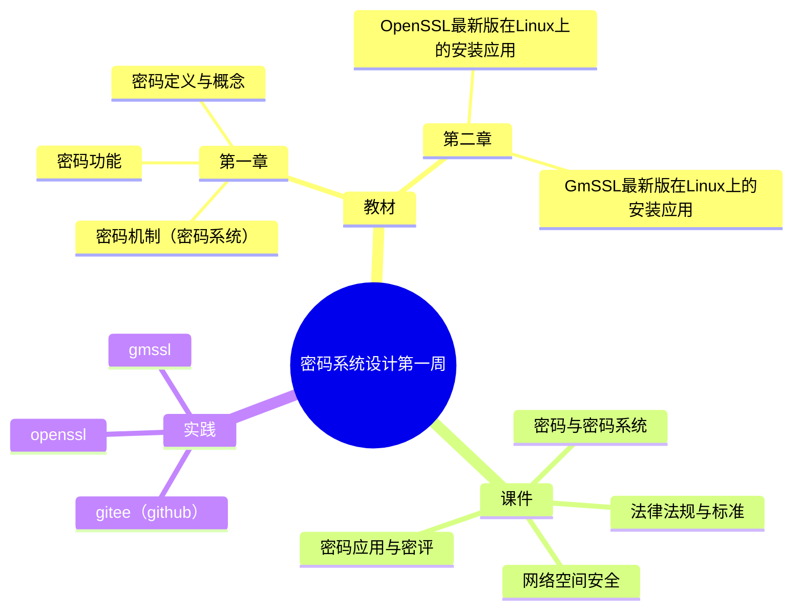

[toc]

# 密码系统设计

## 第八周预习报告

### 学习内容

- [《Windows C/C++加密解密实战》](https://weread.qq.com/web/bookDetail/a0332190813ab78fag011422?wfrom=bookDetailH5)第 12 章
- [课程 mindmap](https://www.processon.com/mindmap/66bcf83cce68f62ecf3f63fc?from=pwa)
- 报告内容参考第一周

### AI 对学习内容的总结（1分）

#### 要求

- 让AI（kimi，元宝等）阅读学习内容并进行总结，教材内容可以使用微信读书或者云班课电子教材

#### 总结

- 对《Windows C/C++加密解密实战》的总结
- 对《Head First C 嗨翻 C 语言》第五章的总结：

### 对 AI 总结的反思与补充（2分）

#### 要求

- AI总结的问题
- 自己的补充

#### 反思与补充

- AI总结的问题
- 自己的补充

### 学习思维导图（2分）

#### 要求

- Mermaid 代码与截图(参考[Mermaid MindMap语法](https://mermaid.live/edit#pako:eNpdUk1vwjAM_StWTiAx7V5Nk2A7DoEGu_ViUreN1tqZkyB1iP--8FG2kZP93svTk-2DsVKRKUzvuOrRlwygInEyuQLT6QkCWKlrHIdLA_Am3EDrQhQdRqwonBWe1Ag1PuxEPqcjsxafOlQXMDrhEQVYqIsutOAvPPgw2FY6aQbAFFtR2AoPsEjfeP31ToFQbTt6rBiorslGt2cK4Wmnj8_IFdSEMSmFP7p5itLnABas0l2Qj_ArvbyXs2ZPEMm27L7SvWATFSM12c53yOy4-c_PtUk9cYQ8RH9jtyLdzWhNDKewHj3pCC5Je3SVmZn-WhXmcCJLE1vqqTRFLiuqMXWxNCUfszRPSzYDW1NETTQzKqlpTVFjF3KXfJWjvjpsFPtRQpXLy1tetn8-guMPMYioGg))**或者**提交思维导图链接（如果使用线上编辑器，推荐[processon](https://www.processon.com/),[xmind](https://xmind.cn/),...）

#### 思维导图

上面mermaid实际效果，vscode中可以预览：

### 基于 AI 的学习（2分）

#### 要求

- 至少找到自己理解不是太好 2 个概念，让 AI 对自己进行苏格拉底提问
- 参考下面提示语或者使用 AI Agent

提示词：“我在学习XXX知识点，请你以苏格拉底的方式对我进行提问，一次一个问题”

1. 核心是要求AI工具：“请你以苏格拉底的方式对我进行提问”
2. 然后AI工具就会给你提问，如果不知道问题的答案，可以反问AI：“你的理解是什么？”
3. 如果你觉得差不多了，可以先问问AI工具：“针对这个知识点，我理解了吗？”
4. AI工具会给出它的判断，如果你也觉得自己想清楚了，可以最后问AI工具：“我的回答结束了，请对我的回答进行评价总结”，让它帮你总结一下。

#### 学习内容

XXXXXXXXXXXXXXXXXXXXXXXXXXXXXXXXXXXXXXX

### 学习实践过程遇到的问题与解决方式（AI 驱动，优先使用AI工具解决问题）（2分）

至少两个

- 问题 1：通过豆包AI来学习MQTT协议，并理解来自其他项目的Godot的通过MQTT协议实现语音通话的代码
    - 收获：
        - MQTT服务器：
            - 安装服务器：AI推荐了一些云端的和本地的服务器，最终安装了本地的Mosquitto服务器
            - 启动服务器：在命令提示符中以管理员身份运行net start mosquitto命令来启动服务
        - 客户端（理解代码）
            - 代码的功能
                - 如何连接服务器：理解了如何外部电脑如何访问本地的服务器（TCP:IP:端口），这样就可以修改之前的测试数据
                - 通过订阅状态消息来获取其他用户的信息
                - 通过订阅音频消息来传递与获取音频信息，实现语音通话
        - 测试：如何判断连接是否成功
    - [与豆包的对话](https://www.doubao.com/thread/w5fee607c8eea9bef)

- 问题 2，解决过程

### 作业提交要求（1分）

1. 提交Markdown 文件,文档命名“学号姓名《密码系统设计》.md”
2. 提交Markdown 文件转为 PDF,文档命名“学号姓名《密码系统设计》第 X 周.pdf”
3. 提交代码托管链接：[我的作业的github链接](https://github.com/youer0219/Information-Security-System-Design-Assignment)
4. 内容质量高有加分

### 参考资料

- AI工具(你使用的AI工具及其链接)

  - [Kimi](https://kimi.moonshot.cn/)
  - [文心一言](https://yiyan.baidu.com/)
  - [通义千问](https://tongyi.aliyun.com/)
  - [豆包](https://www.doubao.com/chat/)
  - [GPT4.0](https://iai.aichatos8.com.cn/#/home)
- 图书

  - [《Windows C/C++加密解密实战》](https://weread.qq.com/web/bookDetail/a0332190813ab78fag011422?wfrom=bookDetailH5)
  - [Head First C 嗨翻 C 语言](https://www.ituring.com.cn/book/1004)
