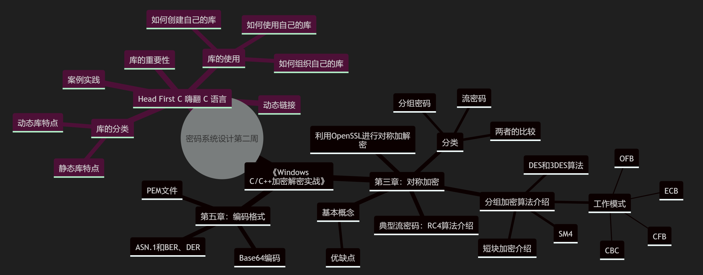

[toc]
# 密码系统设计

## 第二周预习报告 
### 学习内容
- [《Windows C/C++加密解密实战》](https://weread.qq.com/web/bookDetail/a0332190813ab78fag011422?wfrom=bookDetailH5)第3,5章
    -  第三章重点 3.4，3.5， 特别3.4.4
    -  第五章重点 5.3.7
- [Head First C 嗨翻 C 语言](https://www.ituring.com.cn/book/1004) 第八章
- [课程 mindmap](https://www.processon.com/mindmap/66bcf83cce68f62ecf3f63fc?from=pwa)


### AI 对学习内容的总结（1分）
#### 要求
- 让AI（kimi，元宝等）阅读学习内容并进行总结，教材内容可以使用微信读书或者云班课电子教材
#### 总结

- [《Head First C 嗨翻 C 语言》预习内容总结](https://kimi.moonshot.cn/share/crjb43817fmbg745lhcg)
    ```
    User: 请阅读该书第八章的内容，并进行总结 

    Kimi: 第八章的标题是“Static and Dynamic Libraries: Hot-swappable code”，即“静态和动态库：可热插拔的代码”。这一章主要讨论了如何在C语言中创建和使用库，以便代码的重用和管理。

    以下是第八章内容的总结：

    1. **库的重要性**：库允许开发者将代码组织成模块化的单元，这样可以在不同的程序中重复使用相同的代码，减少重复工作，并提高代码的可维护性。

    2. **静态库（Static Libraries）**：
      - 静态库是一组编译过的代码集合，它们在程序编译时被包含进最终的可执行文件中。
      - 静态库通常以`.a`（在Unix-like系统上）或`.lib`（在Windows上）为文件扩展名。
      - 创建静态库的过程包括编译源代码文件生成对象文件（`.o`或`.obj`），然后使用`ar`命令（或其他工具）将这些对象文件打包成一个库文件。

    3. **动态库（Dynamic Libraries）**：
      - 动态库在程序运行时被加载，而不是在编译时静态链接。
      - 动态库允许多个程序共享同一份库代码，节省内存和磁盘空间。
      - 动态库在Unix-like系统上通常有`.so`扩展名，在Windows上是`.dll`。

    4. **创建自己的库**：
      - 介绍了如何创建自己的静态和动态库，包括编写源代码、编译生成对象文件、创建库文件，以及如何在其他程序中链接这些库。

    5. **使用库**：
      - 讨论了如何在程序中链接库，包括在编译时指定库文件和在程序中包含相应的头文件。

    6. **库的组织**：
      - 介绍了如何组织库中的代码和数据，以及如何管理库的版本和依赖。

    7. **动态链接**：
      - 详细解释了动态链接的过程，包括如何在运行时加载和解析库中的符号。

    8. **案例研究**：
      - 通过一个案例研究，展示了如何在实际项目中使用静态和动态库。

    这一章的内容对于理解C语言中的库管理和模块化编程至关重要，它为开发者提供了一种有效的方法来组织和重用代码。通过使用库，开发者可以创建更清晰、更易于维护的程序。 


    ```


- [《Windows C/C++加密解密实战》第一次内容总结](https://kimi.moonshot.cn/share/crjb3r1ldu5opf2bacl0) + [第五章内容的新总结](https://kimi.moonshot.cn/share/crjbcui1jcjkut12ffdg)
    ```
    User: 请阅读该书第三章和第五章的内容并进行总结 

    Kimi: 第三章《对称密码算法》和第五章《杂凑函数和HMAC》是《Windows C/C++加密解密实战》这本书中的关键章节，涵盖了密码学中的两个重要概念：对称加密和杂凑函数（也称为哈希函数）。以下是对这两个章节内容的总结：

    ### 第三章 对称密码算法
    对称密码算法是一种加密方法，其中加密和解密使用相同的密钥。这种算法在数据加密和保护信息安全中非常重要。本章内容包括：

    1. **基本概念**：介绍了对称加密的基本原理和特点，包括它的优缺点。
    2. **对称加解密算法的分类**：讨论了流加密算法和分组加密算法两种主要的对称加密类型。
    3. **流加密算法**：详细解释了流加密的工作原理，特别是RC4算法，包括它的设计和实现。
    4. **分组加密算法**：深入探讨了分组加密的工作模式，如ECB、CBC、CFB和OFB，以及DES、3DES、AES和SM4等算法。
    5. **利用 OpenSSL 进行对称加解密**：介绍了如何使用OpenSSL库实现对称加密算法，包括相关的函数和API。

    ### 第五章 杂凑函数和HMAC
    杂凑函数是密码学中用于生成数据的固定长度摘要的算法，通常用于验证数据完整性和认证。本章内容包括：

    1. **杂凑函数概述**：解释了杂凑函数的基本概念、发展和设计原则。
    2. **SM3杂凑算法**：详细介绍了SM3算法，包括它的常量、填充、迭代压缩和杂凑值的计算方法。
    3. **HMAC**：讨论了基于密钥的杂凑消息认证码（HMAC），包括它的产生背景、设计目标和算法描述。
    4. **SHA系列杂凑算法**：探讨了SHA算法家族，包括SHA-1、SHA-256、SHA-384和SHA-512等。
    5. **基于 OpenSSL 的哈希运算**：介绍了如何使用OpenSSL库进行哈希运算，包括各种哈希算法的实现和应用。

    这两章为读者提供了对称加密和杂凑函数的全面知识，包括理论基础、算法细节以及如何在实际中应用这些技术。通过学习这些内容，读者可以更好地理解和实现加密和数据完整性保护。 

    User: 请重点阅读其中的3.4、3.5和5.4.4部分，特别是3.4.4 

    Kimi: 好的，让我们重点关注《Windows C/C++加密解密实战》这本书中3.4节的分组加密算法、3.5节的利用OpenSSL进行对称加解密，以及5.4.4节的SHA-256算法原理解析。

    ### 3.4 分组加密算法
    在分组加密算法中，3.4.4节特别关注了DES和3DES算法。这些是经典的对称密钥加密算法，广泛应用于保护数据安全。

    #### 3.4.4 DES 和 3DES 算法
    - **DES（Data Encryption Standard）**：最初于1977年被美国国家标准局（NBS）采纳为数据加密标准。DES是一个分组加密算法，它以64位为一个分组对数据进行加密，使用56位的密钥（尽管密钥是64位，但其中有8位用于奇偶校验，实际有效密钥长度为56位）。
    - **3DES（Triple DES）**：为了提高安全性，3DES通过使用两个或三个不同的56位密钥对数据进行三次DES加密操作（加密-解密-加密或加密-加密-加密）。这种机制显著增强了加密的安全性，但随着计算能力的提升，3DES也逐渐显得力不从心。

    ### 3.5 利用 OpenSSL 进行对称加解密
    这一节介绍了如何使用OpenSSL库实现对称加密算法。OpenSSL是一个开源的软件库，提供了丰富的加密算法和安全通信协议的实现。

    #### 3.5.1 基本概念
    - **OpenSSL**：提供了多种对称加密算法的实现，包括AES、DES、RC4等。
    - **EVP（Encrypt, Decrypt, and Verify）**：是OpenSSL中的一个加密抽象层，允许开发者以统一的方式使用不同的加密算法。

    #### 3.5.2 对称加解密相关函数
    - **EVP_EncryptInit_ex**：初始化加密操作。
    - **EVP_EncryptUpdate**：执行加密操作。
    - **EVP_EncryptFinal_ex**：完成加密操作，获取最后一部分加密数据。
    - **EVP_DecryptInit_ex**、**EVP_DecryptUpdate**、**EVP_DecryptFinal_ex**：分别用于初始化、执行和完成解密操作。

    ### 5.4.4 SHA-256算法原理解析
    SHA-256是SHA-2算法家族中的一员，它生成一个256位（32字节）的哈希值，用于确保数据的完整性。

    #### 5.4.4 SHA-256算法原理
    - **初始哈希值**：SHA-256算法开始时会设置一个固定的初始哈希值。
    - **消息填充**：对输入的消息进行填充，使其长度满足特定的要求。
    - **处理消息**：将消息分块处理，每块512位。
    - **主循环**：对每个512位的消息块进行处理，包括扩展成64个32位的字，然后通过64轮的循环处理，每轮使用不同的函数和常量。
    - **产生最终哈希值**：将所有处理过的消息块的结果合并，产生最终的256位哈希值。

    这些内容为读者提供了深入理解对称加密和哈希算法的基础知识，以及如何在实际应用中使用OpenSSL库进行加密和哈希计算的方法。 
    ```
    ```
    User: 请总结第五章的内容 

    Kimi: 第五章主要介绍了密码学中常见的编码格式，包括Base64编码、PEM文件、ASN.1和其编码规则（如BER、DER）等。以下是对第五章内容的总结：

    1. **Base64编码**：
      - Base64编码是一种用于将二进制数据转换成64个可打印字符的编码方法，主要用于在不支持二进制数据的系统（如电子邮件）中传输数据。
      - Base64编码过程包括将二进制数据每三个字节分为一组，每组编码为四个Base64字符。
      - 介绍了Base64编码的原理、索引表、转化过程以及如何处理不足三个字节的情况。
      - 展示了如何使用OpenSSL命令行工具进行Base64编码和解码。
      - 提供了编程实现Base64编解码的示例代码，使用了OpenSSL库中的BIO方法。

    2. **PEM文件**：
      - PEM（Privacy Enhanced Mail）文件是一种文本文件格式，用于存储和传输加密材料，如证书和私钥。
      - PEM文件以“-----BEGIN xxx-----”开头，以“-----END xxx-----”结尾，其中“xxx”代表文件内容的类型。
      - 讨论了PEM文件的生成方法，如使用OpenSSL命令行工具生成RSA私钥。

    3. **ASN.1和编码规则**：
      - ASN.1（Abstract Syntax Notation One）是一种标准的语法描述语言，用于数据结构的描述，与具体的编程语言无关。
      - 介绍了ASN.1的历史、基本概念、优点以及在OSI模型中的应用。
      - 讨论了ASN.1的文法描述，包括基本类型和结构类型。
      - 介绍了ASN.1的几种编码规则，特别是DER（Distinguished Encoding Rules），它是一种严格的编码方式，常用于加密应用中。

    整体而言，第五章深入探讨了在网络通信和密码学中用于数据表示和传输的编码技术，这些技术对于确保数据的完整性、安全性和互操作性至关重要。 


    ```

### 对 AI 总结的反思与补充（2分）
#### 要求
- AI总结的问题
- 自己的补充
#### 反思与补充

- AI总结的问题
  - 缺少“流密码和分组密码的比较”
  - 事实错误：“在分组加密算法中，3.4.4节特别关注了DES和3DES算法。”
  - “张冠李戴”错误：第一次总结时，将第四章的内容当成了第五章的内容
- 自己的补充
  - 流密码和分组密码的比较：
    - 数据长度：流密码适合处理任意长度的数据流，而分组密码需要将数据分块，对于短消息可能效率不高。
    - 错误处理：流密码中的错误可能会传播，而分组密码中的错误通常局限于单个块。
    - 安全性：分组密码通常提供更高的安全性，尤其是现代的分组密码算法如AES。
    - 性能：流密码在处理高速数据流时可能更有优势，分组密码则在处理大块数据时表现出较好的性能。
  - 3.4.4小节主要讲述的是SM4算法的原理与实现

### 学习思维导图（2分）
#### 要求
- Mermaid 代码与截图(参考[Mermaid MindMap语法](https://mermaid.live/edit#pako:eNpdUk1vwjAM_StWTiAx7V5Nk2A7DoEGu_ViUreN1tqZkyB1iP--8FG2kZP93svTk-2DsVKRKUzvuOrRlwygInEyuQLT6QkCWKlrHIdLA_Am3EDrQhQdRqwonBWe1Ag1PuxEPqcjsxafOlQXMDrhEQVYqIsutOAvPPgw2FY6aQbAFFtR2AoPsEjfeP31ToFQbTt6rBiorslGt2cK4Wmnj8_IFdSEMSmFP7p5itLnABas0l2Qj_ArvbyXs2ZPEMm27L7SvWATFSM12c53yOy4-c_PtUk9cYQ8RH9jtyLdzWhNDKewHj3pCC5Je3SVmZn-WhXmcCJLE1vqqTRFLiuqMXWxNCUfszRPSzYDW1NETTQzKqlpTVFjF3KXfJWjvjpsFPtRQpXLy1tetn8-guMPMYioGg))**或者**提交思维导图链接（如果使用线上编辑器，推荐[processon](https://www.processon.com/),[xmind](https://xmind.cn/),...）
#### 思维导图

- mermaid的思维导图代码
    ```mermaid
    mindmap
      root((密码系统设计第二周))
        《Windows C/C++加密解密实战》
            第三章：对称加密
                基本概念
                  优缺点
                分类
                  流密码
                  分组密码
                  两者的比较
                典型流密码：RC4算法介绍
                分组加密算法介绍
                  工作模式
                    ECB
                    CBC
                    CFB
                    OFB
                  短块加密介绍
                  DES和3DES算法
                  SM4
                利用OpenSSL进行对称加解密
            第五章：编码格式
                Base64编码
                PEM文件
                ASN.1和BER、DER
        Head First C 嗨翻 C 语言
            库的重要性
            库的分类
              静态库特点
              动态库特点
            库的使用
              如何创建自己的库
              如何使用自己的库
              如何组织自己的库
            动态链接
            案例实践
    ```




### 基于 AI 的学习（2分）
#### 要求
- 至少找到自己理解不是太好 2 个概念，让 AI 对自己进行苏格拉底提问
- 参考下面提示语或者使用 AI Agent

提示词：“我在学习XXX知识点，请你以苏格拉底的方式对我进行提问，一次一个问题”
1. 核心是要求AI工具：“请你以苏格拉底的方式对我进行提问”
2. 然后AI工具就会给你提问，如果不知道问题的答案，可以反问AI：“你的理解（回答）是什么？”
3. 如果你觉得差不多了，可以先问问AI工具：“针对我XXX知识点，我理解了吗？”
4. AI工具会给出它的判断，如果你也觉得自己想清楚了，可以最后问AI工具：“我的回答结束了，请对我的回答进行评价总结”，让它帮你总结一下。

#### 学习内容
- [对ASN.1知识点的学习](https://kimi.moonshot.cn/share/crjboa5skq8nqqbua920)
    ```
    User: 我对ASN.1的概念不是很理解，请你以苏格拉底的方式对我进行提问，一次一个问题，但最多不超过三个问题 

    Kimi: 好的，让我们开始吧。

    1. 你是否知道ASN.1是用于什么的？（提示：它是一种标准，用于定义数据结构。） 

    Kimi: 非常好，你已经正确地描述了ASN.1的基本用途。现在，让我们深入一点：

    2. 既然ASN.1是一种数据类型描述语言，那么它是否涉及到数据的编码方式？（提示：ASN.1不仅定义了数据结构，还定义了数据的编码规则。） 

    User: 涉及，包括但不限于 BER、DER 

    Kimi: 很好，你已经了解了ASN.1是一种用于描述数据结构的标准，并且它有多种编码规则，比如BER和DER。现在，让我们更进一步：

    3. 在ASN.1的编码规则中，BER和DER有什么区别，为什么在某些情况下我们会选择DER而不是BER？ 

    User: 只有 DER  编码是数据结构与字节流一一对应的编码方法，BER不是。因此，在包括电子商务以内的许多领域中都使用DER 编码方法解决复杂数据和字节流之间的转换。 

    Kimi: BER（Basic Encoding Rules）和DER（Distinguished Encoding Rules）都是ASN.1（Abstract Syntax Notation One）数据结构的编码方式。它们之间的主要区别在于编码的严格性和用途。

    BER提供了一套相对宽松和灵活的编码规则，允许在一定范围内有多种编码方式。例如，一个布尔类型的`true`值可以有多种非零字节的表示方式。BER编码允许使用不定长的形式，这意味着在数据传输过程中可以发送部分消息，而长度域固定编码为0x80，Value编码结束后以两个0x00结尾。

    相比之下，DER是BER的一个子集，它对编码方式有更严格的要求。DER编码要求数据结构中的元素必须按照特定的顺序排列，以确保数据的准确性和一致性。DER编码的特点是给每一个ASN.1值一个唯一的编码，这使得它在需要高度安全性的应用中非常有用，如数字签名和证书。DER编码要求长度必须明确，且使用最小的字节数进行编码，对于bitstring、octetstring、restricted character string类型，P/C不使用constructed。此外，DER编码中BOOLEAN类型的TRUE值必须为0xFF，bitstring的最后一个字节里，未使用的bit需置0。

    在实际应用中，DER编码通常用于需要确保数据完整性和一致性的场景，如数字证书和签名，而BER编码则因其灵活性被广泛用于各种需要传输ASN.1数据的场景。选择哪种编码方式取决于具体的应用需求和安全要求。 

    User: 针对ASN.1这个知识点，我理解了吗？ 

    Kimi: 是的，您已经理解了ASN.1的基本概念，包括它是一种用于描述数据结构的标准语法，以及它与BER和DER编码规则的关系。您还理解了BER和DER之间的主要区别，其中BER提供了灵活的编码规则，而DER则提供了严格和唯一的编码方式，常用于需要高安全性的场合，如数字证书和签名。

    您的理解是正确的，ASN.1的编码规则确保了数据的一致性和互操作性，而BER和DER则是这些规则的具体实现方式。 


    ```

- [对“轮函数”知识点的学习](https://kimi.moonshot.cn/share/crjbrra2jko157213q30)
    ```
    User: 我对SM4中的轮函数的概念不是很理解，请你以苏格拉底的方式对我进行提问，一次一个问题，但最多不超过三个问题 

    Kimi: 当然，让我们开始吧。

    1. 你是否知道SM4是一个对称加密算法？（提示：它是一种用于数据加密和解密的算法。） 

    User: 当然是对称加密算法，并且是分组对称加密 

    Kimi: 很好，你正确地指出了SM4是一个分组对称加密算法。那么，

    2. 在分组加密算法中，数据是如何被处理的？（提示：数据会被分割成固定大小的块。） 

    User: 数据会被分割成固定大小的块，比如将输入分成4个32位的部分 

    Kimi: 正是这样，数据在分组加密算法中会被分割成固定大小的块，这些块会依次通过算法进行处理。现在，请回答最后一个问题：

    3. 在SM4算法中，轮函数起着什么作用？（提示：轮函数是加密过程中的核心部分，它对数据块进行多轮的处理。） 

    User: 将这些固定大小的数据块进行非线性变换和线性变换，但我不知道这样做的意义是什么 

    Kimi: 轮函数在SM4加密算法中扮演着至关重要的角色。它负责在每一轮加密过程中对数据块进行变换，以增强加密的安全性。轮函数通常由非线性变换和线性变换组成，这样的设计有助于防止攻击者通过分析加密过程中的数学特性来破解密码。

    非线性变换通常通过S盒（Substitution box）实现，它是一种将输入的小块数据通过一个复杂的非线性关系映射到输出的小块数据的函数。在SM4中，非线性变换由四个并行的S盒组成，每个S盒接收一个字节的输入，通过查找预定义的S盒表来得到一个字节的输出。这种变换有助于在加密过程中引入复杂性，使得加密后的数据显示出高度的随机性，从而抵抗线性攻击和差分攻击。

    线性变换则通常涉及一些简单的位操作，如异或（XOR）、循环移位（cyclic shift）等，这些操作有助于在整个数据块中传播变化，使得单一比特的更改能够影响到整个数据块的输出，这就是所谓的扩散效应。

    在SM4算法中，轮函数的非线性变换和线性变换的结合使用，确保了算法的复杂性和安全性，使得即使在多轮加密过程中，每一步的输出也难以预测，从而有效抵抗各种密码分析攻击。通过这种方式，SM4算法能够在每一轮中提供强大的安全性，保护数据不被破解。 

    User: 针对SM4中的轮函数知识点，你觉得我掌握得如何 

    Kimi: 您对SM4中的轮函数已经有了基本的理解，包括它由非线性变换和线性变换组成，以及这些变换在加密过程中的作用。您知道轮函数在每一轮中对数据块进行变换，并且理解了非线性变换通过S盒实现，以及线性变换通过位操作来增强数据的扩散。

    然而，要更全面地掌握SM4轮函数的概念，您可能还需要深入了解以下几个方面：

    1. **轮函数的具体操作**：了解轮函数中非线性变换和线性变换的具体数学表达式和操作步骤。
    2. **轮函数在加密和解密中的作用**：虽然加密和解密过程使用相同的轮函数结构，但轮密钥的顺序是相反的。理解这一点对于完全掌握SM4算法至关重要。
    3. **轮函数如何抵抗攻击**：了解轮函数如何帮助算法抵抗差分攻击、线性攻击等密码分析技术。
    4. **SM4算法中轮函数的特定实现**：熟悉SM4算法中S盒的具体内容，以及线性变换中循环移位和异或操作的具体作用。

    如果您能详细描述这些方面，或者解释轮函数如何与密钥扩展算法一起工作，以及它们是如何在SM4算法的32轮加密过程中被应用的，那么您的理解将更加深入和全面。 


    ```


### 学习实践过程遇到的问题与解决方式（AI 驱动，优先使用AI工具解决问题）（2分）

- 问题 1:英文教材阅读有些困难，解决过程：通过AI辅助，可以通过截图直接翻译英文书并进行总结，也可以对一段话进行翻译和概括。[AI辅助翻译与学习](https://kimi.moonshot.cn/share/crjbuna2jko15721o2b0)
- 问题 2:kimi的对话字数和文档阅读字数有限，有什么解决方法，解决过程：询问kimi，kimi说其字数限制在20万字以内，只要上传的文档不超过即可，可以分割文档并只上传需要的部分。[解决文档字数限制](https://kimi.moonshot.cn/share/crjc0oq1jcjkut16epu0)


### 作业提交要求（1分）

1. 提交Markdown 文件,文档命名“学号姓名《密码系统设计》.md”
2. 提交Markdown 文件转为 PDF,文档命名“学号姓名《密码系统设计》第 X 周.pdf”
3. 提交代码托管链接：[github链接](https://github.com/youer0219/Information-Security-System-Design-Assignment) 
4. 内容质量高有加分

### 参考资料
- AI工具(你使用的AI工具及其链接)
  - [Kimi](https://kimi.moonshot.cn/)
- 图书
  - [《Windows C/C++加密解密实战》](https://weread.qq.com/web/bookDetail/a0332190813ab78fag011422?wfrom=bookDetailH5)
  - [Head First C 嗨翻 C 语言](https://www.ituring.com.cn/book/1004)
- 网站
  - [github代码托管](https://github.com/youer0219/Information-Security-System-Design-Assignment) 

