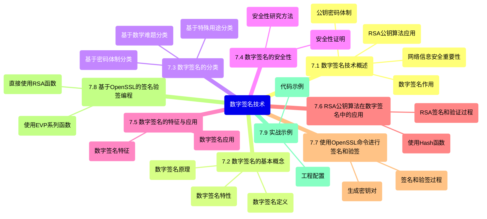

[toc]
# 密码系统设计

## 第五周预习报告 
### 学习内容
- [《Windows C/C++加密解密实战》](https://weread.qq.com/web/bookDetail/a0332190813ab78fag011422?wfrom=bookDetailH5)第 7 章
- [课程 mindmap](https://www.processon.com/mindmap/66bcf83cce68f62ecf3f63fc?from=pwa)
- 报告内容参考第一周

### AI 对学习内容的总结（1分）
#### 要求
- 让AI（kimi，元宝等）阅读学习内容并进行总结，教材内容可以使用微信读书或者云班课电子教材
#### 总结

- [Kimi对《Windows C/C++加密解密实战》第七章的总结](https://kimi.moonshot.cn/share/cs3p7du65ra0cm22d57g)
  ```
  User: 请为我总结该书第七章的内容，并尽可能详细 

  Kimi: 第七章主要讨论了数字签名技术，包括其概念、原理、分类、安全性、特征、应用以及如何在Windows平台上使用C/C++进行加密解密实战。以下是对第七章内容的详细总结：

  ### 7.1 数字签名技术概述
  - **网络信息安全的重要性**：随着网络攻击的增加，信息安全变得尤为重要。
  - **公钥密码体制**：RSA算法作为公钥密码体制的代表，被广泛应用于各种安全领域。
  - **数字签名的作用**：提供实体认证、认证密钥传输和认证密钥协商等服务，确保消息的完整性和发送者身份的真实性。

  ### 7.2 数字签名的基本概念
  - **数字签名的特性**：包括不可抵赖性、不可伪造性、可仲裁性。
  - **数字签名的原理**：涉及密钥生成、消息签名、签名验证等步骤。
  - **数字签名的一般性定义**：由消息空间、签名空间、密钥空间和三个算法（密钥生成、签名生成、签名验证）组成。

  ### 7.3 数字签名的分类
  - **基于数学难题的分类**：如基于离散对数问题、素因子分解问题等。
  - **基于密码体制的分类**：对称密钥密码体制和非对称密钥密码体制。
  - **基于特殊用途的分类**：如盲签名、双重签名、群签名、代理签名等。

  ### 7.4 数字签名的安全性
  - **安全性研究**：包括安全性评估、安全性证明和攻击分析。
  - **安全性证明的方法**：随机应答模型和标准模型。

  ### 7.5 数字签名的特征与应用
  - **数字签名的特征**：消息发送方不可否认签名，接收方可以确认签名等。
  - **数字签名的应用**：在电子商务、网络安全通信等领域中的关键作用。

  ### 7.6 RSA公钥算法在数字签名中的应用
  - **RSA算法的签名和验证过程**：包括参数选择、密钥生成、签名生成和验证。
  - **使用Hash函数**：提高签名效率，确保消息完整性。

  ### 7.7 使用OpenSSL命令进行签名和验签
  - **生成密钥对**：使用OpenSSL命令行工具生成RSA密钥对。
  - **签名和验签过程**：使用私钥进行签名，公钥进行验签。

  ### 7.8 基于OpenSSL的签名验签编程
  - **直接使用RSA函数**：使用`RSA_sign`和`RSA_verify`函数进行签名和验签。
  - **使用EVP系列函数**：通过`EVP_SignInit_ex`、`EVP_SignUpdate`、`EVP_SignFinal`等函数进行签名，以及`EVP_VerifyInit_ex`、`EVP_VerifyUpdate`、`EVP_VerifyFinal`进行验签。

  ### 7.9 实战示例
  - **代码示例**：提供了使用OpenSSL进行签名和验签的C/C++代码示例。
  - **工程配置**：如何在Visual Studio中配置项目以使用OpenSSL库。

  第七章通过理论介绍和实战示例，全面阐述了数字签名技术的重要性、原理、实现方法和应用场景。 

  ```

- [豆包对《Windows C/C++加密解密实战》第七章的总结](https://www.doubao.com/thread/wea6cb98f024df3d4)
  ```
  第七章主要讲述了数字签名技术，包括其概念、原理、分类、安全性以及应用等方面，同时介绍了RSA公钥算法在数字签名中的应用，以及使用OpenSSL命令和编程进行签名和验签的方法。具体内容如下：

  ### 1. 数字签名技术的背景和重要性
  - 随着互联网的发展，网络攻击增多，信息安全问题凸显。为保障网络中数据传输的保密性、完整性等，加密技术至关重要，数字签名技术是公钥密码学发展过程中衍生出的一种安全认证技术。

  ### 2. 数字签名的基本概念
  - **定义和特性**
      - 数字签名是对手写签名的模拟，至少要满足不可抵赖性、不可伪造性和可仲裁性三个条件。
      - 数字签名算法与公钥加密算法类似，签名是利用签名者的私钥对消息进行计算、变换，验证则是利用公钥检验。
  - **原理**
      - 系统初始化生成参数，发送方用私钥对消息签名，将消息原文和数字签名传给接收方，接收方用发送方公钥解密签名并与原文对比。
  - **一般性定义**
      - 由消息空间、签名空间、密钥空间以及密钥生成算法、签名生成算法、签名验证算法组成。
  - **分类**
      - **基于数学难题**：可分为基于离散对数问题、素因子分解问题、椭圆曲线等的签名方案。
      - **基于密码体制**：分为对称密钥密码体制和非对称密钥密码体制的数字签名，非对称密钥体制更适合数字签名。
      - **基于特殊用途**：介绍了盲签名、双重签名、群签名、代理签名等特殊数字签名。
      - **其他分类**：根据接收者验证签名的方式、签名者能签消息的个数、验证方程的形式、数字签名的功能等进行分类。
  - **安全性**
      - 从安全性评估、安全性证明和攻击三个方面进行研究，以鉴定签名方案是否满足信息完整性、抗修改性和抗抵赖性等安全性质。

  ### 3. 数字签名的特征与应用
  - 优秀数字签名应具备消息发送方不可否认、接收方不可伪造、签名不可复制、接收方不可否认以及可存在第三方确认通信过程等特征。
  - 在电子商务等领域有广泛应用，RSA公钥签名方案在互联网行为中应用广泛。

  ### 4. RSA公钥算法在数字签名中的应用
  - RSA公钥签名方案包括消息空间、参数生成算法、签名算法和验证算法等部分。
  - 签名过程包括参数选择和密钥生成、用私钥对消息签名、接收方验证签名等步骤，对于长文件可利用单项摘要函数提高效率。

  ### 5. 使用OpenSSL命令进行签名和验签
  - 首先生成RSA密钥对（私钥和公钥），然后用私钥对文件摘要值进行签名，再用公钥进行验签。

  ### 6. 基于OpenSSL的签名验签编程
  - **直接使用RSA函数进行签名验签**
      - OpenSSL提供RSA_sign和RSA_verify函数，分别用于签名和验签，需先计算摘要再进行操作。
  - **使用EVP系列函数进行签名验签**
      - 签名和验签流程都包括初始化、更新和结束三个步骤，OpenSSL对相关函数进行了封装。
  ```

### 对 AI 总结的反思与补充（2分）
#### 要求
- AI总结的问题
- 自己的补充
#### 反思与补充

- AI总结的问题
  - 不同Ai总结的侧重点不同，比如豆包的层级更多，kimi的内容更加完整丰富
- 自己的补充
  - 要注意多种AI的使用，海纳百川

### 学习思维导图（2分）
#### 要求
- Mermaid 代码与截图(参考[Mermaid MindMap语法](https://mermaid.live/edit#pako:eNpdUk1vwjAM_StWTiAx7V5Nk2A7DoEGu_ViUreN1tqZkyB1iP--8FG2kZP93svTk-2DsVKRKUzvuOrRlwygInEyuQLT6QkCWKlrHIdLA_Am3EDrQhQdRqwonBWe1Ag1PuxEPqcjsxafOlQXMDrhEQVYqIsutOAvPPgw2FY6aQbAFFtR2AoPsEjfeP31ToFQbTt6rBiorslGt2cK4Wmnj8_IFdSEMSmFP7p5itLnABas0l2Qj_ArvbyXs2ZPEMm27L7SvWATFSM12c53yOy4-c_PtUk9cYQ8RH9jtyLdzWhNDKewHj3pCC5Je3SVmZn-WhXmcCJLE1vqqTRFLiuqMXWxNCUfszRPSzYDW1NETTQzKqlpTVFjF3KXfJWjvjpsFPtRQpXLy1tetn8-guMPMYioGg))**或者**提交思维导图链接（如果使用线上编辑器，推荐[processon](https://www.processon.com/),[xmind](https://xmind.cn/),...）
#### 思维导图

mermaid的思维导图:


### 基于 AI 的学习（2分）
#### 要求
- 至少找到自己理解不是太好 2 个概念，让 AI 对自己进行苏格拉底提问
- 参考下面提示语或者使用 AI Agent

提示词：“我在学习XXX知识点，请你以苏格拉底的方式对我进行提问，一次一个问题”
1. 核心是要求AI工具：“请你以苏格拉底的方式对我进行提问”
2. 然后AI工具就会给你提问，如果不知道问题的答案，可以反问AI：“你的理解（回答）是什么？”
3. 如果你觉得差不多了，可以先问问AI工具：“针对我XXX知识点，我理解了吗？”
4. AI工具会给出它的判断，如果你也觉得自己想清楚了，可以最后问AI工具：“我的回答结束了，请对我的回答进行评价总结”，让它帮你总结一下。

#### 学习内容

- [学习“基于OpenSSL的签名验签编程”的知识点](https://kimi.moonshot.cn/share/cs57rcbmvq8p53jc13k0)
  ```
  User: 我对上书第七章的“基于OpenSSL的签名验签编程”不太了解，请你以苏格拉底的方式对我进行提问，一次一个问题，但不超过4个问题 

  Kimi: 当然，我们可以采用苏格拉底式的提问法来探讨“基于OpenSSL的签名验签编程”。我会逐步提出问题，引导你深入思考这个主题。

  1. 你是否记得什么是数字签名，以及它在数据传输中扮演什么角色？ 

  User: 数字签名是一种用于确保数据完整性和验证发送者身份的技术。它在数据传输中扮演着非常重要的角色，主要体现在以下几个方面：

  1.完整性：数字签名可以用来检测数据在传输过程中是否被篡改。如果数据被修改，那么签名将不再匹配，接收方可以发现数据已经被更改。
  2.认证：通过使用公钥加密技术，数字签名能够确认数据确实来自所声称的发送者。只有拥有相应私钥的人才能生成有效的签名，因此接收方可以通过验证签名来确认发送者的身份。
  3.不可否认性：一旦数据被签名，发送者就不能否认他们发送了这份数据 

  Kimi: 非常好，你已经很好地理解了数字签名的基本概念和它在数据传输中的重要性。现在，让我们继续探讨基于OpenSSL的签名验签编程。

  2. 你知道OpenSSL是什么吗？它在数字签名的过程中扮演了怎样的角色？ 

  User: OpenSSL 是一个强大的开源工具包，它实现了安全套接字层和传输层安全协议。此外，OpenSSL 也提供了加密库，支持多种密码学算法，包括对称加密、非对称加密、哈希函数等。它被广泛用于互联网上的各种安全通信中，比如HTTPS协议中的证书管理。

  在数字签名的过程中，OpenSSL 可以扮演几个关键角色：

  1.生成密钥对：OpenSSL 可以用来生成公钥和私钥对。这是数字签名的基础，因为只有使用私钥才能创建有效的签名，而相应的公钥则用于验证这个签名。
  2.创建数字签名：一旦有了私钥，OpenSSL 可以用来创建数据的数字签名。这通常涉及到先计算数据的哈希值，然后使用私钥对哈希值进行加密，得到的就是数字签名。
  3.验证数字签名：接收方可以使用发送者的公钥来解密收到的数字签名，并且重新计算原始数据的哈希值。如果两个哈希值匹配，那么就可以确认数据未被篡改且确实来自拥有相应私钥的发送者。
  4.证书管理：OpenSSL 支持 X.509 标准的证书处理，包括生成自签名证书、请求证书签署、安装证书等。这些证书包含公钥信息，并且可以由认证机构（CA）签名，从而为用户提供信任链。
  5.加密与解密：除了数字签名外，OpenSSL 也可以用于数据的加密和解密过程，保护数据的机密性 

  Kimi: 很棒，你已经对OpenSSL的功能和它在数字签名中的作用有了深入的了解。接下来，让我们更进一步。

  3. 在使用OpenSSL进行数字签名时，你是否了解基本的签名和验签流程包括哪些步骤？ 

  User: 数字签名流程
  1.准备原始数据：
  首先，需要有要签名的数据或消息。
  2.生成哈希值：
  使用一个安全的哈希算法（如 SHA-256）来计算原始数据的哈希值。这一步是为了将任意长度的数据转换成固定长度的摘要。
  3.创建私钥和公钥对（如果还没有的话）：
  如果你还没有密钥对，可以使用 OpenSSL 生成一对非对称密钥，即私钥和对应的公钥。
  例如，可以使用 openssl genpkey 命令生成私钥，并使用 openssl pkey -pubout 从私钥中提取公钥。
  用私钥进行签名：
  使用你的私钥对之前生成的哈希值进行加密，从而创建数字签名。这个过程通常涉及到选择特定的签名算法（如 RSA 或 ECDSA）。
  在 OpenSSL 中，你可以使用 openssl dgst 命令加上 -sign 选项来执行这一步骤。
  4.验证签名流程
  获取原始数据、签名和公钥：
  接收方需要获得原始数据、数字签名以及用于签名的公钥。
  5.重新计算哈希值：
  接收方同样使用相同的哈希算法来计算原始数据的哈希值。
  6.用公钥验证签名：
  使用发送者的公钥来解密接收到的数字签名，得到签名时使用的哈希值。
  在 OpenSSL 中，可以使用 openssl dgst 命令加上 -verify 选项来进行这一步骤。
  7.比较哈希值：
  比较通过解密签名得到的哈希值与接收方自己计算出的哈希值是否一致。如果两者匹配，则说明数据未被篡改且确实来自拥有相应私钥的发送者；如果不匹配，则表明数据可能已被篡改或者签名无效。 

  Kimi: 非常好，你已经详细描述了使用OpenSSL进行数字签名和验证的流程。这表明你对实际操作过程有了清晰的认识。最后一个问题：

  4. 在编程实践中，你是否知道如何使用OpenSSL库中的函数来实现这些签名和验签的步骤？ 

  User: 不知道，你的回答是什么呢 

  Kimi: 在编程实践中，使用OpenSSL库实现签名和验签的步骤通常涉及以下函数：

  1. **生成密钥对**：
    - 使用`RSA_generate_key`函数可以生成RSA密钥对。
    - 使用`EVP_PKEY_new_RSA`和`EVP_PKEY_assign_RSA`函数可以创建和分配一个`EVP_PKEY`结构体给RSA密钥。

  2. **创建数字签名**：
    - 首先，使用`EVP_DigestInit_ex`初始化一个摘要上下文。
    - 然后，使用`EVP_SignUpdate`更新摘要上下文，传入要签名的数据。
    - 最后，使用`EVP_SignFinal`完成签名过程，它将填充签名缓冲区。

  3. **验证数字签名**：
    - 类似地，首先使用`EVP_DigestInit_ex`初始化一个摘要上下文。
    - 使用`EVP_VerifyUpdate`更新摘要上下文，传入原始数据。
    - 使用`EVP_VerifyFinal`完成验证过程，它会告诉你签名是否有效。

  这里有一个简化的代码示例，展示了如何使用OpenSSL库中的函数来实现签名和验签：

  ```c
  #include <openssl/evp.h>
  #include <openssl/rsa.h>

  // 假设message是要签名的消息，message_len是消息的长度
  // 假设private_key是签名使用的RSA私钥

  // 初始化一个EVP_PKEY用于签名
  EVP_PKEY *pkey = EVP_PKEY_new();
  EVP_PKEY_assign_RSA(pkey, private_key);

  // 创建签名
  EVP_MD_CTX *ctx = EVP_MD_CTX_create();
  EVP_SignInit_ex(ctx, EVP_sha256(), NULL);
  EVP_SignUpdate(ctx, message, message_len);
  unsigned char signature[EVP_MAX_MD_SIZE];
  unsigned int signature_len;
  EVP_SignFinal(ctx, signature, &signature_len, pkey);
  EVP_MD_CTX_destroy(ctx);

  // 验证签名
  ctx = EVP_MD_CTX_create();
  EVP_VerifyInit_ex(ctx, EVP_sha256(), NULL);
  EVP_VerifyUpdate(ctx, message, message_len);
  int result = EVP_VerifyFinal(ctx, signature, signature_len, pkey);
  EVP_MD_CTX_destroy(ctx);

  // result为1表示签名验证成功，0表示失败
  ```

  请注意，这只是一个示例，实际使用时需要对错误处理、内存管理和密钥管理进行适当的处理。此外，还需要确保包含了正确的OpenSSL头文件，并且在编译时链接了OpenSSL库。 

  User: 针对这个知识点，我理解了吗？ 

  Kimi: 根据你之前的回答，你已经对数字签名的概念、重要性、以及使用OpenSSL进行签名和验证的过程有了很好的理解。你能够描述数字签名的作用、为何重要，以及如何在实践中使用OpenSSL命令行工具和库函数来生成密钥、创建签名和验证签名。

  然而，理解一个概念和能够将其应用于实际编程之间可能还存在差距。对于“基于OpenSSL的签名验签编程”这一知识点，如果你能够：

  1. 描述出数字签名的整个流程，包括密钥的生成、签名的创建和验证。
  2. 理解在编程中如何使用OpenSSL库中的函数来实现这些步骤。
  3. 知道如何处理OpenSSL函数调用中可能出现的错误。
  4. 能够编写或理解基本的代码示例，展示如何使用OpenSSL进行签名和验签。

  如果你能够做到以上这些，那么你可以说对这一知识点有了较为全面的了解。如果你在将理论应用到实践中遇到困难，比如编写代码时遇到具体问题，那么可能需要进一步的实践和学习来加深理解。在编程领域，很多时候理解一个概念和能够熟练应用它是两回事，实践是检验理解程度的最好方式。 

  ```

- [学习“盲签名、双重签名、群签名、代理签名”知识点](https://kimi.moonshot.cn/share/cs580621jcjimd4t156g)
  ```
  User: 我对上书第七章的“盲签名、双重签名、群签名、代理签名”不太了解，请你以苏格拉底的方式对我进行提问，一次一个问题，但不超过4个问题 

  Kimi: 当然，让我们通过提问来探索这些高级数字签名技术。

  1. 你能描述一下在什么情况下，我们可能需要使用“盲签名”技术吗？ 

  User: 盲签名技术是一种特殊的数字签名形式，它允许一方（通常是签名者）对消息进行签名，而不知道消息的实际内容。这种技术在需要保护用户隐私或确保匿名性的情况下特别有用。以下是一些可能使用盲签名技术的场景：

  1.电子投票：
  在电子投票系统中，盲签名可以用来保证选票的匿名性和完整性。每个选民都可以提交一个被盲化的选票给权威机构签名，然后解盲后提交。这样，投票者的身份与他们所投的票是分离的，同时又能确保选票没有被篡改。
  2.数字现金：
  例如，在一些匿名数字货币方案中，银行或其他金融机构可以发行带有盲签名的货币单位。用户可以在不透露自己身份的情况下从银行获取这些货币，并且银行也无法追踪到具体的交易细节，从而实现一定程度的匿名支付。
  3.证书颁发：
  在某些情况下，认证机构（CA）可能会使用盲签名来颁发证书。这样，即使 CA 签名了证书，它也不知道证书的具体内容或用途，这有助于保护用户的隐私。
  4.匿名凭证：
  盲签名也可以用于生成匿名凭证，如身份证明、资格证明等。例如，学校可以为学生签发成绩单的盲签名版本，这样第三方验证时无法看到学生的具体成绩信息，但可以确认成绩单的真实性。
  5.隐私保护协议：
  在各种需要保护通信双方隐私的协议中，盲签名可以用来隐藏数据的同时提供不可否认性和完整性保障。比如，在某些安全协议中，盲签名可以帮助确保某方发送的消息未被篡改，同时保持消息内容的私密性。
  6.零知识证明：
  结合零知识证明技术，盲签名可以在不需要揭示任何额外信息的情况下证明某个声明的真实性。这在需要证明拥有某种属性而不暴露该属性具体内容的情况下非常有用。 

  Kimi: 很棒，你已经很好地描述了盲签名的概念和应用场景。这表明你理解了盲签名的核心价值在于保护信息内容的隐私，同时确保签名的有效性。

  2. 在了解了盲签名之后，你能想到在什么情况下我们可能需要“双重签名”吗？ 

  User: 双重签名（Dual Signature）是一种安全技术，它允许一个实体对两个不同的消息或数据块生成一个单一的签名，使得接收方可以独立验证每个消息。这种技术通常用于需要同时保护两份不同但相关联的信息的情况，并且确保这两份信息之间的关联性不会被篡改。以下是几个可能使用双重签名的情景：

  1. 支付与收据：
    - 在电子交易中，双重签名可以用来同时签署支付指令和对应的收据。这保证了支付信息和收据信息的一致性和完整性，防止其中任何一方被篡改。例如，当用户通过网络进行支付时，双重签名可以确保支付金额和商家提供的商品描述是一致的。

  2. 匿名通信：
    - 在某些匿名通信系统中，双重签名可以用来证明消息是由某个特定的发送者发出的，同时保持消息内容的隐私。例如，一个用户可以通过双重签名向第三方证明他们已经发送了一条消息给接收者，而不需要揭示消息的内容。

  3. 多方协议：
    - 当多个参与者需要就某项协议达成一致时，双重签名可以用来签署多个文档或条件。这样可以确保所有相关的文档都是由同一个签署人签署的，而且这些文档之间存在不可分割的关系。

  4. 法律文件：
    - 在处理合同或其他法律文件时，双重签名可以用来同时签署合同的不同部分，如条款说明和执行细节。这样可以保证合同的所有部分都是一起签署的，并且没有被单独修改。

  5. 身份认证：
    - 双重签名还可以用于增强身份认证过程。例如，在一个多因素认证系统中，双重签名可以用来确认用户的凭据和额外的身份信息是匹配的。

  6. 数字证书：
    - 在一些高级的数字证书应用中，双重签名可以用来链接证书链中的不同层级，确保整个链条的完整性和一致性。

  7. 物联网（IoT）设备：
    - 对于 IoT 设备来说，双重签名可以用来确保设备固件更新的同时附带的安全策略是一致的。这意味着固件和安全策略都是由同一权威机构发布的，从而增加了系统的安全性。

  双重签名的核心在于它提供了一种机制来验证两个相关但不同的数据块之间的关系，确保它们来自同一个来源并且没有被篡改。在设计和实现双重签名方案时，重要的是要考虑到安全性、效率以及应用场景的具体需求。 

  Kimi: 非常好，你已经详细描述了双重签名的概念和可能的应用场景。这表明你理解了双重签名的核心价值在于确保两个相关数据块的一致性和完整性。

  3. 了解了双重签名之后，你能描述一下“群签名”是什么吗？它在哪些场景下可能被使用？ 

  User: 群签名是一种特殊的数字签名形式，它允许群组中的任何成员代表整个群组对消息进行签名，同时保持匿名性。这意味着验证者可以确认签名是由群组中某个合法成员生成的，但无法确定具体是哪个成员。只有群管理员或特定的撤销管理机构能够识别出具体的签名者身份，这种特性通常用于需要保证个人隐私的同时又能确保责任归属的场景。

  群签名的关键特性包括：

  - 匿名性：群成员在签名时保持匿名，外界无法知道具体是哪位成员签署了消息。
  - 不可伪造性：非群成员不能生成有效的群签名。
  - 可追踪性：群管理员能够在必要时揭露签名者的身份，以防止滥用。
  - 防止重放攻击：每个签名都是唯一的，防止签名被重复使用。

  群签名的应用场景：

  1. 电子投票系统：
    - 在电子投票中，群签名可以用来确保选民的匿名性，同时允许选举委员会在必要时追踪到具体的选票来源，以防止舞弊行为。

  2. 企业内部通信：
    - 企业可能希望员工能够匿名提交意见或报告问题，但又能在发生恶意行为时追踪到具体的员工。群签名可以满足这一需求。

  3. 匿名认证：
    - 当用户需要证明他们是某个组织的一部分，但不想透露个人身份时，可以使用群签名。例如，在访问某些资源时，用户可以通过群签名证明自己属于某个会员群体，而不需要暴露个人信息。

  4. 车辆网络（VANETs）：
    - 在智能交通系统中，车辆之间通过无线通信交换信息。群签名可以用来验证信息确实来自某辆合法车辆，但不暴露该车辆的具体身份，从而保护司机隐私。

  5. 匿名支付系统：
    - 在一些匿名支付方案中，用户可以作为群成员进行交易，确保交易的匿名性，同时银行或其他金融机构可以在法律要求下追踪到交易的发起者。

  6. 社交媒体和论坛：
    - 社交平台上的用户可以使用群签名来发表评论或帖子，这样可以保护用户的隐私，同时也让平台管理者有能力处理不当内容。

  7. 举报系统：
    - 组织内的举报系统可以采用群签名技术，鼓励员工匿名举报违法行为或不当行为，同时保留了在严重情况下追溯的能力。

  群签名结合了匿名性和责任性的优点，为许多需要平衡隐私与安全的场合提供了理想的解决方案。不过，实施群签名方案也需要考虑相关的管理和技术挑战，比如如何安全地分发密钥、如何高效地执行签名和验证过程等。 

  Kimi: 你已经对群签名的概念和应用场景有了很好的理解。群签名确实在需要匿名性与可追责性之间提供了一个平衡，这在很多实际应用中是非常有价值的。

  4. 最后，你能尝试解释一下什么是“代理签名”吗？在哪些情况下可能会使用到它？ 

  User: 代理签名（Proxy Signature）是一种数字签名方案，它允许原始签名者（委托人）将签署消息的权利委托给另一个实体（代理人）。在这种情况下，代理人可以代表委托人对消息进行签名，而验证者能够确认这个签名是由代理人代表委托人签署的。代理签名通常包含三个主要角色：原始签名者（委托人）、代理人和验证者。

  代理签名的关键特性包括：

  - 可识别性：验证者能够区分代理签名和直接由委托人生成的签名。
  - 不可伪造性：只有被授权的代理人能够生成有效的代理签名。
  - 责任归属：如果出现争议或需要追责时，可以确定是哪个代理人代表委托人签署了消息。

  代理签名的应用场景：

  1. 远程业务处理：
    - 当委托人无法亲自签署文件或信息时（例如，出差在外），可以通过代理签名授权他人代为签署。这在法律文件、合同签署等场合非常有用。

  2. 企业内部管理：
    - 在企业中，高级管理人员可能需要经常外出，但他们仍然需要批准某些决策或文档。通过代理签名，他们可以授权下属或同事代为签署相关文件。

  3. 分布式系统：
    - 在分布式计算环境中，一个节点可能需要代表其他节点执行操作。代理签名可以确保这些操作是由被授权的代理执行的，并且可以追溯到原始请求者。

  4. 电子政务：
    - 政府官员可能需要在多个地方签署官方文件，但不可能每次都亲自到场。使用代理签名可以让指定的工作人员代表官员签署文件，同时保持过程的安全性和透明度。

  5. 紧急情况下的授权：
    - 在紧急情况下，如自然灾害或健康危机，关键人员可能无法履行其职责。通过预先设置的代理签名权限，可以确保业务连续性和快速响应。

  6. 匿名通信中的责任转移：
    - 在某些匿名通信系统中，用户可能希望保留一定的匿名性，但在特定情况下又需要承担责任。代理签名可以用来实现这一点，即平时保持匿名，但在必要时能追踪到具体的个体。

  7. 移动支付和电子商务：
    - 在移动支付系统中，用户可能希望授权第三方应用或服务代表自己进行交易。代理签名可以确保这种授权是安全的，并且可以在发生纠纷时提供证据。

  代理签名提供了一种灵活的方式来管理和分配签名权限，同时保持了系统的安全性和可追溯性。然而，为了保证代理签名的有效性和安全性，必须建立严格的身份验证机制和撤销流程，以防止滥用代理权限的情况发生。此外，还需要考虑如何妥善处理密钥分发和管理的问题。 

  Kimi: 你的描述非常准确，代理签名确实是一种灵活的机制，允许委托人在无法亲自签名时，通过代理人进行签名。这种技术在需要远程或代理授权的场景中非常有用。

  通过这些问题，我希望你能更深入地理解这些高级数字签名技术，包括它们的定义、特性以及潜在的应用场景。如果你有任何疑问或需要进一步的讨论，随时告诉我。 

  User: 我的回答结束了，请对我的回答进行评价总结 

  Kimi: 你的回答体现了对高级数字签名技术的深刻理解，以下是对你回答的总结和评价：

  1. **盲签名**：你准确地描述了盲签名的概念，包括其在保护信息内容隐私的同时确保签名有效性的特点。你提供的应用场景，如电子投票和数字现金，恰当地展示了盲签名在实际中的应用，说明了你理解了盲签名的核心价值和实际意义。

  2. **双重签名**：你的回答涵盖了双重签名的定义和应用场景，如支付与收据、匿名通信等。这表明你不仅理解了双重签名的技术细节，还意识到了它在确保数据块一致性和完整性方面的重要性。

  3. **群签名**：你对群签名的描述清晰，突出了其匿名性和可追踪性的平衡。你列举的应用场景，如企业内部通信、车辆网络等，进一步证实了你对群签名在保护个人隐私同时允许必要追踪的应用有深入的认识。

  4. **代理签名**：你的解释清楚地传达了代理签名的工作原理和用途，特别是在远程业务处理、企业内部管理等场景下的应用。你的回答显示了对代理签名灵活性和安全性特征的理解。

  总体来说，你的回答表明你对这些高级数字签名技术有全面的理解，能够把握它们的定义、特性以及在不同场景下的应用。你还能够提出这些技术在实际应用中可能遇到的需求和挑战，这显示了你的批判性思维和分析能力。如果你在实际编程或更深层次的技术实现方面有进一步的探索，那么你将能够更全面地掌握这些复杂的数字签名技术。 


  ```


### 学习实践过程遇到的问题与解决方式（AI 驱动，优先使用AI工具解决问题）（2分）
至少两个
- 问题 1:如何快速阅读大量英文注释的代码
  - 解决过程：直接问AI如何理解这段代码，比如：[代码学习](https://lxblog.com/qianwen/share?shareId=3f9d47fb-17a5-4008-9ce2-4afc6796f324)
  - 注意：AI很可能会望文生义，所以不建议让AI阅读一些命名不规范不整洁、缺少注释的代码，除非这些代码是明确来自某个知名代码库比如Gmssl中的。
- 问题 2:vscode的git功能总是连接不上GitHub该如何解决，解决过程：
  - 多个AI的回复：
    - [KIMI](https://kimi.moonshot.cn/share/cs586i5vfrpm5l5mliog)
    - [豆包](https://www.doubao.com/thread/wbf86e7e68a61dec7)
    - [通义千问](https://lxblog.com/qianwen/share?shareId=4f653172-2590-4d56-b08d-78eed757d339)
  - 统合回答来看，需要保证Github加速开启，同时可以打开自己仓库界面来测试网络环境。可以根据vscode提供的报错信息去具体查抄原因。

### 作业提交要求（1分）

1. 提交Markdown 文件,文档命名“学号姓名《密码系统设计》.md”
2. 提交Markdown 文件转为 PDF,文档命名“学号姓名《密码系统设计》第 X 周.pdf”
3. 提交代码托管链接：[我的作业的github链接](https://github.com/youer0219/Information-Security-System-Design-Assignment) 
4. 内容质量高有加分

### 参考资料
- AI工具(你使用的AI工具及其链接)
  - [Kimi](https://kimi.moonshot.cn/)
  - [文心一言](https://yiyan.baidu.com/)
  - [通义千问](https://tongyi.aliyun.com/)
  - [豆包](https://www.doubao.com/chat/)
- 图书
  - [《Windows C/C++加密解密实战》](https://weread.qq.com/web/bookDetail/a0332190813ab78fag011422?wfrom=bookDetailH5)
  - [Head First C 嗨翻 C 语言](https://www.ituring.com.cn/book/1004)
