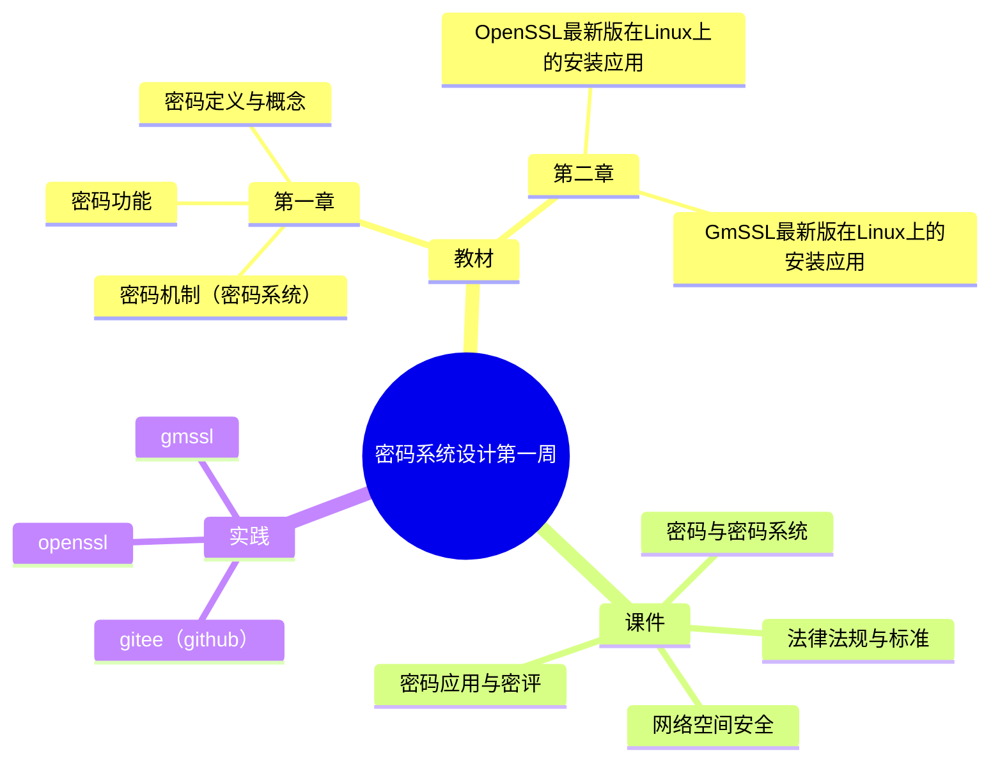

[toc]
# 密码系统设计

## 第五周预习报告 
### 学习内容
- [《Windows C/C++加密解密实战》](https://weread.qq.com/web/bookDetail/a0332190813ab78fag011422?wfrom=bookDetailH5)第 7 章
- [课程 mindmap](https://www.processon.com/mindmap/66bcf83cce68f62ecf3f63fc?from=pwa)
- 报告内容参考第一周

### AI 对学习内容的总结（1分）
#### 要求
- 让AI（kimi，元宝等）阅读学习内容并进行总结，教材内容可以使用微信读书或者云班课电子教材
#### 总结

- [Kimi对《Windows C/C++加密解密实战》第七章的总结](https://kimi.moonshot.cn/share/cs3p7du65ra0cm22d57g)
  ```
  User: 请为我总结该书第七章的内容，并尽可能详细 

  Kimi: 第七章主要讨论了数字签名技术，包括其概念、原理、分类、安全性、特征、应用以及如何在Windows平台上使用C/C++进行加密解密实战。以下是对第七章内容的详细总结：

  ### 7.1 数字签名技术概述
  - **网络信息安全的重要性**：随着网络攻击的增加，信息安全变得尤为重要。
  - **公钥密码体制**：RSA算法作为公钥密码体制的代表，被广泛应用于各种安全领域。
  - **数字签名的作用**：提供实体认证、认证密钥传输和认证密钥协商等服务，确保消息的完整性和发送者身份的真实性。

  ### 7.2 数字签名的基本概念
  - **数字签名的特性**：包括不可抵赖性、不可伪造性、可仲裁性。
  - **数字签名的原理**：涉及密钥生成、消息签名、签名验证等步骤。
  - **数字签名的一般性定义**：由消息空间、签名空间、密钥空间和三个算法（密钥生成、签名生成、签名验证）组成。

  ### 7.3 数字签名的分类
  - **基于数学难题的分类**：如基于离散对数问题、素因子分解问题等。
  - **基于密码体制的分类**：对称密钥密码体制和非对称密钥密码体制。
  - **基于特殊用途的分类**：如盲签名、双重签名、群签名、代理签名等。

  ### 7.4 数字签名的安全性
  - **安全性研究**：包括安全性评估、安全性证明和攻击分析。
  - **安全性证明的方法**：随机应答模型和标准模型。

  ### 7.5 数字签名的特征与应用
  - **数字签名的特征**：消息发送方不可否认签名，接收方可以确认签名等。
  - **数字签名的应用**：在电子商务、网络安全通信等领域中的关键作用。

  ### 7.6 RSA公钥算法在数字签名中的应用
  - **RSA算法的签名和验证过程**：包括参数选择、密钥生成、签名生成和验证。
  - **使用Hash函数**：提高签名效率，确保消息完整性。

  ### 7.7 使用OpenSSL命令进行签名和验签
  - **生成密钥对**：使用OpenSSL命令行工具生成RSA密钥对。
  - **签名和验签过程**：使用私钥进行签名，公钥进行验签。

  ### 7.8 基于OpenSSL的签名验签编程
  - **直接使用RSA函数**：使用`RSA_sign`和`RSA_verify`函数进行签名和验签。
  - **使用EVP系列函数**：通过`EVP_SignInit_ex`、`EVP_SignUpdate`、`EVP_SignFinal`等函数进行签名，以及`EVP_VerifyInit_ex`、`EVP_VerifyUpdate`、`EVP_VerifyFinal`进行验签。

  ### 7.9 实战示例
  - **代码示例**：提供了使用OpenSSL进行签名和验签的C/C++代码示例。
  - **工程配置**：如何在Visual Studio中配置项目以使用OpenSSL库。

  第七章通过理论介绍和实战示例，全面阐述了数字签名技术的重要性、原理、实现方法和应用场景。 

  ```

- [豆包对《Windows C/C++加密解密实战》第七章的总结](https://www.doubao.com/thread/wea6cb98f024df3d4)
  ```
  第七章主要讲述了数字签名技术，包括其概念、原理、分类、安全性以及应用等方面，同时介绍了RSA公钥算法在数字签名中的应用，以及使用OpenSSL命令和编程进行签名和验签的方法。具体内容如下：

  ### 1. 数字签名技术的背景和重要性
  - 随着互联网的发展，网络攻击增多，信息安全问题凸显。为保障网络中数据传输的保密性、完整性等，加密技术至关重要，数字签名技术是公钥密码学发展过程中衍生出的一种安全认证技术。

  ### 2. 数字签名的基本概念
  - **定义和特性**
      - 数字签名是对手写签名的模拟，至少要满足不可抵赖性、不可伪造性和可仲裁性三个条件。
      - 数字签名算法与公钥加密算法类似，签名是利用签名者的私钥对消息进行计算、变换，验证则是利用公钥检验。
  - **原理**
      - 系统初始化生成参数，发送方用私钥对消息签名，将消息原文和数字签名传给接收方，接收方用发送方公钥解密签名并与原文对比。
  - **一般性定义**
      - 由消息空间、签名空间、密钥空间以及密钥生成算法、签名生成算法、签名验证算法组成。
  - **分类**
      - **基于数学难题**：可分为基于离散对数问题、素因子分解问题、椭圆曲线等的签名方案。
      - **基于密码体制**：分为对称密钥密码体制和非对称密钥密码体制的数字签名，非对称密钥体制更适合数字签名。
      - **基于特殊用途**：介绍了盲签名、双重签名、群签名、代理签名等特殊数字签名。
      - **其他分类**：根据接收者验证签名的方式、签名者能签消息的个数、验证方程的形式、数字签名的功能等进行分类。
  - **安全性**
      - 从安全性评估、安全性证明和攻击三个方面进行研究，以鉴定签名方案是否满足信息完整性、抗修改性和抗抵赖性等安全性质。

  ### 3. 数字签名的特征与应用
  - 优秀数字签名应具备消息发送方不可否认、接收方不可伪造、签名不可复制、接收方不可否认以及可存在第三方确认通信过程等特征。
  - 在电子商务等领域有广泛应用，RSA公钥签名方案在互联网行为中应用广泛。

  ### 4. RSA公钥算法在数字签名中的应用
  - RSA公钥签名方案包括消息空间、参数生成算法、签名算法和验证算法等部分。
  - 签名过程包括参数选择和密钥生成、用私钥对消息签名、接收方验证签名等步骤，对于长文件可利用单项摘要函数提高效率。

  ### 5. 使用OpenSSL命令进行签名和验签
  - 首先生成RSA密钥对（私钥和公钥），然后用私钥对文件摘要值进行签名，再用公钥进行验签。

  ### 6. 基于OpenSSL的签名验签编程
  - **直接使用RSA函数进行签名验签**
      - OpenSSL提供RSA_sign和RSA_verify函数，分别用于签名和验签，需先计算摘要再进行操作。
  - **使用EVP系列函数进行签名验签**
      - 签名和验签流程都包括初始化、更新和结束三个步骤，OpenSSL对相关函数进行了封装。
  ```

### 对 AI 总结的反思与补充（2分）
#### 要求
- AI总结的问题
- 自己的补充
#### 反思与补充

- AI总结的问题
  - 不同Ai总结的侧重点不同，部分AI总结内容不全
- 自己的补充
  - 要注意多AI的使用，可以使用360AI助手

### 学习思维导图（2分）
#### 要求
- Mermaid 代码与截图(参考[Mermaid MindMap语法](https://mermaid.live/edit#pako:eNpdUk1vwjAM_StWTiAx7V5Nk2A7DoEGu_ViUreN1tqZkyB1iP--8FG2kZP93svTk-2DsVKRKUzvuOrRlwygInEyuQLT6QkCWKlrHIdLA_Am3EDrQhQdRqwonBWe1Ag1PuxEPqcjsxafOlQXMDrhEQVYqIsutOAvPPgw2FY6aQbAFFtR2AoPsEjfeP31ToFQbTt6rBiorslGt2cK4Wmnj8_IFdSEMSmFP7p5itLnABas0l2Qj_ArvbyXs2ZPEMm27L7SvWATFSM12c53yOy4-c_PtUk9cYQ8RH9jtyLdzWhNDKewHj3pCC5Je3SVmZn-WhXmcCJLE1vqqTRFLiuqMXWxNCUfszRPSzYDW1NETTQzKqlpTVFjF3KXfJWjvjpsFPtRQpXLy1tetn8-guMPMYioGg))**或者**提交思维导图链接（如果使用线上编辑器，推荐[processon](https://www.processon.com/),[xmind](https://xmind.cn/),...）
#### 思维导图

下面是个简单mermaid的思维导图，你可以根据你自己的需求修改


上面mermaid实际效果，vscode中可以预览：


### 基于 AI 的学习（2分）
#### 要求
- 至少找到自己理解不是太好 2 个概念，让 AI 对自己进行苏格拉底提问
- 参考下面提示语或者使用 AI Agent

提示词：“我在学习XXX知识点，请你以苏格拉底的方式对我进行提问，一次一个问题”
1. 核心是要求AI工具：“请你以苏格拉底的方式对我进行提问”
2. 然后AI工具就会给你提问，如果不知道问题的答案，可以反问AI：“你的理解（回答）是什么？”
3. 如果你觉得差不多了，可以先问问AI工具：“针对我XXX知识点，我理解了吗？”
4. AI工具会给出它的判断，如果你也觉得自己想清楚了，可以最后问AI工具：“我的回答结束了，请对我的回答进行评价总结”，让它帮你总结一下。

#### 学习内容
XXXXXXXXXXXXXXXXXXXXXXXXXXXXXXXXXXXXXXX

### 学习实践过程遇到的问题与解决方式（AI 驱动，优先使用AI工具解决问题）（2分）
至少两个
- 问题 1，解决过程
- 问题 2，解决过程
- ...

### 作业提交要求（1分）

1. 提交Markdown 文件,文档命名“学号姓名《密码系统设计》.md”
2. 提交Markdown 文件转为 PDF,文档命名“学号姓名《密码系统设计》第 X 周.pdf”
3. 提交代码托管链接：[github链接](https://github.com/youer0219/Information-Security-System-Design-Assignment) 
4. 内容质量高有加分

### 参考资料
- AI工具(你使用的AI工具及其链接)
  - [Kimi](https://kimi.moonshot.cn/)
  - [文心一言](https://yiyan.baidu.com/)
  - [通义千问](https://tongyi.aliyun.com/)
- 图书
  - [《Windows C/C++加密解密实战》](https://weread.qq.com/web/bookDetail/a0332190813ab78fag011422?wfrom=bookDetailH5)
  - [Head First C 嗨翻 C 语言](https://www.ituring.com.cn/book/1004)
