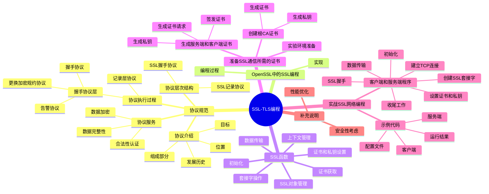

[toc]

# 密码系统设计

## 第八周预习报告

### 学习内容

- [《Windows C/C++加密解密实战》](https://weread.qq.com/web/bookDetail/a0332190813ab78fag011422?wfrom=bookDetailH5)第 12 章
- [课程 mindmap](https://www.processon.com/mindmap/66bcf83cce68f62ecf3f63fc?from=pwa)
- 报告内容参考第一周

### AI 对学习内容的总结（1分）

#### 要求

- 让AI（kimi，元宝等）阅读学习内容并进行总结，教材内容可以使用微信读书或者云班课电子教材

#### 总结

- [KIMI： 对《Windows C/C++加密解密实战》的总结](https://kimi.moonshot.cn/share/csitbhnogfdn4q0j5phg)
    ```
    这份文件是关于SSL-TLS编程的教程，主要内容包括：

    1. **SSL协议规范**：
    - SSL（Secure Sockets Layer）是一个中间层协议，位于TCP/IP层和应用层之间，提供安全的网络传输通道。
    - SSL协议由两层组成：SSL记录层协议和高层协议（包括SSL握手协议、改变加密规约协议、告警协议等）。
    - SSL协议的优点包括与应用层协议无关、提供安全连接、使用加密技术、认证对方身份、保证数据完整性等。
    - SSL协议的发展历史，从SSL v1.0到TLS v1.3的演变过程。
    - SSL v3/TLS提供的服务，包括客户方和服务器的合法性认证、数据加密、数据完整性保证。

    2. **SSL协议层次结构模型**：
    - SSL协议是分层的，包括握手协议层和记录层。
    - SSL记录层协议负责数据封装、压缩、加密等基本功能。
    - SSL握手协议负责在数据传输前进行身份认证、协商加密算法、交换加密密钥。

    3. **SSL记录层协议**：
    - 记录层协议对数据进行分段、压缩、加密和传输。
    - 定义了四种记录层协议的调用者：握手协议、告警协议、加密修改协议、应用程序数据协议。

    4. **SSL握手协议层**：
    - 握手协议在SSL记录层之上，负责生成会话状态的密码参数。
    - 详细描述了SSL握手协议的过程，包括客户端和服务器之间的通信、证书验证、密钥交换等。

    5. **OpenSSL中的SSL编程**：
    - OpenSSL实现了SSL协议和TLS协议，提供了函数进行安全编程。
    - 介绍了如何使用OpenSSL提供的函数，如SSL_connect、SSL_accept、SSL_write、SSL_read等。
    - 详细说明了SSL函数的使用方法，包括初始化SSL算法库、设置SSL证书和私钥、创建SSL结构、启动TLS/SSL握手等。

    6. **准备SSL通信所需的证书**：
    - 描述了如何搭建环境建立CA（证书颁发机构）并签发证书。
    - 详细介绍了创建根CA证书、生成服务端和客户端的证书请求文件、签发服务端和客户端证书的过程。

    7. **实战SSL网络编程**：
    - 提供了一个SSL服务端和客户端通信的示例代码，展示了如何使用OpenSSL进行SSL通信。
    - 包含了服务端和客户端的代码示例，以及如何设置和使用SSL_CTX、SSL等结构体。

    这份文件是一个全面的SSL-TLS编程指南，适合需要在C/C++中实现安全通信的开发者。

    ```
- [豆包： 对《Windows C/C++加密解密实战》的总结](https://www.doubao.com/thread/w7599196a4ef99a4f)
    ```
    本文是关于SSL - TLS编程的介绍，包括协议规范、OpenSSL中的编程、相关函数以及证书准备和实战编程等内容，具体如下：
    1. **SSL协议规范**
        - **协议介绍**
            - SSL是位于TCP/IP层和应用层之间的中间层协议，由SSL记录层协议和高层协议（握手协议、改变加密规约协议、告警协议等）组成，目标是提供安全的网络传输通道，具有与应用层协议无关等优点。
            - SSL协议发展经历了多个版本，从SSL v1.0到v3.0，以及后来的TLS v1.0到v1.3，各版本有不同的应用和改进。
        - **协议服务**
            - 提供客户方和服务器的合法性认证，通过证书和公钥验证身份。
            - 对数据进行加密，包括对称算法和非对称算法的结合使用。
            - 保证数据的完整性，采用消息摘要函数提供服务。
        - **协议层次结构**
            - SSL记录协议为高层协议提供数据封装、压缩、加密等功能。
            - SSL握手协议用于通信双方进行身份认证、协商加密算法、交换加密密钥等，是SSL协议的核心。
        - **协议执行过程**
            - **记录层协议**：把要传送的数据进行分段、压缩、加密传送，对输入数据进行解密、解压、校验后传给上层。
            - **握手协议层**
                - **握手协议**：客户端和服务器通过交换信息，协商协议版本，选择密码算法，验证身份，产生共享密钥，过程包括客户端发送信息、服务器回应、验证合法性、交换密钥等步骤。
                - **更换加密规约协议**：使密码策略能及时通知，只有一个消息，用当前加密约定加密和压缩。
                - **告警协议**：传送告警消息的严重程度和描述，致命告警会导致连接终止。
    2. **OpenSSL中的SSL编程**
        - OpenSSL实现了SSL协议多个版本以及TLS协议，提供了相关函数用于安全编程，其编程过程和普通套接字编程类似，但需要设置其他环境参数，如服务器证书等。
    3. **SSL函数**
        - 包括初始化SSL算法库函数、初始化SSL上下文环境变量函数、释放SSL上下文环境变量函数、设置SSL证书函数（文件形式和结构体方式）、设置SSL私钥函数（文件形式和结构体方式）、检查SSL私钥和证书是否匹配函数、创建SSL结构函数、释放SSL套接字结构体函数、设置读写套接字函数、启动TLS/SSL握手函数、接受SSL连接函数、获取对方的X509证书函数、向TLS/SSL连接写数据函数、从TLS/SSL连接中读取数据函数等，介绍了各函数的功能、参数和返回值。
    4. **准备SSL通信所需的证书**
        - **准备实验环境**：可以用一台物理机完成证书签发工作，避免在多台Windows下安装VC和OpenSSL。
        - **熟悉CA环境**：通过OpenSSL实现CA，了解其配置文件openssl.cnf的内容。
        - **创建所需要的文件**：在C:\myOpensslout\bin\下新建文件夹demoCA及相关子文件夹和文件。
        - **创建根CA的证书**
            - 生成私钥文件，采用DES3加密，通过genrsa命令生成。
            - 生成根证书请求文件，可选择自签或让其他机构签名，这里采用自签，通过req - new - x509 - key root.key - out root.crt命令生成。
        - **生成服务端和客户端的证书请求文件及签发证书**
            - 分别生成服务端和客户端的私钥和证书请求文件，命令格式类似，如genrsa - des3 - out server.key 1024和req - new - key server.key - out server.csr。
            - 通过ca命令签发出服务端和客户端的证书，如ca - in server.csr - out server.crt - keyfile root.key - cert root.crt - days 365 - config../ssl/openssl.cnf。
    5. **实战SSL网络编程**
        - 程序分为客户端和服务端，利用SSL/TLS特性保证通信双方身份验证、数据完整性和私密性。
        - 介绍了SSL通信的一般流程，包括OpenSSL的初始化、设置证书和私钥、创建SSL套接字、建立TCP连接、进行SSL握手、交换数据、收尾工作等步骤。
        - 通过示例代码展示了SSL服务端和客户端的编程实现，包括工程创建、代码编写、相关库文件和证书文件的配置以及运行结果展示等。
    ```
- [通义千问：对《Windows C/C++加密解密实战》的总结](https://lxblog.com/qianwen/share?shareId=75b5f892-f3c8-4d54-a50c-9e8128c4f286)
    ```
    文档《第12章 SSL-TLS编程》主要介绍了SSL（安全套接层）和TLS（传输层安全）协议的基础知识、发展历程、提供的服务、握手协议流程、以及在OpenSSL中的实现。

    ### 1. SSL协议概述
    - **定义**：SSL协议位于TCP/IP层和应用层之间，为应用层程序提供安全的网络传输通道，确保数据传输的私有性和可靠性。
    - **层次结构**：由两层组成，分别是SSL记录层协议（SSL Record Protocol）和高层协议（如SSL握手协议、改变加密规约协议、告警协议等）。

    ### 2. SSL协议的优点
    - **透明性**：与应用层协议无关，高层协议可以透明地放置于SSL协议层之上。
    - **安全性**：使用对称密钥技术和非对称加密技术确保数据的安全传输，并使用哈希函数保证数据完整性。

    ### 3. SSL协议的发展
    - **SSL v1.0**：1994年由网景公司提出，未公开。
    - **SSL v2.0**：1995年发布，2011年被弃用。
    - **SSL v3.0**：1996年发布，2015年被弃用。
    - **TLS v1.0**：1999年被IETF纳入标准化，与SSL v3.0相似。
    - **TLS v1.1**：2006年发布，修复了一些bug并支持更多参数。
    - **TLS v1.2**：2008年发布，广泛应用于新设备，增加了扩展和算法改进。
    - **TLS v1.3**：2018年正式纳入标准，改善了握手流程，减少了时延，并采用了更安全的密钥交换算法。

    ### 4. SSL/TLS提供的服务
    - **合法性认证**：通过交换证书进行身份认证。
    - **数据加密**：使用对称算法和非对称算法确保数据的安全传输。
    - **数据完整性**：使用消息摘要函数（MAC）保证数据的完整性。

    ### 5. SSL握手协议流程
    1. **客户端发送Client Hello**：包含支持的协议版本、加密算法、随机数等信息。
    2. **服务器发送Server Hello**：包含选定的协议版本、加密算法、随机数等信息。
    3. **服务器发送证书**：验证服务器的合法性。
    4. **服务器请求客户端证书**（可选）。
    5. **服务器发送Server Hello Done**：表示Hello信息部分完成。
    6. **客户端发送证书**（如果服务器请求）。
    7. **客户端发送Client Key Exchange**：包含加密的预主密码。
    8. **客户端发送Certificate Verify**（如果客户端证书具有签名能力）。
    9. **客户端发送Change Cipher Spec**：更改加密约定。
    10. **客户端发送Finished**：握手结束。
    11. **服务器发送Change Cipher Spec**：更改加密约定。
    12. **服务器发送Finished**：握手结束。
    13. **数据通信开始**：使用协商好的对称密钥进行数据传输。

    ### 6. OpenSSL中的SSL编程
    - **初始化SSL算法库**：使用`SSL_library_init()`函数初始化SSL算法库。
    - **常用函数**：`SSL_connect`、`SSL_accept`、`SSL_write`、`SSL_read`等，类似于普通Socket编程中的函数，但提供了额外的安全功能。

    ### 7. 告警协议
    - **告警消息**：用于传送告警的严重程度和描述，致命告警会导致连接立即终止。
    - **关闭告警**：用于防止截断攻击，客户端和服务器必须知道连接已经结束。

    ### 8. 更换加密规约协议
    - **目的**：使密码策略得到及时的通知。
    - **消息**：一个字节的数值，使用当前的加密约定进行加密和压缩。

    通过以上内容，文档详细介绍了SSL/TLS协议的工作原理及其在实际编程中的应用。
    ```

### 对 AI 总结的反思与补充（2分）

#### 要求

- AI总结的问题
- 自己的补充

#### 反思与补充

- AI总结的问题
    - 对SSL函数介绍的不清楚
    - 在证书创建的介绍中没有具体的命令
- 自己的补充
    - SSL函数补充：
        ```
        初始化：SSL_library_init() 和 OPENSSL_add_all_algorithms()
        上下文管理：SSL_CTX_new() 和 SSL_CTX_free()
        证书和私钥设置：SSL_CTX_use_certificate_file()、SSL_CTX_use_PrivateKey_file()、SSL_CTX_check_private_key()
        SSL对象管理：SSL_new() 和 SSL_free()
        套接字操作：SSL_set_fd()、SSL_accept()、SSL_connect()
        数据传输：SSL_write() 和 SSL_read()
        证书获取：SSL_get_peer_certificate()
        ```
    - 证书创建的命令补充：
        ```
        4.2 创建根CA证书
        生成私钥：使用genrsa命令生成私钥文件，如openssl genrsa -des3 -out root.key 2048。
        生成证书：使用req命令生成自签名的根证书，如openssl req -new -x509 -key root.key -out root.crt -days 3650。
        4.3 生成服务端和客户端证书
        生成私钥：分别为服务端和客户端生成私钥，如openssl genrsa -des3 -out server.key 2048。
        生成证书请求：使用req命令生成证书请求文件，如openssl req -new -key server.key -out server.csr。
        签发证书：使用ca命令签发证书，如openssl ca -in server.csr -out server.crt -keyfile root.key -cert root.crt -days 365 -config openssl.cnf。
        ```
    - 最终的总结
        ```
        1. SSL协议规范
        1.1 协议介绍
        位置：SSL协议位于TCP/IP层和应用层之间，作为两者间的中间层协议。
        组成部分：由SSL记录层协议和高层协议（如握手协议、改变加密规约协议、告警协议等）构成。
        目标：提供安全的网络传输通道，确保数据传输的私有性和可靠性，同时保持与应用层协议的无关性。
        发展历史：从SSL v1.0到v3.0，再到TLS v1.0至v1.3，每个版本都有所改进，以提高安全性、性能和兼容性。
        1.2 协议服务
        合法性认证：通过证书和公钥验证客户方和服务器的身份。
        数据加密：使用对称加密和非对称加密相结合的方式保护数据。
        数据完整性：利用消息摘要函数（如MD5、SHA-1等）确保数据未被篡改。
        1.3 协议层次结构
        SSL记录协议：负责数据的封装、压缩、加密，确保数据在传输过程中不被窃听或篡改。
        SSL握手协议：核心协议，用于通信双方的身份认证、加密算法的选择、密钥的交换等关键操作。
        1.4 协议执行过程
        记录层协议：处理数据的分段、压缩、加密和解密，确保数据的完整性和安全性。
        握手协议层
        握手协议：客户端和服务器通过一系列消息交换来协商协议版本、选择加密算法、验证身份、生成共享密钥。
        更换加密规约协议：允许通信双方在会话期间动态更改加密策略。
        告警协议：用于传递告警消息，包括告警的严重程度和描述，严重告警将导致连接终止。
        2. OpenSSL中的SSL编程
        实现：OpenSSL库实现了多个版本的SSL和TLS协议，提供了丰富的API用于安全编程。
        编程过程：与普通套接字编程类似，但需要额外设置环境参数，如服务器证书、私钥等。
        3. SSL函数
        初始化：SSL_library_init() 和 OPENSSL_add_all_algorithms()
        上下文管理：SSL_CTX_new() 和 SSL_CTX_free()
        证书和私钥设置：SSL_CTX_use_certificate_file()、SSL_CTX_use_PrivateKey_file()、SSL_CTX_check_private_key()
        SSL对象管理：SSL_new() 和 SSL_free()
        套接字操作：SSL_set_fd()、SSL_accept()、SSL_connect()
        数据传输：SSL_write() 和 SSL_read()
        证书获取：SSL_get_peer_certificate()
        4. 准备SSL通信所需的证书
        4.1 实验环境准备
        单机环境：可以在一台物理机上完成证书签发，避免在多台机器上安装复杂的开发环境。
        CA环境：通过OpenSSL实现证书颁发机构（CA），熟悉其配置文件openssl.cnf的内容。
        4.2 创建根CA证书
        生成私钥：使用genrsa命令生成私钥文件，如openssl genrsa -des3 -out root.key 2048。
        生成证书：使用req命令生成自签名的根证书，如openssl req -new -x509 -key root.key -out root.crt -days 3650。
        4.3 生成服务端和客户端证书
        生成私钥：分别为服务端和客户端生成私钥，如openssl genrsa -des3 -out server.key 2048。
        生成证书请求：使用req命令生成证书请求文件，如openssl req -new -key server.key -out server.csr。
        签发证书：使用ca命令签发证书，如openssl ca -in server.csr -out server.crt -keyfile root.key -cert root.crt -days 365 -config openssl.cnf。
        5. 实战SSL网络编程
        5.1 客户端和服务端程序
        初始化：调用SSL_library_init()和SSL_load_error_strings()初始化OpenSSL库。
        设置证书和私钥：使用SSL_CTX_use_certificate_file()和SSL_CTX_use_PrivateKey_file()设置证书和私钥。
        创建SSL套接字：使用SSL_new()和SSL_set_fd()创建和配置SSL套接字。
        建立TCP连接：使用普通套接字编程建立TCP连接。
        SSL握手：调用SSL_accept()（服务端）和SSL_connect()（客户端）进行SSL握手。
        数据传输：使用SSL_write()和SSL_read()进行数据的加密传输。
        收尾工作：释放资源，关闭连接，如SSL_free()、SSL_CTX_free()、close()。
        5.2 示例代码
        服务端：创建监听套接字，接受客户端连接，进行SSL握手，传输数据。
        客户端：连接服务端，进行SSL握手，接收和发送数据。
        配置文件：确保正确配置openssl.cnf文件，以便生成和管理证书。
        运行结果：展示程序的运行结果，验证SSL通信的正确性和安全性。
        6. 补充说明
        性能优化：在实际应用中，可以通过会话缓存、会话票证等方式优化SSL握手的性能。
        安全性考虑：定期更新证书和密钥，禁用不安全的加密算法，使用最新的TLS版本，确保系统的安全性。
        ```

### 学习思维导图（2分）

#### 要求

- Mermaid 代码与截图(参考[Mermaid MindMap语法](https://mermaid.live/edit#pako:eNpdUk1vwjAM_StWTiAx7V5Nk2A7DoEGu_ViUreN1tqZkyB1iP--8FG2kZP93svTk-2DsVKRKUzvuOrRlwygInEyuQLT6QkCWKlrHIdLA_Am3EDrQhQdRqwonBWe1Ag1PuxEPqcjsxafOlQXMDrhEQVYqIsutOAvPPgw2FY6aQbAFFtR2AoPsEjfeP31ToFQbTt6rBiorslGt2cK4Wmnj8_IFdSEMSmFP7p5itLnABas0l2Qj_ArvbyXs2ZPEMm27L7SvWATFSM12c53yOy4-c_PtUk9cYQ8RH9jtyLdzWhNDKewHj3pCC5Je3SVmZn-WhXmcCJLE1vqqTRFLiuqMXWxNCUfszRPSzYDW1NETTQzKqlpTVFjF3KXfJWjvjpsFPtRQpXLy1tetn8-guMPMYioGg))**或者**提交思维导图链接（如果使用线上编辑器，推荐[processon](https://www.processon.com/),[xmind](https://xmind.cn/),...）

#### 思维导图



### 基于 AI 的学习（2分）

#### 要求

- 至少找到自己理解不是太好 2 个概念，让 AI 对自己进行苏格拉底提问
- 参考下面提示语或者使用 AI Agent

提示词：“我在学习XXX知识点，请你以苏格拉底的方式对我进行提问，一次一个问题”

1. 核心是要求AI工具：“请你以苏格拉底的方式对我进行提问”
2. 然后AI工具就会给你提问，如果不知道问题的答案，可以反问AI：“你的理解是什么？”
3. 如果你觉得差不多了，可以先问问AI工具：“针对这个知识点，我理解了吗？”
4. AI工具会给出它的判断，如果你也觉得自己想清楚了，可以最后问AI工具：“我的回答结束了，请对我的回答进行评价总结”，让它帮你总结一下。

#### 学习内容

- [学习SSL通信中证书的作用](https://kimi.moonshot.cn/share/csitgtvd0p82itkr77l0)
    ```
    User: 我在学习SSL通信所需的证书的知识点，请你以苏格拉底的方式对我进行提问，一次一个问题，不超过四个问题 

    Kimi: 当然，让我们以苏格拉底的方式进行对话。首先，我会问你第一个问题：

    你知道SSL通信中证书的主要目的是什么吗？ 

    User: 在 SSL 通信中，证书主要用于验证通信双方的身份，确保数据传输到正确的客户端或服务器上，同时也用于建立安全的加密连接，以保证数据的完整性和保密性。 

    Kimi: 非常好，你已经掌握了证书的基本功能。那么，我的下一个问题来了：

    在SSL通信中，客户端如何验证服务器证书的合法性？ 

    User: 首先检查证书是否在有效期内，然后验证证书的域名是否与实际访问的服务器域名匹配，最后使用受信任的CA公钥验证证书的数字签名。 

    Kimi: 你的回答很全面，这确实是客户端验证服务器证书合法性的步骤。接下来，我有一个稍微深入的问题：

    如果客户端不信任服务器提供的证书，你认为会发生什么情况？ 

    User: 如果客户端不信任服务器提供的证书，客户端会显示一个安全警告，提示用户证书不可信；用户可以选择继续访问（承担潜在风险）或取消连接；在某些情况下，客户端可能会自动拒绝连接，特别是当安全策略设置为严格验证时。 

    Kimi: 非常好，你已经理解了证书信任对SSL通信的重要性。最后一个问题：

    在SSL通信中，除了验证服务器证书，客户端的证书有什么作用？ 

    User: 在SSL通信中，客户端的证书用于验证客户端的身份，确保服务器与合法的客户端通信；客户端证书通常在需要双向认证的场景中使用，如企业内部系统；通过客户端证书，服务器可以防止未授权的客户端访问敏感资源。 

    Kimi: 你的回答非常准确，确实如此。客户端证书在需要双向认证的场景中发挥着重要作用，确保了通信的安全性和双方身份的真实性。这完成了我们的对话，希望这有助于你更好地理解SSL通信中证书的作用和重要性。如果你有任何其他问题或需要进一步的讨论，随时欢迎提问。 

    User: 请总结我的回答 

    Kimi: 当然，以下是你对于SSL通信中证书作用和处理机制的回答总结：

    1. **证书的主要目的**：
    - 验证通信双方的身份，确保数据传输到正确的客户端或服务器。
    - 建立安全的加密连接，保证数据的完整性和保密性。

    2. **客户端验证服务器证书的合法性**：
    - 检查证书是否在有效期内。
    - 验证证书的域名是否与实际访问的服务器域名匹配。
    - 使用受信任的CA公钥验证证书的数字签名。

    3. **客户端不信任服务器证书的情况**：
    - 显示安全警告，提示用户证书不可信。
    - 用户可以选择继续访问或取消连接。
    - 客户端可能自动拒绝连接，尤其是在安全策略严格的情况下。

    4. **客户端证书的作用**：
    - 验证客户端的身份，确保服务器与合法的客户端通信。
    - 用于需要双向认证的场景，如企业内部系统。
    - 帮助服务器防止未授权的客户端访问敏感资源。

    这些回答展示了你对SSL证书在确保网络安全通信中所扮演角色的深刻理解。 


    ```
- [学习SSL通信中客户端和服务端程序](https://kimi.moonshot.cn/share/csitjr6gi3pq0gea0hvg)
    ```
    User: 我在学习SSL通信中客户端和服务端程序的知识点，请你以苏格拉底的方式对我进行提问，一次一个问题，不超过四个问题 

    Kimi: 很好，让我们开始这个探索过程。我的第一个问题是：

    当客户端和服务端在SSL通信中首次建立连接时，它们首先需要完成什么步骤？ 

    User: 当客户端和服务端在SSL通信中首次建立连接时，它们首先需要完成以下步骤：客户端发送一个`Client Hello`消息，包含支持的协议版本、加密算法和随机数；服务端回应一个`Server Hello`消息，确认协议版本、选择的加密算法和随机数，并发送其数字证书；客户端验证服务端的证书，生成一个预主密钥并用服务端的公钥加密后发送；双方使用预主密钥生成会话密钥，完成握手过程，开始加密通信。 

    Kimi: 你的回答非常全面，涵盖了SSL握手过程的关键步骤。接下来，我的第二个问题是：

    在SSL握手过程中，客户端和服务端如何确保他们交换的信息是安全的？ 

    User: 在SSL握手过程中，客户端和服务端通过以下步骤确保交换的信息是安全的：首先，双方使用非对称加密算法（如RSA）交换公钥，确保初始通信的安全性；然后，客户端生成一个对称密钥（预主密钥），并用服务端的公钥加密后发送给服务端；服务端使用其私钥解密预主密钥，双方使用相同的对称密钥进行后续的加密通信；最后，通过消息认证码（MAC）确保数据的完整性和防止篡改。 

    Kimi: 非常好，你已经很好地描述了SSL握手过程中确保信息安全的关键机制。我的第三个问题是：

    在SSL通信中，客户端和服务端如何验证对方的身份？ 

    User: 这个问题问过了，换一个吧 

    Kimi: 我明白了，让我们换个角度。那么，我的新问题是：

    在SSL通信中，如果客户端想要验证服务器的身份，它依赖于什么信息来完成这个验证？ 

    User: 这个问题也问过了，换一个吧 

    Kimi: 我理解了，让我们换个话题。那么，我的下一个问题：

    在SSL通信中，客户端和服务端如何确保他们传输的数据的完整性？ 

    User: 在SSL通信中，客户端和服务端通过以下方式确保数据的完整性：使用消息认证码（MAC）对每个数据包进行签名；MAC使用共享的会话密钥生成，确保数据未被篡改；接收方使用相同的会话密钥验证MAC，确认数据的完整性；如果MAC验证失败，数据包将被丢弃，确保通信的安全性。 

    Kimi: 非常好，你已经准确地描述了SSL/TLS协议中确保数据完整性的机制。现在我来提出最后一个问题：

    在SSL通信过程中，如果握手成功完成，客户端和服务端如何开始实际的数据传输？ 

    User: 在SSL通信过程中，如果握手成功完成，客户端和服务端通过以下步骤开始实际的数据传输：双方使用握手过程中协商的对称密钥进行加密和解密；客户端发送一个`Change Cipher Spec`消息，通知服务端切换到协商的加密模式；服务端也发送一个`Change Cipher Spec`消息，确认切换到加密模式；随后，双方使用对称密钥进行加密通信，开始传输实际的数据。 

    Kimi: 你的描述非常准确。通过握手过程协商的加密参数和密钥，客户端和服务端就能够安全地开始数据传输。这样，我们就完成了对SSL通信中客户端和服务端程序知识点的探讨。如果你有任何其他问题或需要进一步的讨论，随时欢迎提问。 

    User: 请总结我的回答 

    Kimi: 当然，以下是你对于SSL通信中客户端和服务端程序知识点的回答总结：

    1. **SSL握手过程**：
    - 客户端首先发送`Client Hello`消息，包含支持的协议版本、加密算法和随机数。
    - 服务端回应`Server Hello`消息，确认协议版本、选择的加密算法和随机数，并发送其数字证书。
    - 客户端验证服务端的证书，生成一个预主密钥并用服务端的公钥加密后发送。
    - 双方使用预主密钥生成会话密钥，完成握手过程，开始加密通信。

    2. **确保信息安全**：
    - 客户端和服务端使用非对称加密算法交换公钥，确保初始通信的安全性。
    - 客户端生成对称密钥（预主密钥），并用服务端的公钥加密后发送给服务端。
    - 服务端使用其私钥解密预主密钥，双方使用相同的对称密钥进行后续的加密通信。
    - 通过消息认证码（MAC）确保数据的完整性和防止篡改。

    3. **验证对方身份**：
    - 客户端依赖服务端的数字证书来验证其身份，使用CA的公钥来验证证书的签名。

    4. **确保数据完整性**：
    - 使用消息认证码（MAC）对每个数据包进行签名，确保数据未被篡改。
    - 接收方使用相同的会话密钥验证MAC，确认数据的完整性。
    - 如果MAC验证失败，数据包将被丢弃，确保通信的安全性。

    5. **开始实际的数据传输**：
    - 双方使用握手过程中协商的对称密钥进行加密和解密。
    - 客户端和服务端发送`Change Cipher Spec`消息，通知对方切换到协商的加密模式。
    - 随后，双方使用对称密钥进行加密通信，开始传输实际的数据。

    这些回答展示了你对SSL通信过程中客户端和服务端如何建立安全连接、验证身份、确保数据安全和完整性以及开始数据传输的深刻理解。 


    ```

### 学习实践过程遇到的问题与解决方式（AI 驱动，优先使用AI工具解决问题）（2分）

- 问题 1:如何在Godot中实现服务器与客户端的通信，这与今天的SSL通信等有多大关系
    - [Godot本身不直接支持SSL/TLS，需要使用Godot的GDNative来支持SSL/TLS通信](https://kimi.moonshot.cn/share/csitm234ukfbg1jik9lg)
    - [SSL/TLS主要用于加密网络通信，这在局域网中需求不是非常明显](https://kimi.moonshot.cn/share/csitm7mgi3pq0geb3kfg)

- 问题 2:在学习一个项目时不是很理解他的代码
    - 使用AI来帮助解释代码：比如[解释服务器创建的代码](https://kimi.moonshot.cn/share/csitomtvfrpl3sgmgvb0)
    - 先易后难，先从代码量少的服务器创建部分看，之后再看客户端的实现
    - 询问AI如何扩展功能：比如[如何支持语音消息](https://kimi.moonshot.cn/share/csitpsmm1f0fukmmds5g)

### 作业提交要求（1分）

1. 提交Markdown 文件,文档命名“学号姓名《密码系统设计》.md”
2. 提交Markdown 文件转为 PDF,文档命名“学号姓名《密码系统设计》第 X 周.pdf”
3. 提交代码托管链接：[我的作业的github链接](https://github.com/youer0219/Information-Security-System-Design-Assignment)
4. 内容质量高有加分

### 参考资料

- AI工具(你使用的AI工具及其链接)
  - [Kimi](https://kimi.moonshot.cn/)
  - [文心一言](https://yiyan.baidu.com/)
  - [通义千问](https://tongyi.aliyun.com/)
  - [豆包](https://www.doubao.com/chat/)
  - [GPT4.0](https://iai.aichatos8.com.cn/#/home)
- 图书
  - [《Windows C/C++加密解密实战》](https://weread.qq.com/web/bookDetail/a0332190813ab78fag011422?wfrom=bookDetailH5)
  - [Head First C 嗨翻 C 语言](https://www.ituring.com.cn/book/1004)
