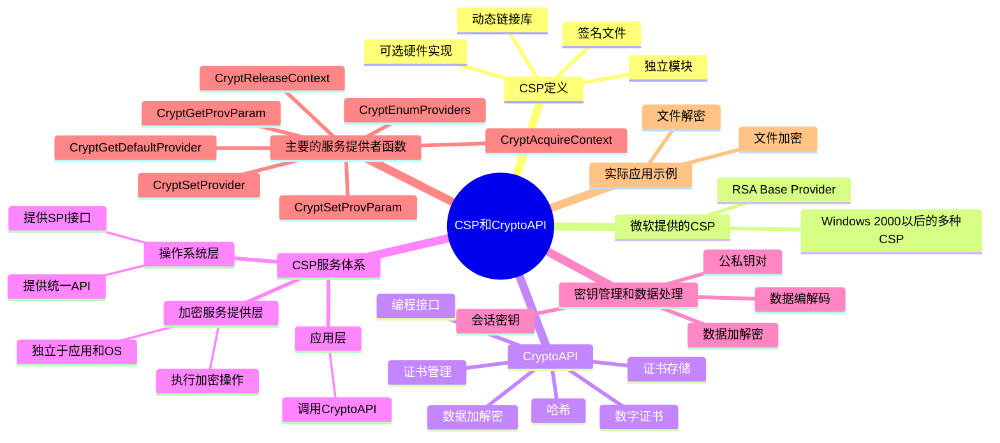

[toc]
# 密码系统设计

## 第六周预习报告 
### 学习内容
- [《Windows C/C++加密解密实战》](https://weread.qq.com/web/bookDetail/a0332190813ab78fag011422?wfrom=bookDetailH5)第9章
- [课程 mindmap](https://www.processon.com/mindmap/66bcf83cce68f62ecf3f63fc?from=pwa)
- 报告内容参考第一周

### AI 对学习内容的总结（1分）
#### 要求
- 让AI（kimi，元宝等）阅读学习内容并进行总结，教材内容可以使用微信读书或者云班课电子教材
#### 总结
- 对《Windows C/C++加密解密实战》第九章的总结
  - [KIMI的总结](https://kimi.moonshot.cn/share/cs8c45qflk16on7rknqg)
    ```
    User: 请为我详细总结第九章的内容 

    Kimi: 第九章主要介绍了Windows平台的加密服务提供者（CSP）和CryptoAPI的相关内容。以下是本章的详细总结：

    1. **CSP（Cryptographic Service Provider）**：
      - CSP是Windows平台上执行加密运算的独立模块，由动态链接库（DLL）和签名文件组成。
      - 签名文件确保CSP经过认证，防止攻击者冒充。
      - 如果加密算法由硬件实现，CSP还包括硬件装置。
      - Microsoft操作系统中捆绑了RSA Base Provider作为CSP，提供公钥加密算法。

    2. **CryptoAPI简介**：
      - CryptoAPI是Windows平台上的数据加解密和证书服务的编程接口。
      - 提供了多种信息安全相关的函数，如编码、解码、加密、解密、哈希、数字证书等。
      - CryptoAPI的编程模型类似于Windows系统的GDI，其中CSP相当于图形设备驱动程序。

    3. **CSP服务体系**：
      - 由应用程序、操作系统（OS）和CSP组成。
      - 应用程序通过CryptoAPI与操作系统通信，操作系统通过CryptoSPI与CSP通信。
      - 展示了服务分层体系，包括应用层、服务提供层和系统层。

    4. **CSP的组成**：
      - CSP可以是纯软件实现或带硬件的实现。
      - 物理上由动态链接库和签名文件组成，逻辑上包括SPI接口、算法实现和密钥库。

    5. **CryptoAPI体系结构**：
      - 由基本加密函数、简单消息函数、底层消息函数、证书编解码函数和证书库管理函数组成。
      - 支持敏感信息的加密或签名处理，保证信息的私有性和认证性。

    6. **CryptoAPI调用底层CSP服务的方式**：
      - 通过函数CryptAcquireContext获取CSP的句柄，使用KeyBlob数据结构在不同CSP间安全传输密钥。

    7. **CryptoAPI的基本功能**：
      - 包括密钥管理、数据编解码、数据加解密、哈希和数字签名、数字证书管理等。

    8. **搭建CryptoAPI开发环境**：
      - 使用VC2017开发CryptoAPI应用程序，包含相关头文件即可。

    9. **基本加密函数**：
      - CSP可以由软件或硬件实现，必须符合CryptoAPI接口规范。
      - 介绍了不同的CSP类型及其支持的算法。

    10. **服务提供者函数**：
        - 用于连接和断开CSP，如CryptAcquireContext和CryptReleaseContext。

    11. **密钥的产生和交换函数**：
        - 用于创建、配置和销毁加密密钥，以及与其他用户交换密钥。

    12. **编码/解码函数**：
        - 对证书、证书撤销列表、证书请求和证书扩展进行编码和解码。

    13. **数据加密/解密函数**：
        - 支持数据的加密和解密操作。

    14. **哈希和数字签名函数**：
        - 完成计算哈希、创建和校验数字签名。

    15. **实际加密解密示例**：
        - 提供了一个使用CryptoAPI进行文件加密和解密的示例代码，展示了如何使用CryptoAPI函数进行实际的加密解密操作。

    本章内容涵盖了CSP和CryptoAPI的基本概念、体系结构、功能以及如何在实际开发中使用这些API进行加密解密操作。 


    ```
  - [通义千问的总结](https://lxblog.com/qianwen/share?shareId=1a0694a5-1f7c-4707-9898-3590a727d40d)
    ```
    第九章主要介绍了CSP（Cryptographic Service Provider，加密服务提供者）和CryptoAPI在Windows平台上的角色与功能。以下是详细总结：

    ### 9.1 什么是CSP
    - **定义**：CSP是执行密码运算的独立模块，包括一个动态链接库和签名文件。签名文件确保CSP经过认证。
    - **组成**：如果加密算法由硬件实现，CSP还包括硬件装置。
    - **微软提供的CSP**：微软通过捆绑RSA Base Provider，在操作系统中提供了一个使用RSA公钥加密算法的CSP。自Windows 2000起，系统自带了多种不同的CSP。

    ### CSP服务体系
    - **体系结构**：分为三层 - 应用层、操作系统层和加密服务提供层。
    - **应用层**：应用程序通过CryptoAPI与操作系统通信。
    - **操作系统层**：为应用层提供统一的API接口，并通过CryptoSPI与CSP通信。
    - **加密服务提供层**：即具体的CSP，负责实际的数据加密工作，包括密钥生成、交换、数据加密、摘要生成等。

    ### CryptoAPI简介
    - **国际标准**：GSS-API, CDSA, RSA PKCS#11, 微软CryptoAPI。
    - **功能**：提供了大量信息安全相关的函数，如编码、解码、加密、解密、哈希、数字证书管理等。
    - **编程模型**：类似于Windows GDI，其中CSP相当于设备驱动程序。

    ### CryptoAPI体系结构
    - **组成部分**：
      1. 基本加密函数
      2. 简单的消息函数
      3. 底层消息函数
      4. 证书编解码函数
      5. 证书库管理函数

    ### 密钥管理和数据处理
    - **密钥类型**：会话密钥（对称密钥）和公私钥对（非对称密钥）。
    - **数据加解密**：通常使用对称密钥算法来处理较大的数据块。
    - **数据编解码**：采用ASN.1编码方式，遵循DER编码规则。

    ### 主要的服务提供者函数
    - **CryptAcquireContext**：获取指定CSP的密钥容器句柄。
    - **CryptEnumProviders**：枚举计算机上所有可用的CSP。
    - **其他函数**：包括连接和断开CSP，增加引用计数，设置默认CSP等。

    ### 实际应用示例
    - 提供了关于如何使用CryptoAPI进行文件加密和解密的实际代码示例，涉及密钥生成、数据加密/解密等操作。

    总的来说，这一章节深入探讨了CSP和CryptoAPI的概念及其在Windows安全架构中的重要性，同时提供了实用的编程指南和技术细节。
    ```

### 对 AI 总结的反思与补充（2分）
#### 要求
- AI总结的问题
- 自己的补充
#### 反思与补充

- AI总结的问题
  - kimi总结的结构不清晰，有关“基本加密函数”等内容（第9、10、11、12、13点）不应该单独拿出来和其他的并列。
  - 缺少细节。比如对主要服务提供者函数讲述的很浅，需要进一步阐述几个关键函数的功能。
  - 在CryptoAPI体系结构中补充CryptoSPI的内容
- 自己的补充
  - 有关“基本加密函数”部分应该都放在“CryptoAPI体系结构”之下
  - CryptAcquireContext用于获得指定CSP的句柄，CryptEnumProviders用来列出系统上所有可用的CSP
  - CryptoSPI：作为操作系统与CSP之间的桥梁，允许操作系统通过统一的接口与各种CSP交互，从而实现加密操作。

### 学习思维导图（2分）
#### 要求
- Mermaid 代码与截图(参考[Mermaid MindMap语法](https://mermaid.live/edit#pako:eNpdUk1vwjAM_StWTiAx7V5Nk2A7DoEGu_ViUreN1tqZkyB1iP--8FG2kZP93svTk-2DsVKRKUzvuOrRlwygInEyuQLT6QkCWKlrHIdLA_Am3EDrQhQdRqwonBWe1Ag1PuxEPqcjsxafOlQXMDrhEQVYqIsutOAvPPgw2FY6aQbAFFtR2AoPsEjfeP31ToFQbTt6rBiorslGt2cK4Wmnj8_IFdSEMSmFP7p5itLnABas0l2Qj_ArvbyXs2ZPEMm27L7SvWATFSM12c53yOy4-c_PtUk9cYQ8RH9jtyLdzWhNDKewHj3pCC5Je3SVmZn-WhXmcCJLE1vqqTRFLiuqMXWxNCUfszRPSzYDW1NETTQzKqlpTVFjF3KXfJWjvjpsFPtRQpXLy1tetn8-guMPMYioGg))**或者**提交思维导图链接（如果使用线上编辑器，推荐[processon](https://www.processon.com/),[xmind](https://xmind.cn/),...）
#### 思维导图



### 基于 AI 的学习（2分）
#### 要求
- 至少找到自己理解不是太好 2 个概念，让 AI 对自己进行苏格拉底提问
- 参考下面提示语或者使用 AI Agent

提示词：“我在学习XXX知识点，请你以苏格拉底的方式对我进行提问，一次一个问题”
1. 核心是要求AI工具：“请你以苏格拉底的方式对我进行提问”
2. 然后AI工具就会给你提问，如果不知道问题的答案，可以反问AI：“你的理解是什么？”
3. 如果你觉得差不多了，可以先问问AI工具：“针对这个知识点，我理解了吗？”
4. AI工具会给出它的判断，如果你也觉得自己想清楚了，可以最后问AI工具：“我的回答结束了，请对我的回答进行评价总结”，让它帮你总结一下。

#### 学习内容

- [CSP的密钥管理知识学习](https://kimi.moonshot.cn/share/cs8cio87061ti8clqvpg)
  ```
  User: 我在学CSP的密钥管理知识点，请你以苏格拉底的方式对我进行提问，一次一个问题，不超过4个问题 

  Kimi: 当然可以，让我们开始吧：

  1. 你能告诉我什么是CSP中的密钥管理吗？ 

  User: 在CSP（Cryptographic Service Provider）中，密钥管理是确保加密操作安全性的核心功能之一。它涵盖了密钥的创建、存储、使用、导出和销毁等一系列过程。以下是CSP中密钥管理的主要方面：

  1. **密钥生成**：
    - CSP负责生成对称密钥（会话密钥）和非对称密钥对（公钥/私钥）。
    - 通常情况下，CSP会为每个用户生成一个或多个密钥容器（Key Container），每个容器包含特定用户的密钥对。

  2. **密钥存储**：
    - 密钥存储在CSP的密钥库中。密钥库是一个内部数据库，其中包含了属于不同用户的密钥容器。
    - 每个密钥容器都有唯一的名字，并且只能通过该名字获取到对应的密钥句柄。
    - 私钥一般不被允许直接导出，以保证其安全性。如果需要导出密钥，通常会使用`CryptExportKey`函数将密钥以加密的形式导出为KeyBlob。

  3. **密钥使用**：
    - 应用程序通过调用CryptoAPI函数来使用存储在CSP中的密钥进行加密、解密、签名和验证等操作。
    - 例如，使用`CryptEncrypt`和`CryptDecrypt`函数来进行数据的加解密，或者使用`CryptSignHash`和`CryptVerifySignature`函数来创建和验证数字签名。

  4. **密钥导出与导入**：
    - `CryptExportKey`函数可以用来将密钥从CSP中导出。导出的密钥通常是加密后的KeyBlob格式。
    - `CryptImportKey`函数则用于将外部的密钥导入到CSP中，以便在不同的CSP之间安全地传输密钥。

  5. **密钥销毁**：
    - 当不再需要某个密钥时，可以通过调用`CryptDestroyKey`函数来销毁密钥。
    - 这有助于防止密钥泄露，尤其是在处理敏感信息时尤为重要。

  6. **密钥容器管理**：
    - 每个密钥容器中可以存放多对密钥，包括用于交换会话密钥的密钥对（交换密钥对）和用于生成数字签名的密钥对（签名密钥对）。
    - 使用`CryptAcquireContext`函数可以选择并打开指定的密钥容器，从而获得对该容器中密钥的操作权限。

  7. **密钥长度与默认模式**：
    - 不同的CSP类型支持不同的密钥长度和默认模式（如块加密模式或填充方法）。这些属性决定了密钥的安全性和使用方式。

  总之，CSP中的密钥管理确保了密钥的安全存储和正确使用，同时提供了必要的灵活性，使得应用程序可以根据具体需求选择合适的密钥管理和加密方案。 

  Kimi: 很好，你已经详细描述了CSP中密钥管理的过程。现在，我的第二个问题是：在CSP中，密钥容器的作用是什么？ 

  User: 在CSP（Cryptographic Service Provider）中，密钥容器（Key Container）是一个非常重要的概念，它用于存储和管理用户的密钥。以下是密钥容器的主要作用：

  1. **密钥存储**：
    - 密钥容器是CSP内部数据库的一部分，用来安全地存储用户的公钥/私钥对、会话密钥以及其他与密钥相关的数据。
    - 每个用户可以拥有一个或多个密钥容器，每个容器包含特定用户的密钥。

  2. **密钥隔离**：
    - 通过使用不同的密钥容器，可以将不同应用或不同用途的密钥分开存储，从而实现密钥的逻辑隔离。
    - 这种隔离有助于提高安全性，防止不同应用之间共享密钥带来的潜在风险。

  3. **访问控制**：
    - 密钥容器可以通过访问控制列表（ACLs）来设置权限，限制哪些用户或进程可以访问其中的密钥。
    - 例如，`CRYPT_MACHINE_KEYSET`标志创建的密钥容器只能由创建者本人或具有系统管理员身份的人使用。

  4. **持久性存储**：
    - 密钥容器提供了一个持久性的存储位置，使得密钥可以在多次会话之间保持有效。
    - 用户不需要每次都需要重新生成密钥，而是可以重复使用之前生成的密钥。

  5. **唯一标识**：
    - 每个密钥容器都有一个唯一的名称，这个名称用于在调用CryptoAPI函数时指定要使用的密钥容器。
    - 例如，在`CryptAcquireContext`函数中，通过提供密钥容器的名字来获取该容器的句柄，以便进行后续的加密操作。

  6. **密钥生命周期管理**：
    - 密钥容器支持密钥的整个生命周期管理，包括密钥的创建、使用、备份、导出、导入和销毁等操作。
    - 例如，可以使用`CryptExportKey`将密钥导出到其他系统或备份，或者使用`CryptDestroyKey`销毁不再需要的密钥。

  7. **证书关联**：
    - 密钥容器还可以存储与密钥相关联的X.509数字证书，这些证书通常用于身份验证和签名操作。

  8. **临时密钥容器**：
    - 对于不需要长期保存密钥的应用程序，可以使用临时密钥容器。这些容器中的密钥不会被永久存储，并且在会话结束时会被自动删除。

  总之，密钥容器在CSP中扮演着关键角色，它不仅为密钥提供了安全的存储环境，还允许应用程序以一种受控的方式管理和使用密钥，从而确保了密码操作的安全性和有效性。 

  Kimi: 非常好，你已经很好地解释了密钥容器的作用。我的第三个问题是：在CSP中，私钥的安全如何得到保障？ 

  User: 在CSP（Cryptographic Service Provider）中，私钥的安全性是通过多种机制来保障的，这些机制确保了私钥不会被未经授权的用户或进程访问。以下是保护私钥安全的主要措施：

  1. **密钥容器隔离**：
    - 每个用户的私钥存储在独立的密钥容器（Key Container）中，密钥容器之间相互隔离，防止不同用户之间的密钥泄露。

  2. **访问控制**：
    - 密钥容器可以通过访问控制列表（ACLs）进行权限设置，限制只有授权的用户或进程才能访问特定的密钥容器。
    - 例如，`CryptAcquireContext`函数可以用来获取密钥容器的句柄，但只有经过身份验证并具有适当权限的实体才能成功调用该函数。

  3. **私钥不可导出**：
    - 默认情况下，私钥不允许直接导出到应用程序中。如果需要将私钥从一个CSP转移到另一个CSP，通常会使用加密后的KeyBlob格式。
    - `CryptExportKey`函数用于导出私钥时，私钥会被加密，并且加密所用的算法和密钥由应用程序管理，这增加了额外的安全层。

  4. **硬件保护**：
    - 对于带硬件实现的CSP（如智能卡或USB Key），私钥直接存储在硬件设备上，不在计算机内存中存在明文形式。
    - 硬件设备通常具备防篡改特性，即使设备被盗，也难以提取出私钥。

  5. **密钥生成与销毁**：
    - 私钥在CSP内部生成，生成过程受到严格的控制，确保生成的密钥符合安全标准。
    - 当不再需要某个私钥时，可以使用`CryptDestroyKey`函数将其彻底销毁，避免残留数据被利用。

  6. **加密存储**：
    - 即使是在纯软件实现的CSP中，私钥也会以加密的形式存储在硬盘上的文件中。
    - 加密使用的密钥通常是系统级的强密钥，或者是基于用户的密码派生出来的密钥。

  7. **定期验证**：
    - 操作系统会对CSP进行定期验证，确保CSP及其签名文件未被篡改，从而保证CSP本身的安全性。
    - 这种验证有助于发现任何潜在的安全漏洞或攻击尝试。

  8. **密钥使用限制**：
    - CSP可能会对私钥的使用施加限制，例如限制某些操作只能在特定的上下文中执行，或者要求用户必须提供额外的身份验证信息。

  9. **日志记录**：
    - 记录对私钥的所有访问和操作，以便在发生安全事件时能够追踪和审计。

  通过上述措施，CSP能够有效地保护私钥的安全，防止私钥被非法访问、复制或篡改，从而维护整个系统的安全性。 

  Kimi: 非常好，你已经详细解释了CSP中保护私钥安全的各种措施。我的最后一个问题是：在CSP中，密钥的生命周期管理包括哪些操作？ 

  User: 在CSP（Cryptographic Service Provider）中，密钥的生命周期管理涵盖了从密钥的创建到最终销毁的全过程。这个过程包括了多个关键操作，以确保密钥的安全性和有效性。以下是密钥生命周期管理的主要操作：

  1. **密钥生成**：
    - 创建新的密钥对（公钥和私钥）或会话密钥。
    - 通常使用`CryptGenKey`函数来生成对称密钥，或者使用`CryptGenKey`与特定算法标识符来生成非对称密钥对。

  2. **密钥存储**：
    - 将生成的密钥安全地存储在密钥容器中。
    - 密钥容器提供了持久性存储，并且通过访问控制机制保护密钥不被未授权访问。

  3. **密钥获取**：
    - 使用`CryptAcquireContext`函数来获取指定密钥容器的句柄。
    - 一旦获得了密钥容器的句柄，就可以通过其他CryptoAPI函数来访问和使用其中的密钥。

  4. **密钥使用**：
    - 使用密钥进行加密、解密、签名和验证等操作。
    - 例如，使用`CryptEncrypt`和`CryptDecrypt`进行数据加解密，使用`CryptSignHash`和`CryptVerifySignature`进行数字签名和验证。

  5. **密钥导出**：
    - 如果需要将密钥传输到另一个系统或备份，可以使用`CryptExportKey`函数将密钥导出为加密后的KeyBlob格式。
    - 导出时，私钥会被加密，以防止在传输过程中泄露。

  6. **密钥导入**：
    - 在不同的系统或CSP之间传输密钥时，使用`CryptImportKey`函数将加密的KeyBlob导入到目标CSP中。
    - 导入后，密钥可以在新环境中继续使用。

  7. **密钥更新**：
    - 定期更新密钥以增强安全性，特别是对于长期使用的密钥。
    - 更新密钥可能涉及重新生成新的密钥对，并替换旧的密钥。

  8. **密钥撤销**：
    - 当密钥不再有效或怀疑已被泄露时，可以将其撤销。
    - 撤销通常涉及停止使用该密钥，并通知相关方不再信任该密钥。

  9. **密钥销毁**：
    - 当密钥不再需要时，使用`CryptDestroyKey`函数彻底删除密钥。
    - 销毁操作确保密钥不会留下任何残留数据，从而防止未来的潜在风险。

  10. **密钥备份**：
      - 对重要的密钥进行定期备份，以防丢失或损坏。
      - 备份可以是加密后的KeyBlob，也可以是整个密钥容器的副本。

  11. **密钥恢复**：
      - 在密钥丢失或损坏的情况下，可以通过备份恢复密钥。
      - 恢复过程可能涉及验证身份，以确保只有授权用户才能恢复密钥。

  通过这些操作，CSP能够有效地管理和保护密钥，确保其在整个生命周期中的安全性。这不仅有助于维护系统的整体安全性，还能支持各种加密操作的需求。 

  Kimi: 非常好，你对CSP中密钥生命周期管理的各个操作进行了全面而详细的阐述。通过这些问题和回答，你展示了对密钥管理知识的深入理解。如果你还有其他问题或需要进一步探讨的主题，请随时告诉我！ 

  ```
- [CSP服务体系知识点学习](https://kimi.moonshot.cn/share/cs8crk71ed3dcp0h3ib0)
  ```
  User: 我对CSP服务体系的知识点不太懂，请你以苏格拉底的方式对我进行提问，一次一个问题，不要超过四个问题 

  Kimi: 当然可以，让我们开始探索CSP服务体系的知识。

  1. 你能描述一下你认为CSP服务体系是什么吗？ 

  User: CSP（Cryptographic Service Provider）服务体系是Windows操作系统中用于提供加密服务的架构。这个体系由多个层次组成，每个层次负责不同的功能，共同协作以实现安全的数据加密、解密、签名和其他密码学操作。以下是CSP服务体系的主要组成部分及其作用：

  ### 1. 应用层
  - **应用程序**：这是用户直接交互的部分，包括任何使用加密服务的应用程序。
  - **CryptoAPI接口**：应用程序通过CryptoAPI（Cryptographic Application Programming Interface）与操作系统通信。CryptoAPI是一组为开发者提供的函数，允许他们轻松地在应用程序中集成加密功能，而无需深入了解底层的加密细节。

  ### 2. 操作系统层
  - **操作系统（OS）**：这一层是指具体的Windows操作系统平台。操作系统层为应用层提供了统一的CryptoAPI接口，并为加密服务提供层提供了CryptoSPI（Cryptographic Service Provider Interface）接口。
  - **管理功能**：操作系统还承担了管理功能，如定期验证CSP的签名文件，确保CSP未被篡改，并提供对不同CSP的访问控制和配置选项。

  ### 3. 加密服务提供层
  - **CSP（Cryptographic Service Provider）**：这是真正执行加密运算的独立模块。CSP可以是纯软件实现，也可以结合硬件来提高安全性。
  - **动态链接库 (DLL)**：CSP通常以动态链接库的形式存在，它包含了实现各种加密算法的代码。
  - **签名文件**：每个CSP都有一个签名文件，用于确保CSP的真实性和完整性。操作系统会定期验证这些签名文件，防止恶意软件冒充合法的CSP。
  - **密钥库**：CSP内部有一个密钥库，用于存储用户的密钥。每个密钥库包含一个或多个密钥容器，每个容器存储特定用户的密钥对。
  - **CryptoSPI接口**：CSP通过CryptoSPI接口与操作系统通信，这样操作系统可以调用CSP提供的加密服务，而不需要关心具体实现细节。

  ### 服务分层体系
  CSP服务体系分为三个相互独立的层次：
  1. **最底层**：加密服务提供层，即具体的CSP，负责实际的加密操作。
  2. **中间层**：操作系统层，为上层应用提供统一的API接口，并通过CryptoSPI接口与下层的CSP进行交互。
  3. **顶层**：应用层，应用程序通过调用CryptoAPI接口来使用加密服务。

  ### 主要特点
  - **抽象化**：应用程序不需要了解底层的具体加密实现，只需通过统一的CryptoAPI接口调用即可。
  - **灵活性**：不同的厂商可以根据CryptoSPI接口实现自己的CSP，从而支持更多的加密算法和更强大的加密功能。
  - **安全性**：通过签名文件和定期验证机制，确保CSP的安全性，防止被篡改或冒充。
  - **可扩展性**：可以通过增加新的CSP来扩展系统的加密能力，以满足不断变化的安全需求。

  总之，CSP服务体系通过分层的设计，将复杂的加密操作封装起来，使得开发者能够方便地在应用程序中集成加密功能，同时保证了系统的安全性和灵活性。 

  Kimi: 你对CSP服务体系的描述非常详细且全面。接下来的问题是：

  2. 在CSP服务体系中，应用层和操作系统层之间是如何进行通信的？ 

  User: CSP（Cryptographic Service Provider）服务体系是Windows操作系统中用于提供加密服务的架构。这个体系由多个层次组成，每个层次负责不同的功能，共同协作以实现安全的数据加密、解密、签名和其他密码学操作。以下是CSP服务体系的主要组成部分及其作用：

  ### 1. 应用层
  - **应用程序**：这是用户直接交互的部分，包括任何使用加密服务的应用程序。
  - **CryptoAPI接口**：应用程序通过CryptoAPI（Cryptographic Application Programming Interface）与操作系统通信。CryptoAPI是一组为开发者提供的函数，允许他们轻松地在应用程序中集成加密功能，而无需深入了解底层的加密细节。

  ### 2. 操作系统层
  - **操作系统（OS）**：这一层是指具体的Windows操作系统平台。操作系统层为应用层提供了统一的CryptoAPI接口，并为加密服务提供层提供了CryptoSPI（Cryptographic Service Provider Interface）接口。
  - **管理功能**：操作系统还承担了管理功能，如定期验证CSP的签名文件，确保CSP未被篡改，并提供对不同CSP的访问控制和配置选项。

  ### 3. 加密服务提供层
  - **CSP（Cryptographic Service Provider）**：这是真正执行加密运算的独立模块。CSP可以是纯软件实现，也可以结合硬件来提高安全性。
  - **动态链接库 (DLL)**：CSP通常以动态链接库的形式存在，它包含了实现各种加密算法的代码。
  - **签名文件**：每个CSP都有一个签名文件，用于确保CSP的真实性和完整性。操作系统会定期验证这些签名文件，防止恶意软件冒充合法的CSP。
  - **密钥库**：CSP内部有一个密钥库，用于存储用户的密钥。每个密钥库包含一个或多个密钥容器，每个容器存储特定用户的密钥对。
  - **CryptoSPI接口**：CSP通过CryptoSPI接口与操作系统通信，这样操作系统可以调用CSP提供的加密服务，而不需要关心具体实现细节。

  ### 服务分层体系
  CSP服务体系分为三个相互独立的层次：
  1. **最底层**：加密服务提供层，即具体的CSP，负责实际的加密操作。
  2. **中间层**：操作系统层，为上层应用提供统一的API接口，并通过CryptoSPI接口与下层的CSP进行交互。
  3. **顶层**：应用层，应用程序通过调用CryptoAPI接口来使用加密服务。

  ### 主要特点
  - **抽象化**：应用程序不需要了解底层的具体加密实现，只需通过统一的CryptoAPI接口调用即可。
  - **灵活性**：不同的厂商可以根据CryptoSPI接口实现自己的CSP，从而支持更多的加密算法和更强大的加密功能。
  - **安全性**：通过签名文件和定期验证机制，确保CSP的安全性，防止被篡改或冒充。
  - **可扩展性**：可以通过增加新的CSP来扩展系统的加密能力，以满足不断变化的安全需求。

  总之，CSP服务体系通过分层的设计，将复杂的加密操作封装起来，使得开发者能够方便地在应用程序中集成加密功能，同时保证了系统的安全性和灵活性。 

  Kimi: 很好，你已经清楚地说明了CSP服务体系的结构和主要特点。现在，我的下一个问题：

  3. 在CSP服务体系中，操作系统层如何通过CryptoSPI与加密服务提供层进行通信？ 

  User: 在CSP服务体系中，操作系统层通过CryptoSPI（Cryptographic Service Provider Interface）与加密服务提供层进行通信。CryptoSPI是一组定义好的接口函数，允许操作系统调用底层CSP提供的各种加密服务。以下是操作系统层通过CryptoSPI与加密服务提供层进行通信的主要机制：

  ### 1. **获取CSP句柄**
  - **`CryptAcquireContext`**：这是应用程序通过CryptoAPI调用的第一个重要函数。它用于获取一个CSP的句柄（HCRYPTPROV）。这个句柄是后续所有加密操作的基础。
  - 当应用程序调用`CryptAcquireContext`时，操作系统会使用CryptoSPI接口来初始化并连接到指定的CSP。如果成功，返回一个CSP句柄给应用程序。

  ### 2. **执行加密操作**
  - 应用程序通过CryptoAPI调用各种加密相关的函数（如`CryptEncrypt`、`CryptDecrypt`、`CryptSignHash`等），这些调用最终会被传递给操作系统。
  - 操作系统接收到这些调用后，会通过CryptoSPI将请求转发给相应的CSP。
  - CSP执行具体的加密操作，并将结果通过CryptoSPI返回给操作系统。
  - 操作系统再将结果通过CryptoAPI返回给应用程序。

  ### 3. **密钥管理**
  - **密钥生成**：当应用程序需要生成新的密钥时，会调用`CryptGenKey`函数。操作系统通过CryptoSPI将生成密钥的请求发送给CSP，CSP生成密钥并将密钥信息返回。
  - **密钥导入和导出**：应用程序可以通过`CryptImportKey`和`CryptExportKey`函数导入和导出密钥。这些操作同样通过CryptoSPI由操作系统传递给CSP处理。
  - **密钥销毁**：当不再需要某个密钥时，应用程序可以调用`CryptDestroyKey`函数。操作系统通过CryptoSPI通知CSP销毁该密钥。

  ### 4. **CSP管理和配置**
  - **枚举CSP**：操作系统提供了`CryptEnumProviders`函数，允许应用程序枚举系统中可用的所有CSP。这同样是通过CryptoSPI接口实现的。
  - **设置CSP属性**：应用程序可以通过`CryptSetProvParam`函数设置CSP的属性。操作系统通过CryptoSPI将这些设置传递给CSP。

  ### 5. **释放资源**
  - **释放CSP句柄**：当应用程序完成加密操作后，会调用`CryptReleaseContext`函数来释放CSP句柄。操作系统通过CryptoSPI通知CSP释放相关资源，并关闭连接。

  ### 6. **安全验证**
  - **签名文件验证**：操作系统定期验证CSP的签名文件，确保CSP未被篡改。这种验证也是通过CryptoSPI进行的。

  ### 7. **错误处理**
  - 在整个过程中，任何错误或异常情况都会通过CryptoSPI从CSP传递回操作系统，然后由操作系统通过CryptoAPI将错误信息返回给应用程序。

  通过这种方式，操作系统层充当了一个中介的角色，负责协调应用程序与CSP之间的通信，同时隐藏了底层的具体实现细节。这使得应用程序开发者能够以统一的方式访问不同的CSP，而不需要关心每个CSP的具体实现。此外，这种分层设计也增强了系统的安全性，因为应用程序不能直接与CSP通信，所有的交互都经过了操作系统的过滤和控制。 

  Kimi: 你已经很好地解释了操作系统层如何通过CryptoSPI与加密服务提供层进行通信。现在我来提出最后一个问题：

  4. 在CSP服务体系中，这种分层架构设计有什么优势？ 

  User: CSP（Cryptographic Service Provider）服务体系中的分层架构设计带来了多方面的优势，这些优势主要体现在安全性、灵活性、可维护性和易用性上。以下是这种分层架构的主要优点：

  ### 1. **安全性**
  - **隔离与保护**：应用程序通过统一的CryptoAPI接口与操作系统通信，而不是直接与CSP交互。这样可以防止应用程序直接访问底层的密钥和加密算法，从而减少了安全风险。
  - **签名验证**：CSP包含签名文件，操作系统会定期验证这些签名，确保CSP未被篡改。这增加了系统的整体安全性。
  - **访问控制**：操作系统可以实施严格的访问控制策略，限制对特定CSP或密钥容器的访问权限，进一步增强了安全性。

  ### 2. **灵活性**
  - **多CSP支持**：系统可以同时支持多种CSP，每种CSP可能提供不同的加密算法和功能。应用程序可以根据需要选择合适的CSP，而无需修改代码。
  - **硬件与软件实现**：CSP可以是纯软件实现，也可以是基于硬件的实现（如智能卡）。这种灵活性允许根据性能和安全需求选择最合适的实现方式。
  - **扩展性**：新的CSP可以很容易地添加到系统中，只需符合CryptoSPI接口规范即可。这使得系统能够快速适应新的加密标准和技术。

  ### 3. **可维护性**
  - **模块化设计**：分层架构将不同功能分离到不同的层次，每个层次负责特定的任务。这使得系统更加模块化，便于维护和升级。
  - **独立更新**：由于各层相对独立，可以在不影响其他层的情况下单独更新某一层。例如，可以更新CSP而不影响应用程序或操作系统。
  - **标准化接口**：CryptoSPI提供了标准化的接口，使得不同厂商的CSP可以互换使用，简化了系统维护和管理。

  ### 4. **易用性**
  - **抽象化**：应用程序开发者不需要了解复杂的加密细节，只需通过统一的CryptoAPI接口调用即可完成各种加密操作。这大大降低了开发难度。
  - **一致的编程模型**：无论底层使用哪种CSP，应用程序都可以使用相同的编程模型。这使得代码更易于理解和维护。
  - **丰富的函数库**：CryptoAPI提供了丰富的函数库，涵盖了从密钥管理到数据加解密的各种功能，方便开发者使用。

  ### 5. **兼容性**
  - **跨平台支持**：虽然CryptoAPI是Windows特有的，但其设计理念可以应用于其他平台上的类似架构，为跨平台应用提供了一定的参考。
  - **向后兼容**：新版本的CSP可以保持与旧版本的兼容性，确保现有应用程序在不修改代码的情况下也能正常工作。

  ### 6. **性能优化**
  - **硬件加速**：对于基于硬件的CSP，可以利用硬件加速来提高加密操作的性能。操作系统通过CryptoSPI自动选择最优的实现方式。
  - **资源管理**：操作系统可以有效地管理和调度资源，确保多个应用程序共享CSP时的性能和稳定性。

  总之，CSP服务体系的分层架构设计不仅提高了系统的安全性，还增强了灵活性、可维护性和易用性。这种设计使得开发者能够轻松集成强大的加密功能，同时保证了系统的稳定性和安全性。 

  Kimi: 你的解释非常到位，很好地概述了CSP服务体系分层架构设计的优势。这些优点确实为用户提供了强大的加密功能，同时也确保了系统的安全性和可扩展性。如果你对CSP服务体系或其他相关主题还有更多的问题或需要进一步探讨，我随时准备回答。 

  ```

### 学习实践过程遇到的问题与解决方式（AI 驱动，优先使用AI工具解决问题）（2分）
至少两个
- 问题 1:在预习实验过程中，需要修改一些代码，但AI总是自己编一些函数名称，且迟迟不改正.解决过程：
  - 修改提问：要明确告诉AI他的哪些函数或定义是错误的，如果可能，自己去查找正确的用法。不能只把报错信息交给AI自己分析。
  - 重起炉灶：在AI的回复"循环"起来时，要及时开启新的对话。不然之后的对话可能会受到之前的不良影响。建议每轮对话择优代码，再进行下一轮对话或换一个AI。
  - 提供示例：如果有正确的代码示例，AI会学习的很快。
  - AI的回答（GPT）：
    ```
    如果你在修改代码时遇到AI生成的函数名称不符合你的预期，以下是一些解决方案，可以帮助你更有效地进行代码修改：

    1. **明确函数命名规则**：
      - 在提供代码片段时，可以明确告知AI你希望使用的函数命名规则。比如，是否采用驼峰命名法（CamelCase）或下划线命名法（snake_case）。在代码块之前，先写下你希望遵循的命名约定。

    2. **提供示例**：
      - 在要求修改之前，给出你想要的函数名称的具体示例。这样可以帮助AI更好地理解你的期望。

    3. **逐步修改**：
      - 如果代码较复杂，可以分步骤进行修改。在每个步骤中，清晰地指出需要改变的部分，避免一次性修改太多，容易导致混乱。

    4. **反馈和纠正**：
      - 如果AI生成的函数名称不合适，可以及时指出，并提供正确的名称。多次反馈可以帮助AI学习你的偏好。

    5. **使用注释**：
      - 在代码中添加注释，指明每个函数的功能和你期望的命名方式，这样AI在理解上下文时可以更准确地生成代码。

    6. **代码重构**：
      - 如果可能，考虑重构整个模块或功能，以使代码更加一致和清晰。这不仅有助于命名规范的统一，也提升了代码的可读性。

    7. **结合其他工具**：
      - 使用代码静态分析工具或代码风格检查工具，帮助你保持一致的命名风格。这些工具可以自动检测并提示不符合规范的命名。

    ```
- 问题 2:在阅读《代码整洁之道》时，其大段的JAVA代码看不懂，无法体会到其重构的过程与优势，解决过程：
  - [获取《代码整洁之道》的电子书](https://zh.z-lib.gs/book/5451419/2938a3/%E4%BB%A3%E7%A0%81%E6%95%B4%E6%B4%81%E4%B9%8B%E9%81%93.html)
  - 将电子书或专门的代码传递给AI，让AI帮忙解释
    - 特别的，整洁代码提倡的有意义的命名也为AI提供了不错的参考

### 作业提交要求（1分）

1. 提交Markdown 文件,文档命名“学号姓名《密码系统设计》.md”
2. 提交Markdown 文件转为 PDF,文档命名“学号姓名《密码系统设计》第 X 周.pdf”
3. 提交代码托管链接：[我的作业的github链接](https://github.com/youer0219/Information-Security-System-Design-Assignment) 
4. 内容质量高有加分

### 参考资料
- AI工具(你使用的AI工具及其链接)
  - [Kimi](https://kimi.moonshot.cn/)
  - [文心一言](https://yiyan.baidu.com/)
  - [通义千问](https://tongyi.aliyun.com/)
  - [豆包](https://www.doubao.com/chat/)
  - [GPT4.0 mini(国内访问)](https://iai.aichatos8.com.cn/#/home)
- 图书
  - [《Windows C/C++加密解密实战》](https://weread.qq.com/web/bookDetail/a0332190813ab78fag011422?wfrom=bookDetailH5)
  - [Head First C 嗨翻 C 语言](https://www.ituring.com.cn/book/1004)
  - [《代码整洁之道》](https://zh.z-lib.gs/book/5451419/2938a3/%E4%BB%A3%E7%A0%81%E6%95%B4%E6%B4%81%E4%B9%8B%E9%81%93.html)