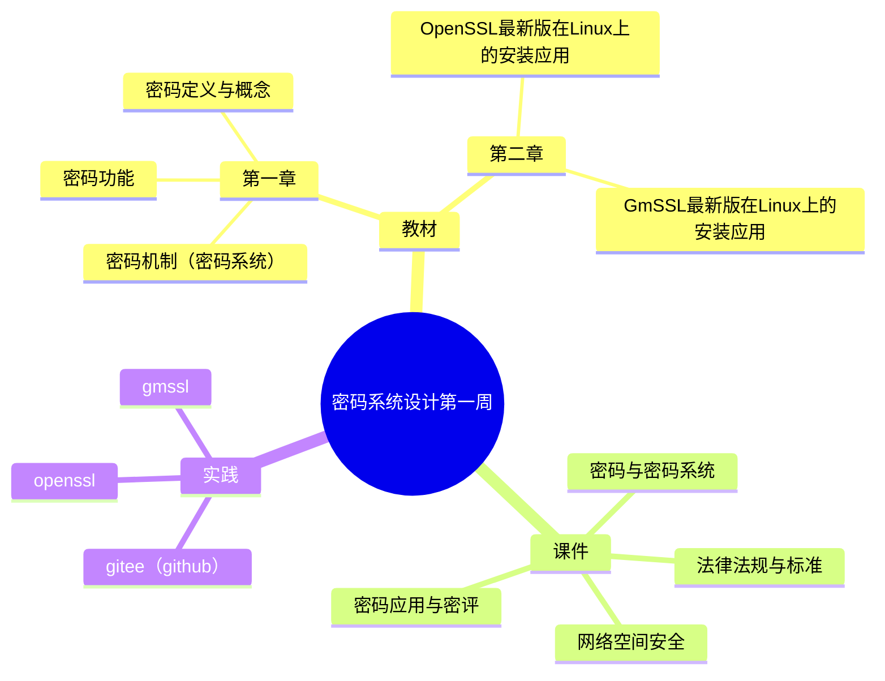
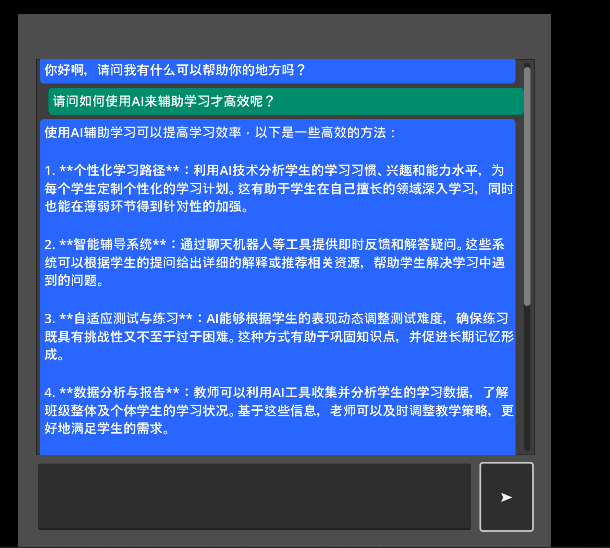

[toc]

# 密码系统设计

## 第十一周预习报告 
### 学习内容
- [Head First C 嗨翻 C 语言](https://www.ituring.com.cn/book/1004) 第11章
- [课程 mindmap](https://www.processon.com/mindmap/66bcf83cce68f62ecf3f63fc?from=pwa)

### AI 对学习内容的总结（1分）

#### 要求

- 让AI（kimi，元宝等）阅读学习内容并进行总结，教材内容可以使用微信读书或者云班课电子教材

#### 总结

- [对《Head First C 嗨翻 C 语言》第11章的总结](https://www.doubao.com/thread/wdd580b35e1f14bf8)(使用了豆包专门的AI阅读与提示词)
    - 我
        ```
        详细整理这篇文档，输出格式清晰的总结
        ```
    - AI
        ```
        本文主要介绍了使用C语言进行套接字（socket）编程和网络通信的相关知识，包括创建服务器和客户端、端口绑定、数据传输以及处理多客户端连接等内容。
        1. **网络编程基础概念**
            - **协议（Protocol）**：是一种结构化的对话，规定了客户端和服务器之间通信的规则。不同的网络应用使用不同的协议，如控制数据在网络中传输的互联网协议（IP）和用于网页浏览器与服务器通信的超文本传输协议（HTTP）。
            - **套接字（Socket）**：C程序通过套接字与外部世界通信，它是一种新的数据流，与文件或标准输入输出流不同，套接字可用于双向通信，需要使用特定函数（如`send()`和`recv()`）进行数据读写。
            - **端口（Port）**：计算机上的服务器程序通过端口与外界通信，端口类似于电视频道，不同的网络服务使用不同的端口，如Web服务使用端口80，电子邮件服务使用端口25等。端口号范围是0到65535，小于1024的端口通常保留给系统服务，普通用户一般使用大于1024的端口。
        2. **创建服务器**
            - **创建套接字**：使用`socket()`函数创建套接字，指定地址族（如`PF_INET`表示互联网地址族）、套接字类型（如`SOCK_STREAM`表示面向连接的字节流套接字）和协议（通常设为0）。
            - **绑定端口**：将套接字与特定端口绑定，使用`bind()`函数，需要提供套接字描述符、包含端口信息的`sockaddr_in`结构体（设置`sin_family`为`PF_INET`，`sin_port`为绑定端口号，`sin_addr.s_addr`为`htonl(INADDR_ANY)`表示接受任意地址的连接）。绑定端口时需注意，操作系统在一段时间内会阻止其他程序绑定已使用的端口，可使用`setsockopt()`函数设置`SO_REUSEADDR`选项来解决该问题。
            - **监听连接**：使用`listen()`函数设置监听队列长度，指定套接字描述符和队列长度，如`listen(listener_d, 10)`表示允许最多10个客户端同时等待连接。
            - **接受连接**：通过`accept()`函数等待客户端连接，该函数会阻塞直到有客户端连接，成功后返回一个新的套接字描述符，用于与客户端进行通信，同时获取客户端的地址信息。
            - **数据传输**：使用`send()`函数向客户端发送数据，指定连接套接字描述符、要发送的数据缓冲区、数据长度和标志（通常设为0）。接收客户端数据使用`recv()`函数，它返回接收的字节数，若为0表示客户端关闭连接，若为 -1表示发生错误。`recv()`函数接收的数据不包含`\0`终止符，且当客户端输入文本并回车时，字符串以`\r\n`结尾，可能需要多次调用`recv()`才能接收完所有数据，可编写辅助函数（如`read_in()`）来简化接收操作。
        3. **创建客户端**
            - **创建套接字**：与服务器创建套接字类似，使用`socket()`函数。
            - **连接服务器**：使用`connect()`函数连接到远程服务器的指定端口，需要提供套接字描述符和包含服务器地址信息的`sockaddr_in`结构体（设置`sin_family`为`PF_INET`，`sin_addr.s_addr`为服务器IP地址，`sin_port`为服务器端口号）。若使用域名连接服务器，可使用`getaddrinfo()`函数获取服务器地址信息，该函数根据域名和端口号查找并返回地址信息结构体链表，然后使用返回的信息创建套接字并连接。
            - **数据传输**：与服务器发送和接收数据类似，使用`send()`函数发送请求数据，使用`recv()`函数接收服务器响应数据。
        4. **多客户端处理**
            - **问题**：原始服务器代码只能一次处理一个客户端连接，若一个客户端响应慢，其他客户端将无法连接。
            - **解决方案**：在`accept()`接受客户端连接后，使用`fork()`创建子进程来处理与该客户端的通信，子进程关闭主监听套接字，父进程关闭与客户端通信的套接字，这样父进程可继续接受其他客户端连接，实现多客户端同时处理。

        文中通过构建互联网敲门服务器（Internet knock-knock server）和Web客户端（web client）的示例，详细展示了服务器和客户端的创建、端口绑定、数据传输以及多客户端处理等操作。同时，强调了在网络编程中进行错误检查的重要性，如检查套接字创建、绑定、监听、连接等系统调用的返回值，以确保程序的稳定性和可靠性。
        ```


### 对 AI 总结的反思与补充（2分）

#### 要求

- AI总结的问题
- 自己的补充

#### 反思与补充

- AI总结的问题
- 自己的补充

### 学习思维导图（2分）

#### 要求

- Mermaid 代码与截图(参考[Mermaid MindMap语法](https://mermaid.live/edit#pako:eNpdUk1vwjAM_StWTiAx7V5Nk2A7DoEGu_ViUreN1tqZkyB1iP--8FG2kZP93svTk-2DsVKRKUzvuOrRlwygInEyuQLT6QkCWKlrHIdLA_Am3EDrQhQdRqwonBWe1Ag1PuxEPqcjsxafOlQXMDrhEQVYqIsutOAvPPgw2FY6aQbAFFtR2AoPsEjfeP31ToFQbTt6rBiorslGt2cK4Wmnj8_IFdSEMSmFP7p5itLnABas0l2Qj_ArvbyXs2ZPEMm27L7SvWATFSM12c53yOy4-c_PtUk9cYQ8RH9jtyLdzWhNDKewHj3pCC5Je3SVmZn-WhXmcCJLE1vqqTRFLiuqMXWxNCUfszRPSzYDW1NETTQzKqlpTVFjF3KXfJWjvjpsFPtRQpXLy1tetn8-guMPMYioGg))**或者**提交思维导图链接（如果使用线上编辑器，推荐[processon](https://www.processon.com/),[xmind](https://xmind.cn/),...）

#### 思维导图



上面mermaid实际效果，vscode中可以预览：


### 基于 AI 的学习（2分）

#### 要求

- 至少找到自己理解不是太好 2 个概念，让 AI 对自己进行苏格拉底提问
- 参考下面提示语或者使用 AI Agent

提示词：“我在学习XXX知识点，请你以苏格拉底的方式对我进行提问，一次一个问题”

1. 核心是要求AI工具：“请你以苏格拉底的方式对我进行提问”
2. 然后AI工具就会给你提问，如果不知道问题的答案，可以反问AI：“你的理解是什么？”
3. 如果你觉得差不多了，可以先问问AI工具：“针对这个知识点，我理解了吗？”
4. AI工具会给出它的判断，如果你也觉得自己想清楚了，可以最后问AI工具：“我的回答结束了，请对我的回答进行评价总结”，让它帮你总结一下。

#### 学习内容

XXXXXXXXXXXXXXXXXXXXXXXXXXXXXXXXXXXXXXX

### 学习实践过程遇到的问题与解决方式（AI 驱动，优先使用AI工具解决问题）（2分）

- 问题 1，解决过程
- 问题 2:这周研究了怎么自己实现一个客户端来访问通义千问等大模型
    - 解决过程
        - 找到[GitHub上的连接GPT的项目](https://github.com/oceanbuilders/ChatGPT-stream-for-Godot-4)和[B站视频](https://www.bilibili.com/video/BV1yMxweiEpk/?spm_id_from=333.337.search-card.all.click&vd_source=912de37828db7e4feff5c9492864d51c)
            - 这两个项目一个连接GPT，另一个连接文心一言的应用，都不是通义千问
            - 但成功项目可以给我们根本的方向借鉴
            - 了解到两者都是HTTP方式访问大模型。Godot本身不支持python等语言，C#我也不会写，所以我只能找支持通过HTTP协议访问的大模型
        - 获得通义千问的密钥。查阅[通义千问的技术文档](https://help.aliyun.com/zh/model-studio/developer-reference/compatibility-of-openai-with-dashscope?spm=a2c4g.11186623.help-menu-2400256.d_3_9_0.1040516erhFodV&scm=20140722.H_2833609._.OR_help-V_1)，寻找其与OpenAI/HTTP兼容的部分。
        - 修改原先项目代码，尝试访问通义千问大模型("qwen-plus")
    - 成果展示：
        - 
        - 
    - 事后总结：
        - 访问都需要消耗额度，还是直接用免费的比较好。
        - 通义千问等大模型对于HTTP的支持不是很彻底，有些音频、文件等大模型不支持HTTP访问，所以我去找了KIMI大模型，kimi比较支持HTTP访问(似乎也就只支持这个了)，可以上传文件等。后续可以往这方面努力。
         - AI本身在这方面帮助不大，直接寻找成功项目和官方技术文档对自己更有帮助。
            - 但是，对于一些原理解读可以求助AI
            - 同时，对于大概的实现步骤也可以问AI，比如：[Godot如何调用通义千问大模型的API](https://www.doubao.com/thread/wb4af6eb05b0ed811)

### 作业提交要求（1分）

1. 提交Markdown 文件,文档命名“学号姓名《密码系统设计》.md”
2. 提交Markdown 文件转为 PDF,文档命名“学号姓名《密码系统设计》第 X 周.pdf”
3. 提交代码托管链接：[我的作业的github链接](https://github.com/youer0219/Information-Security-System-Design-Assignment)
4. 内容质量高有加分

### 参考资料

- AI工具(你使用的AI工具及其链接)

  - [Kimi](https://kimi.moonshot.cn/)
  - [文心一言](https://yiyan.baidu.com/)
  - [通义千问](https://tongyi.aliyun.com/)
  - [豆包](https://www.doubao.com/chat/)
  - [GPT4.0](https://iai.aichatos8.com.cn/#/home)
- 图书

  - [《Windows C/C++加密解密实战》](https://weread.qq.com/web/bookDetail/a0332190813ab78fag011422?wfrom=bookDetailH5)
  - [Head First C 嗨翻 C 语言](https://www.ituring.com.cn/book/1004)
