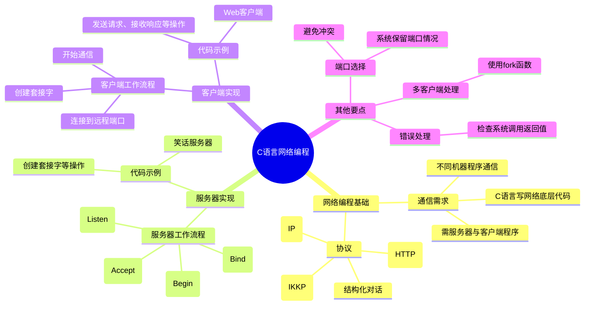

[toc]

# 密码系统设计

## 第十一周预习报告 
### 学习内容
- [Head First C 嗨翻 C 语言](https://www.ituring.com.cn/book/1004) 第11章
- [课程 mindmap](https://www.processon.com/mindmap/66bcf83cce68f62ecf3f63fc?from=pwa)

### AI 对学习内容的总结（1分）

#### 要求

- 让AI（kimi，元宝等）阅读学习内容并进行总结，教材内容可以使用微信读书或者云班课电子教材

#### 总结

- [对《Head First C 嗨翻 C 语言》第11章的总结](https://www.doubao.com/thread/wdd580b35e1f14bf8)(使用了豆包专门的AI阅读与提示词)
    - 我的提问
        ```md
        详细整理这篇文档，输出格式清晰的总结
        ```
    - AI的回答
        ```md
        本文主要介绍了使用C语言进行套接字（socket）编程和网络通信的相关知识，包括创建服务器和客户端、端口绑定、数据传输以及处理多客户端连接等内容。
        1. **网络编程基础概念**
            - **协议（Protocol）**：是一种结构化的对话，规定了客户端和服务器之间通信的规则。不同的网络应用使用不同的协议，如控制数据在网络中传输的互联网协议（IP）和用于网页浏览器与服务器通信的超文本传输协议（HTTP）。
            - **套接字（Socket）**：C程序通过套接字与外部世界通信，它是一种新的数据流，与文件或标准输入输出流不同，套接字可用于双向通信，需要使用特定函数（如`send()`和`recv()`）进行数据读写。
            - **端口（Port）**：计算机上的服务器程序通过端口与外界通信，端口类似于电视频道，不同的网络服务使用不同的端口，如Web服务使用端口80，电子邮件服务使用端口25等。端口号范围是0到65535，小于1024的端口通常保留给系统服务，普通用户一般使用大于1024的端口。
        2. **创建服务器**
            - **创建套接字**：使用`socket()`函数创建套接字，指定地址族（如`PF_INET`表示互联网地址族）、套接字类型（如`SOCK_STREAM`表示面向连接的字节流套接字）和协议（通常设为0）。
            - **绑定端口**：将套接字与特定端口绑定，使用`bind()`函数，需要提供套接字描述符、包含端口信息的`sockaddr_in`结构体（设置`sin_family`为`PF_INET`，`sin_port`为绑定端口号，`sin_addr.s_addr`为`htonl(INADDR_ANY)`表示接受任意地址的连接）。绑定端口时需注意，操作系统在一段时间内会阻止其他程序绑定已使用的端口，可使用`setsockopt()`函数设置`SO_REUSEADDR`选项来解决该问题。
            - **监听连接**：使用`listen()`函数设置监听队列长度，指定套接字描述符和队列长度，如`listen(listener_d, 10)`表示允许最多10个客户端同时等待连接。
            - **接受连接**：通过`accept()`函数等待客户端连接，该函数会阻塞直到有客户端连接，成功后返回一个新的套接字描述符，用于与客户端进行通信，同时获取客户端的地址信息。
            - **数据传输**：使用`send()`函数向客户端发送数据，指定连接套接字描述符、要发送的数据缓冲区、数据长度和标志（通常设为0）。接收客户端数据使用`recv()`函数，它返回接收的字节数，若为0表示客户端关闭连接，若为 -1表示发生错误。`recv()`函数接收的数据不包含`\0`终止符，且当客户端输入文本并回车时，字符串以`\r\n`结尾，可能需要多次调用`recv()`才能接收完所有数据，可编写辅助函数（如`read_in()`）来简化接收操作。
        3. **创建客户端**
            - **创建套接字**：与服务器创建套接字类似，使用`socket()`函数。
            - **连接服务器**：使用`connect()`函数连接到远程服务器的指定端口，需要提供套接字描述符和包含服务器地址信息的`sockaddr_in`结构体（设置`sin_family`为`PF_INET`，`sin_addr.s_addr`为服务器IP地址，`sin_port`为服务器端口号）。若使用域名连接服务器，可使用`getaddrinfo()`函数获取服务器地址信息，该函数根据域名和端口号查找并返回地址信息结构体链表，然后使用返回的信息创建套接字并连接。
            - **数据传输**：与服务器发送和接收数据类似，使用`send()`函数发送请求数据，使用`recv()`函数接收服务器响应数据。
        4. **多客户端处理**
            - **问题**：原始服务器代码只能一次处理一个客户端连接，若一个客户端响应慢，其他客户端将无法连接。
            - **解决方案**：在`accept()`接受客户端连接后，使用`fork()`创建子进程来处理与该客户端的通信，子进程关闭主监听套接字，父进程关闭与客户端通信的套接字，这样父进程可继续接受其他客户端连接，实现多客户端同时处理。

        文中通过构建互联网敲门服务器（Internet knock-knock server）和Web客户端（web client）的示例，详细展示了服务器和客户端的创建、端口绑定、数据传输以及多客户端处理等操作。同时，强调了在网络编程中进行错误检查的重要性，如检查套接字创建、绑定、监听、连接等系统调用的返回值，以确保程序的稳定性和可靠性。
        ```

### 对 AI 总结的反思与补充（2分）

#### 要求

- AI总结的问题
- 自己的补充

#### 反思与补充

- AI总结的问题
  - 层次不够清晰，并且没有讲解书中的示例
  - 第四部分不单单只有一个多客户端处理，还有其他的要点，比如：错误处理、端口选择
- 自己的补充
  - 新的总结
```md
该文档主要介绍了使用C语言进行网络编程的相关知识，包括网络通信的基本概念、服务器和客户端的实现等。以下是文档的详细总结：

### 网络编程基础
- **通信需求**：不同机器上的程序需要相互通信，C语言常用于编写网络底层代码，网络应用程序通常需要服务器和客户端两个程序。
- **协议**：协议是一种结构化的对话，如互联网协议（IP）和超文本传输协议（HTTP）等。本文将构建一个基于自定义协议（互联网敲门协议IKKP）的服务器。

### 服务器实现
- **服务器工作流程**
    - **绑定端口（Bind）**：服务器启动时需告诉操作系统使用的端口，使用`bind`函数将套接字绑定到指定端口。
    - **监听（Listen）**：使用`listen`函数设置监听队列长度，等待客户端连接。
    - **接受连接（Accept）**：使用`accept`函数等待客户端连接，返回一个新的套接字描述符用于通信。
    - **开始通信（Begin）**：使用`send`和`recv`函数与客户端进行数据交互。
- **代码示例**：以一个简单的笑话服务器为例，展示了服务器的基本实现过程，包括创建套接字、绑定端口、监听、接受连接、发送数据等操作。

### 客户端实现
- **客户端工作流程**
    - **创建套接字**：使用`socket`函数创建套接字。
    - **连接到远程端口**：使用`connect`函数连接到服务器的远程端口。
    - **开始通信**：使用`send`和`recv`函数与服务器进行数据交互。
- **代码示例**：以一个简单的Web客户端为例，展示了客户端的基本实现过程，包括创建套接字、连接到服务器、发送HTTP请求、接收服务器响应等操作。

### 其他要点
- **端口选择**：选择端口号时需注意避免与其他程序冲突，小于1024的端口号通常为系统保留端口。
- **错误处理**：在网络编程中，错误处理非常重要，需要检查系统调用的返回值并进行相应的处理。
- **多客户端处理**：为了处理多个客户端的连接，可以使用`fork`函数为每个客户端创建一个子进程。
```

### 学习思维导图（2分）

#### 要求

- Mermaid 代码与截图(参考[Mermaid MindMap语法](https://mermaid.live/edit#pako:eNpdUk1vwjAM_StWTiAx7V5Nk2A7DoEGu_ViUreN1tqZkyB1iP--8FG2kZP93svTk-2DsVKRKUzvuOrRlwygInEyuQLT6QkCWKlrHIdLA_Am3EDrQhQdRqwonBWe1Ag1PuxEPqcjsxafOlQXMDrhEQVYqIsutOAvPPgw2FY6aQbAFFtR2AoPsEjfeP31ToFQbTt6rBiorslGt2cK4Wmnj8_IFdSEMSmFP7p5itLnABas0l2Qj_ArvbyXs2ZPEMm27L7SvWATFSM12c53yOy4-c_PtUk9cYQ8RH9jtyLdzWhNDKewHj3pCC5Je3SVmZn-WhXmcCJLE1vqqTRFLiuqMXWxNCUfszRPSzYDW1NETTQzKqlpTVFjF3KXfJWjvjpsFPtRQpXLy1tetn8-guMPMYioGg))**或者**提交思维导图链接（如果使用线上编辑器，推荐[processon](https://www.processon.com/),[xmind](https://xmind.cn/),...）

#### 思维导图




### 基于 AI 的学习（2分）

#### 要求

- 至少找到自己理解不是太好 2 个概念，让 AI 对自己进行苏格拉底提问
- 参考下面提示语或者使用 AI Agent

提示词：“我在学习XXX知识点，请你以苏格拉底的方式对我进行提问，一次一个问题”

1. 核心是要求AI工具：“请你以苏格拉底的方式对我进行提问”
2. 然后AI工具就会给你提问，如果不知道问题的答案，可以反问AI：“你的理解是什么？”
3. 如果你觉得差不多了，可以先问问AI工具：“针对这个知识点，我理解了吗？”
4. AI工具会给出它的判断，如果你也觉得自己想清楚了，可以最后问AI工具：“我的回答结束了，请对我的回答进行评价总结”，让它帮你总结一下。

#### 学习内容

- [学习服务器工作流程知识点](https://kimi.moonshot.cn/share/ct0st2ojdo7tdnbvl7d0)
  - 探讨了一般服务器的工作原理与最近学习的MQTT协议与之的关联
    ```md
    User: 我在学习服务器的工作流程知识点，请你以苏格拉底的方式对我进行提问，一次一个问题，不超过四个问题 

    Kimi: 当然，我们将通过有限的问题来探索服务器的工作流程。让我们开始：

    1. **如果服务器的主要功能是提供服务，那么它首先需要做什么来使其服务对客户端可见？**
    （思考：在服务器可以提供服务之前，它需要完成哪个关键步骤？） 

    User: 服务器首先需要绑定一个特定的网络地址和端口号，这样客户端才能通过该地址和端口找到并访问服务器所提供的服务 。然后开始监听该端口，等待客户端的连接请求以提供服务。 

    Kimi: 非常好，你已经正确地识别了服务器使其服务对客户端可见的第一步。现在，让我们继续探讨接下来的步骤：

    2. **服务器绑定了特定的网络地址和端口号后，它如何表示已准备好接受来自客户端的连接？**
    （思考：在服务器绑定端口之后，它需要采取什么行动来表明它正在等待客户端的连接？） 

    User: 服务器通过系统调用如listen函数，设置监听队列长度等参数，来表示已准备好接受来自客户端的连接。之后就可等待客户端连接请求并按设置处理 。 

    Kimi: 对的，你已经很好地理解了服务器如何表明它已准备好接受连接。现在，让我们探讨最后一个问题：

    3. **一旦服务器通过监听表明它已准备好，那么它如何实际接受客户端的连接请求，并开始与客户端进行通信？**
    （思考：服务器使用哪个系统调用来接受连接，并与客户端建立通信通道？） 

    User: 服务器使用 accept 系统调用来接受客户端的连接请求，该调用会返回一个新的套接字，通过此套接字服务器就可与客户端进行通信。 

    Kimi: 正是如此，你已经准确地描述了服务器如何使用 `accept` 系统调用来接受客户端的连接请求，并开始通信。这标志着服务器工作流程的核心步骤之一。

    通过这些讨论，我们覆盖了服务器工作流程的关键环节：
    4. **绑定**：服务器绑定到一个网络地址和端口号。
    5. **监听**：服务器通过 `listen` 函数设置监听队列，准备接受连接。
    6. **接受连接**：服务器使用 `accept` 函数接受客户端的连接请求，并创建一个新的套接字用于通信。

    这些步骤共同确保了服务器能够有效地为网络中的客户端提供服务。感谢你的参与和思考，这有助于深化你对服务器工作流程的理解。如果你有任何其他问题或需要进一步的讨论，随时欢迎提问。 

    User: MQTT协议也是类似的实现嘛？请直接回答我的问题，不需要再提问。 

    Kimi: 是的，MQTT协议也是通过客户端和服务器之间的网络通信实现的，但它专注于轻量级的、基于发布/订阅的消息传输。MQTT协议中，客户端连接到MQTT代理（服务器），然后可以发布消息到特定的主题，或者订阅以接收来自特定主题的消息。虽然MQTT在实现细节上与TCP/IP模型中的套接字通信有所不同，特别是在效率和资源使用上进行了优化，但基本原理是相似的，都涉及到客户端和服务器之间的网络连接和数据交换。 

    User: MQTT协议也是基于TCP/IP技术的吧？ 

    Kimi: 是的，MQTT协议通常是运行在TCP/IP协议之上的。MQTT设计为一个轻量级的通信协议，它被构建在可靠的传输层协议TCP之上，以确保消息的可靠传输。尽管MQTT也可以在其他传输协议上实现，但在大多数实际应用中，它都是基于TCP/IP网络模型工作的。 

    ```
- [学习多客户端处理知识点](https://kimi.moonshot.cn/share/ct0t0l2vk6g71l50lekg)
    ```md
    User: 我在学习多客户端处理知识点，请你以苏格拉底的方式对我进行提问，一次只说一个问题，不超过四个问题 

    Kimi: 当然，让我们一步步探讨多客户端处理的知识点。

    1. **如果一个服务器需要同时处理多个客户端的请求，那么它首先需要解决什么问题？**
    （思考：在能够同时服务多个客户端之前，服务器面临的基本挑战是什么？） 

    User: 它首先需要解决资源分配和并发处理的问题，包括如何高效地分配CPU、内存等资源，以及如何同时处理多个并发的连接请求而互不干扰。 

    Kimi: 确实，资源分配和并发处理是服务器能够同时服务多个客户端的关键。接下来：

    2. **在并发处理中，服务器通常采用什么技术来确保它可以同时响应多个客户端？**
    （思考：有哪些常见的技术可以帮助服务器处理多个并发连接？） 

    User: 服务器在并发处理中，常采用多线程技术，为每个客户端连接创建独立线程来并行处理请求；也会使用多进程技术，利用进程的独立性同时响应多个客户端；还会运用基于事件驱动的异步非阻塞 I/O 技术，通过单线程处理多个连接事件，提高响应效率。 

    Kimi: 非常好，你已经提到了多线程、多进程和事件驱动的异步I/O这几种处理并发的技术。现在，让我们探讨这些技术中的一个具体应用：

    3. **在使用多进程技术时，服务器如何确保每个客户端都能得到及时响应，同时又不会使服务器资源过载？**
    （思考：在多进程模型中，服务器如何平衡资源使用和响应速度？） 

    User: 在多进程技术中，服务器可通过进程池来限制同时运行的进程数量，避免资源过载。还能根据客户端请求的优先级或类型，合理分配进程资源，确保重要或紧急的客户端请求能优先得到处理，以此平衡资源使用和响应速度 。同时，服务器可以采用进程间通信机制，协调各进程的工作，避免资源竞争和冲突，从而提高整体性能和稳定性。 

    Kimi: 你已经很好地描述了如何在多进程模型中平衡资源和响应速度。最后，让我们探讨一个与这些技术实施相关的问题：

    4. **在实现多客户端处理时，服务器如何确保不同客户端之间的数据安全和隔离性？**
    （思考：服务器如何处理不同客户端的数据，以保证数据的安全性和隔离性？） 

    User: 在多客户端处理时，服务器可利用操作系统提供的进程或线程隔离机制，不同进程或线程处理不同客户端数据，彼此空间独立。也可采用加密技术对每个客户端数据加密，传输与存储时防止他人窃取或篡改，以此确保数据安全和隔离性 。 

    Kimi: 非常好，你已经理解了确保数据安全和隔离性的重要性，并提出了利用操作系统的隔离机制和加密技术作为解决方案。这些措施确实有助于保护客户端数据不被未授权访问或篡改。

    通过这些问题和答案，我们深入探讨了多客户端处理的关键知识点，包括资源分配、并发技术、进程管理以及数据安全和隔离性。希望这个苏格拉底式的探讨有助于你更深入地理解这些概念。如果你有任何其他问题或需要进一步的讨论，随时欢迎提问。 

    User: 那该如何防范太多客户端连接导致服务器崩溃了 

    Kimi: 防范过多客户端连接导致服务器崩溃是一个重要的问题，涉及到服务器的稳定性和可靠性。以下是一些策略和技术：

    5. **限流（Rate Limiting）**：
    - 限制在特定时间内可以处理的请求数量，避免服务器过载。

    1. **负载均衡（Load Balancing）**：
    - 使用多个服务器分散请求，没有单个服务器需要处理所有请求。

    1. **水平扩展（Horizontal Scaling）**：
    - 在流量增加时，增加更多的服务器实例来处理额外的负载。

    1. **垂直扩展（Vertical Scaling）**：
    - 增强单个服务器的资源，如CPU、内存和存储，以处理更多的请求。

    1. **队列系统（Queuing Systems）**：
    - 使用消息队列来管理请求，确保它们可以按顺序和在容量范围内处理。

    1. **服务降级（Service Degradation）**：
    - 在高负载时，有意降低某些服务的优先级或质量，以保护核心服务。

    1. **异常检测和自动扩展（Anomaly Detection and Auto-scaling）**：
    - 实时监控流量和性能，自动调整资源以应对异常流量峰值。

    1. **数据库和缓存优化**：
    - 优化数据库查询和使用高效的缓存策略，减少数据库的压力。

    1. **连接池（Connection Pooling）**：
    - 重用数据库或外部服务的连接，减少建立和关闭连接的开销。

    1.  **超时和错误处理**：
        - 设定合理的超时限制，并在出现错误时快速失败，释放资源。

    2.  **安全措施**：
        - 防止DDoS攻击等恶意流量，使用防火墙和入侵检测系统。

    3.  **代码和资源优化**：
        - 优化代码以减少资源消耗，确保服务器能够更高效地处理请求。

    4.  **压力测试和性能调优**：
        - 定期进行压力测试，了解系统极限，并根据测试结果进行性能调优。

    通过这些策略，你可以提高服务器的韧性，确保它在面对大量客户端连接时能够保持稳定和响应。每种策略都有其适用场景，可能需要根据具体的业务需求和技术栈来选择和实施。 

    ```

### 学习实践过程遇到的问题与解决方式（AI 驱动，优先使用AI工具解决问题）（2分）


- 问题 1:这周总结了怎么自己实现一个客户端来访问通义千问等大模型
    - 解决过程
        - 找到[GitHub上的连接GPT的项目](https://github.com/oceanbuilders/ChatGPT-stream-for-Godot-4)和[B站视频](https://www.bilibili.com/video/BV1yMxweiEpk/?spm_id_from=333.337.search-card.all.click&vd_source=912de37828db7e4feff5c9492864d51c)
            - 这两个项目一个连接GPT，另一个连接文心一言的应用，都不是通义千问
            - 但成功项目可以给我们根本的方向借鉴
            - 了解到两者都是HTTP方式访问大模型。Godot本身不支持python等语言，C#我也不会写，所以我只能找支持通过HTTP协议访问的大模型
        - 获得通义千问的密钥。查阅[通义千问的技术文档](https://help.aliyun.com/zh/model-studio/developer-reference/compatibility-of-openai-with-dashscope?spm=a2c4g.11186623.help-menu-2400256.d_3_9_0.1040516erhFodV&scm=20140722.H_2833609._.OR_help-V_1)，寻找其与OpenAI/HTTP兼容的部分。
        - 修改原先项目代码，尝试访问通义千问大模型("qwen-plus")
    - 成果展示：
        - 
        - 
    - 事后总结：
        - 访问都需要消耗额度，注意消耗（一般也不至于用完）
        - 通义千问等大模型对于HTTP的支持不是很彻底，有些音频、文件等大模型不支持HTTP访问，所以我去找了KIMI大模型，kimi比较支持HTTP访问(似乎也就只支持这个了)，可以上传文件等。后续可以往这方面努力。
         - AI本身在这方面帮助不大，直接寻找成功项目和官方技术文档对自己更有帮助。
            - 但是，对于一些原理解读可以求助AI
            - 同时，对于大概的实现步骤也可以问AI，比如：[Godot如何调用通义千问大模型的API](https://www.doubao.com/thread/wb4af6eb05b0ed811)
    - 更加具体的可以参考`访问大模型API.md`的讲述（也在微信群中）。这份是在他之前的总结。
- 问题 2:龙脉芯片相关代码显示设备找不到 （未解决）
    - 在上一次实验的基础上，这次尝试`更多的调试信息`以及`设备测试`，但还是没能解决问题，也无法找到问题本质
        - 在这个过程中，AI帮助我理解各种输出的含义
    - 添加调试信息，明确问题出在返回的设备名称为空上
        ```
        root@Youer:~/bestidiocs2024/ch06/参考/longmaiskf0016-stu/samples/skf/linux_mac/encrypt# ./encryptTest
        Calling SKF_EnumDev...
        SKF_EnumDev result: 0 (Success)
        Enumerated device name: ''
        Calling SKF_ConnectDev...
        SKF_ConnectDev result: 167772166 (Invalid parameter)
        Error at line 173 in function SKF_ConnectDev, call failed with error code: 167772166 (Invalid parameter)
        ```
        - 事后来看，应该运行`enumdevinfo`中的代码，其本身就是检测功能，自带合适的报错输出。
    - 明确了这个函数只能返回空值。
    - 尝试询问官方。显然没有回复……
    
    - [在WSL中进行USB设备测试](https://github.com/dorssel/usbipd-win/wiki/Tested-Devices)
      - 是否可见
        ```
        root@Youer:~# lsusb
        Bus 002 Device 001: ID 1d6b:0003 Linux Foundation 3.0 root hub
        Bus 001 Device 002: ID 055c:db08 Proton Electronic Ind. Longmai mToken
        Bus 001 Device 001: ID 1d6b:0002 Linux Foundation 2.0 root hub
        ```
      - 是否被发现
          ```
          root@Youer:~# dmesg | tail
          [  705.549639] vhci_hcd vhci_hcd.0: devid(131073) speed(2) speed_str(full-speed)
          [  705.550110] vhci_hcd vhci_hcd.0: Device attached
          [  705.823331] vhci_hcd: vhci_device speed not set
          [  705.893339] usb 1-1: new full-speed USB device number 2 using vhci_hcd
          [  705.973336] vhci_hcd: vhci_device speed not set
          [  706.043250] usb 1-1: SetAddress Request (2) to port 0
          [  706.075896] usb 1-1: New USB device found, idVendor=055c, idProduct=db08, bcdDevice= 1.01
          [  706.076353] usb 1-1: New USB device strings: Mfr=1, Product=2, SerialNumber=0
          [  706.076703] usb 1-1: Product: Longmai mToken
          [  706.076909] usb 1-1: Manufacturer: Longmai Technologies
          ```
          - [AI对输出的解释](https://www.doubao.com/thread/wb3e0b5e7ecdce020)
      - USB复合设备检测(验证是否显示了所有预期的 USB 接口，例如大容量存储和通信设备)
        - `lsusb --tree`
            ```
            root@Youer:~# lsusb --tree
            /:  Bus 02.Port 1: Dev 1, Class=root_hub, Driver=vhci_hcd/8p, 5000M
            /:  Bus 01.Port 1: Dev 1, Class=root_hub, Driver=vhci_hcd/8p, 480M
                |__ Port 1: Dev 2, If 0, Class=Mass Storage, Driver=, 12M
            ```
        - [AI对输出的解释](https://www.doubao.com/thread/wb3e0b5e7ecdce020)
      - ` udevadm info -a -n /dev/bus/usb/001/002`命令查看USB信息
        ```
        root@Youer:~# udevadm info -a -n /dev/bus/usb/001/002

        Udevadm info starts with the device specified by the devpath and then
        walks up the chain of parent devices. It prints for every device
        found, all possible attributes in the udev rules key format.
        A rule to match, can be composed by the attributes of the device
        and the attributes from one single parent device.

        looking at device '/devices/platform/vhci_hcd.0/usb1/1-1':
            KERNEL=="1-1"
            SUBSYSTEM=="usb"
            DRIVER=="usb"
            ATTR{authorized}=="1"
            ATTR{avoid_reset_quirk}=="0"
            ATTR{bConfigurationValue}=="1"
            ATTR{bDeviceClass}=="00"
            ATTR{bDeviceProtocol}=="00"
            ATTR{bDeviceSubClass}=="00"
            ATTR{bMaxPacketSize0}=="64"
            ATTR{bMaxPower}=="200mA"
            ATTR{bNumConfigurations}=="1"
            ATTR{bNumInterfaces}==" 1"
            ATTR{bcdDevice}=="0101"
            ATTR{bmAttributes}=="80"
            ATTR{busnum}=="1"
            ATTR{configuration}==""
            ATTR{devnum}=="2"
            ATTR{devpath}=="1"
            ATTR{idProduct}=="db08"
            ATTR{idVendor}=="055c"
            ATTR{ltm_capable}=="no"
            ATTR{manufacturer}=="Longmai Technologies"
            ATTR{maxchild}=="0"
            ATTR{product}=="Longmai mToken"
            ATTR{quirks}=="0x0"
            ATTR{removable}=="unknown"
            ATTR{rx_lanes}=="1"
            ATTR{speed}=="12"
            ATTR{tx_lanes}=="1"
            ATTR{urbnum}=="9"
            ATTR{version}==" 1.10"

        looking at parent device '/devices/platform/vhci_hcd.0/usb1':
            KERNELS=="usb1"
            SUBSYSTEMS=="usb"
            DRIVERS=="usb"
            ATTRS{authorized}=="1"
            ATTRS{authorized_default}=="1"
            ATTRS{avoid_reset_quirk}=="0"
            ATTRS{bConfigurationValue}=="1"
            ATTRS{bDeviceClass}=="09"
            ATTRS{bDeviceProtocol}=="01"
            ATTRS{bDeviceSubClass}=="00"
            ATTRS{bMaxPacketSize0}=="64"
            ATTRS{bMaxPower}=="0mA"
            ATTRS{bNumConfigurations}=="1"
            ATTRS{bNumInterfaces}==" 1"
            ATTRS{bcdDevice}=="0515"
            ATTRS{bmAttributes}=="e0"
            ATTRS{busnum}=="1"
            ATTRS{configuration}==""
            ATTRS{devnum}=="1"
            ATTRS{devpath}=="0"
            ATTRS{idProduct}=="0002"
            ATTRS{idVendor}=="1d6b"
            ATTRS{interface_authorized_default}=="1"
            ATTRS{ltm_capable}=="no"
            ATTRS{manufacturer}=="Linux 5.15.167.4-microsoft-standard-WSL2 vhci_hcd"
            ATTRS{maxchild}=="8"
            ATTRS{product}=="USB/IP Virtual Host Controller"
            ATTRS{quirks}=="0x0"
            ATTRS{removable}=="unknown"
            ATTRS{rx_lanes}=="1"
            ATTRS{serial}=="vhci_hcd.0"
            ATTRS{speed}=="480"
            ATTRS{tx_lanes}=="1"
            ATTRS{urbnum}=="46"
            ATTRS{version}==" 2.00"

        looking at parent device '/devices/platform/vhci_hcd.0':
            KERNELS=="vhci_hcd.0"
            SUBSYSTEMS=="platform"
            DRIVERS=="vhci_hcd"
            ATTRS{driver_override}=="(null)"
            ATTRS{nports}=="16"
            ATTRS{usbip_debug}=="0"

        looking at parent device '/devices/platform':
            KERNELS=="platform"
            SUBSYSTEMS==""
            DRIVERS==""

        ```
        - [AI对输出的解释](https://kimi.moonshot.cn/share/ct0tmnm0atp2a09k98t0)
      - 综上所述，设备测试中看不出什么问题
    - 重新试了试，还是找不到设备
        ```
        root@Youer:~/bestidiocs2024/ch06/longmaiskf0016-stu/samples/skf/linux_mac/enumdevinfo# nano makefile_linux
        root@Youer:~/bestidiocs2024/ch06/longmaiskf0016-stu/samples/skf/linux_mac/enumdevinfo# make -f makefile_linux
        rm -f enumdevice
        g++  -o enumdevice main.o ../lib/linux/x64/libgm3000.1.0.so
        root@Youer:~/bestidiocs2024/ch06/longmaiskf0016-stu/samples/skf/linux_mac/enumdevinfo# ./enumdevice
                Not found device.
        ```
        - 理论上讲，这不太是我能解决的问题了。


### 作业提交要求（1分）

1. 提交Markdown 文件,文档命名“学号姓名《密码系统设计》.md”
2. 提交Markdown 文件转为 PDF,文档命名“学号姓名《密码系统设计》第 X 周.pdf”
3. 提交代码托管链接：[我的作业的github链接](https://github.com/youer0219/Information-Security-System-Design-Assignment)
4. 内容质量高有加分

### 参考资料

- AI工具(你使用的AI工具及其链接)

  - [Kimi](https://kimi.moonshot.cn/)
  - [文心一言](https://yiyan.baidu.com/)
  - [通义千问](https://tongyi.aliyun.com/)
  - [豆包](https://www.doubao.com/chat/)
  - [GPT4.0](https://iai.aichatos8.com.cn/#/home)
- 图书

  - [《Windows C/C++加密解密实战》](https://weread.qq.com/web/bookDetail/a0332190813ab78fag011422?wfrom=bookDetailH5)
  - [Head First C 嗨翻 C 语言](https://www.ituring.com.cn/book/1004)
