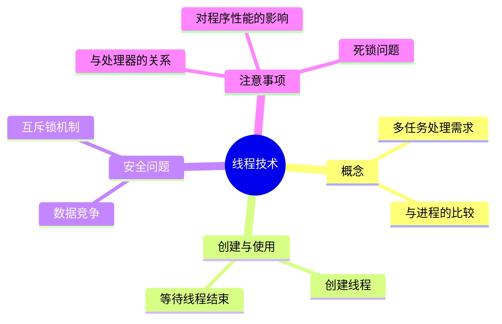

[toc]

# 密码系统设计

## 第十二周预习报告 
### 学习内容
- [Head First C 嗨翻 C 语言](https://www.ituring.com.cn/book/1004) 第12章
- [课程 mindmap](https://www.processon.com/mindmap/66bcf83cce68f62ecf3f63fc?from=pwa)

### AI 对学习内容的总结（1分）

#### 要求

- 让AI（kimi，元宝等）阅读学习内容并进行总结，教材内容可以使用微信读书或者云班课电子教材

#### 总结

- [对《Head First C 嗨翻 C 语言》第十二章的总结](https://www.doubao.com/thread/w720b148224f004f7)
    ```md
    ## 总结一
    该文档主要介绍了POSIX线程相关知识，包括线程的创建、同步机制以及相关注意事项，具体内容如下：

    ### 线程的概念
    - **多任务处理需求**：程序通常需要同时执行多个任务，如游戏中需要计算物体位置、更新图形、处理网络和用户输入等。
    - **线程与进程的比较**
        - **进程的不足**：创建进程耗时，进程间数据共享困难，且代码编写复杂。
        - **线程的优势**：能快速启动单独任务，可共享当前数据，代码编写相对简单。

    ### 线程的创建与使用
    - **创建线程**：使用POSIX线程库（pthread），线程函数需具有`void*`返回类型。通过`pthread_create`函数创建线程，将线程信息存储在`pthread_t`结构中。
    - **等待线程结束**：使用`pthread_join`函数等待线程完成，并接收线程函数的返回值。

    ### 线程安全问题
    - **数据竞争**：多个线程同时访问和修改共享数据可能导致结果不可预测，如在啤酒计数程序中，多个线程同时减少啤酒数量时可能出现错误结果。
    - **解决方法**：使用互斥锁（mutex）保护共享数据，确保同一时间只有一个线程能访问共享资源。

    ### 代码示例分析
    文档中给出了啤酒计数程序的两个版本，通过在不同位置加锁，产生了不同的输出结果，展示了互斥锁位置对程序执行的影响。

    ### 线程相关注意事项
    - **线程与处理器**：即使机器只有一个处理器核心，也能运行线程，操作系统会在多个线程之间快速切换，营造出同时执行多个任务的假象。
    - **线程对程序速度的影响**：线程不一定能使程序更快，过多的锁定操作可能导致程序运行速度与单线程相当。
    - **死锁问题**：当两个线程相互等待对方持有的互斥锁时，会发生死锁，导致程序停止运行。

    ## 总结二

    在计算机编程领域，随着软件系统日益复杂，对并行处理的需求愈发显著，线程技术应运而生。本文围绕POSIX线程展开了深入探讨，揭示了其在实现多任务并行执行中的关键作用及相关要点。

    ### 线程技术的背景与重要性
    在现代程序设计中，许多复杂任务需要同时进行多个操作。以游戏开发为例，需同时处理图形渲染、物体物理计算、用户输入响应以及网络通信等任务。传统的单线程程序如同单人作业，只能依次完成各项任务，效率受限。而线程技术则如同为程序配备了多个工作人员，可并行处理多个任务，极大地提高了程序的响应性和执行效率。

    ### 线程与进程的对比
    - **进程的局限性**
        - **创建开销**：创建新进程需要一定时间，对于执行时间较短的任务，创建进程的开销可能相对较大，影响程序整体性能。
        - **数据共享困难**：进程间的数据共享需要借助特定的通信机制，如管道等，增加了编程的复杂性。
        - **编程复杂性**：编写多进程程序需要处理进程间的同步、通信等问题，代码结构相对复杂。
    - **线程的优势**
        - **快速启动**：线程创建相对迅速，能够及时响应任务需求。
        - **数据共享便捷**：同一进程内的多个线程可以直接共享全局变量等数据，简化了数据共享的实现。
        - **编程相对简单**：相较于多进程编程，多线程编程在同步和通信方面的处理相对较为简单。

    ### POSIX线程的基本操作
    - **线程创建**：使用POSIX线程库（pthread）中的`pthread_create`函数创建线程。线程函数需具有`void*`返回类型，可接受一个`void*`类型的参数。通过该函数，可指定线程要执行的函数以及传递给该函数的参数，并将线程信息存储在`pthread_t`结构中。
    - **线程等待**：使用`pthread_join`函数等待线程执行完毕。该函数可以接收线程函数的返回值，并确保在主线程继续执行之前，所有创建的线程都已完成任务。

    ### 线程安全问题与解决方案
    - **线程安全隐患**：当多个线程同时访问和修改共享数据时，可能会出现数据竞争问题，导致程序结果不可预测。例如在啤酒计数程序中，多个线程同时对啤酒数量进行减操作时，可能会出现计数错误的情况。
    - **互斥锁机制**：为解决线程安全问题，引入了互斥锁（mutex）。互斥锁如同交通信号灯，确保在同一时刻只有一个线程能够访问被保护的共享资源。通过`pthread_mutex_lock`函数获取锁，进入临界区执行敏感操作，操作完成后使用`pthread_mutex_unlock`函数释放锁，允许其他线程访问共享资源。

    ### 线程编程的注意事项
    - **线程与处理器的关系**：即使计算机只有一个处理器核心，操作系统也能通过时间片轮转等方式实现多线程的并发执行，使程序看起来像是在同时执行多个任务。然而，在单处理器环境下，过多的线程切换可能会带来额外的开销，影响程序性能。
    - **线程对程序性能的影响**：虽然线程可以提高程序的并行性，但如果线程之间存在大量的锁竞争，可能会导致线程频繁等待，从而降低程序的执行效率。因此，在设计线程程序时，需要合理规划线程的数量和任务分配，减少锁的使用频率，以提高程序性能。
    - **死锁问题**：在多线程编程中，死锁是一种需要特别注意的问题。当两个或多个线程相互等待对方持有的资源时，就会发生死锁，导致程序陷入停滞状态。为避免死锁的发生，需要仔细设计线程的同步机制，确保线程获取资源的顺序合理，避免出现循环等待的情况。

    综上所述，POSIX线程为程序实现多任务并行执行提供了强大的支持。通过合理运用线程技术，能够有效提高程序的性能和响应性。然而，在使用线程时，需要充分考虑线程安全、性能优化以及死锁等问题，以确保程序的正确性和稳定性。

    ```

### 对 AI 总结的反思与补充（2分）

#### 要求

- AI总结的问题
- 自己的补充

#### 反思与补充

- AI总结的问题
    - 死锁的预防和解决策略可以扩展一些
    - 可以扩展一些别的同步机制
- 自己的补充
    - 其他死锁预防策略：请求和释放锁的顺序一致性、超时机制、死锁检测算法等
    - 其他同步机制：信号量（semaphores）、条件变量（condition variables）、屏障（barriers）等
        - 信号量：信号量用于控制对共享资源的访问，它维护一个计数器，线程可以通过信号量的`wait`（P操作）和`signal`（V操作）来控制对共享资源的并发访问，从而实现同步和互斥。
        - 条件变量：条件变量用于线程间的同步，允许一个或多个线程在某个条件成立之前挂起等待，而其他线程可以唤醒它们。它们通常与互斥锁配合使用，以等待特定条件的发生。
        - 屏障：屏障用于多线程程序中，让一组线程在继续执行之前等待，直到所有线程都到达屏障点。这确保了在继续执行下一步之前，所有线程都完成了当前阶段的工作。


### 学习思维导图（2分）

#### 要求

- Mermaid 代码与截图(参考[Mermaid MindMap语法](https://mermaid.live/edit#pako:eNpdUk1vwjAM_StWTiAx7V5Nk2A7DoEGu_ViUreN1tqZkyB1iP--8FG2kZP93svTk-2DsVKRKUzvuOrRlwygInEyuQLT6QkCWKlrHIdLA_Am3EDrQhQdRqwonBWe1Ag1PuxEPqcjsxafOlQXMDrhEQVYqIsutOAvPPgw2FY6aQbAFFtR2AoPsEjfeP31ToFQbTt6rBiorslGt2cK4Wmnj8_IFdSEMSmFP7p5itLnABas0l2Qj_ArvbyXs2ZPEMm27L7SvWATFSM12c53yOy4-c_PtUk9cYQ8RH9jtyLdzWhNDKewHj3pCC5Je3SVmZn-WhXmcCJLE1vqqTRFLiuqMXWxNCUfszRPSzYDW1NETTQzKqlpTVFjF3KXfJWjvjpsFPtRQpXLy1tetn8-guMPMYioGg))**或者**提交思维导图链接（如果使用线上编辑器，推荐[processon](https://www.processon.com/),[xmind](https://xmind.cn/),...）

#### 思维导图




### 基于 AI 的学习（2分）

#### 要求

- 至少找到自己理解不是太好 2 个概念，让 AI 对自己进行苏格拉底提问
- 参考下面提示语或者使用 AI Agent

提示词：“我在学习XXX知识点，请你以苏格拉底的方式对我进行提问，一次一个问题”

1. 核心是要求AI工具：“请你以苏格拉底的方式对我进行提问”
2. 然后AI工具就会给你提问，如果不知道问题的答案，可以反问AI：“你的理解是什么？”
3. 如果你觉得差不多了，可以先问问AI工具：“针对这个知识点，我理解了吗？”
4. AI工具会给出它的判断，如果你也觉得自己想清楚了，可以最后问AI工具：“我的回答结束了，请对我的回答进行评价总结”，让它帮你总结一下。

#### 学习内容

- [学习避免线程死锁知识点](https://kimi.moonshot.cn/share/ct21p986n7mtqek4qfag)
    ```md
    User: 我在学习避免死锁的知识点，请你以苏格拉底的方式对我进行提问，一次一个问题，不超过四个问题 

    Kimi: 当然可以，让我们开始吧。

    1. 你能描述一下什么是死锁吗？ 

    User: 死锁是指在多线程编程中，两个或多个线程因相互等待对方持有的资源而无法继续执行的情况，导致程序陷入停滞。 

    Kimi: 非常好，你已经理解了死锁的基本概念。那么，我的下一个问题：

    2. 你能举出一个可能导致死锁的具体场景吗？ 

    User: 线程A获取了资源1并等待资源2，线程B获取了资源2并等待资源1，两个线程都不释放已持有的资源，就会导致死锁。 

    Kimi: 很棒，你提供了一个典型的死锁场景。现在，让我们深入一步：

    3. 在编程时，我们可以采取哪些措施来预防或避免死锁的发生？ 

    User: 预防死锁可通过避免嵌套锁、按顺序获取锁、设置超时机制、使用资源分配图等措施来实现。 

    Kimi: 非常好，你已经提到了一些有效的策略。最后一个问题：

    4. 你能解释一下为什么这些措施能够帮助我们避免死锁吗？ 

    User: 因为它们打破了死锁产生的条件，如避免资源相互等待、防止循环等待等。 

    Kimi: 完全正确，你已经很好地理解了如何通过打破死锁产生的条件来避免死锁。这些措施确保了资源的有序访问和合理释放，从而减少了线程间相互等待的可能性，这是避免死锁的关键。通过你的描述，可以看出你对死锁的预防有了一定的认识和理解。继续深入学习，你将能够更有效地处理多线程编程中的并发问题。 

    User: 我在阅读《整洁代码》一书中，发现作者对多线程开发的代码整洁很担忧，你有什么好的方法使多线程的程序代码整洁吗 

    Kimi: 多线程编程确实会增加代码的复杂性，但以下是一些使多线程程序代码保持整洁的方法：

    5. **最小化共享状态**：
    - 减少线程间共享的数据。共享状态越少，需要同步的地方就越少，代码就越简洁。
    - 使用局部变量或者线程局部存储（Thread Local Storage, TLS）来避免共享状态。

    1. **使用高级并发抽象**：
    - 利用现代编程语言提供的并发库和工具，比如Java的`java.util.concurrent`包，C#的`Task`和`async/await`，Python的`asyncio`库等。
    - 这些工具提供了更高级的抽象，如线程池、futures、promises等，可以减少直接处理线程的复杂性。

    1. **明确线程的职责**：
    - 每个线程应该只有一个职责，这样可以使线程的代码更加模块化和可重用。

    1. **避免锁**：
    - 尽可能使用无锁编程技术，如原子操作和非阻塞数据结构。
    - 如果必须使用锁，确保锁的粒度尽可能小，并且锁的作用范围尽可能短。

    1. **使用设计模式**：
    - 应用设计模式，如生产者-消费者模式、读者-写者模式等，可以帮助管理线程间的交互。

    1. **限制线程数量**：
    - 过多的线程会导致上下文切换开销增加，而且难以管理。使用线程池来限制并发线程的数量。

    1. **清晰的接口和文档**：
    - 为线程间的交互定义清晰的接口，并提供充分的文档，这样其他开发者可以更容易理解和维护代码。

    1. **错误处理**：
    - 在多线程环境中，错误处理尤为重要。确保每个线程都能妥善处理异常情况，并且不会影响到其他线程。

    1. **测试和调试**：
    - 多线程程序的测试和调试通常比单线程程序更复杂。使用工具和框架来帮助测试并发代码，确保代码在并发环境下的行为符合预期。

    1.  **代码审查**：
        - 多线程代码的代码审查尤为重要，以确保没有潜在的竞态条件和死锁。

    通过遵循这些实践，你可以提高多线程程序的代码质量和可维护性。记住，简洁的代码不仅仅是看起来整洁，更重要的是易于理解和维护。 
    ```
- [学习游戏开发中的多线程知识点](https://kimi.moonshot.cn/share/ct21qo9m9sk3dhciqntg)
    ```md
    User: 我在学习游戏开发多线程的知识点，请你以苏格拉底的方式对我进行提问，一次一个问题，不超过四个问题 

    Kimi: 当然可以，让我们开始这个探索过程。

    1. 在游戏开发中，你如何看待多线程的作用？它为游戏性能带来了哪些可能的提升？ 

    User: 多线程在游戏开发中作用重大，能提升游戏性能，比如可并行处理图形渲染、物理计算等任务，提高响应速度和流畅度。 

    Kimi: 很好，你已经理解了多线程在游戏开发中的基本作用。那么，我的下一个问题：

    2. 在实现多线程时，你认为应该如何平衡线程的数量和游戏的性能？ 

    User: 平衡线程数量和游戏性能需考虑硬件资源，避免过多线程导致开销大，根据任务类型和复杂度合理分配线程。 

    Kimi: 非常好，你已经考虑到了线程管理中的一个重要方面。接下来，我的第三个问题：

    3. 在游戏开发中，你如何确保多线程环境下的数据安全和一致性？ 

    User: 确保数据安全和一致性可通过使用互斥锁、读写锁等同步机制，以及合理设计数据结构和算法来实现。
    以及引擎自带一些机制。 

    Kimi: 你的回答涵盖了多线程编程中的关键点。最后一个问题：

    4. 你能描述一下在游戏开发中，你如何决定哪些任务适合放在不同的线程中执行吗？ 

    User: 决定任务分配需考虑任务的独立性、计算复杂度和数据依赖关系，将可并行的任务放在不同线程中执行以提高效率。 

    Kimi: 你的回答非常到位，确实，将任务分配到不同线程中执行是多线程游戏开发中的一个核心决策。考虑任务的独立性、计算复杂度和数据依赖关系是确保多线程效率的关键因素。这样的策略可以帮助你最大化地利用多核处理器的能力，同时避免线程间的不必要竞争和冲突，从而提高游戏的整体性能和响应速度。继续保持这种分析和决策的能力，它将在你的游戏开发旅程中发挥重要作用。 

    ```

### 学习实践过程遇到的问题与解决方式（AI 驱动，优先使用AI工具解决问题）（2分）

- 问题 1:学习AI代码助手的使用
    - 解决过程
        - 参考老师在群中发的链接，挑选感兴趣的代码助手(我选的是通义千问)，找到官网的使用文档进行部署即可
            - 代码助手一般都以插件形式封装好了，在很多IDE中直接下载即可使用
            - 老师发的AI代码助手列表
            ```
            市场上常见的AI代码助手列表
            🔍 市场上常见的AI代码助手

            GitHub Copilot: 由GitHub提供的AI代码助手。
            StackBlitz Bolt: StackBlitz推出的Bolt。
            Cursor AI 和被收购的 Supermaven AI。
            Codeium Windsurf: 由Codeium开发的Windsurf。
            PearAI: @trypearai。
            Vercel: @v0。
            Claude AI Artifacts: Claude AI推出的Artifacts。
            ChatGPT Canvas: ChatGPT推出的Canvas。
            Aider: aider.chat。
            Cline: github.com/cline/cline。
            Lovable: @lovable_dev。
            QodoAI: @QodoAI。
            CodeGPT AI: @codegptAI。
            Continue Dev: @continuedev。

            🛠️ 其他知名AI代码助手：

            OpenHands (github.com/All-Hands-AI/OpenHands) 
            Cody AI (Sourcegraph Cody)
            Amazon Q Developer (aws.amazon.com/q/developer/)
            智谱 AI 的 CodeGeeX (codegeex.cn)
            Baidu 的 文心快码 (comate.baidu.com/en)
            Alibaba 的 通义灵码 (tongyi.aliyun.com/lingma/)
            Alipay 的 CodeFuse (codefuse.alipay.com/vat/home)
            Bytedance 的 MarsCode Team (@MarsCode_Team)
            腾讯云 AI 代码助手 (copilot.tencent.com)
            Monica Code (@hey_im_monica) 
            代码小浣熊 (xiaohuanxiong.com/code)
            ```
        - [通义千问代码助手官网下载教程](https://tongyi.aliyun.com/lingma/download)
            -  Visual Studio Code、Visual Studio、JetBrains IDEs等知名IDE均支持直接下载该插件
            -  在`vscode`中下载安装该插件(`安装时间很长`)
                
                - 重启 Visual Studio Code后登录阿里云账号
            - 使用过程
                - 
                - 
            - [通义灵码帮助文档链接](https://help.aliyun.com/zh/lingma/product-overview/introduction-of-tongyi-lingma)
- 问题 2：利用AI辅助实验四项目设计
    - 解决过程
        - [使用AI来大概估计需要什么方面的技术，适合用什么语言与框架进行实现](https://www.doubao.com/thread/w42e9b873fe36b663)
            - 可以一步步明确自己的需求。比如，如果选择了python语言就把提问中的语言选择一栏限制为只要python。其他的如框架等也是如此。
        - 明确最小需求。
            - 不要指望两周能实现全部功能。明确哪些是关键的，哪些是可以舍弃或用一些简单方式替代的。
        - 同时要注意，一方面要研究实际业务怎么办，也就是什么语言什么框架怎么实现，另一方面也要注重项目的抽象设计，比如要实现怎么样的系统才能满足实验要求，也就是实现的目标。这个`实现的目标`是对实验要求这一层抽象的具体化的抽象层。

### 作业提交要求（1分）

1. 提交Markdown 文件,文档命名“学号姓名《密码系统设计》.md”
2. 提交Markdown 文件转为 PDF,文档命名“学号姓名《密码系统设计》第 X 周.pdf”
3. 提交代码托管链接：[我的作业的github链接](https://github.com/youer0219/Information-Security-System-Design-Assignment)
4. 内容质量高有加分

### 参考资料

- AI工具(你使用的AI工具及其链接)

  - [Kimi](https://kimi.moonshot.cn/)
  - [文心一言](https://yiyan.baidu.com/)
  - [通义千问](https://tongyi.aliyun.com/)
  - [豆包](https://www.doubao.com/chat/)
  - [GPT4.0](https://iai.aichatos8.com.cn/#/home)
- 图书

  - [《Windows C/C++加密解密实战》](https://weread.qq.com/web/bookDetail/a0332190813ab78fag011422?wfrom=bookDetailH5)
  - [Head First C 嗨翻 C 语言](https://www.ituring.com.cn/book/1004)
