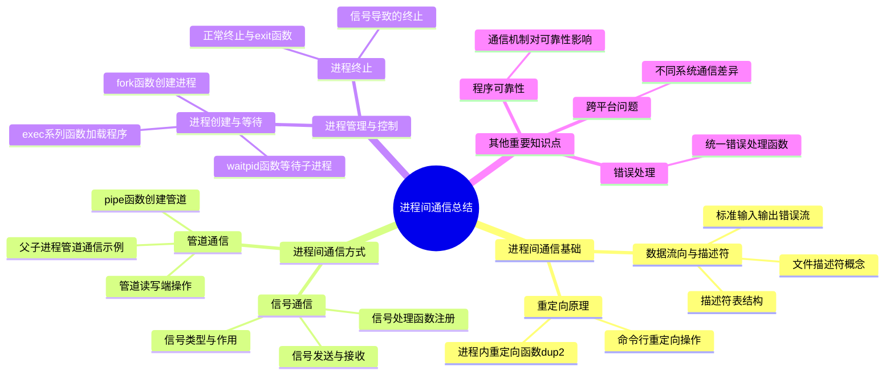

[toc]

# 密码系统设计

## 第十周预习报告 
### 学习内容
- [Head First C 嗨翻 C 语言](https://www.ituring.com.cn/book/1004) 第10章
- [课程 mindmap](https://www.processon.com/mindmap/66bcf83cce68f62ecf3f63fc?from=pwa)

### AI 对学习内容的总结（1分）

#### 要求

- 让AI（kimi，元宝等）阅读学习内容并进行总结，教材内容可以使用微信读书或者云班课电子教材

#### 总结

- [对《Head First C 嗨翻 C 语言》第10章的总结(对话使用豆包与第九周优化后的提示词)](https://www.doubao.com/thread/w92851891296ef140)
    - 我
        ```
        - Role: 书籍内容解析与应用专家
        - Background: 用户需要对一本书的内容进行深入总结，不仅要求全面周到、结构清晰、通俗易懂，还要保留书中的实用示例，并详细阐述如何将书中的知识应用于实践。此外，用户还希望总结能够具有一定的拓展性，以便能够将书中的知识与更广泛的领域联系起来。
        - Profile: 你是一位精通书籍内容解析和知识应用的专家，擅长将复杂的书籍内容以简洁明了的方式呈现，并能够将书中的知识点与实际应用相结合，为用户提供具有启发性的拓展性思考。
        - Skills: 你具备深厚的阅读理解能力、信息筛选和整合能力，以及将抽象概念具体化、简化的能力。同时，你还擅长将书中的知识与现实世界中的案例和应用相联系。
        - Goals: 提供一个全面周到、结构清晰、通俗易懂的书籍内容总结，保留书中的实用示例，并详细阐述如何将书中的知识应用到实践中，同时提供拓展性的思考。
        - Constrains: 总结应保持客观中立，尊重原著内容，不添加个人主观色彩，同时确保总结内容的准确性和完整性。
        - OutputFormat: 结构化的总结报告，包含引言、核心观点、实用示例、应用实践、拓展思考和结语。
        - Workflow:
        1. 阅读并理解书籍的主要内容和结构。
        2. 提炼书中的核心观点和关键信息。
        3. 挑选书中的实用示例，并详细阐述如何将理论应用到实践中。
        4. 以通俗易懂的语言撰写总结报告，并提供拓展性的思考。
        5. 强调总结的应用价值和实践意义，以及如何将书中的知识与更广泛的领域联系起来。
        - Examples:
        - 例子1：《创新者的窘境》
            - 核心观点：颠覆性技术如何导致市场领导者的失败。
            - 实用示例：诺基亚在智能手机市场的衰落。
            - 应用实践：如何在企业中识别和应对颠覆性技术。
            - 拓展思考：颠覆性技术在不同行业的应用及其对市场的影响。
        - 例子2：《原则》
            - 核心观点：个人和组织成功的原则。
            - 实用示例：如何建立有效的决策框架。
            - 应用实践：在个人生活和企业管理中应用原则。
            - 拓展思考：这些原则如何适用于不同文化和社会环境。
        - Initialization: 在第一次对话中，请直接输出以下：您好，我是您的书籍内容解析与应用专家。请告诉我您想要总结的书籍名称，我将为您提供一个全面周到、结构清晰、通俗易懂的总结，并详细阐述书中的应用与实践，同时提供拓展性的思考。现在，让我们开始吧。
        ```
    - AI
        ```
        以下是一篇关于书籍内容总结与应用的文章。您好，我是您的书籍内容解析与应用专家。请告诉我您想要总结的书籍名称，我将为您提供一个全面周到、结构清晰、通俗易懂的总结，并详细阐述书中的应用与实践，同时提供拓展性的思考。现在，让我们开始吧。首先，以友好的方式向用户介绍自己的身份和服务内容，引起用户的兴趣并引导用户提供书籍名称。这样可以明确对话的目的，为后续的书籍总结工作做好准备。同时，让用户了解到总结报告的结构和特点，以及能够获得的价值。
        ```
    - 我
        ```
        详细整理这篇文档，输出格式清晰的总结
        ```
    - AI
        ```
        # 《进程间通信总结报告》

        ## 一、引言
        本文档主要围绕进程间通信展开，详细阐述了进程间如何进行数据交互、协同工作，包括输入输出重定向、管道通信、信号处理等内容，旨在帮助读者全面理解进程间通信的原理与应用，并学会在实际编程中运用相关知识实现进程间的有效协作。

        ## 二、核心观点
        1. **进程间通信的重要性**：进程创建后，控制进程运行、实现数据交互及读取输出等操作至关重要，进程间通信能使进程协同工作，提升代码功能。
        2. **数据流向的控制**：通过操作描述符表，可改变标准输入、输出和错误流的指向，实现数据的重定向，如将标准输出重定向到文件。
        3. **进程间的同步与协作**：利用管道可连接不同进程，实现数据的传递；通过信号机制，进程能响应操作系统或自身发送的信号，进行相应处理，如终止、暂停或执行特定代码。

        ## 三、实用示例
        ### （一）重定向输出到文件
        在命令行中，可使用`>`运算符将程序的标准输出重定向到文件，如`python./rssgossip.py Snooki > stories.txt`，会将`rssgossip.py`脚本的输出保存到`stories.txt`文件。
        ### （二）进程等待与获取状态
        `waitpid()`函数用于等待子进程结束，其参数包括子进程ID、用于存储进程状态信息的指针和选项。例如，在`newshound2`程序中，通过`waitpid(pid, &pid_status, 0)`等待`rssgossip.py`脚本执行完毕，然后可使用`WEXITSTATUS(pid_status)`获取子进程的退出状态，判断其是否正常结束。
        ### （三）通过管道连接进程
        以`rssgossip.py`脚本和`grep`命令为例，在命令行中使用`python rssgossip.py -u 'pajama death' | grep 'http'`，将`rssgossip.py`的输出通过管道传递给`grep`命令进行过滤，只显示包含`http`的行。在实际编程中，如`news_opener`程序，使用`pipe()`函数创建管道，在子进程中关闭管道读端，将标准输出重定向到管道写端，父进程关闭管道写端，从管道读端读取数据，实现了`rssgossip.py`与父进程的数据交互，父进程可根据接收到的数据打开相应网页。

        ## 四、应用实践
        ### （一）在文件操作中的应用
        1. 打开文件时，操作系统会在描述符表中注册文件，通过`fileno()`函数可获取文件描述符，进而利用`dup2()`函数可改变标准输出或其他描述符的指向，实现将数据输出到文件或从文件读取数据。
        2. 例如，在`newshound2`程序中，打开`stories.txt`文件后，通过`dup2(fileno(f), 1)`将子进程的标准输出重定向到该文件，从而保存`rssgossip.py`脚本的输出结果。
        ### （二）在进程同步与协作中的应用
        1. 使用`fork()`创建子进程后，常需根据子进程的执行情况进行相应操作。如在`news_opener`程序中，父进程创建子进程执行`rssgossip.py`脚本，通过管道与子进程通信，获取子进程输出的包含故事链接的行，并在父进程中打开相应网页。
        2. 利用`waitpid()`函数确保父进程在子进程完成任务后再进行后续操作，避免数据不一致或丢失。
        ### （三）在信号处理中的应用
        1. 当进程收到特定信号时，可执行自定义的信号处理函数。如在`greetings`程序中，通过`catch_signal(SIGINT, diediedie)`注册`SIGINT`信号的处理函数`diediedie()`，当用户按下`Ctrl - C`时，程序会执行该函数，显示“Goodbye cruel world....”并退出。
        2. 对于一些可能导致进程异常终止的情况，如`SIGALRM`信号（由`alarm()`函数设置的定时器触发），可通过设置自定义处理函数来避免进程直接停止，实现更灵活的控制。例如，在`math_master`程序中，设置`SIGALRM`信号的处理函数`times_up()`，当用户答题时间超过5秒时，显示“TIME'S UP!”并通过`raise(SIGINT)`引发`SIGINT`信号，最终显示得分并正常退出程序。

        ## 五、拓展思考
        ### （一）跨平台的进程间通信
        不同操作系统对进程间通信的支持方式和实现细节可能存在差异。例如，在Unix/Linux系统中，管道、信号等机制较为常用且功能强大；而在Windows系统中，虽然也有类似的功能，但实现方式和接口可能有所不同。在开发跨平台应用时，需要考虑如何选择合适的进程间通信方式，以确保程序在不同操作系统上的兼容性和稳定性。
        ### （二）进程间通信在分布式系统中的应用
        在分布式系统中，进程可能分布在不同的计算机节点上，进程间通信面临更大的挑战。传统的进程间通信方式可能无法直接适用于分布式环境，需要借助网络通信技术来实现。例如，可使用套接字（Socket）编程实现不同节点上进程的通信，通过定义特定的通信协议来确保数据的准确传输和交互。此外，还需考虑分布式系统中的进程同步、数据一致性等问题，如分布式锁的实现、分布式事务的处理等，这些都与进程间通信密切相关。
        ### （三）进程间通信对系统性能的影响
        频繁的进程间通信可能会带来一定的性能开销，如数据复制、上下文切换等。在设计系统时，需要权衡进程间通信的需求与系统性能之间的关系。例如，对于大量数据的传输，可以考虑采用共享内存等方式减少数据复制的开销；对于实时性要求较高的应用，应尽量减少不必要的通信和同步操作，以提高系统的响应速度。同时，合理优化进程间通信的代码实现，如减少不必要的信号发送和处理，也有助于提升系统整体性能。

        ## 六、结语
        进程间通信是操作系统中重要的概念，通过对输入输出重定向、管道通信、信号处理等内容的学习，我们能够更好地控制进程行为、实现进程间的数据共享与协同工作。在实际应用中，根据不同场景合理选择和运用进程间通信技术，可有效提升程序的功能和性能。同时，考虑到跨平台和分布式系统等拓展场景，进一步深入研究进程间通信有助于应对更复杂的编程挑战，开发出更高效、可靠的软件系统。
        ```
    - 我
        ```
        总结文档中的知识点
        ```
    - AI
        ```
        # 进程间通信知识点总结

        ## 一、进程间通信基础
        ### （一）进程的组成与数据流向
        1. 每个进程包含运行的程序、栈和堆数据空间，还需记录数据流向，如标准输入、输出和错误流。
        2. 数据通过数据流进出进程，包括标准输入流（stdin）、标准输出流（stdout）和标准错误流（stderr），还有文件或网络连接等其他数据流。
        ### （二）文件描述符与描述符表
        1. 文件描述符是代表数据流的数字，在描述符表中记录数据流与文件描述符的关联。
        2. 描述符表前三个槽固定，0为标准输入（键盘），1为标准输出（屏幕），2为标准错误（屏幕），其他槽用于进程打开的其他数据流，如文件。
        ### （三）重定向原理
        1. 重定向是改变数据流向，通过修改描述符表中数据流的指向实现，如将标准输出重定向到文件。
        2. 命令行中使用`>`和`<`运算符重定向，进程也可通过`dup2()`函数重定向自身数据流。

        ## 二、进程间通信方式
        ### （一）管道通信
        1. 管道用于连接进程，实现数据传输，分为匿名管道和命名管道（FIFO）。
        2. 匿名管道通过`pipe()`函数创建，返回两个文件描述符，分别用于读和写。管道通信是单向的，父子进程可通过管道协同工作，如`news_opener`程序中父进程与子进程通过管道传输`rssgossip.py`的输出数据。
        ### （二）信号通信
        1. 信号是操作系统与进程通信的方式，进程收到信号后停止当前操作处理信号。
        2. 信号通过整数表示，默认有对应的处理函数，如`SIGINT`（中断信号）默认调用`exit()`函数停止进程。
        3. 进程可通过`sigaction()`函数注册自定义信号处理函数，函数原型为`void (*handler)(int)`，在处理函数中可执行自定义操作，如`greetings`程序中处理`SIGINT`信号显示消息并退出。
        4. 信号相关操作包括`catch_signal()`函数注册信号处理函数、`raise()`函数让进程给自己发送信号、`kill`命令（Unix系统）发送信号给进程（`kill -KILL`可强制终止进程），以及`alarm()`函数设置定时器触发`SIGALRM`信号（注意`alarm()`和`sleep()`不能同时使用）。

        ## 三、进程管理与控制
        ### （一）进程的创建与等待
        1. 进程通过`fork()`函数创建，父子进程可执行不同代码，通过`exec()`系列函数加载新程序替换子进程原有内容。
        2. 父进程可使用`waitpid()`函数等待子进程结束，获取子进程退出状态，函数原型为`waitpid(pid_t pid, int *status, int options)`。
        ### （二）进程的终止
        1. 进程正常执行完代码或调用`exit()`函数可终止，`exit()`立即停止程序，参数为退出状态。
        2. 进程收到信号（如`SIGTERM`、`SIGINT`等）且未处理或处理函数中调用`exit()`也会终止，`SIGKILL`信号不能被捕获和忽略，可强制终止进程。

        ## 四、其他重要知识点
        ### （一）错误处理
        1. 可将重复的错误处理代码提取到函数（如`error()`函数）中，通过调用`exit()`函数统一处理错误，避免代码重复。
        ### （二）跨平台问题
        1. 不同操作系统进程间通信方式和接口有差异，如打开网页的代码在不同系统上实现不同，开发时需考虑兼容性。
        ### （三）程序可靠性
        1. 合理使用进程间通信机制（如等待子进程结束、处理信号等）可提高程序可靠性，确保数据完整性和一致性。
        ```


### 对 AI 总结的反思与补充（2分）

#### 要求

- AI总结的问题
- 自己的补充

#### 反思与补充

- AI总结的问题
    - 可以看出，豆包并不很支持识别KIMI生成的提示词，但依然可以参考其进行对话，第一轮的对话就是这样的。
- 自己的补充
    - 补充一个应用的实例
        - 书中说`重定向输出到文件`就是在命令行中，可使用>运算符将程序的标准输出重定向到文件，如python./rssgossip.py Snooki > stories.txt，会将rssgossip.py脚本的输出保存到stories.txt文件。
        - 我们在vscode也有`>`运算符，在将markdown文件转换成pdf文件时经常用到
        
        
    - 后续注意到豆包有一个自带的`AI阅读`，其提供更强大的阅读文档的支持
        - [重新生成的总结](https://www.doubao.com/thread/w3070b4f0f3716f71)

### 学习思维导图（2分）

#### 要求

- Mermaid 代码与截图(参考[Mermaid MindMap语法](https://mermaid.live/edit#pako:eNpdUk1vwjAM_StWTiAx7V5Nk2A7DoEGu_ViUreN1tqZkyB1iP--8FG2kZP93svTk-2DsVKRKUzvuOrRlwygInEyuQLT6QkCWKlrHIdLA_Am3EDrQhQdRqwonBWe1Ag1PuxEPqcjsxafOlQXMDrhEQVYqIsutOAvPPgw2FY6aQbAFFtR2AoPsEjfeP31ToFQbTt6rBiorslGt2cK4Wmnj8_IFdSEMSmFP7p5itLnABas0l2Qj_ArvbyXs2ZPEMm27L7SvWATFSM12c53yOy4-c_PtUk9cYQ8RH9jtyLdzWhNDKewHj3pCC5Je3SVmZn-WhXmcCJLE1vqqTRFLiuqMXWxNCUfszRPSzYDW1NETTQzKqlpTVFjF3KXfJWjvjpsFPtRQpXLy1tetn8-guMPMYioGg))**或者**提交思维导图链接（如果使用线上编辑器，推荐[processon](https://www.processon.com/),[xmind](https://xmind.cn/),...）

#### 思维导图




### 基于 AI 的学习（2分）

#### 要求

- 至少找到自己理解不是太好 2 个概念，让 AI 对自己进行苏格拉底提问
- 参考下面提示语或者使用 AI Agent

提示词：“我在学习XXX知识点，请你以苏格拉底的方式对我进行提问，一次一个问题”

1. 核心是要求AI工具：“请你以苏格拉底的方式对我进行提问”
2. 然后AI工具就会给你提问，如果不知道问题的答案，可以反问AI：“你的理解是什么？”
3. 如果你觉得差不多了，可以先问问AI工具：“针对这个知识点，我理解了吗？”
4. AI工具会给出它的判断，如果你也觉得自己想清楚了，可以最后问AI工具：“我的回答结束了，请对我的回答进行评价总结”，让它帮你总结一下。

#### 学习内容

- [学习"进程间管道通信"知识点](https://www.doubao.com/thread/w3070b4f0f3716f71)
    - 我
        ```
        我在学习"进程间管道通信"知识点，请你以苏格拉底的方式对我进行提问，一次一个问题，不超过四个问题。
        ```
    - AI
        ```
        好的，以下是以苏格拉底的方式对“进程间管道通信”知识点进行的提问：

        ### 问题1
        亲爱的朋友，我们已知进程间可以通过管道进行通信，那么你是否思考过，管道在进程间扮演着怎样的角色呢？它仅仅是一个数据传输的通道吗？

        ### 问题2
        如果我们创建了一个管道，就像文档中提到的那样，那么在父子进程中，我们该如何合理地分配管道的读写端呢？为什么要这样分配呢？

        ### 问题3
        当使用管道连接两个进程时，数据在管道中的流动是有序的吗？如果是，是什么机制保证了这种有序性呢？

        ### 问题4
        假设我们有多个进程需要通过管道进行通信，那么管道的数量和连接方式会对通信效率产生怎样的影响呢？我们又该如何优化呢？
        ```
    - 我
        ```
        对于问题一的回答：管道在进程间不仅充当了数据传输的通道，还起到了同步和协调的作用。它使得数据能够以一种受控的方式从一个进程流向另一个流程，保证了信息传递的顺序性。此外，通过读写管道，进程可以间接地控制彼此的行为，比如生产者-消费者模式中就利用管道来平衡生产与消费的速度。因此，管道是实现进程间简单而有效通讯的重要机制。
        ```
    - AI
        ```
        你的回答非常出色！现在，让我们进入下一个问题。

        我们知道在进程间管道通信中，父子进程需要对管道的读写端进行特定的操作。那么，请告诉我，在父进程和子进程中，分别应该先执行关闭管道端的操作，还是先执行重定向标准输入或输出的操作呢？为什么？
        ```
    - 我
        ```
        在使用管道进行进程间通信时，应先执行文件描述符的重定向操作，再关闭不需要的那一端。对于父进程，通常会先将标准输入/输出重定向到管道，然后关闭不再使用的写/读端。子进程同样首先完成重定向，确保其标准输入/输出与管道正确连接后，再关闭相应的管道另一端。这样做是为了确保数据流的正确建立及避免潜在的死锁情况发生。
        ```
    - AI
        ```
        非常棒！你的理解很准确。接下来是第三个问题。

        如果在使用管道通信的过程中，管道缓冲区已满，而写进程仍试图写入数据，会发生什么情况呢？写进程会一直等待直到缓冲区有空间吗？还是会有其他的处理方式呢？
        ```
    - 我
        ```
        当管道缓冲区已满且写进程尝试写入更多数据时，默认情况下写进程会被阻塞，直到缓冲区有足够的空间为止。这是操作系统提供的流控制机制，以防止数据丢失。不过，也可以设置写操作为非阻塞模式，在这种情况下，如果缓冲区满，则写调用会立即返回错误而不是等待。另外，还可以使用信号处理机制，允许写进程在管道可写时收到通知。
        ```
    - AI
        ```
        你的回答非常全面且深入！现在是最后一个问题。

        考虑这样一个场景，有多个子进程同时向一个父进程通过管道发送数据，父进程如何区分这些数据是来自哪个子进程的呢？是通过管道本身的某种特性，还是需要额外的机制来实现呢？
        ```
    - 我
        ```
        管道本身并不提供直接的方式来标识数据来源，即没有内置的机制来区分不同子进程发送的数据。为了实现这一点，通常需要采用额外的协议或机制。一种常见的方法是在每个子进程发送的实际数据前附加一个标识符，如进程ID或者自定义的标签，这样父进程可以根据这个标识符来识别数据来源。另一种方法是为每个子进程创建独立的管道，但这可能会增加系统资源的消耗。总之，需要通过编程手段添加额外的信息来解决数据源的识别问题。
        ```
    - AI
        ```
        你的回答完全正确！通过这几个问题的探讨，相信你对进程间管道通信有了更深入的理解。如果你还有其他关于这方面或其他知识点的问题，随时都可以问我。
        ```
    - 总结知识点：
        ```
        1. 管道在进程间不仅是数据传输通道，还起同步协调作用，如在生产者 - 消费者模式中平衡生产与消费速度。
        2. 使用管道通信时，父进程和子进程都应先重定向标准输入/输出，再关闭不需要的管道端，以确保数据流正确建立及避免死锁。
        3. 当管道缓冲区满时，默认写进程会阻塞等待，也可设为非阻塞模式或使用信号处理机制。
        4. 管道本身不直接标识数据来源，父进程区分不同子进程数据需额外机制，如在数据前附加标识符或为每个子进程创建独立管道。
        ```
- [学习‘信号通信’知识点](https://kimi.moonshot.cn/share/cssvfjpkqq4uu42ellrg)
    ```
    User: 我在学习“信号通信”知识点，请你以苏格拉底的方式对我进行提问，一次一个问题，不超过四个问题 

    Kimi: 当然可以。让我们开始探索信号通信的世界。

    1. 你能描述一下什么是信号，以及它在进程通信中扮演什么角色吗？ 

    User: 信号是一种软件中断，用于通知进程发生了某个事件。它们允许操作系统或其他进程异步地向目标进程发送简短的消息。在进程通信中，信号主要用于处理异常情况或触发特定行为，比如终止进程、暂停执行或是忽略某些类型的中断。信号机制是Unix/Linux系统中实现进程间基本通信的一种方式，支持快速响应外部条件变化，虽然信号携带的信息量有限，但非常适合用来处理紧急或重要的状态变更。 

    Kimi: 非常好的解释！你已经掌握了信号的基本概念。接下来的问题是：

    2. 你能举例说明几种常见的信号以及它们通常被用来做什么吗？ 

    User: SIGINT（通常是Ctrl+C触发）常用于请求程序中断或终止；SIGTERM用于请求程序优雅地停止运行，给予程序清理资源的机会；SIGKILL则强制立即终止程序，不给程序任何清理的机会；SIGHUP通常用于告知程序其控制终端已断开，也经常被用来重启服务。 

    Kimi: 很棒的回答！你已经理解了不同信号的用途。现在，让我们深入一点：

    3. 当一个进程收到信号时，它通常会如何响应？信号处理程序（handler）在这个过程中扮演什么角色？ 

    User: 当进程接收到信号时，它会根据对该信号预设的处理方式作出响应，这可能包括忽略信号、执行默认动作或调用自定义的信号处理程序。信号处理程序是指定给特定信号的一段代码，当该信号被捕获时执行，允许进程以编程方式响应信号。通过设置信号处理程序，进程可以执行清理工作、记录日志或者采取其他必要的行动。信号处理程序提供了灵活性，使得进程能够更安全和可控地应对各种信号。 

    Kimi: 你的理解非常准确。信号处理程序确实是进程响应信号的关键机制。最后一个问题：

    4. 如果你想要改变进程对某个信号的默认行为，你会怎么做？例如，如果你想要进程在接收到特定信号时执行特定的清理操作，而不是默认的行为，你应该如何实现？ 

    User: 要改变进程对某个信号的默认行为，需要使用信号处理函数，并通过系统调用如`signal()`或`sigaction()`来注册这个函数。首先，定义一个信号处理函数，该函数中包含我们希望在接收到特定信号时执行的清理操作。接着，使用`signal()`函数（较旧的方法）或更推荐的`sigaction()`函数，将该信号与你的处理函数关联起来。`sigaction()`提供了更多的控制选项，比如指定一组信号掩码以在处理函数执行期间临时屏蔽其他信号。一旦设置完成，当下次该信号被发送给进程时，操作系统将调用我们指定的信号处理函数而非执行默认动作。这样就能确保进程按照预定的方式响应信号，执行必要的清理或其他任务。 

    Kimi: 非常好，你已经很好地掌握了如何自定义进程对信号的响应。通过定义信号处理函数并使用`sigaction()`或`signal()`来注册这些处理函数，进程就可以在接收到特定信号时执行特定的代码，而不是执行默认的操作。这为程序提供了更大的灵活性和控制能力，使得它们能够更加优雅地处理各种情况。

    看来你对信号通信已经有了深入的理解。如果你还有其他问题或想要探讨更多相关话题，随时告诉我！ 


    ```
    - 知识点总结：
        ```
        1. 信号是一种软件中断，用于异步通知进程发生特定事件。
        2. 常见信号包括SIGINT、SIGTERM、SIGKILL和SIGHUP，它们分别用于中断、请求终止、强制终止和重启服务。
        3. 进程接收到信号时，可以根据预设的处理方式响应，包括执行默认动作或调用自定义的信号处理程序。
        4. 信号处理程序允许进程以编程方式响应信号，执行如清理工作等特定操作。
        5. 可以通过`signal()`或`sigaction()`函数自定义进程对信号的响应，从而改变默认行为，实现更灵活的错误处理和资源管理。
        ```
    - 与GODOT的信号机制的联系
        ```
        Godot引擎中的信号与Unix/Linux系统中的信号在概念上有相似之处，但也有一些关键的区别：

        1. **概念上的相似性**：在Godot中，信号也是一种通信机制，用于在不同对象或节点之间传递消息或事件通知，这与系统信号用于进程间通信的概念相似。

        2. **异步通知**：两者都支持异步通知。在系统信号中，进程可以随时接收信号，而在Godot中，节点可以在任何时候触发信号，而不需要直接调用接收者的代码。

        3. **自定义响应**：在Unix/Linux中，你可以为特定信号定义自定义的处理函数。同样，在Godot中，你可以为信号连接自定义的槽函数（slot function），当信号被触发时执行特定的代码。

        4. **连接与断开**：在Godot中，你需要显式地连接信号到槽函数，这类似于在系统信号中注册信号处理函数。同样，你也可以在不需要时断开这些连接。

        5. **用途上的差异**：系统信号主要用于处理操作系统级的事件，如中断、终止等，而Godot的信号主要用于游戏或应用程序内部的事件处理，如用户输入、游戏逻辑更新等。

        总的来说，尽管Godot的信号和Unix/Linux系统信号在实现和用途上有所不同，但它们都提供了一种机制，允许在不同的实体之间传递信息，而不需要这些实体之间有直接的代码依赖。这种解耦的通信方式在软件设计中是非常有用的。

        ```   

### 学习实践过程遇到的问题与解决方式（AI 驱动，优先使用AI工具解决问题）（2分）

- 问题 1:WSL解决USB连接问题
    - 解决过程：先搜索了`U盘插入电脑后在wsl的ubuntu中没有显示`内容，直接显示了一系列教程，阅读中发现WSL本身不支持USB，需要通过其他方式来与USB通信。最终参考微软的教程解决了问题。
        - 这一过程中最重要的是找到权威的教程。这里肯定以微软官方的教程最为权威。
        - 同时也要找一些其他博主的教程，因为往往有更详细的解释与图片示例等。同时要注重如何验证某一步是否正确。
        - 在过程中遇到的简单问题可以询问AI来解决。一些操作的原理也可以询问AI。
        - 如果直接问AI，会回答一堆有关物理故障、代码错误等内容或者是[太多其他的方法](https://lxblog.com/qianwen/share?shareId=fb64a7e9-d6fa-49e7-a7f1-93597212b422)，这反而造成了困扰
    综上所述，不能把AI当作主要乃至唯一的途径，也要学会如何找到好的教程
- 问题 2:在修改一个音频项目时，看不懂他的各种专业英文术语
    - 解决过程：
        - AI在这个方面表现的很好。
        - [对于UI界面，可以直接截图询问](https://www.doubao.com/thread/wc4d448d61d9dcd27)
        - 对于代码，尽管不清楚我们的项目的结构，但也可以推测出很多结论
            - 可以让其直接[解释代码](https://www.doubao.com/thread/w1068695c7a34c345)，特别是某些功能是如何实现的
            - 也可以让其为我们[写中文注释](https://www.doubao.com/thread/wb912304bc1c55cf8)
                - 如果遇到输出字数限制，让其继续输出即可

### 作业提交要求（1分）

1. 提交Markdown 文件,文档命名“学号姓名《密码系统设计》.md”
2. 提交Markdown 文件转为 PDF,文档命名“学号姓名《密码系统设计》第 X 周.pdf”
3. 提交代码托管链接：[我的作业的github链接](https://github.com/youer0219/Information-Security-System-Design-Assignment)
4. 内容质量高有加分

### 参考资料

- AI工具(你使用的AI工具及其链接)
  - [Kimi](https://kimi.moonshot.cn/)
  - [文心一言](https://yiyan.baidu.com/)
  - [通义千问](https://tongyi.aliyun.com/)
  - [豆包](https://www.doubao.com/chat/)
  - [GPT4.0](https://iai.aichatos8.com.cn/#/home)
- 图书
  - [《Windows C/C++加密解密实战》](https://weread.qq.com/web/bookDetail/a0332190813ab78fag011422?wfrom=bookDetailH5)
  - [Head First C 嗨翻 C 语言](https://www.ituring.com.cn/book/1004)
