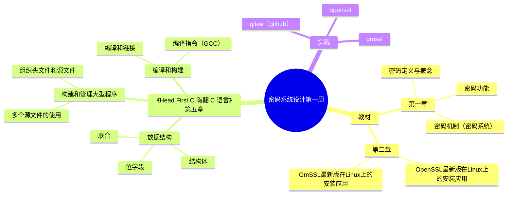

[toc]
# 密码系统设计

## 第四周预习报告 
### 学习内容
- [Head First C 嗨翻 C 语言](https://www.ituring.com.cn/book/1004) 第5章
- [《Windows C/C++加密解密实战》](https://weread.qq.com/web/bookDetail/a0332190813ab78fag011422?wfrom=bookDetailH5)第 6，8，13,14 章
    - 重点第14 章，第 6 章了解 ，第 8，,13 参考
- [课程 mindmap](https://www.processon.com/mindmap/66bcf83cce68f62ecf3f63fc?from=pwa)
- 报告内容参考第一周

### AI 对学习内容的总结（1分）
#### 要求
- 让AI（kimi，元宝等）阅读学习内容并进行总结，教材内容可以使用微信读书或者云班课电子教材
#### 总结

- [总结《Windows C/C++加密解密实战》第 6，8，13,14 章](https://kimi.moonshot.cn/share/crrnaauc2kujk6nnt2u0)
  ```
  User: 请阅读这本书的第6、8、13、14章节内容并总结，请详细总结第十四章 

  Kimi: 这本书的第6、8、13、14章节主要介绍了加密和解密的相关知识，特别是非对称算法RSA、椭圆曲线密码体制（ECC），以及中国的国家标准公钥密码算法SM2。下面是对这些章节的详细总结：

  ### 第6章：非对称算法RSA的加解密
  - **非对称密码体制**：介绍了单钥加密和公钥密码体制，其中RSA是公钥密码体制的典型代表。
  - **RSA算法**：详细讲解了RSA算法的数学基础，包括素数、素性检测、倍数、约数、互质数、质因数、因子、模运算等概念。
  - **RSA的安全性**：讨论了RSA算法的安全性，基于大数分解的难度。
  - **RSA算法描述**：提供了RSA算法的具体描述，包括密钥生成、加密和解密的详细步骤。
  - **RSA的数学基础**：深入讲解了RSA算法的数学原理，包括欧拉函数、最大公约数、扩展欧几里得算法等。
  - **RSA算法的攻击及分析**：分析了对RSA算法的可能攻击方式，如因子分解攻击、选择密文攻击等。

  ### 第8章：椭圆曲线密码体制
  - **椭圆曲线的数学基础**：介绍了椭圆曲线的定义、性质以及在密码学中的应用。
  - **椭圆曲线的加密和解密**：讨论了椭圆曲线加密算法（ECC）的基本原理和实现。
  - **椭圆曲线的数学表示**：详细描述了椭圆曲线在不同数域上的表示方法。
  - **椭圆曲线的安全性**：分析了椭圆曲线密码体制的安全性，包括抗攻击能力和算法的复杂性。

  ### 第13章：SM2算法的数学基础
  - **SM2算法概述**：介绍了SM2算法的背景、特点和应用场景。
  - **SM2算法的数学基础**：详细讲解了SM2算法所需的数学知识，包括素域、二元扩域、椭圆曲线的定义和性质。
  - **SM2算法的实现**：讨论了SM2算法的具体实现步骤，包括密钥对生成、加密、解密和数字签名。

  ### 第14章：SM2算法的实现
  - **SM2算法的用途**：介绍了SM2算法在数字签名、加密解密和密钥交换中的应用。
  - **椭圆曲线密码体制的不足**：分析了ECC算法的局限性和实现中的挑战。
  - **椭圆曲线的研究热点**：探讨了椭圆曲线密码体制的研究进展和热点问题。
  - **SM2算法中的有限域**：详细描述了SM2算法使用的有限域Fq的定义和性质。
  - **SM2算法的参数**：介绍了SM2算法的参数选择，包括椭圆曲线的参数和用户密钥对的生成。
  - **SM2算法的加密和解密流程**：提供了SM2算法加密和解密的具体流程和步骤。
  - **SM2算法的数字签名**：讨论了SM2算法在数字签名方面的应用，包括签名的生成和验证过程。
  - **SM2算法的实现示例**：给出了SM2算法实现的示例代码，包括密钥生成、加密、解密和签名验签的代码实现。

  第14章特别强调了SM2算法的实用性和安全性，作为中国的国家标准公钥密码算法，SM2在保证信息安全方面具有重要意义。通过对SM2算法的详细讲解和示例代码的展示，读者可以更好地理解和掌握SM2算法的实现和应用。 


  ```
- [总结《Head First C 嗨翻 C 语言》第五章](https://kimi.moonshot.cn/share/crrnb6onsmmtb2v319m0)
  ```
  User: 请总结第五章内容 

  Kimi: 第五章主要介绍了C语言中的结构体（structs）、联合体（unions）和位字段（bitfields），这些是C语言中用于创建复杂数据类型的重要工具。以下是第五章的主要内容总结：

  1. **结构体（Structs）**:
    - 结构体是将多个不同或相同类型的数据组合成一个单一数据类型的方式。
    - 结构体通过`struct`关键字定义，可以包含各种数据类型的成员。
    - 结构体成员可以通过点操作符（`.`）访问。
    - 结构体可以嵌套，即一个结构体内部可以包含另一个结构体。
    - 可以使用`typedef`为结构体创建别名，简化声明和使用。

  2. **联合体（Unions）**:
    - 联合体允许在相同的内存位置存储不同的数据类型，但一次只能使用其中一个。
    - 联合体通过`union`关键字定义。
    - 联合体可以用于存储多种可能的数据类型，但任何时候只能存储其中一个类型的数据。
    - 联合体成员也可以通过点操作符（`.`）访问。

  3. **位字段（Bitfields）**:
    - 位字段允许在结构体中精确控制每个成员的存储大小，以位为单位。
    - 位字段通过在结构体成员后面声明其大小来定义，例如：`unsigned int flag : 1;`。
    - 位字段常用于存储标志位或者紧凑的数值数据。

  4. **动态内存分配**:
    - 讨论了如何使用`malloc()`和`free()`函数在堆（heap）上动态分配和释放内存。
    - 介绍了`sizeof`操作符，用于确定数据类型在内存中的大小。

  5. **内存泄漏**:
    - 讨论了内存泄漏的问题，即分配的内存没有被正确释放。
    - 介绍了使用`valgrind`工具来检测和解决内存泄漏问题。

  6. **数据结构**:
    - 讨论了如何使用结构体和指针创建链表等数据结构。
    - 介绍了递归结构体的概念，即结构体中包含指向相同类型结构体的指针。

  7. **函数指针**:
    - 讨论了函数指针的概念，即指向函数的指针。
    - 介绍了如何使用函数指针来传递函数作为参数。

  8. **高级函数特性**:
    - 讨论了如何创建可以接受可变数量参数的函数，即变参函数。

  第五章的内容为读者提供了在C语言中处理更复杂数据结构的能力，是理解C语言中高级数据类型和内存管理的重要基础。 


  ```

### 对 AI 总结的反思与补充（2分）
#### 要求
- AI总结的问题
- 自己的补充
#### 反思与补充
XXXXXXXXXXXXXXXXXXXXXXXXXXXXXXXXXXXXXX
### 学习思维导图（2分）
#### 要求
- Mermaid 代码与截图(参考[Mermaid MindMap语法](https://mermaid.live/edit#pako:eNpdUk1vwjAM_StWTiAx7V5Nk2A7DoEGu_ViUreN1tqZkyB1iP--8FG2kZP93svTk-2DsVKRKUzvuOrRlwygInEyuQLT6QkCWKlrHIdLA_Am3EDrQhQdRqwonBWe1Ag1PuxEPqcjsxafOlQXMDrhEQVYqIsutOAvPPgw2FY6aQbAFFtR2AoPsEjfeP31ToFQbTt6rBiorslGt2cK4Wmnj8_IFdSEMSmFP7p5itLnABas0l2Qj_ArvbyXs2ZPEMm27L7SvWATFSM12c53yOy4-c_PtUk9cYQ8RH9jtyLdzWhNDKewHj3pCC5Je3SVmZn-WhXmcCJLE1vqqTRFLiuqMXWxNCUfszRPSzYDW1NETTQzKqlpTVFjF3KXfJWjvjpsFPtRQpXLy1tetn8-guMPMYioGg))**或者**提交思维导图链接（如果使用线上编辑器，推荐[processon](https://www.processon.com/),[xmind](https://xmind.cn/),...）
#### 思维导图

下面是个简单mermaid的思维导图，你可以根据你自己的需求修改


上面mermaid实际效果，vscode中可以预览：


### 基于 AI 的学习（2分）
#### 要求
- 至少找到自己理解不是太好 2 个概念，让 AI 对自己进行苏格拉底提问
- 参考下面提示语或者使用 AI Agent

提示词：“我在学习XXX知识点，请你以苏格拉底的方式对我进行提问，一次一个问题”
1. 核心是要求AI工具：“请你以苏格拉底的方式对我进行提问”
2. 然后AI工具就会给你提问，如果不知道问题的答案，可以反问AI：“你的理解（回答）是什么？”
3. 如果你觉得差不多了，可以先问问AI工具：“针对我XXX知识点，我理解了吗？”
4. AI工具会给出它的判断，如果你也觉得自己想清楚了，可以最后问AI工具：“我的回答结束了，请对我的回答进行评价总结”，让它帮你总结一下。

#### 学习内容
XXXXXXXXXXXXXXXXXXXXXXXXXXXXXXXXXXXXXXX

### 学习实践过程遇到的问题与解决方式（AI 驱动，优先使用AI工具解决问题）（2分）
至少两个
- 问题 1，解决过程
- 问题 2，解决过程
- ...

### 作业提交要求（1分）

1. 提交Markdown 文件,文档命名“学号姓名《密码系统设计》.md”
2. 提交Markdown 文件转为 PDF,文档命名“学号姓名《密码系统设计》第 X 周.pdf”
3. 提交代码托管链接：[github链接](https://github.com/youer0219/Information-Security-System-Design-Assignment) 
4. 内容质量高有加分

### 参考资料
- AI工具(你使用的AI工具及其链接)
  - [Kimi](https://kimi.moonshot.cn/)
  - [秘塔搜索](https://metaso.cn/)
  - ...
- 图书
  - [《Windows C/C++加密解密实战》](https://weread.qq.com/web/bookDetail/a0332190813ab78fag011422?wfrom=bookDetailH5)
  - ...
- 网站
  - [gmssl官网](https://gmssl.org/)
  - [openssl](https://openssl-library.org/)
  - ......

