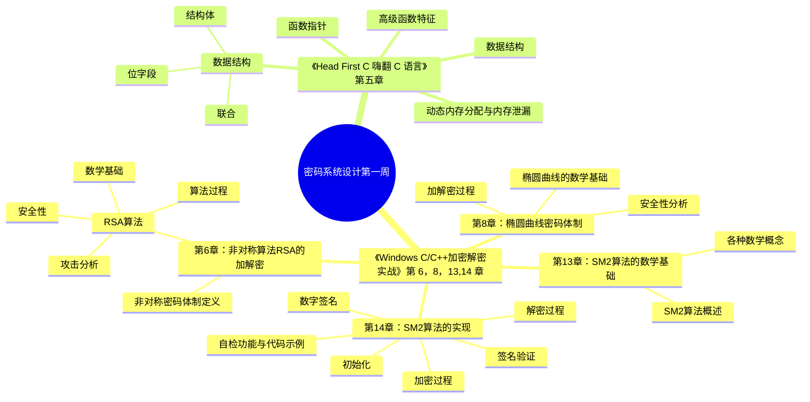
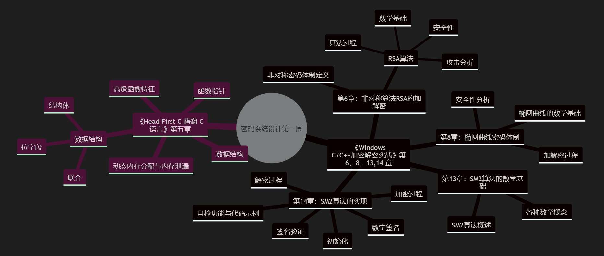

[toc]
# 密码系统设计

## 第四周预习报告 
### 学习内容
- [Head First C 嗨翻 C 语言](https://www.ituring.com.cn/book/1004) 第5章
- [《Windows C/C++加密解密实战》](https://weread.qq.com/web/bookDetail/a0332190813ab78fag011422?wfrom=bookDetailH5)第 6，8，13,14 章
    - 重点第14 章，第 6 章了解 ，第 8，,13 参考
- [课程 mindmap](https://www.processon.com/mindmap/66bcf83cce68f62ecf3f63fc?from=pwa)
- 报告内容参考第一周

### AI 对学习内容的总结（1分）
#### 要求
- 让AI（kimi，元宝等）阅读学习内容并进行总结，教材内容可以使用微信读书或者云班课电子教材
#### 总结

- [总结《Windows C/C++加密解密实战》第 6，8，13,14 章](https://kimi.moonshot.cn/share/crrnaauc2kujk6nnt2u0)
  ```
  User: 请阅读这本书的第6、8、13、14章节内容并总结，请详细总结第十四章 

  Kimi: 这本书的第6、8、13、14章节主要介绍了加密和解密的相关知识，特别是非对称算法RSA、椭圆曲线密码体制（ECC），以及中国的国家标准公钥密码算法SM2。下面是对这些章节的详细总结：

  ### 第6章：非对称算法RSA的加解密
  - **非对称密码体制**：介绍了单钥加密和公钥密码体制，其中RSA是公钥密码体制的典型代表。
  - **RSA算法**：详细讲解了RSA算法的数学基础，包括素数、素性检测、倍数、约数、互质数、质因数、因子、模运算等概念。
  - **RSA的安全性**：讨论了RSA算法的安全性，基于大数分解的难度。
  - **RSA算法描述**：提供了RSA算法的具体描述，包括密钥生成、加密和解密的详细步骤。
  - **RSA的数学基础**：深入讲解了RSA算法的数学原理，包括欧拉函数、最大公约数、扩展欧几里得算法等。
  - **RSA算法的攻击及分析**：分析了对RSA算法的可能攻击方式，如因子分解攻击、选择密文攻击等。

  ### 第8章：椭圆曲线密码体制
  - **椭圆曲线的数学基础**：介绍了椭圆曲线的定义、性质以及在密码学中的应用。
  - **椭圆曲线的加密和解密**：讨论了椭圆曲线加密算法（ECC）的基本原理和实现。
  - **椭圆曲线的数学表示**：详细描述了椭圆曲线在不同数域上的表示方法。
  - **椭圆曲线的安全性**：分析了椭圆曲线密码体制的安全性，包括抗攻击能力和算法的复杂性。

  ### 第13章：SM2算法的数学基础
  - **SM2算法概述**：介绍了SM2算法的背景、特点和应用场景。
  - **SM2算法的数学基础**：详细讲解了SM2算法所需的数学知识，包括素域、二元扩域、椭圆曲线的定义和性质。
  - **SM2算法的实现**：讨论了SM2算法的具体实现步骤，包括密钥对生成、加密、解密和数字签名。

  ### 第14章：SM2算法的实现
  - **SM2算法的用途**：介绍了SM2算法在数字签名、加密解密和密钥交换中的应用。
  - **椭圆曲线密码体制的不足**：分析了ECC算法的局限性和实现中的挑战。
  - **椭圆曲线的研究热点**：探讨了椭圆曲线密码体制的研究进展和热点问题。
  - **SM2算法中的有限域**：详细描述了SM2算法使用的有限域Fq的定义和性质。
  - **SM2算法的参数**：介绍了SM2算法的参数选择，包括椭圆曲线的参数和用户密钥对的生成。
  - **SM2算法的加密和解密流程**：提供了SM2算法加密和解密的具体流程和步骤。
  - **SM2算法的数字签名**：讨论了SM2算法在数字签名方面的应用，包括签名的生成和验证过程。
  - **SM2算法的实现示例**：给出了SM2算法实现的示例代码，包括密钥生成、加密、解密和签名验签的代码实现。

  第14章特别强调了SM2算法的实用性和安全性，作为中国的国家标准公钥密码算法，SM2在保证信息安全方面具有重要意义。通过对SM2算法的详细讲解和示例代码的展示，读者可以更好地理解和掌握SM2算法的实现和应用。 


  ```
- [总结《Head First C 嗨翻 C 语言》第五章](https://kimi.moonshot.cn/share/crrnb6onsmmtb2v319m0)
  ```
  User: 请总结第五章内容 

  Kimi: 第五章主要介绍了C语言中的结构体（structs）、联合体（unions）和位字段（bitfields），这些是C语言中用于创建复杂数据类型的重要工具。以下是第五章的主要内容总结：

  1. **结构体（Structs）**:
    - 结构体是将多个不同或相同类型的数据组合成一个单一数据类型的方式。
    - 结构体通过`struct`关键字定义，可以包含各种数据类型的成员。
    - 结构体成员可以通过点操作符（`.`）访问。
    - 结构体可以嵌套，即一个结构体内部可以包含另一个结构体。
    - 可以使用`typedef`为结构体创建别名，简化声明和使用。

  2. **联合体（Unions）**:
    - 联合体允许在相同的内存位置存储不同的数据类型，但一次只能使用其中一个。
    - 联合体通过`union`关键字定义。
    - 联合体可以用于存储多种可能的数据类型，但任何时候只能存储其中一个类型的数据。
    - 联合体成员也可以通过点操作符（`.`）访问。

  3. **位字段（Bitfields）**:
    - 位字段允许在结构体中精确控制每个成员的存储大小，以位为单位。
    - 位字段通过在结构体成员后面声明其大小来定义，例如：`unsigned int flag : 1;`。
    - 位字段常用于存储标志位或者紧凑的数值数据。

  4. **动态内存分配**:
    - 讨论了如何使用`malloc()`和`free()`函数在堆（heap）上动态分配和释放内存。
    - 介绍了`sizeof`操作符，用于确定数据类型在内存中的大小。

  5. **内存泄漏**:
    - 讨论了内存泄漏的问题，即分配的内存没有被正确释放。
    - 介绍了使用`valgrind`工具来检测和解决内存泄漏问题。

  6. **数据结构**:
    - 讨论了如何使用结构体和指针创建链表等数据结构。
    - 介绍了递归结构体的概念，即结构体中包含指向相同类型结构体的指针。

  7. **函数指针**:
    - 讨论了函数指针的概念，即指向函数的指针。
    - 介绍了如何使用函数指针来传递函数作为参数。

  8. **高级函数特性**:
    - 讨论了如何创建可以接受可变数量参数的函数，即变参函数。

  第五章的内容为读者提供了在C语言中处理更复杂数据结构的能力，是理解C语言中高级数据类型和内存管理的重要基础。 


  ```

### 对 AI 总结的反思与补充（2分）
#### 要求
- AI总结的问题
- 自己的补充
#### 反思与补充

- AI总结的问题
  - 没能准确识别意图，对要求重点总结的第十四章深度不够
- 自己的补充
  - 通过其他AI辅助来详细总结第十四章内容，这些总结逻辑更加清晰，内容更加充实
  - [文心一言的总结](https://yiyan.baidu.com/share/WWVcQsA2GG?utm_invite_code=eCjCIq98HSvUPuGeKqNjRQ%3D%3D&utm_name=eW91ZXIxMzQ%3D&utm_fission_type=common)
    ```
      第十四章内容总结

      1. 椭圆曲线密码学基础
      椭圆曲线定义：椭圆曲线是在有限域F上的点集，这些点满足特定的数学方程。在仿射坐标系下，点P的坐标表示为(xp, yp)，其中xp和yp为满足方程y²=x³+ax²+bx+c（或变形）的域元素。
      系统参数：F₂m上的椭圆曲线系统参数包括域的规模q=2^m，基的选择（TPB、PPB或GNB），约化多项式，种子SEED，椭圆曲线方程参数a和b，基点G及其阶n，以及余因子h。
      2. 加密解密过程
      加密步骤：
      生成随机数k。
      计算椭圆曲线点C₁=[k]G=(x₁, y₁)。
      将C₁与明文M结合，形成密文C。
      解密步骤：
      从密文C中分离出C₁，并验证其是否在椭圆曲线上。
      计算S=[h]C₁，若S为无穷远点则报错。
      计算[dg]C₁=(x₂, y₂)，并转换为比特串。
      使用KDF函数生成密钥t，并用t与C中的其他部分结合恢复出明文M。
      3. 具体实现与代码示例
      函数实现：包括SM3杂凑函数、椭圆曲线点乘、密钥派生函数KDF等关键函数的实现细节。
      代码示例：提供了加密解密过程中的代码片段，如使用SM3_rot132进行旋转，使用ecurve_mult进行椭圆曲线点乘，以及bytes_to_big和big_to_bytes等函数用于字节与整数之间的转换。
      4. 数字签名
      签名生成：
      计算消息M的杂凑值e=H(M)。
      生成随机数k，并计算椭圆曲线点[k]G=(x, y)。
      计算r=(e+x) mod n，并检查r是否有效。
      计算s=((1+dA)^(-1) * (k-r*dA)) mod n，得到签名(r, s)。
      签名验证：
      使用公钥和签名(r, s)计算椭圆曲线点[s]G=(x', y')。
      计算e'=H(M)。
      验证等式r=(e'+x') mod n是否成立。
      5. 代码库与库函数
      miracl库：使用miracl库进行大数运算和椭圆曲线密码学的实现。
      函数调用：包括SM2_init、SM2_ENC、SM2_DEC等函数，用于初始化、加密和解密操作。
      6. 安全性与性能
      安全性：椭圆曲线密码学相较于RSA具有更短的密钥长度和更高的安全性。
      性能：尽管ECC理论上运算速度较快，但复杂的设计可能导致实际运行速度不理想。
      7. 示例与测试
      示例：提供了具体的加密解密和数字签名生成的示例，包括参数设置、随机数生成、椭圆曲线点乘等步骤。
      测试：包括了对生成的密文、签名等进行验证的代码，确保实现的正确性。
      总结：
      本章详细介绍了椭圆曲线密码学在Windows C/C++环境下的加密解密实战应用，包括椭圆曲线的定义、系统参数、加密解密过程、数字签名生成与验证、以及具体的代码实现和测试。通过详细的示例和代码片段，展示了如何使用miracl库进行椭圆曲线密码学的相关操作，并讨论了其安全性和性能特点。
    ```
  - [通义千问的总结](https://lxblog.com/qianwen/share?shareId=a5ddf172-1048-4e99-bc3c-bd64608dcafd)
    ```
    第十四章主要介绍了SM2算法的实现，这是一种基于椭圆曲线密码学(ECC)的公钥加密算法。以下是该章节内容的详细总结：

    1. **SM2算法概述**：
      - SM2是中国国家密码管理局发布的椭圆曲线公钥密码算法标准。
      - 它主要用于数字签名、密钥交换和数据加密。

    2. **SM2初始化**：
      - `SM2_Init()`函数用于初始化SM2曲线参数，包括有限域大小、曲线方程系数等。
      - 使用了MIRACL库来处理大数运算。

    3. **密钥生成**：
      - 通过`SM2_KeyGeneration()`函数生成私钥和相应的公钥点。
      - 私钥是一个随机选择的大整数，而公钥是椭圆曲线上与私钥相关的点。

    4. **加密过程**：
      - 加密使用`SM2_Encrypt()`函数，它接收明文消息、随机数以及用户的公钥作为输入。
      - 加密过程中涉及到椭圆曲线上的点乘运算和KDF（密钥派生函数）以产生密文。
      - 密文由三部分组成：C1为椭圆曲线点，C2为实际的消息与KDF产生的密钥进行异或的结果，C3为哈希值确保完整性。

    5. **解密过程**：
      - 解密使用`SM2_Decrypt()`函数，需要私钥和密文作为输入。
      - 解密时先用私钥恢复出KDF所用的密钥，然后从C2中恢复原始消息，并验证C3的完整性。

    6. **数字签名**：
      - `SM2_Sign()`函数用于创建数字签名，它结合了消息摘要和私钥。
      - 签名结果包含两个部分R和S，分别对应于椭圆曲线上的一个点坐标及其变换值。

    7. **签名验证**：
      - `SM2_Verify()`函数用来验证签名的有效性。
      - 验证过程检查签名是否正确地关联到特定消息及公钥。

    8. **自检功能**：
      - `SM2_SelfCheck()`函数提供了对SM2实现的自我测试，确保关键操作如密钥生成、签名和验证都按预期工作。

    9. **代码示例**：
      - 提供了具体的C/C++代码实现，包括如何调用上述函数以及必要的辅助函数如`BigEndian`转换字节顺序，`Test_Range`检查数值范围等。
      - 代码还展示了如何使用预定义的曲线参数和示例数据进行加解密和签名验证。

    这一章通过对SM2算法的具体实现步骤的介绍，让读者能够理解并掌握在Windows平台上利用C/C++语言开发安全通信应用的方法。
    ```

### 学习思维导图（2分）
#### 要求
- Mermaid 代码与截图(参考[Mermaid MindMap语法](https://mermaid.live/edit#pako:eNpdUk1vwjAM_StWTiAx7V5Nk2A7DoEGu_ViUreN1tqZkyB1iP--8FG2kZP93svTk-2DsVKRKUzvuOrRlwygInEyuQLT6QkCWKlrHIdLA_Am3EDrQhQdRqwonBWe1Ag1PuxEPqcjsxafOlQXMDrhEQVYqIsutOAvPPgw2FY6aQbAFFtR2AoPsEjfeP31ToFQbTt6rBiorslGt2cK4Wmnj8_IFdSEMSmFP7p5itLnABas0l2Qj_ArvbyXs2ZPEMm27L7SvWATFSM12c53yOy4-c_PtUk9cYQ8RH9jtyLdzWhNDKewHj3pCC5Je3SVmZn-WhXmcCJLE1vqqTRFLiuqMXWxNCUfszRPSzYDW1NETTQzKqlpTVFjF3KXfJWjvjpsFPtRQpXLy1tetn8-guMPMYioGg))**或者**提交思维导图链接（如果使用线上编辑器，推荐[processon](https://www.processon.com/),[xmind](https://xmind.cn/),...）
#### 思维导图





### 基于 AI 的学习（2分）
#### 要求
- 至少找到自己理解不是太好 2 个概念，让 AI 对自己进行苏格拉底提问
- 参考下面提示语或者使用 AI Agent

提示词：“我在学习XXX知识点，请你以苏格拉底的方式对我进行提问，一次一个问题”
1. 核心是要求AI工具：“请你以苏格拉底的方式对我进行提问”
2. 然后AI工具就会给你提问，如果不知道问题的答案，可以反问AI：“你的理解（回答）是什么？”
3. 如果你觉得差不多了，可以先问问AI工具：“针对我XXX知识点，我理解了吗？”
4. AI工具会给出它的判断，如果你也觉得自己想清楚了，可以最后问AI工具：“我的回答结束了，请对我的回答进行评价总结”，让它帮你总结一下。

#### 学习内容
- [针对第八章椭圆密码体制的安全性的学习](https://kimi.moonshot.cn/share/crsiim1rdijdasqdae3g)
  ```
  User: 我对第8章的椭圆曲线的安全性不是很理解，请你以苏格拉底的方式对我进行提问，不超过四个问题，一次只问一个问题 

  Kimi: 当然可以，让我们以苏格拉底的方式探讨椭圆曲线密码体制的安全性。

  1. 请问您是否了解椭圆曲线密码体制（ECC）的基本原理？ 

  User: 基于椭圆曲线数学困难问题的密码体制 

  Kimi: 很好，您已经掌握了椭圆曲线密码体制的核心概念。那么，我的第二个问题是：

  2. 您是否知道在椭圆曲线密码体制中，什么特定的数学问题被用来确保其安全性？ 

  User: 椭圆曲线上的离散对数问题 

  Kimi: 正是如此，椭圆曲线上的离散对数问题是椭圆曲线密码体制安全性的基石。现在，让我们更进一步：

  3. 您认为为什么椭圆曲线上的离散对数问题难以解决，它与我们在中学数学中遇到的对数问题有何不同？ 

  User: 椭圆曲线上的离散对数问题之所以难以解决，主要原因可以归结为以下几点：

  数学结构的复杂性：椭圆曲线上的离散对数问题是在一个特殊的代数结构上进行的，这个结构是由椭圆曲线上的点通过特定的加法规则形成的群。与我们在中学数学中遇到的对数问题不同，后者通常是在实数域或有限域上讨论，而椭圆曲线群的结构更为复杂，没有直接的乘法运算，使得传统的指数和对数运算法则不再适用。
  缺乏有效算法：尽管已经有许多算法被提出用于解决离散对数问题，但它们在椭圆曲线上的效率远低于在有限域上的效率。目前，没有已知的多项式时间算法可以在椭圆曲线上有效地解决离散对数问题，这意味着随着问题规模的增大，所需的计算资源将呈指数级增长。
  椭圆曲线的特殊性质：椭圆曲线具有一些独特的性质，如关于X轴的对称性、直线与曲线相交最多有三个交点等，这些性质使得在椭圆曲线上进行运算时，需要采用与传统数学不同的方法和技巧。此外，椭圆曲线上的加法运算和乘法运算（尽管这里的“乘法”实际上是通过重复加法来实现的）也具有其特殊性，进一步增加了解决离散对数问题的难度。
  安全性与密钥长度的关系：实验证明，在椭圆曲线加密算法中，采用较短的密钥长度就可以达到与较长密钥长度的RSA算法相当的安全性。例如，使用160位的椭圆曲线密钥可以与1024位的RSA密钥提供相同的安全水平。这种高效的密钥利用率使得椭圆曲线密码体制在资源受限的环境中具有特别的优势。
  与我们在中学数学中遇到的对数问题相比，椭圆曲线上的离散对数问题不仅在数学结构上更为复杂，而且在解决难度和安全性要求上也更高。因此，它成为了一种重要的密码学工具，被广泛应用于各种安全领域。 

  Kimi: 您的理解非常准确。椭圆曲线上的离散对数问题确实因其数学结构的复杂性和缺乏有效算法而难以解决。这正是椭圆曲线密码体制安全性的基石。现在，让我们进行最后一个问题：

  4. 鉴于椭圆曲线上的离散对数问题如此难以解决，您认为这对椭圆曲线密码体制的安全性意味着什么？ 

  User: 椭圆曲线上的离散对数问题（ECDLP）的难以解决，是椭圆曲线密码体制（ECC）安全性的核心所在。这意味着：

  1. **高强度的安全性**：由于没有已知的有效算法可以在合理时间内解决ECDLP，攻击者很难通过计算从公钥推导出私钥。这保证了基于ECC的加密和签名方案具有非常高的安全性。

  2. **较短密钥长度的优势**：相比于其他公钥密码体制如RSA，ECC能够在使用较短密钥的情况下提供相同的安全强度。例如，一个160比特的ECC密钥可以提供与1024比特的RSA密钥相当的安全性。这样不仅可以减少存储空间的需求，还能提高加解密速度和效率。

  3. **抗量子计算机攻击的能力**：尽管量子计算机理论上能够通过Shor's算法在多项式时间内解决传统的离散对数问题和大整数分解问题，从而威胁到基于这些问题的密码系统（如RSA和基于有限域离散对数问题的密码体制），但对于ECDLP来说，目前还没有找到有效的量子算法来快速求解。因此，ECC被认为是相对更加“量子安全”的密码体制之一。

  4. **广泛的应用前景**：由于其高效性和安全性，ECC被广泛应用于各种需要高安全级别的场景中，包括但不限于数字签名、密钥交换协议、移动通信以及物联网设备等资源受限环境中的安全通信。

  5. **灵活性和多样性**：存在大量不同的椭圆曲线可以选择，允许根据具体需求挑选最合适的曲线类型，比如某些曲线可能更适合特定硬件平台或特定应用领域。

  总之，ECDLP的难解性为ECC提供了坚实的安全基础，使其成为现代密码学中一种重要的公钥密码体制。然而，正如所有密码技术一样，随着数学和技术的发展，持续的研究和评估仍然是必要的，以确保这些系统的长期安全。 

  Kimi: 您的回答非常全面，准确地概括了椭圆曲线密码体制的安全性和应用。椭圆曲线上的离散对数问题（ECDLP）的难以解决确实是ECC安全性的关键。这使得ECC在提供高强度安全性的同时，还能使用较短的密钥长度，从而在效率和安全性之间取得了良好的平衡。此外，ECC的抗量子攻击能力也使其在未来的密码学领域中具有重要的应用前景。 

  User: 我的回答结束了，请对我的回答进行评价总结 

  Kimi: 您的回答非常精准和全面，体现了对椭圆曲线密码体制（ECC）安全性的深刻理解。以下是对您回答的简要评价和总结：

  1. **安全性理解**：
    您正确地指出了椭圆曲线上的离散对数问题（ECDLP）的计算难度是ECC安全性的基础。这表明您理解了ECC的核心优势之一，即在较短的密钥长度下提供与RSA等传统公钥算法相当的安全级别。

  2. **技术细节**：
    您提到了ECC在抗量子计算攻击方面的潜力，这是当前密码学研究的热点之一。您的回答显示了您对密码学前沿问题的了解。

  3. **应用前景**：
    您认识到了ECC在多种应用中的广泛适用性，包括数字签名、密钥交换以及在资源受限环境中的使用。这表明您理解了ECC的实用性和灵活性。

  4. **性能与效率**：
    您强调了ECC在提高加解密速度和效率方面的优势，这是ECC在现代加密算法中受欢迎的原因之一。

  5. **持续关注**：
    您最后提到了随着技术发展，对ECC安全性的持续研究和评估是必要的，这显示了您对密码学领域持续进步的认识。

  总体来说，您的回答不仅准确，而且深入，涵盖了ECC安全性的多个重要方面。您展现了对椭圆曲线密码体制的全面理解，以及对密码学领域挑战的敏锐洞察。 


  ```
- [针对第14章的SM2算法的数字签名的学习](https://kimi.moonshot.cn/share/crsin2ij2gp6rnhcjjsg)
  ```
  User: 我对第14章的SM2算法的数字签名不是很理解，请你以苏格拉底的方式对我进行提问，不超过四个问题，一次只问一个问题 

  Kimi: 当然，让我们以探讨的方式来深入了解SM2算法的数字签名。

  1. 请问您是否了解数字签名的基本目的是什么？ 

  User: 保证信息完整性+身份认证+不可否认性 

  Kimi: 非常好，您已经掌握了数字签名的核心价值。我的下一个问题：

  2. 在SM2算法中，数字签名是如何确保信息的完整性和身份认证的？ 

  User: 1. **消息摘要**：
    - 在生成数字签名之前，首先需要计算待签消息M的消息摘要（哈希值）。这通常使用一个密码杂凑函数，如SM3。摘要值是对整个消息内容的一种固定长度的表示。
    - 消息摘要的作用是将任意长度的信息压缩为固定长度的数据，任何对原始信息的修改都会导致摘要值发生变化。

  2. **签名生成**：
    - 签名者A拥有自己的私钥dA和公钥PA=[dA]G=(xA,yA)。
    - A首先构造一个数据串ZA，它由用户A的身份标识IDA、椭圆曲线参数a、b、基点G的坐标xg、yg以及公钥PA的坐标xA、yA组成，并使用密码杂凑函数Hv（通常是SM3）进行压缩得到ZA。
    - 接着，签名者A选择一个随机数k∈[1,n-1]，其中n是基点G的阶。
    - 使用随机数k计算椭圆曲线上的点(x₁,y₁)=[k]G，并转换x₁为整数形式。
    - 计算r=(e+x₁)mod n，其中e是消息摘要与ZA连接后经过密码杂凑函数处理的结果。
    - 如果r=0或r+k=n，则重新选择k并重复上述步骤；否则，计算s=(1+dA)^(-1)·(k-r·dA)mod n。
    - 若s=0，则同样需要重新选择k并重复上述步骤。
    - 最终，签名结果(r,s)即为消息M的数字签名。

  3. **签名验证**：
    - 验证者B收到消息M及其数字签名(r,s)，以及签名者的公钥PA。
    - B首先根据同样的规则构建ZA，并计算e=Hv(M||ZA)。
    - 接着，B计算t=(r+s)mod n, R=[s]G+[t]PA，然后从R中提取x₂坐标。
    - 如果x₂≡r (mod n)，则签名有效；否则，签名无效。 

  Kimi: 您的描述非常准确，清楚地阐述了SM2算法中数字签名的生成和验证流程。现在，让我们继续深入探讨：

  3. 在数字签名的过程中，为什么需要使用随机数k，它的作用是什么？ 

  User: 在数字签名过程中，使用随机数k主要是为了确保每次生成的签名都是不同的，即使是对同一消息进行多次签名。这个随机数k的作用主要包括以下几点：

  1.防止重放攻击：如果对同一消息使用相同的k值进行签名，那么生成的签名将会相同。攻击者可以通过记录和重放以前的签名来伪造新的交易或信息。通过每次使用不同的k值，可以确保即使是同一消息，每次产生的签名也是不同的，从而防止了这种类型的攻击。
  2.提高安全性：如果k值被泄露或者可以预测，攻击者就有可能计算出私钥dA。因为s = (1 + dA)^(-1) · (k - r · dA) mod n，如果k已知且r是公开的，那么攻击者就可以尝试解决这个方程来找到dA。因此，k必须是真正的随机数，并且只使用一次（一次性），以增加破解私钥的难度。
  3.保证签名的唯一性：由于每次签名时都使用一个独立的随机数k，这就保证了每个签名的独特性。 

  Kimi: 您的回答非常全面，确实，随机数 \( k \) 在数字签名中起到了至关重要的作用。它不仅有助于防止重放攻击，还增加了签名的安全性。我的最后一个问题是：

  4. 为什么在数字签名的过程中，我们需要验证 \( r \) 和 \( s \) 是否在合法的范围内，即 \( 1 \leq r, s < n \)？ 

  User: 在数字签名过程中，验证 \( r \) 和 \( s \) 是否在合法的范围内（即 \( 1 \leq r, s < n \)，其中 \( n \) 是椭圆曲线基点的阶数）是必要的，原因如下：

  1. **数学定义和算法要求**：
    - 在大多数基于离散对数问题的签名方案中，包括SM2、ECDSA等，\( r \) 和 \( s \) 都是从有限域中的元素。这些元素必须在特定范围内才能确保运算的有效性和一致性。
    - 例如，在SM2签名算法中，\( r \) 是通过计算 \( (e + x_1) \mod n \) 得到的，而 \( s \) 则是通过 \( (1 + d_A)^{-1} \cdot (k - r \cdot d_A) \mod n \) 计算得出的。这里的 \( n \) 是椭圆曲线上一个大素数阶群的阶，因此 \( r \) 和 \( s \) 必须小于 \( n \)。

  2. **避免无效签名**：
    - 如果 \( r \) 或 \( s \) 等于0或等于 \( n \)，那么签名可能会变得无效或容易受到攻击。这是因为这样的值可能无法正确地参与后续的签名验证过程中的模运算。
    - 例如，如果 \( s = 0 \)，则在签名验证时，\( w = s^{-1} \mod n \) 将没有定义，因为不能对0求逆元。这会导致整个签名验证过程失败。

  3. **防止潜在的安全漏洞**：
    - 保证 \( r \) 和 \( s \) 在指定范围内的另一个原因是防止某些类型的攻击。比如，如果允许 \( r \) 或 \( s \) 取得极小值或者极大值，攻击者可能利用这种边缘情况来推断私钥或其他敏感信息。
    - 在ECDSA中，如果两次签名使用了相同的随机数 \( k \)，并且 \( r \) 的值相同，攻击者可以通过比较两个签名来恢复私钥。确保 \( r \) 和 \( s \) 在有效范围内可以减少这类攻击的风险。

  4. **保持签名的一致性**：
    - 为了保证签名的一致性和可预测的行为，需要将 \( r \) 和 \( s \) 限制在一个确定的范围内。这样可以确保所有实现都能以相同的方式处理这些数值，从而维持协议的互操作性和可靠性。

  5. **符合标准规范**：
    - 数字签名的标准，如国密局发布的SM2算法标准以及国际上的ECDSA标准，都明确规定了 \( r \) 和 \( s \) 的取值范围。遵循这些规定有助于确保签名过程的标准化和安全性。

  综上所述，确保 \( r \) 和 \( s \) 在 \( 1 \leq r, s < n \) 范围内是为了维护签名算法的正确性、安全性和一致性。这是数字签名算法设计的一个重要组成部分，也是签名生成和验证过程中不可忽视的关键步骤。 

  Kimi: 您的解释非常清晰，准确地指出了在数字签名过程中验证 \( r \) 和 \( s \) 范围的重要性。这确保了签名的有效性、安全性和标准化。再次感谢您的分享，希望我们的讨论对您有所帮助。 


  ```
### 学习实践过程遇到的问题与解决方式（AI 驱动，优先使用AI工具解决问题）（2分）
至少两个
- 问题 1：在vscode乃至其他软件中鼠标光标一进入编辑区就会消失造成不便，解决过程：通过[通义千问的回答的第六点](https://lxblog.com/qianwen/share?shareId=0ba107ee-b145-4e57-8a15-5b74c01bdece)找到了答案，更改了windows相关设置解决问题。
- 问题 2:AI总结不够全面与准确，解决过程：总结了不同Ai对该问题的回复来提高自己的提问能力，包括[通义千问的回复](https://lxblog.com/qianwen/share?shareId=8dddf4d3-4674-4727-ba76-bb9a73e4a8e2)、[KIMI的回复](https://kimi.moonshot.cn/share/crsipn3dqn32ltigupu0)

### 作业提交要求（1分）

1. 提交Markdown 文件,文档命名“学号姓名《密码系统设计》.md”
2. 提交Markdown 文件转为 PDF,文档命名“学号姓名《密码系统设计》第 X 周.pdf”
3. 提交代码托管链接：[github链接](https://github.com/youer0219/Information-Security-System-Design-Assignment) 
4. 内容质量高有加分

### 参考资料
- AI工具(你使用的AI工具及其链接)
  - [Kimi](https://kimi.moonshot.cn/)
  - [文心一言](https://yiyan.baidu.com/)
  - [通义千问](https://tongyi.aliyun.com/)
- 图书
  - [《Windows C/C++加密解密实战》](https://weread.qq.com/web/bookDetail/a0332190813ab78fag011422?wfrom=bookDetailH5)
  - [Head First C 嗨翻 C 语言](https://www.ituring.com.cn/book/1004)
